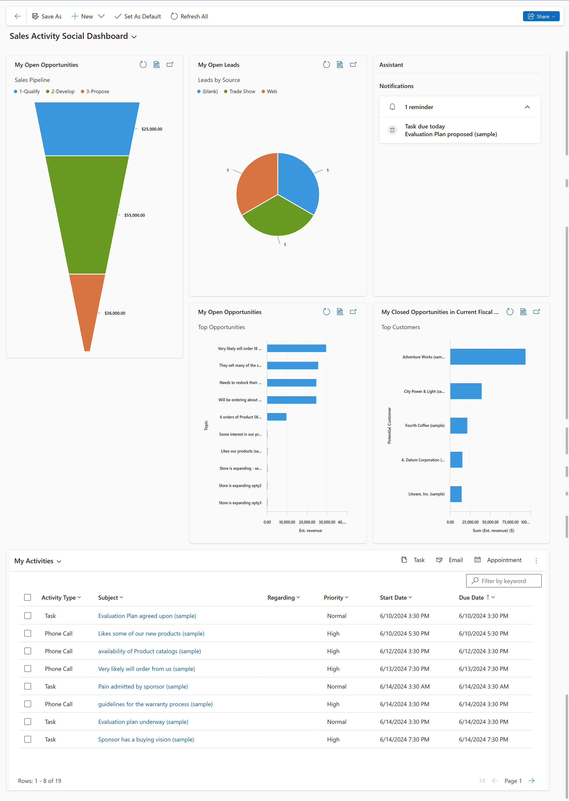
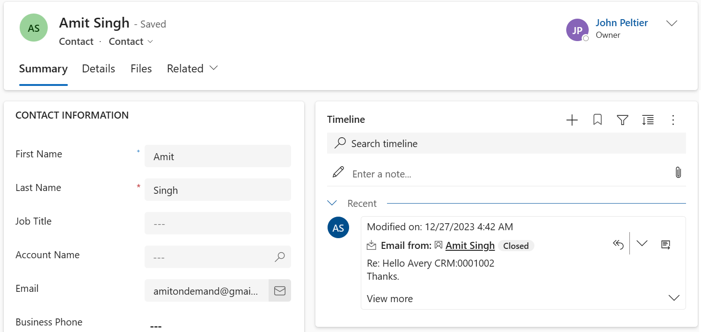
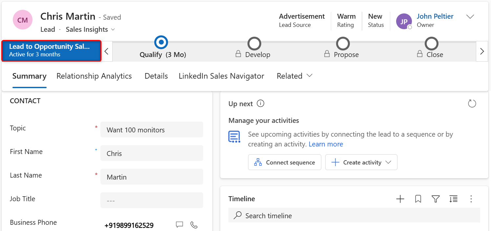
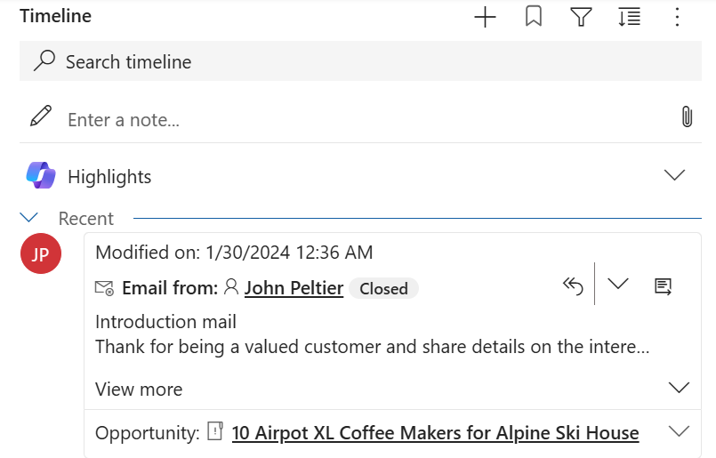
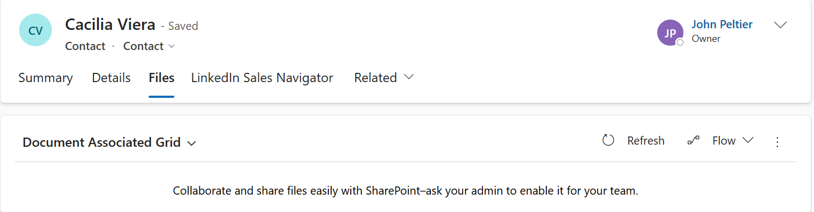
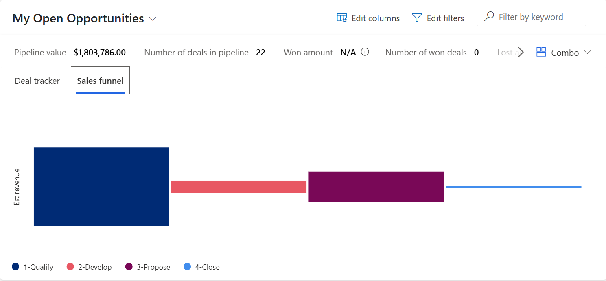
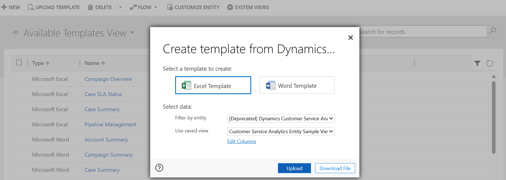
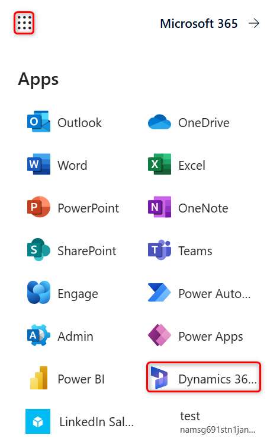
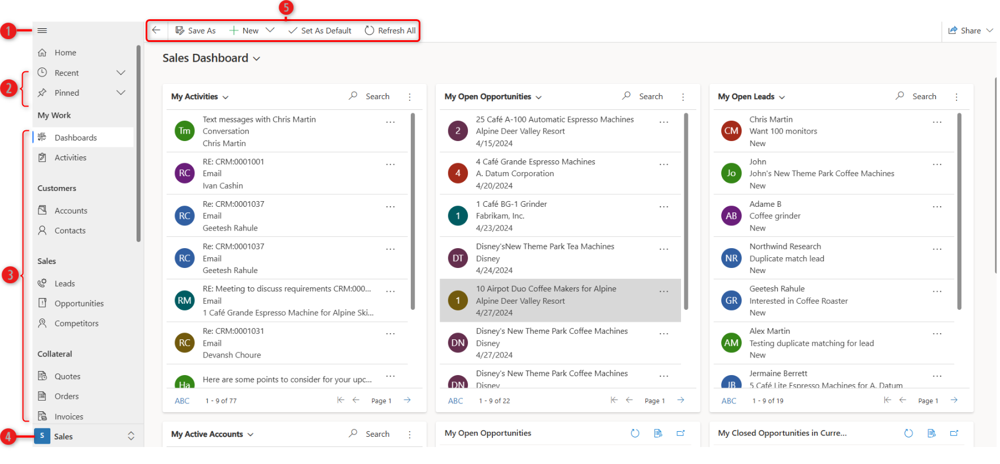

# Learn the basics of [!INCLUDE[pn-dyn-365-sales](../includes/pn-dyn-365-sales.md)] 

Learn how to access the Sales app, navigate the UI, and understand the data in the app, and some quick tips.

## License and role requirements
| Requirement type | You must have |  
|-----------------------|---------|
| **License** | Dynamics 365 Sales Premium, Dynamics 365 Sales Enterprise, or Dynamics 365 Sales Professional   More information: [Dynamics 365 Sales pricing](https://dynamics.microsoft.com/sales/pricing/) |
| **Security roles** | Any primary sales role, such as salesperson or sales manager   More information: [Primary sales roles](security-roles-for-sales.md#primary-sales-roles)|

## Get productive quickly

The app is designed to make getting up to speed simple and painless, whether you’re handling your day-to-day sales transactions or setting up the app for
your team. 

What’s the fastest way to get productive? 

Here are a couple options:

-   **Dive in and try out the sample data.** If you learn best through hands-on exploration, the app comes with sample data to help you see how
    data is presented and organized, and to give you something to experiment with as you get oriented.

    Start exploring, and play around with the sample data until you’re ready to work with your real customer data.

-   **Do a quick read that covers the basics.** The user guide and learning modules contain all the essentials you need to know to navigate the app,
    find and enter customer data, glean actionable insights from interactive dashboards, and more. And it’s short. (We know you’re busy.)

No matter how you decide to get started, soon you’ll be up and running—working your deals and building profitable relationships along the way, as you turn your
customers into lifelong fans of your products.

Ready to get started? Here are the feature highlights.

## Feature highlights

Here are some highlights of Dynamics 365 Sales:

-   **Visual insights.** The out-of-the-box dashboards and charts have almost everything that you need to get insight into your business.

    More information: [Gain insights with dashboards in Dynamics 365 Sales](dashboards.md).

    > [!div class="mx-imgBorder"]
    > 

-   **Customer 360&deg; view.** Once in the app, quickly get an overview of what’s happening with a customer, such as communications with them, progress of individual deals, and much more, all in one place.

    > [!div class="mx-imgBorder"]
    > 

-   **Business process flow.** The guided process flows on the **Lead and Opportunity** form tell you exactly what to do next. You can quickly find out the steps you must take to increase the likelihood of a successful sale and an increased sales count. The process bar can be docked to the right side of the screen for an omnipresent experience while you work on the opportunity.

    > [!div class="mx-imgBorder"]
    > 

-   **Activities timeline.** All the appointments you schedule while you work on an opportunity, the emails that you send or the phone calls you make are
    available in one place, giving you all the context you need to do your job.

    > [!div class="mx-imgBorder"]
    > 

-   **Store and view documents in the context of records.** Do you have presentations or documents for an opportunity all over the place? Store them
    all in one place, so anyone who’s working on the opportunity can view them!

    More information: [Collaborate using SharePoint](/powerapps/user/collaborate-using-sharepoint?context=/dynamics365/context/sales-context).

    

-   **Simplified opportunity-to-invoice process.** It is easy to move a customer through the Sales funnel. Just generate a quote right from the opportunity
    you’re working on, and activate it. Use the same quote to quickly generate an invoice and mark the deal as won. You can also email the quotes and
    invoices to your customer in just one click.

    More information: [Understand the sales process](nurture-sales-from-lead-order-sales.md).

    > [!div class="mx-imgBorder"]
    > 

-   **Document templates.** The Word and Excel templates ensure that the documents that you’re sending out to your customers align with you company’s
    brand.

    More information: [Manage Word templates](manage-word-templates.md).

    > [!div class="mx-imgBorder"]
    > 

-   **Sales data anywhere and everywhere.** Get all your customer and sales data right on your mobile device or tablet. Whether you are visiting a customer or
    on the road, you can quickly pull out your device to update the opportunity with information. What’s more—you get the same consistent experience
    regardless of the device you use.

## Go to the Sales apps 

1. Sign in to [!INCLUDE[pn-office-365](../includes/pn-office-365.md)], select the [!INCLUDE[pn-office-365](../includes/pn-office-365.md)] app launcher, and then select the icon for **[!INCLUDE[pn-dyn-365](../includes/pn-dyn-365.md)]**.

   > [!div class="mx-imgBorder"]
   >   

   > [!Note]
   > 
   > The apps available to you in the app launcher depend on your subscription.

2. Select one of the following tiles depending on your license: 
    1. For Sales Enterprise, select **Sales Hub**.
    1. For Sales Professional, select **Sales Professional**.  

    > [!TIP]
    > Alternatively, visit the [Apps page](https://office.com/apps) on office.com, select **Business Apps**, and then select the Dynamics 365 app that you want.  

If you don't see the app, contact your administrator to grant you access. For more information, refer to [Grant or revoke access to the Sales Hub app](grant-access-saleshub.md).

## Navigate using the site map

The following image shows the site map or menu of the Sales app that helps you navigate to the different areas of the app.

|Number  |Description  |
|---------|---------|
|1     | Open or collapse the site map.        |
|2     | Access the recent items you've worked on or the customers you've pinned.        |
|3     | Access everything that you need to communicate with customers, manage your pipeline, and other sales-related records.     |
|4     | Use the change area to switch between **Sales** and other settings.        |
|5     | Access the command bar for quick actions.        |

   
## Understand the data in the app

Every day, you’ll work with different customer records and record types as you move customers through your business processes, collecting the data you need to fill in the fields for their records—and ultimately to win their business.

- What’s a record? In [!INCLUDE[pn-dyn-365-sales](../includes/pn-dyn-365-sales.md)], a **record** is a complete unit of information such as all the information about a single contact. You can think of it as a row in a table. For example, each time you add a new account to the app, you’re creating a new record in the Sales app.

- What’s a record type? Each record you add to the system belongs to a certain **record type**, such as an account, contact, lead, or opportunity.

## Quick create – Enter new records fast

The Quick Create command makes it fast and easy to enter almost any type of information into the system. The command is on the navigation bar (also referred to as the nav bar), so it’s always available whenever you need to enter new info into the system.

With Quick Create, you need to complete only a few fields. Later, when you have more time or more information, you can fill in more details.

1. On the nav bar, select the **New** button and then select the record you want to create.  

    :::image type="content" source="media/nav-bar.png" alt-text="Navigation bar highlighting the Quick Create button":::

   > [!TIP]
   > On a mobile device, from the nav bar, tap  and then tap **Quick Create Menu**.

2. Fill in the fields, and then select **Save**.

## Business processes in Dynamics 365 Sales

Business processes help everyone follow best practices, even when handling situations that don’t occur very often. You complete a step by entering data or
marking the step completed in the process bar at the top of the screen. When all the steps are done, you can move on to the next stage.

The following ready-to-use business processes are available that you can use as you move your leads through a sales process:

  -   Lead to invoice. This business process flow is available for:
      -   All leads.
      -   Opportunities created from leads
  -   Opportunity sales process. This business process flow is available for:
      -   All directly created opportunities (not originating from lead) forms

For information on how to create or customize business process flows, see the Tutorial: [Create a business process flow](/power-automate/create-business-process-flow?context=/dynamics365/context/sales-context) 

[!INCLUDE [cant-find-option](../includes/cant-find-option.md)]

[!INCLUDE[footer-include](../includes/footer-banner.md)]
