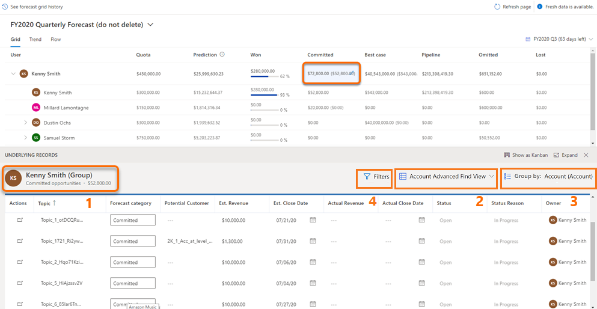

# View and manage underlying opportunities  

Getting visibility into the underlying opportunities that are contributing to the forecast values helps the sales team to focus on specific opportunities and take action.  

## License and role requirements
| Requirement type | You must have |  
|-----------------------|---------|
| **License** | Dynamics 365 Sales Premium or Dynamics 365 Sales Enterprise   More information: [Dynamics 365 Sales pricing](https://dynamics.microsoft.com/sales/pricing/) |
| **Security roles** | Any primary sales role, such as salesperson or sales manager   More information: [Primary sales roles](security-roles-for-sales.md#primary-sales-roles)|

## View underlying opportunities

To understand which opportunities are affecting forecast values, select one of the following options: 

- Select a row to show all opportunities, regardless of forecast category.

- Select a cell to show only the opportunities that match the roll-up column value.

> [!NOTE]
> Underlying opportunities won't be displayed for **Quota** and simple column types, because no opportunities contribute to calculating their values; you manually upload these values through an Excel workbook.

The opportunities you see in the table depend on the role assigned to you in the hierarchy that was used to configure the forecast.

For example, Alyce Durham is a manager and Nicolas Frizzell reports to her. Nicolas can see only his underlying opportunities, while Alyce can see her own and Nicolas's underlying opportunities.

You can view and edit underlying opportunities in two ways:

- [View and edit in a table view](#view-and-edit-in-a-table-view)

- [View and edit in a kanban view](#view-and-edit-in-a-kanban-view)

### View and edit in a table view

With the enhanced grid, you can view and edit related entity records also. The following screen is an example of the enhanced grid view of underlying records:   

> [!div class="mx-imgBorder"]
> 

1. **General information**: You can identify the owning user or team of the underlying records. Also, you can see the category of the underlying records—such as won, committed, or pipeline along with the total value of the category.

    > [!NOTE]
    > Though you can update the forecast category of an opportunity in the grid, the options **Won** and **Lost** are disabled and can't be selected. These options are automatically updated when an opportunity is closed as won or lost; hence they shouldn't be updated manually. More information: [Close opportunities as won or lost](close-opportunity-won-lost-sales.md). 

2. **View selector**: You can change the view of these records. By default, the view that was selected when the forecast was configured is displayed.

3. **Group by**: You can group the underlying opportunity records by using a related entity such as, account. For more information on how to use the **Group by** option with or without a filter, go to [Filter the underlying opportunities of a forecast](#filter-the-underlying-opportunities-of-a-forecast).

4. **Filter**: You can filter the underlying opportunities to view specific set of opportunities that you want to analyze or work on. For more information on how to use filters, go to [Filter the underlying opportunities of a forecast](#filter-the-underlying-opportunities-of-a-forecast). 

### Filter the underlying opportunities of a forecast

When you select a row in the forecast grid, you see the underlying opportunities that contribute to that row in the forecast. You can group and filter these opportunities to efficiently manage them and take necessary actions to finalize deals that matter the most.  

**To filter the underlying opportunities**

1.	Open a forecast, and select a row.
    
    The underlying opportunities that contribute to the selected row are displayed.

2.	(Optional) In the **Group by** field, select the entity (such as, account) that you want to use for grouping opportunities.
  
    The opportunities are grouped by the selected entity. 

    1. Select the **View underlying rollup records** (the plus sign (+)) next to a group.
    
        The opportunities associated with that account are displayed. For more information on how filters work when the underlying records are grouped, go to [Example: Grouping and filtering the underlying opportunities](#example-grouping-and-filtering-the-underlying-opportunities).

3. Select **Filters**, and add the filter conditions.  
 
    - If **Group by** is set to **None**, you can directly apply the filters on the underlying opportunities as shown in the following screenshot. The opportunities filter will persist across the recurrences in the same forecast until you clear the filter manually.  
    
        :::image type="content" source="media/forecast-filter-opportunity.png" alt-text="Screenshot of a filter set on opportunity columns":::

    - If **Group by** is set to an entity (such as, account),

        - You can filter the group by using the attributes in the selected table. For example, if you've chosen to group the opportunities by account, you can filter the accounts from a specific region. You can also add a filter on a related entity, such as estimated revenue of the opportunities associated with the account.
        
        - You can apply a different filter for the opportunities associated with the group. The filters applied on the underlying opportunities persist irrespective of the grouped entity, group filter, and recurrence of the forecast.  
        
        - Each forecast can have different filter conditions and grouping.  

For more information about filters, go to [Add conditions to a filter](/powerapps/maker/model-driven-apps/create-edit-view-filters#add-conditions-to-a-filter).

#### Example: Grouping and filtering the underlying opportunities 

Let's understand grouping and filtering of underlying records with an example.

Kenny Smith is a Vice President of the sales organization at Contoso Inc. He heads the Sales teams in North America (NA) and Europe regions. He wants to personally follow up with the customers of the high-value opportunities in the NA region so that the deals can be closed in time for Q2.  Following are the steps that Kenny should perform:

1. Open the Q2 forecast for his org.
1. Select **Account** in the **Group by** field. 
    All underlying opportunities of the forecast are grouped by their corresponding accounts.  
1. Select **Filters** > **Add** > **Add row** and specify the following condition:  
    `Address2: Country Equals North America`
    :::image type="content" source="media/forecast-grouping-by-account.png" alt-text="Screenshot of forecast records grouped by account":::

    All the accounts in North America are displayed.

1. Select the **View underlying rollup records** (the plus sign (+)) next to an account.
    The underlying opportunities associated with that account are displayed.
1. Select **Filters** > **Add** > **Add row**, and specify the following condition for the opportunities:
 
   `Est.Revenue Is greater than or equal to 1,000,000`
       
    The high-value opportunities of the selected account are displayed. 

    > [!NOTE]
    > The opportunities filter is persisted unless cleared manually. For example, when he opens the rollup records of another account in the NA region, the records are already filtered for high-value opportunities. Even if he changes the grouping to a User entity, the underlying opportunities filter persists and is automatically applied to the opportunities in the new group.  
     

 
### View and edit in a kanban view

1.	Open a forecast. 

2.	Select a row or a cell for any level of the hierarchy for which you want to see underlying opportunities. 

    In this example, we're selecting **Kenny Smith**. As Kenny is a manager, all the underlying opportunities that are contributing to his team's forecast are listed. This view is opened in a table, by default.

    :::image type="content" source="media/forecast-view-underlying-opportunities.png" alt-text="Screenshot of the forecast underlying opportunities" lightbox="media/forecast-view-underlying-opportunities.png":::

    You can identify whether the selected opportunities belong to a team, an individual, a single cell value, or a full row by looking at the table heading. The format of the heading is described in the following table:

    | Heading format| Description |
    |----------------|-------------|
    | Username (Group) – All opportunities | All the opportunities across different forecast categories that the selected user and that user's team own. |
    | Username - All opportunities | All the opportunities across different forecast categories that the selected user owns. |
    | Username (Group) – Column name | The opportunities that the selected user and that user's team own for the selected forecast category. |
    | Username – Column name | All the opportunities that the selected user owns for the selected forecast category. |
    

    You can change the view of these opportunities by using the view selector. By default, the view that was selected when the forecast was configured is displayed.

3.	Select **Show as Kanban**. 

    The table view changes into a kanban view and the order of columns is displayed based on the order that's defined in the option set in the application. All the underlying opportunities are displayed as cards in their respective forecast categories. Each card displays attributes that you can edit. In this example, the opportunity name, **Owner**, **Est. Revenue**, and **Est. Close Date** are displayed.

    :::image type="content" source="media/forecast-view-underlying-opportunities-kanban.png" alt-text="View forecast underlying opportunities in a kanban view" lightbox="media/forecast-view-underlying-opportunities-kanban.png":::

    > [!NOTE]
    > The opportunities in columns **Won** and **Lost** are locked. You can't edit these values directly, because multiple attribute values must be set to enter an opportunity as **Won** or **Lost**. However, you can select the name of the opportunity, and the opportunity will open in a new page where you can edit the opportunity, and then save and close it.

4.	To edit the opportunity, you can directly change the values for the attributes displayed on the card and drag the cards from one forecast category to another.
    
    The changes are saved, and the opportunity is updated in Dynamics 365 Sales. The changes are also automatically applied in the forecast grid.

    > [!NOTE]
    > To edit more attributes for the opportunity, select the name of the opportunity. The opportunity will open in a new page, where you can edit it as required, and then save and close it.

[!INCLUDE [cant-find-option](../includes/cant-find-option.md)]

### See also

[Project accurate revenue with sales forecasting](project-accurate-revenue-sales-forecasting.md) 
[View a forecast](view-forecasts.md)

[!INCLUDE[footer-include](../includes/footer-banner.md)]
