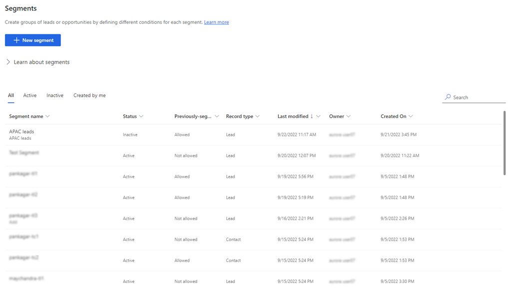
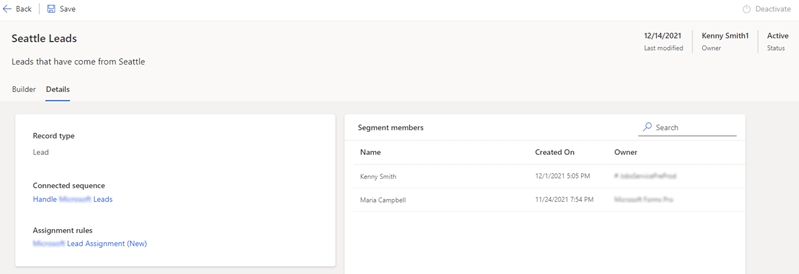

# View details of a segment

You can view the details of a segment with information such as, connected sequences, segment members, and assignment rules. 

## License and role requirements

| &nbsp; | &nbsp; |
|-----------------------|---------|
| **License** | Dynamics 365 Sales Premium  More information: [Dynamics 365 Sales pricing](https://dynamics.microsoft.com/sales/pricing/) |
| **Security Role** | System Administrator or Sequence Manager    See [Predefined security roles for Sales](security-roles-for-sales.md)|
|||

## Open and view details of a segment

1.	Sign in to your Dynamics 365 Sales Hub app.   
2.	Go to **Change area** in the lower-left corner of the page, and select **Sales Insights settings**.
3.	Under **Sales accelerator**, select **Segments**.   

    The **Segments** page opens with the list of available segments with details such as states, record type, and owner. The status of a segments specifies whether the segment is active, inactive, or paused. If a segment is **Paused**, which means that the record type of the segment is deleted from the sales accelerator configuration. You can't activate a paused segment. Add the record type to configuration to move the segment back to its previous state (active or inactive). To know more about the record type configuration, see [Choose content and layout](enable-configure-sales-accelerator.md#choose-content-and-layout). 
    
    >[!NOTE]
    >The lead and opportunity record types will not be paused. By default, the lead and opportunity record types are always available in segments even if they are not added as record types.

    >[!div class="mx-imgBorder"]
    >  

4.	Open a segment and then select the **Details** tab. In this example, **Seattle leads** is selected.

    >[!div class="mx-imgBorder"]
    >  

    The following information about the segment is displayed:
    - **Record type**: The type of record that the segment supports.
    -  **Connected sequence**: The sequence that the segment is connected to. When you select the connected sequence, the sequence opens in the sequence editor. You can view details of the connected sequence and perform actions such as, add records and segments. More information: [Manage sequences](create-manage-sequences.md).    
        When you select back on the sequence page, you are directed back to the segment details page. 
    - **Assignment rules**: The assignment rule that the segment is connected to. When you select the assignment rule, the rule opens in the editor. You can edit and update the rule as required. More information: [Edit an assignment rule](edit-assignment-rule.md).    
        When you save or cancel, you are directed back to the segment details page.   
    - **Segment members**: A list of records that are associated with the segment. You can edit the records without moving away from the details page. Select the record.The records opens in a dialog box and you can edit or update the information as required. 

[!INCLUDE[cant-find-option](../includes/cant-find-option.md)] 

### See also

[Manage segments](manage-segments.md)    
[Create and activate a segment](create-and-activate-a-segment.md)   

[!INCLUDE[footer-include](../includes/footer-banner.md)]
 

