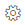

# View sequence in a grid

As an administrator, you can create a saved query to view latest sequences that are in-progress in Entity record grid.

## License and role requirements

| &nbsp; | &nbsp; |  
|-----------------------|---------|
| **License** | Dynamics 365 Sales Premium <br>More information: [Dynamics 365 Sales pricing](https://dynamics.microsoft.com/sales/pricing/) |
| **Security Role** | System Administrator <br>  See [Predefined security roles for Sales](security-roles-for-sales.md)|
|||

## Create a saved query

1.	Make sure that you have the System Administrator security role or an equivalent role. Check your security role:
    1.	Follow the steps in [View your user profile](/powerapps/user/view-your-user-profile?context=/dynamics365/context/sales-context).   
    2.	Don't have the correct permissions? Contact your system administrator.   
2.	(Optional) Create a new view for each entity that you want to include in the sequence view. The entity must be enabled for Sales Accelerator in the **Setup** page. For more information, see step 7 in [Set up the sales accelerator](enable-configure-sales-accelerator.md#set-up-the-sales-accelerator).  
3.	In the web app, go to **Settings** () > **Advanced Settings**, go to **Settings** > **Customizations** > **Solutions**.   
4.	Create a solution with name as **SequenceViewSolution**. For more information, see [Create a solution](/powerapps/maker/canvas-apps/add-app-solution?context=/dynamics365/context/sales-context)  .   
5.	Choose **Entities** > **Add Existing** > **Entity**, find and add the entities for which you created views (as described in step 2).   
6.	Select **Save and Close**.   
7.	Publish all customizations.   
8.	Select the created solution&mdash;SequenceViewSolution (created in step 4).
9.	Export the solution and choose the **Package type** as **Unmanaged**. The ```SequenceViewSolution.zip``` file will be downloaded.
10.	Delete the solution that was created during step 4 from the organization.
11.	Extract the exported solution zip file (downloaded file from Step 9).
12.	In the solution contents folder, locate and then open ```Solution.xml```. 
13.	Change the following value in ```Solution.xml```, and then save it.  
    From ```<Managed>0</Managed>``` to ```<Managed>1</Managed>```.
14.	In the solution contents folder, locate and open ```customization.xml```.
15.	For each **View** added in step 2, locate its ```<savedquery>``` and add the following to its ```fetchxml``` function.
    ```xml
    <link-entity name="msdyn_sequencetarget" from="msdyn_target" to="{primary key of the entity}" alias="sequencetarget" link-type="outer">
        <attribute name="msdyn_parentsequence" />
        <filter type="and">
            <condition attribute="statecode" operator="eq" value="0" />
        </filter>
    </link-entity>
    ```
    For example, if the **View** is added for lead entity, the ```to``` parameter in ``link-entity`` is replaced with ```leadid```.
16.	For each **View** added in step 2, locate its ```<savedquery>``` and add the following to its ```layoutxml```.
    ```xml
    <cell name="sequencetarget.msdyn_parentsequence" width="100" />
    ```    
17.	Save the file.
18.	Zip the folder.
19.	Open a model-driven app such as, Sales Hub in Dynamics 365.
20.	Go to **Settings** > **Solutions**.
21.	Import the solution (zipped file in Step 18).
22.	Publish all customizations.

[!INCLUDE[cant-find-option](../includes/cant-find-option.md)]

### See also

[Manage sequences](create-manage-sequences.md)   


[!INCLUDE[footer-include](../includes/footer-banner.md)]

