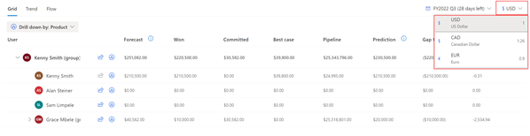

# View a forecast

Forecasts help you to see the health of your pipeline or to see how your sales team is doing against their quota or target.

The forecasting feature isn't supported on mobile devices.

## Open and view a forecast

Bottoms-up forecasting is the projection of what a salesperson, team, or organization will sell in a given predefined period (week, month, quarter, or year). Sellers can also use forecasts to track their performance by using assigned sales targets or quotas.

**To view a forecast**

1. In the Sales Hub sitemap, go to **Performance** and select **Forecasts**.  
   If your organization hasn't configured a forecast or you don't have access to a configured forecast, you see an [out-of-the-box forecast](#out-of-the-box-forecast) for the current month. For more information, see [values displayed in the forecast](#default-columns-in-an-org-chart-forecast).

 **To view your organization's configured a forecast**

  1. Select a forecast from the dropdown list on the left. Any forecasts for which you have permissions will appear here.

  2. Choose the forecast period that you want to see from the dropdown list on the right.
     - Options in the dropdown list reflect the number of forecast periods defined in the forecast configuration. The default is the current period.
     - To rearrange the forecast periods in the dropdown list, contact your administrator. For more information, see [Rearrange forecast periods](manage-forecast-periods.md#rearrange-forecast-periods).

        :::image type="content" source="media/forecast-view-drop-down.png" alt-text="Screenshot of the forecast view with the forecast and forecast period drop-down lists highlighted.":::

  3. Verify the **Last updated** time stamp to see when the forecast was last recalculated successfully. When you make any adjustments to the forecast or changes to the underlying records on the **Forecasts** page, the forecast is immediately recalculated. However, if you've updated the underlying records on the opportunities page or updated the forecast hierarchy, select **Recalculate data** to manually recalculate the forecast and refresh the page. For more information, see [Maintain up-to-date forecast data](keep-forecast-data-up-to-date.md).  

   The forecast grid displays all relevant columns as defined in the forecast configuration. The totals are aggregated by user or by territory, at each level of the hierarchy and for each period according to the forecast column attributes. As an example, see the [default columns in an org chart forecast](#default-columns-in-an-org-chart-forecast).

  - The aggregated values displayed in the grid are based on the fields configured in your forecast. If these values don't match the values you expected, verify the [fields used for aggregation](choose-layout-and-columns-forecast.md#configure-columns).
   - The permissions granted during the forecast configuration affects who can view the forecast values. To learn more, see [Provide viewing permissions](provide-permissions-forecast.md).

### Default columns in an org chart forecast

The following columns are displayed by default in an org chart forecast.

- **Users**: Shows the hierarchy of users as defined by the **Manager** field. To learn more, see [Forecasts and sales hierarchy](#forecasts-and-sales-hierarchy).

- **Quota**: A target amount set for a specific owner over a given time frame. This value is specified in the forecast configuration. The progress bar is calculated against this value. For the out-of-the-box forecast, this value is set to the previous months's won amount.

- **Committed**: Shows the aggregated (rolled-up) value of estimated revenue for all open opportunities that have the forecast category set as **Committed** (high confidence). This value can be adjusted during forecast.

- **Best case**: Shows the aggregated (rolled-up) value of estimated revenue of all open opportunities that have the forecast category set as **Best Case** (medium confidence). This value can be adjusted during forecast.

- **Pipeline**: Shows the aggregated (rolled-up) value of estimated revenue for all open opportunities that have the forecast category set as **Pipeline** (low confidence). This value can be adjusted during forecast.

- **Omitted**: Shows the aggregated (rolled-up) value of excluded revenue for all open opportunities that have the forecast category set as **Omitted**.

- **Won**: Shows the aggregated (rolled-up) value of revenue that's generated for all won opportunities that have the forecast category set as **Won**.

- **Lost**: Shows the aggregated (rolled-up) value of revenue that's lost for all lost opportunities that have the forecast category set as **Lost**.

## Out-of-the-box forecast

You can take advantage of forecasts even if your administrator hasn't configured one. 

- The out-of-the-box forecast is based on the org chart template and is available to all users. 

- The forecast is based on the sales team hierarchy as defined by the **Manager** field on the **User** record. This means that the forecast reflects the structure of the sales team, providing insights that align with the organization's structure.  
- The out-of-the-box forecast uses opportunity as the rollup entity and is available only for the current month.

To view the out-of-the-box forecast, go to **Performance** > **Forecasts**. The forecast is available for the current month. The forecast is named after the current month and fiscal year, for example, **My FY2024 February forecast**.

The out-of-the-box forecast is only a starting point. We recommend that you work with your administrator to configure a forecast that's tailored to your organization's needs. To learn more, see [Configure a forecast](configure-forecast.md).

## Difference between the out-of-the-box forecast and a configured forecast

The following table lists the differences between the out-of-the-box forecast and a forecast configured for your organization.

| Out-of-the-box forecast | Configured forecast |
|-----------------------|---------|
| Based on the org chart template. | Based on the template that your administrator has configured. |
| Uses opportunity as the rollup entity. | Uses a rollup entity that your administrator has configured. |
| Is available to all users. | Is available to users who have been granted access by the administrator. |
| Is available only for the current month. | Is available for the number of periods defined in the forecast configuration. |
| Forecast values are updated in near real-time. | Forecast values are only updated every 24 hours or can be refreshed manually anytime.|
| Quota value is based on previous month's won amount. | Quota value is based on the value defined in the forecast configuration. |
| Updates to the underlying records are reflected in the forecast after the forecast page is refreshed.| Updates to the underlying records are reflected in the forecast after the forecast is recalculated. |
| Can handle upto 50,000 records. | No limit on the number of records. |
| Forecasts are not saved; at a given time, only the current month's forecast is available. | Forecasts are saved for several forecast periods and can be viewed anytime. |

## Forecasts and sales hierarchy

Every forecast is attached to an organization-defined hierarchy that rolls up the values level by level. If the **Org chart forecast** template is used, the forecast is created based on the sales team hierarchy as defined by the manager role on the **User** record. Similarly, if the **Territory forecast** template is used, the hierarchy is based on the **Territory manager** lookup field.

For example, you created a forecast by using the **Org chart forecast** template. The hierarchy is defined based on the **User** record. If Alyce Durham is a sales manager with one direct report, and is designated as manager in the **User** record, Alyce sees the forecast for both users. Because Alyce Durham reports to Samuel Strom, Samuel will see their own forecasts along with the rolled-up forecasts of their direct reports, including Alyce's.

> [!div class="mx-imgBorder"]
> 

To see the rolled-up forecast for everyone in the hierarchy, expand a specific forecast.

## Select a currency

When your sales teams are spread across different regions, it might be confusing for users in different regions to analyze and understand the forecast in the organization's base currency. The multi-currency selection option allows the sales teams to choose and convert the forecast data in real time based on the latest exchange rate to the currencies defined in your organization. This feature aids in better planning, organization, and understanding of the current forecast state.

The real time conversion of forecast data always takes place based on the latest exchange rate defined in your organization.

For example, you have sales teams in the US and Europe. The base currency for your organization is defined as US Dollar and also, Euro is defined as one of the currencies. When you create forecast with multi currency enabled, sales teams open the forecast the data is displayed in Dollar. Sales teams in Europe can select currency as Euro and the forecast data is displayed in Euro. The conversion of currency happens in real time based on the current exchange rate. Also, manual adjustments can be made on the chosen currency.

> [!div class="mx-imgBorder"]
> 

Administrator or forecast manager must enable the option to select currency. For more information, see [Turn on multi-currency selection](forecast-configure-advanced-settings.md#turn-on-multi-currency-selection).

## Tasks you can do on the forecast grid

With the forecast grid, you can do the following tasks:

- [View and manage underlying opportunities](view-and-manage-underlying-opportunities.md)

- [Adjust values in a forecast](adjust-values-in-forecast.md)

- [Maintain up-to-date forecast data](keep-forecast-data-up-to-date.md)

[!INCLUDE [cant-find-option](../includes/cant-find-option.md)]

## Related information

[Project accurate revenue with sales forecasting](project-accurate-revenue-sales-forecasting.md)  
[Configure a forecast](configure-forecast.md)  
[Analyze revenue outcome by using predictive forecasting](/dynamics365/ai/sales/analyze-revenue-outcome-using-predictive-forecasting)  
[Troubleshoot issues with forecasting](/troubleshoot/dynamics-365/sales/troubleshoot-forecast-issues)

[!INCLUDE[footer-include](../includes/footer-banner.md)]
