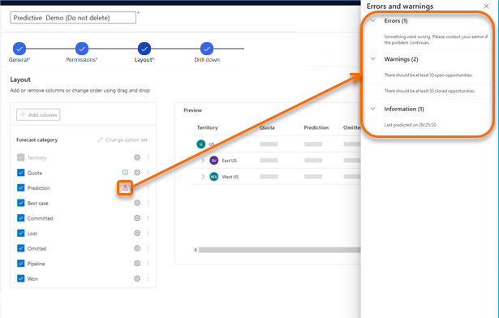

# View prediction model status  

Use the status of prediction column in a forecast to view the details such as, last predicted date and errors.

## License and role requirements
| Requirement type | You must have |
|-----------------------|---------|
| **License** | Dynamics 365 Sales Premium  More information: [Dynamics 365 Sales pricing](https://dynamics.microsoft.com/sales/pricing/) |
| **Security roles** | System Administrator or Forecast Manager   More information: [Predefined security roles for Sales](security-roles-for-sales.md)|

## How to view prediction model status

You can view the details of the prediction model, such as last predicted date and errors in a forecast. After a model is generated, an icon is displayed corresponding to the **Prediction** column in the [layout configuration step](/dynamics365/sales-enterprise/choose-layout-and-columns-forecast) of a forecast. Based on the icon, you can determine whether the model was successful.

>[!NOTE]
>After you configure and publish a forecast with a prediction column for the first time, the column takes about two hours to display the data. 

## On successful prediction

When the prediction succeeds, an information icon is displayed corresponding to the **Prediction** column. Select the icon to see a side pane with the date of the last prediction.

> [!div class="mx-imgBorder"]
> 

## On erroneous prediction

When the prediction fails, an alert icon is displayed corresponding to the **Prediction** column. Select the icon to see a side pane with information about errors, warnings, and the last prediction date. Based on this information, you can take necessary steps to resolve the issues and regenerate the model.

> [!div class="mx-imgBorder"]
> 

### See also

[Premium forecasting](configure-premium-forecasting.md)

[!INCLUDE[footer-include](../includes/footer-banner.md)]
