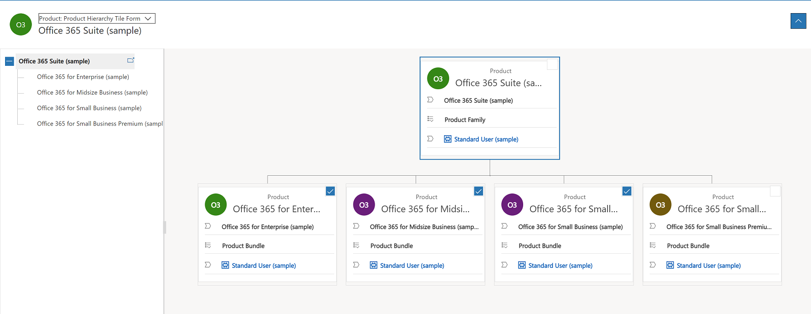

# View product hierarchy (Sales)

Get a visual snapshot of the products your organization sells by looking at the product hierarchy.

## License and role requirements
| Requirement type | You must have |
|-----------------------|---------|
| **License** | Dynamics 365 Sales Premium or Dynamics 365 Sales Enterprise   More information: [Dynamics 365 Sales pricing](https://dynamics.microsoft.com/sales/pricing/) |
| **Security roles** | System Administrator   More information: [Predefined security roles for Sales](security-roles-for-sales.md)|

## What is a product hierarchy

A product hierarchy gives you a visual snapshot of the products your organization sells. It makes it easy to see what products are available to sell and how they are connected. With this information at your fingertips, you can take whatever actions you need to on any product from a single place and improve your chances of a sale.  

## View hierarchy of a product family or bundle

1. [!INCLUDE[proc_sales_products](../includes/proc-sales-products.md)]  
  
2. In the list of products, open a product family, or bundle whose hierarchy you want to see, and on the command bar, select **View Hierarchy**.  
  
    You'll see the product in a tree structure and a visual organization of all products in the hierarchy.  
  
     
  
 

[!INCLUDE [cant-find-option](../includes/cant-find-option.md)]

### See also  
 [Set up a product catalog: Walkthrough](set-up-product-catalog-walkthrough.md)   
 [Create a product family](create-product-family.md)

[!INCLUDE[footer-include](../includes/footer-banner.md)]
