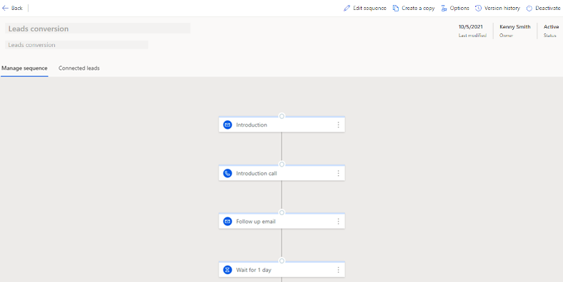

# View details of a sequence and its connected records 

You can view the details of a sequence and the records connected with it. This view can also be used to remove records connected with the sequence.

## License and role requirements

| &nbsp; | &nbsp; |
|-----------------------|---------|
| **License** | Dynamics 365 Sales Premium  More information: [Dynamics 365 Sales pricing](https://dynamics.microsoft.com/sales/pricing/) |
| **Security Role** | System Administrator or Sequence Manager    See [Predefined security roles for Sales](security-roles-for-sales.md)|
|||

## To view details of a sequence and its connected records
   
1. Sign in to your sales app.   
2. At the bottom of the site map, select **Change area** > **Sales Insights settings**.   
3. Under **Sales accelerator**, select **Sequence**.   
4. On the **Sequences** page, select the **Active** tab.    
    >[!NOTE]
    > You can assign records to sequences that are in active state only.

    > [!div class="mx-imgBorder"]
    >        
5. Select and open the sequence for which you want to assign records.      
    >[!TIP]
    >Alternatively, hover over a sequence, and then select **More options** > **View sequence**.    

    The sequence opens and on the **Manage sequence** tab, you can view the activities that are defined for the sequence.     

    > [!div class="mx-imgBorder"]
    >      
6. To view list of connected records, select the **Connected *record*** tab. In this examp
    The **Connected segments** that are associated with the sequence and the records that are connected.
    The **Connected *records*** section displays the list of records that are connected to the sequence with the following information in columns:   
       - **Progress**: Shows the number of steps that are completed in the record.  
       - **Current step**: Shows the step that is to be completed.
       - **Days elapsed**: Shows the number of days since the record moved into the current step. 

    > [!div class="mx-imgBorder"]
    >          

 
  
[!INCLUDE[cant-find-option](../includes/cant-find-option.md)]

### See also

[Create and manage sequences](create-manage-sequences.md)

[!INCLUDE[footer-include](../includes/footer-banner.md)]
