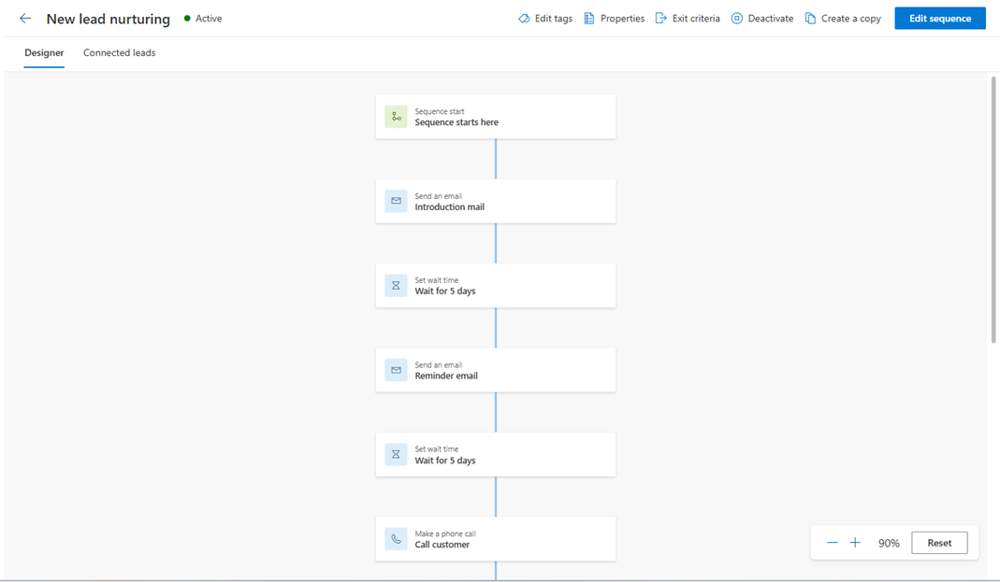
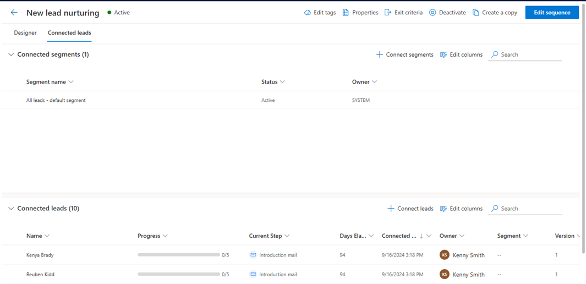

# View details of a sequence and its connected records 

You can view the details of a sequence and the records connected with it. 

## License and role requirements
| Requirement type | You must have |
|-----------------------|---------|
| **License** | Dynamics 365 Sales Premium or Dynamics 365 Sales Enterprise  More information: [Dynamics 365 Sales pricing](https://dynamics.microsoft.com/sales/pricing/) |
| **Security roles** | System Administrator or Sequence Manager    More information: [Predefined security roles for Sales](security-roles-for-sales.md)|

## To view details of a sequence and its connected records
   
1. Sign in to your sales app.   
2. At the bottom of the site map, select **Change area** > **Sales Insights settings**.   
3. Under **Sales accelerator**, select **Sequences**.   
4. On the **Sequences** page, select and open the sequence for which you want to view the details such as activities and assigned records.    
    
    >[!TIP]
    >Alternatively, hover over a sequence, and then select **More options** > **View sequence**.    

    The sequence opens and on the **Designer** tab, you can view the activities that are defined for the sequence.     

    > [!div class="mx-imgBorder"]
    >      

5. To view the list of connected records, select the **Connected *record*** tab. In this example, we're selecting a sequence with record type lead. You can also remove and connect records with the sequence through this view. More information: [Connect a sequence to records](connect-a-sequence-to-records.md#ContactThroughASequence)   
    - The **Connected segments** section lists the segments that are associated with the sequence.   
    - The **Connected *records*** section displays the list of records that are connected to the sequence with the following information in columns:   
        - **Progress**: Shows the number of steps that are completed in the record.  
        - **Current step**: Shows the step that is to be completed.    
        - **Days elapsed**: Shows the number of days since the record moved into the current step. 

    > [!div class="mx-imgBorder"]
    >          

6. To view the properties of the sequence such as, name, description, record type, and owner, select **Properties**. 
 
    > [!div class="mx-imgBorder"]
    >          

    The **Properties** pane opens.

    > [!div class="mx-imgBorder"]
    >     

 
[!INCLUDE[cant-find-option](../includes/cant-find-option.md)]

### See also

[Create and manage sequences](create-manage-sequences.md)

[!INCLUDE[footer-include](../includes/footer-banner.md)]
