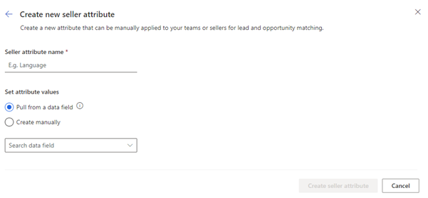

# Manage seller attributes

Seller attributes help you define skills of sellers such as languages, location, country, and skills. After you define attributes, you can use these attributes while configuring the rules to automatically assign leads to sellers.

## License and role requirements

| Requirement type | You must have |
|-----------------------|---------|
| **License** | Dynamics 365 Sales Premium, Dynamics 365 Sales Enterprise, or [Microsoft Relationship Sales](https://dynamics.microsoft.com/en-in/sales/relationship-sales/)  More information: [Dynamics 365 Sales pricing](https://dynamics.microsoft.com/sales/pricing/) |
| **Security roles** | System Administrator, Sequence Manager, or Sales Manager    More information: [Predefined security roles for Sales](security-roles-for-sales.md)|

## Manage seller attributes

As an administrator or a sequence manager, you can create attributes and add values. For example, you want to group sellers according to the languages they know. Create an attribute with the name **Languages**, and add values for the attribute such as English, French, and Spanish. Assign the language attribute to sellers, and then an assignment rule can be configured to assign leads automatically to sellers who know the required language.

You can use the attribute designer to:

- [Create an attribute](#create-an-attribute).
- [Edit an attribute](#edit-an-attribute).
- [Delete an attribute](#delete-an-attribute).

## Create an attribute

1. In the Sales Hub app, go to **Change area** in the lower-left corner of the page, and select **Sales Insights settings**.  
1. Under **Sales accelerator**, select **Work assignment**.  
1. On the **Work assignment** page, select **Settings**.  
1. On the **Work assignment settings** page, select **Manage attributes**.  
1. On the **Manage attributes** page, select **New seller attribute**.

    :::image type="content" source="media/sa-ar-seller-attributes-select-new-seller-attribute.png" alt-text="Screenshot of manage attribute page to add new seller attribute.":::

1. In the **Create new seller attribute** dialog, enter the information as follows:

   >[!div class="mx-imgBorder"]
   >   

    - **Seller attribute name**: Enter a name for the attribute. For example, **Language**.   
    - **Set attribute values**: Select how you want to enter the values for the attribute.      
        - **Pull from a data field**: The attribute values are fetched from a data field with an option set that is selected from the **Search data field** dropdown list. The list displays fields of type option set that is available lead, opportunity, and mutual. For example, when you select the field as **Budget** from **Mutual fields (same option set)**, the values that are defined for the field in both lead and opportunity form are added to the attribute values. You can remove the values and also add values.

        :::image type="content" source="media/sa-ar-new-attribute-lead-related.png" alt-text="Screenshot of select the budget field to add values to the attribute.":::

       - **Do not link with fields**: Enter the attribute values manually.

        :::image type="content" source="media/sa-ar-new-attribute-manual-value.png" alt-text="Screenshot to enter attribute value manually.":::
 
1.	Select **Create seller attribute**.

The attribute is created and added to the list.

## Edit an attribute

1. In the Sales Hub app, go to **Change area** in the lower-left corner of the page, and select **Sales Insights settings**.  
1. Under **Sales accelerator**, select **work assignment**.  
1. On the **work assignment** page, select **Settings**.  
1. On the **Work assignment settings** page, select **Manage attributes**.  
1. On the **Manage attributes** page, select the pencil icon corresponding to the attribute that you want to edit.  
1. In the edit dialog, edit the values you want, and then select **Update seller attribute**.  

    :::image type="content" source="media/sa-ar-attribute-edit-attribute.png" alt-text="Screenshot of edit attribute dialog.":::
 
The attribute is updated.

## Delete an attribute

1. In the Sales Hub app, go to **Change area** in the lower-left corner of the page, and select **Sales Insights settings**.  
1. Under **Sales accelerator**, select **work assignment**.  
1. On the **work assignment** page, select **Settings**.  
1. On the **Work assignment settings** page, select **Manage attributes**.  
1. On the **Manage attributes** page, select the delete icon corresponding to the attribute.  
1. In the confirmation message, select **Delete permanently**.  

    :::image type="content" source="media/sa-ar-delete-attribute-confirmation.png" alt-text="Screenshot of delete attribute confirmation message.":::

The attribute is deleted from the application.

[!INCLUDE[cant-find-option](../includes/cant-find-option.md)] 

### See also

[Configure security roles to assign records](wa-manage-sales-teams.md)  
[Manage seller attributes](wa-manage-seller-attributes.md)  
