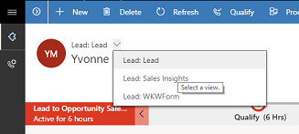
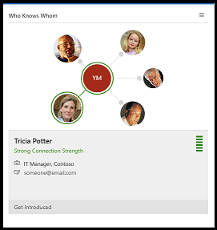
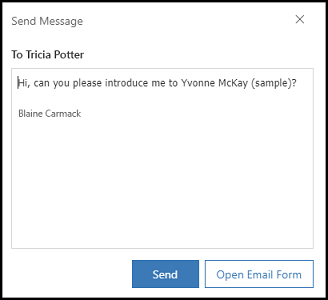

# How to get introduced to leads or contacts  

Use who knows whom to quickly identify colleagues who can introduce you to a lead or contact.

## License and role requirements

| Requirement type | You must have |  
|-----------------------|---------|
| **License** | Dynamics 365 Sales Premium  More information: [Dynamics 365 Sales pricing](https://dynamics.microsoft.com/sales/pricing/) |
| **Security roles** | Any primary sales role, such as salesperson or sales manager   More information: [Primary sales roles](security-roles-for-sales.md#primary-sales-roles)|

## What is who knows whom?

As a sales representative, you often interact with leads whom you've never talked to or even met before. If only you knew someone who knew the lead, an introduction could increase the chances of a positive outcome. Who knows whom in Dynamics 365 Sales does exactly that. Who knows whom suggests the names and email addresses of your colleagues who know the lead. It even helps you quickly email your colleagues to request an introduction.

Dynamics 365 calculates who knows whom relationships based on users' email interactions and meetings in your Microsoft Exchange environment. It uses that data to suggest colleagues who can help make a connection. You can [opt out](#turn-off-data-sharing-with-dynamics-365-applications) of having your Exchange data collected. You can also search for contacts or leads outside your Exchange organization and, if users in your Exchange organization have added internal users' email addresses to their Exchange address book, inside it, too.

You'll find the **Who Knows Whom** tile in **Contact** and **Lead** forms. When you open a lead or contact and select the **Sales Insights** view, the **Who Knows Whom** tile is displayed. 

## Use the Who Knows Whom tile

The Who Knows Whom tile shows up to five people in your organization who have communicated with the lead through calls and emails. It also shows you how strong their connection is.

1. In Dynamics 365 Sales, select a lead or a contact and open the **Sales Insights** view.

    :::image type="content" source="media/wkw-widget.png" alt-text="Screenshot of the Who Knows Whom tile.":::

    > [!NOTE]
    > If you don't see the **Who Knows Whom** tile in the **Sales Insights** view of a contact or lead, ask your admin to turn on the feature. If you see a message that you don't have sufficient privileges, ask your admin to provide necessary permissions. 

2. Select the icon in the upper-right corner of the **Who Knows Whom** tile to switch between graph and list views.

### List view

The list view of the tile displays colleagues in order of the strength of their connection to your lead. Green bars indicate a strong connection. A mix of gray and red indicates a weaker connection. The more gray that appears in the bar, the weaker the connection. You can also hover over the bar to display the connection strength in a tool tip.

:::image type="content" source="media/wkw-tile-bars.png" alt-text="Screenshot of the connection strength tool tip in the list view of the Who Knows Whom tile.":::

### Graph view

The graph view of the tile displays colleagues in a radial format, with shorter lines indicating stronger connections. You can also hover over a colleague's picture or avatar to display the connection strength in a tool tip.

:::image type="content" source="media/wkw-graph.png" alt-text="Screenshot of the connection strength tool tip in the graph view of the Who Knows Whom tile.":::

In the graph view, select a colleague to view their email address and connection strength.

:::image type="content" source="media/wkw-connection-details.png" alt-text="Screenshot of a colleague's connection details in the Who Knows Whom tile graph view.":::

### Ask for an introduction

You can ask a colleague to introduce you to the lead right from the **Who Knows Whom** tile.

1. In the list view or in the contact details section of the graph view, select **Get introduced**.

    **List view:**

    :::image type="content" source="media/wkw-get-introduced-list.png" alt-text="Screenshot of the Who Knows Whom tile list view with Get introduced highlighted.":::

    **Graph view:**

    :::image type="content" source="media/wkw-get-introduced-graph.png" alt-text="Screenshot of the Who Knows Whom tile graph view with Get introduced highlighted.":::

1. In the email compose window, use the provided text or add your own to ask your colleague to introduce you to the lead.
1. Select **Send** to send the request or **Open Email Form** to customize the email with more options.

    :::image type="content" source="media/wkw-intro-email.png" alt-text="Screenshot of the email compose window in the Who Knows Whom tile.":::

Let’s look at an example. Blaine Carmack is a sales representative who sells coffee makers. He has a new lead, Yvonne McKay, who owns Fourth Coffee and has opened a new store. Blaine wants to sell coffee machines to Yvonne, but he has not met or spoken to her. Before Blaine makes a call to Yvonne, he wants to know if any of his colleagues know her so that they could introduce him to increase the positive outcome of the call. Blaine will perform the following steps:

1.	Open the Sales app and go to the **My Open Leads** view.
2.	Open the lead **Yvonne McKay** with the topic **New store opened this year - follow up**.  
    The summary of the lead displays.
3.	Select the **Lead:Sales Insights** view from the view dropdown list.

    > [!div class="mx-imgBorder"]
    > 

    The **Who Knows Whom** tile is displayed.

    > [!div class="mx-imgBorder"]
    > 

4.  Select each contact to view the details and verify the connection strength to increase the chances of an introduction to the lead. Here, Tricia Potter has a better chance to introduce Yvonne McKay because of her strong connection strength.

    > [!div class="mx-imgBorder"]
    > 

    Alternatively, select list view to verify the connection strengths.

5.	Select **Get Introduced** to send an email to Tricia requesting an introduction to Yvonne.

    > [!div class="mx-imgBorder"]
    > 
  
6.	Select **Send**. 
    The email is sent to Tricia to introduce Yvonne. 

## Turn off data sharing with Dynamics 365 applications

You can choose to opt out if you don't want Dynamics 365 to analyze your Exchange data. Your Office 365 organization must be in one of the [EMEA or Asia Pacific global geographies](/microsoft-365/enterprise/o365-data-locations?view=o365-worldwide&preserve-view=true) to opt out of who knows whom data collection.

1. Sign in to your [Office 365 account](https://myprofile.microsoft.com/).

    > [!div class="mx-imgBorder"]
    > 

2. Select **Settings & Privacy**, and then select the **Privacy** tab. 

3. In the **Services** section, select the arrow next to **Dynamics 365 applications**.  

4. Turn off the **Include my data in Dynamics 365 applications** toggle.

    > [!div class="mx-imgBorder"]
    > 

    Dynamics 365 applications can no longer access, collect, or analyze your data.  

### See also

[Configure who knows whom](configure-who-knows-whom.md)  
[Who knows whom FAQs](faqs-sales-insights.md#who-knows-whom)

[!INCLUDE[footer-include](../includes/footer-banner.md)]
