# Work with LinkedIn activities

You can use LinkedIn-related activities that have been defined for sequences in the sales accelerator to display steps in the work list and **Up next** widget.

## License and role requirements
| Requirement type | You must have |  
|-----------------------|---------|
| **License** | Dynamics 365 Sales Premium  More information: [Dynamics 365 Sales pricing](https://dynamics.microsoft.com/sales/pricing/) |
| **Security roles** | Any primary sales role, such as salesperson or sales manager   More information: [Primary sales roles](security-roles-for-sales.md#primary-sales-roles)|

## What are LinkedIn activities?

As a seller, you can use the LinkedIn network, which contains millions of users and offers a unique depth and quality of information that can help you research and connect with your customers. This functionality allows you to use LinkedIn Sales Navigator in your sequence to recommend the next best action.

When a sequence contains steps that are related to LinkedIn activities, you can perform the following actions to interact with customers:

-  Research a customer to learn more about their preferences. More information: [Research activity](#research-activity)
- Get introduced to a customer. More information: [Get introduced activity](#get-introduced-activity)
- Send personal messages to connect with a customer. More information: [Connect activity](#connect-activity)
- Send an InMail to a customer. More information: [Send InMail activity](#send-inmail-activity)

## Research activity

You can use the **Research** activity to view LinkedIn profiles, including customer contact and account information. This can help you to better understand customers before you start working with them.

You can perform the actions described in the following table.

|   &nbsp;     | Up next widget | Work list item |
|--------------|----------------|----------------|
| **Sample image** | 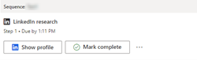 | 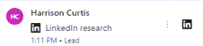|
| **Action** | Select **Show profile**. | Hover over the item, and then select the LinkedIn icon. |
| **Close the step** | Select **Mark complete**, to close the step and move to the next step.  or Select **More options (...)**, and then choose an appropriate option:<ul><li>**Skip** to ignore the step.</li><li>**Snooze** to look into the step later.</li><li>**Assign** to transfer the step to a different seller.</li></ul> | Select **More options (&vellip;)**, and then choose an appropriate option:<ul><li>**Mark complete** to close the step and move to the next step.</li><li>**Skip** to ignore the step.</li><li>**Snooze** to look into the step later.</li><li>**Assign** to transfer the step to a different seller.</li></ul> |

When the action is selected, the **LinkedIn research** pane opens on the right side with information about the customer profile and account. 

The following image is an example of the **LinkedIn research** side pane:
 
>[!div class="mx-imgBorder"]
>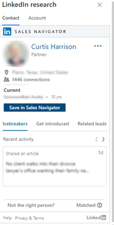

For more information on contacts and accounts, go to [Leads Module References](/linkedin/sales/display-services/leads-screenshots) and [Accounts Module References](/linkedin/sales/display-services/accounts-screenshots), respectively.

## Get introduced activity

Use the **Get introduced** activity to ask for an introduction to a customer from anyone within your network who's already connected to the customer. If the Sales Navigator instance has licensed TeamLink, you'll be able to see anyone in your organization who's connected to the customer and can make the introduction.

You can perform the actions described in the following table.

|     &nbsp;   | Up next widget | Work list item |
|--------------|----------------|----------------|
| **Sample image** | 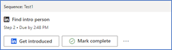 | 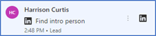|
| **Action** | Select **Get introduced**. | Hover over the item, and then select the LinkedIn icon. |
| **Close the step** | Select **Mark as complete** to close the step and move to the next step. or Select **More options (...)**, and then choose an appropriate option:<ul><li>**Skip** to ignore the step.</li><li>**Snooze** to look into the step later.</li><li>**Assign** to transfer the step to a different seller.</li></ul> | Select **More options (&vellip;)**, and then choose an appropriate option:<ul><li>**Mark as complete** to close the step and move to the next step.</li><li>**Skip** to ignore the step.</li><li>**Snooze** to look into the step later.</li><li>**Assign** to transfer the step to a different seller.</li></ul> |

When the action is selected, the **Find intro person** pane opens on the right side. On the **Contact** tab, select the **Get introduced** tab. The list of contacts who might be able to introduce the customer is displayed.  

The following image is an example of the **Get introduced** tab on the **Find intro person** side pane:

>[!div class="mx-imgBorder"]
>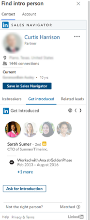 

For more information on customer introductions, go to [Get Introduced](/linkedin/sales/display-services/leads-screenshots#get-introduced).

## Connect activity

Use the **Connect** activity to send connection invites along with personal messages, to help solidify relationships with customers and add them to your network.

You can perform the actions described in the following table.

|   &nbsp;     | Up next widget | Work list item |
|--------------|----------------|----------------|
| **Sample image** | 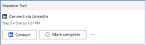 | 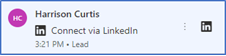|
| **Action** | Select **Connect**. | Hover over the item, and then select the LinkedIn icon. |
| **Close the step** | Select **Mark complete** to close the step and move to the next step. or Select **More options (...)**, and then choose an appropriate option:<ul><li>**Skip** to ignore the step.</li><li>**Snooze** to look into the step later.</li><li>**Assign** to transfer the step to a different seller.</li></ul> | Select **More options (&vellip;)**, and then choose an appropriate option:<ul><li>**Mark complete** to close the step and move to the next step.</li><li>**Skip** to ignore the step.</li><li>**Snooze** to look into the step later.</li><li>**Assign** to transfer the step to a different seller.</li></ul> |

When the action is selected, the **Connect via LinkedIn** pane opens in the lower-right corner. On the **Connect via LinkedIn** tab, you can see the default message used to connect with the customer.

The following image is an example of the **Connect** message side pane:

>[!div class="mx-imgBorder"]
>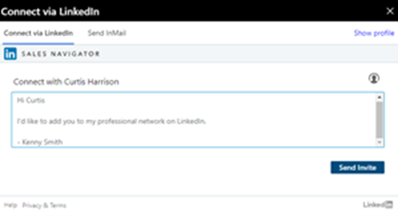 

For more information on connecting with a customer, go to [Connect](/linkedin/sales/display-services/leads-screenshots#connect).

## Send InMail activity

Use the **Send InMail** activity to directly message customers who you're not already connected to on LinkedIn.

You can perform the actions described in the following table.

|   &nbsp;     | Up next widget | Work list item |
|--------------|----------------|----------------|
| **Sample image** | 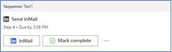 | 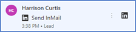|
| **Action** | Select **InMail**. | Hover over the item and then select the LinkedIn icon. |
| **Close the step** | Select **Mark complete** to close the step and move to the next step. or Select **More options (...)**, and then choose an appropriate option:<ul><li>**Skip** to ignore the step.</li><li>**Snooze** to look into the step later.</li><li>**Assign** to transfer the step to a different seller.</li></ul> | Select **More options (&vellip;)**, and then choose an appropriate option:<ul><li>**Mark complete** to close the step and move to the next step.</li><li>**Skip** to ignore the step.</li><li>**Snooze** to look into the step later.</li><li>**Assign** to transfer the step to a different seller.</li></ul> |

When the action is selected, the **Send InMail** pane opens in the lower-right corner. Go to the **Send InMail** tab, enter a subject and message, add any attachments if necessary, and then select **Send**. The InMail message is sent to the customer.

> [!NOTE]
> To view the profile of the customer, select **Show profile**.

The following image is an example of the **Send InMail** side pane:

>[!div class="mx-imgBorder"]
> 
 
For more information on sending InMail, go to [Send an InMail Message](https://www.linkedin.com/help/linkedin/answer/437).

### See also

[Add LinkedIn activities to sequence](linkedin-activities-sequence.md)

[!INCLUDE[footer-include](../includes/footer-banner.md)]
