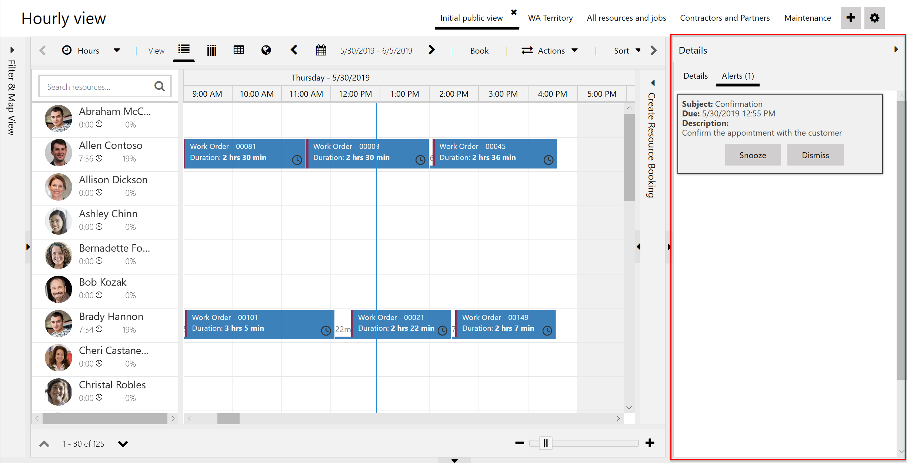

Dispatchers need to be aware of important updates and status changes to ensure accurate schedules and timely job completion. Beyond scheduling, dispatchers may also need to ensure billing and customer satisfaction concerns are handled.

**Booking alerts** bring attention to important notifications so that dispatchers can schedule with confidence. Booking alerts display notes and reminders on the schedule board, and can relate to bookings, work orders, users, and other entities. They can be triggered based on timers, set alarms, or workflows.

> [!div class="mx-imgBorder"]
> 

## Create a booking alert

Booking alerts are often created through automation - either a flow, plugin or through an integration with an external system. They can also be manually created from the schedule board.

1. Open the schedule board, select the **Actions** and choose **New Booking Alert**.

2. On the **Booking Alert** form, enter **Subject** and **Description** to define the message that appears on the alert.

> [!div class="mx-imgBorder"]
> 

1. Set the **Due Date** for when the alert shows.

1. Choose a related record in the **Regarding** field to shoe the alert in the related record's timeline.

1. Choose at least one system user in the **Assignees** field. Each assignee can choose to snooze or dismiss the alert individually.

You can edit the fields inside a booking alert by editing the **Booking Alert Template** in the schedule board tab settings. For more information, see [schedule board tab settings](/dynamics365/field-service/schedule-board-tab-settings#other-settings).

## View the booking alert

Once the due date is reached and the alert appears on the schedule board side pane, assignees can dismiss or snooze the active alert. Selecting the snooze option will dismiss the alert for a configurable amount of time.

Alerts for **Bookable Resource Bookings** also show in the schedule board alongside a booking time slot.

The icon indicates the number of active alerts for that booking. Select the number to show the alerts. **Snooze** or **Dismiss** them as needed.

By creating the booking alert, the system automatically creates one *Booking Alert Status* record for every assignee so every user can snooze or dismiss alerts individually. When deleting records, keep the relationship *Booking > Booking Alert > Booking Alert Status* in mind.
