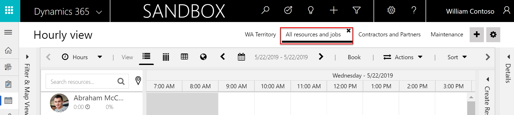
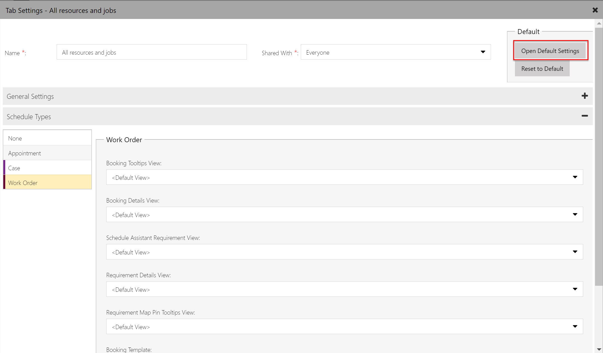

When a requirement is scheduled to a resource, a booking record is created and displayed on the schedule board during the respective resource's time slot. The fields displayed in the schedule board booking is called a **Booking Template** and is editable.

> [!div class="mx-imgBorder"]
> 

In this topic, we'll discuss how to edit the booking template.

## Prerequisites

- Field Service v6.1+

## Edit work order booking template

Each schedule board and each scheduling-enabled entity (such as work orders, projects, cases, or custom entities) can have a different booking template. When a work order requirement is scheduled, the booking template shows the **Bookable Resource Booking** record's **Name** and **Duration** values as seen in the following screenshot.
 
> [!div class="mx-imgBorder"]
>    

The HTML that displays these values is:

    
{SchedulableEntityDisplayName} - {name} Duration: <strong class="bold">{duration}</strong>
 

To edit the HTML that controls the booking template, double-click the name of the schedule board tab, then scroll down to the **Schedule Types** section and select the entity on the left for which you would like to change the booking template. 
 
> [!div class="mx-imgBorder"]
> 

In this example, we will choose work order, and then find the **Booking Template** field at the end of the form.

> [!div class="mx-imgBorder"]
>   

Next, modify the booking template by deleting the existing value and entering HTML and CSS that can reference fields from the **Bookable Resource Booking** entity and linked entities, such as the work order. 

Here is an example that pulls values from the work order that relates to the booking.

    

    WO: 
    <B>{msdyn_msdyn_workorder_bookableresourcebooking_WorkOrder.msdyn_name}</B> 
    Account: <b>{msdyn_msdyn_workorder_bookableresourcebooking_WorkOrder.msdyn_account_msdyn_workorder_ServiceAccount.name}</b> 
    Incident: <b>{msdyn_msdyn_workorder_bookableresourcebooking_WorkOrder.msdyn_primaryincidenttype}</b> 
    Duration: <b>{duration} minutes</b> 
    

Enter the sample text above and select **Apply**.

Refresh the schedule board and bookings related to work order requirements will appear as the following:

> [!div class="mx-imgBorder"]
>  

> [Note!]
> To avoid typing mistakes, go to **Customization** > **Entities** > **Bookable Resource Bookings** and copy the field names. Fields from the **Bookable Resource Booking** entity can be referenced directly using the field name in curly brackets. Example: **{duration}**.

If you want to display a field from a linked entity, find the name of the N:1 relationship - for the work order entity, it's **msdyn_msdyn_workorder_bookableresourcebooking_WorkOrder** - and add a period (.) followed by the field name of the target entity. For example, the primary incident type field on the work order has a schema name of **msdyn_primaryincidenttype**; simply add this after the relationship schema and enclose the whole string with curly brackets, as follows: 

**{msdyn_msdyn_workorder_bookableresourcebooking_WorkOrder.msdyn_primaryincidenttype}**

Linking to yet another entity (like from work order to account) is also possible - simply connect the entities with period, like in our previous example.

 
Following these instructions will edit the booking template for work order requirements displayed on *this* schedule board tab. If you would like to edit the default booking template for *all* schedule board tabs, then select **Open Default Settings** and edit the **Booking Template** field there.

> [!div class="mx-imgBorder"]
> 

> [!Note]
> When **< Default >** is displayed in a schedule board tab setting field, this means the value is being dictated by the default settings.

## Advanced booking template styling using CSS

In this scenario, let's add customer rating and service call icons to the booking template based on conditional values on the account and work order records.

Let’s assume that there is a customer rating that the dispatcher should see on the schedule board to prioritize jobs. The customizer has added a field **new_customerrating** on the Account entity and propagates that field to the work order entity with an integer range from 1 to 10. Using the approach above, this field could easily be added to the booking template, though it won't look to good.

Instead, in our scenario, we want the booking template to show the customer rating as 5 grey stars, which represent the range. To represent the actual customer rating, we will overlay 5 orange stars, but only show a percentage of these, corresponding to the 1-10 customer rating.

For example: let's say the customer rating is 4 out of 10, so we only show 40% of the orange stars, which is 2 out of 5. See the following screenshot for an example.

> [!div class="mx-imgBorder"]
>  

We also want our dispatcher to see whether a work order is a service call or another type of job. The customizer has created a field **new_isservicecall** on the work order entity, values are 0 or 1. Using the same approach as above, we first draw a gray wrench as background, put an orange wrench on top and limit its size to 0% (new_isservicecall = 0) or 100% (new_isservicecall = 1).

> [!div class="mx-imgBorder"]
>  

Go to **Resource Scheduling > Administration > Scheduling Parameters** and set **Disable Sanitizing HTML Templates** to **Yes**. This is required to be able to include CSS statements into the booking templates.

Next, add the following HTML and CSS text to **Booking Template** field in **Schedule Board Tab Settings**. 

    

    

        <i class="fa fa-star" aria-hidden="true"></i>
        <i class="fa fa-star" aria-hidden="true"></i>
        <i class="fa fa-star" aria-hidden="true"></i>
        <i class="fa fa-star" aria-hidden="true"></i>
        <i class="fa fa-star" aria-hidden="true"></i>
    

        <i class="fa fa-star" aria-hidden="true"></i>
        <i class="fa fa-star" aria-hidden="true"></i>
        <i class="fa fa-star" aria-hidden="true"></i>
        <i class="fa fa-star" aria-hidden="true"></i>
        <i class="fa fa-star" aria-hidden="true"></i>
    

    

    

        <i class="fa fa-wrench" aria-hidden="true"></i>
    

        <i class="fa fa-wrench" aria-hidden="true"></i>
    

    

     
    WO:
    <b>{msdyn_msdyn_workorder_bookableresourcebooking_WorkOrder.msdyn_name}</b> 
    Account: <b>{msdyn_msdyn_workorder_bookableresourcebooking_WorkOrder.msdyn_account_msdyn_workorder_ServiceAccount.name}</b> 
    Incident: <b>{msdyn_msdyn_workorder_bookableresourcebooking_WorkOrder.msdyn_primaryincidenttype}</b> 
    Duration: <b>{duration} minutes</b> 
    

See the result of the change in the following screenshot.

> [!div class="mx-imgBorder"]
> 
  
When building these advanced booking templates, make sure to test on multiple browsers and also consider accessibility.

### See also

- [Add custom resource attributes to the schedule board](https://docs.microsoft.com/dynamics365/field-service/extend-schedule-board-custom-resource-attribute)
