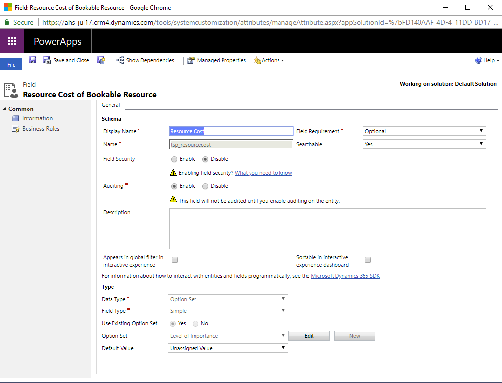
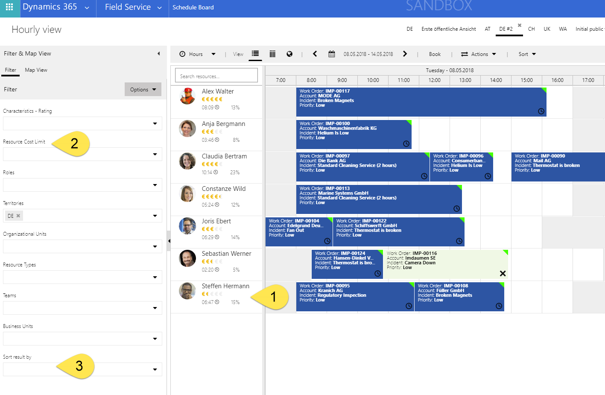
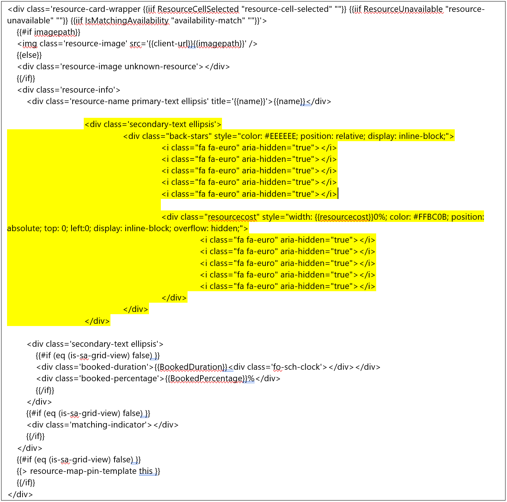
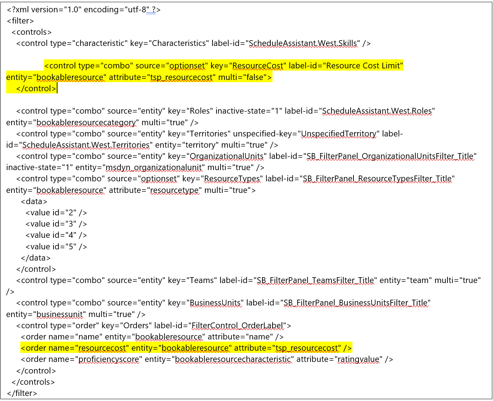
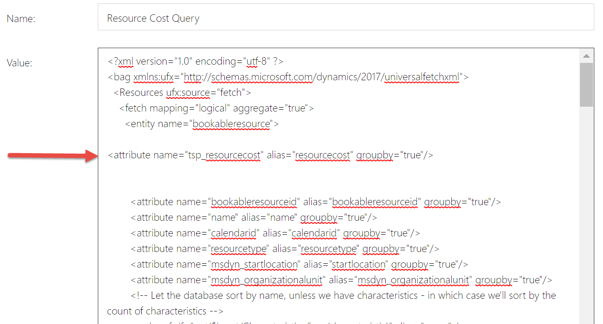
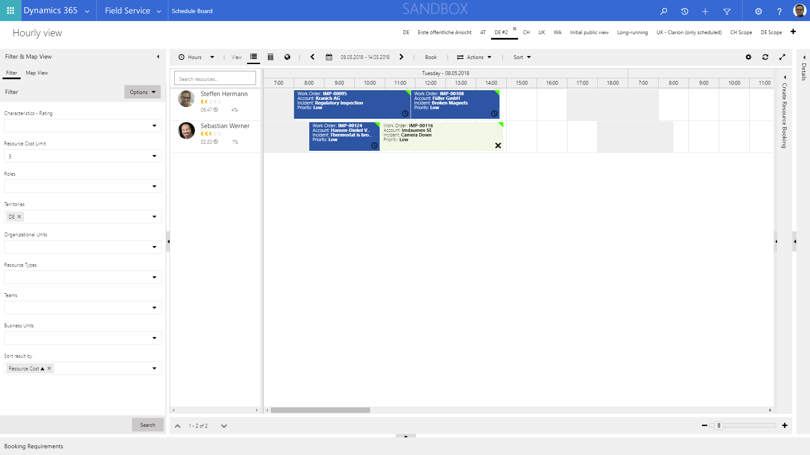
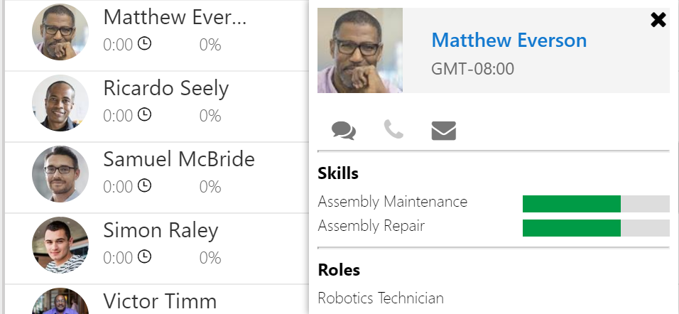

The schedule board can be customized and extended to help you reach your business needs. Common examples include customizing:

1. the resource cells where the resources' names, pictures, and utilization are listed by default 
2. the fields in the filter pane where dispatchers choose the resources in a view 
3. the sort options (also located in the filter pane) allowing dispatchers to sort the current resources on the the schedule board based on various criteria.

Consider the following customization scenario:

Each bookable resource (field technician) has a cost based on factors like seniority and certification level. Dispatchers would like to see the general cost of their resources, along with the ability to filter and sort by cost. This is common for scenarios where an organization prioritizes scheduling internal employees over external contracting parties, who are usually more expensive. Rather than use an exact resource cost, this scenario uses a score of 1 (lowest resource cost) to 10 (highest resource cost) and exposes the score: 

- In the resource cell, for viewing the cost with a graphical element
- In the filter panel, to filter a by a maximum cost level for the desired resources
- In the sort options, to sort from lowest to highest cost or vice versa

In this topic, we'll walk through how to configure this common example scenario.

## Prerequisites

- Field Service v6.2.1+
- Universal Resource Scheduling v1.1.1+

## Step 1: Add the new attribute to the bookable resource entity

Go to **Customizations > Customize the System > Bookable Resource > Fields** and add a new field named **Resource Cost** with the schema name **tsp_resourcecost**. If your organization has a different schema prefix such as **new_**, it can be used if the code snippets (which you will find below) are updated to reflect this.

> [!div class="mx-imgBorder"]
> 

Use the data type **Option Set** and select the existing option set **Level of Importance**. This is simply to have a list of 1 to 10, where the underlying numeric values are also 1 to 10.

Add the newly created field to the form to be able to administrate your resources. **Publish the changes**.

## Step 2: Create a new schedule board (or modify an existing one)

Go to the schedule board that you want to add the new resource cost attribute to. In the following example screenshot, you'll see a schedule board titled "DE#2". You'll also find the 3 areas highlighted on the schedule board that we will customize with the new resource cost attribute. 

1. add resource cost indicator in the resource cells 
2. define a maximum cost score when filtering and searching for resources
3. allow sorting by cost score

> [!div class="mx-imgBorder"]
> 

## Step 3: Modify the resource cell template

The resource cost indicator should be displayed in the resource cell (1). [Font Awesome](https://fontawesome.com/) can be used to display icons, such as €, $, £. 

The HTML first draws 5 gray icons as a background, then 5 yellow icons as foreground. Then the number of the foreground icons is limited to the value of the resource cost; in other words, a resource cost value of 2 is converted to 20%, which means only 20% of the 5 yellow Euro icons (1 icon) will be displayed. A resource cost value of 5 shows 50% of the 5 yellow Euro icons (2.5 icons). 

Double-click the tab of your schedule board (DE#2 in our example). Scroll down to resource cell template. You can't (and shouldn't) modify the standard templates. Use the button and **Save As** to create a custom template. 

> [!Note]
> If you want to set these changes as the default for all schedule boards, after double-clicking a schedule board tab, select **Open Default Settings** in the top right and make the code changes to **Resource Cell Template**, **Filter Layout**, and **Retrieve Resources Query**.

> [!div class="mx-imgBorder"]
> 

Below is the new code snippet to copy and paste into the resource cell template, followed by an image that shows the delta (highlighted in yellow) that can be used to modify an existing template. Replace **fa-euro** if you need a symbol different from the euro.

    

    {{#if imagepath}}
    
    {{else}}
    

    {{/if}}
    

        
{{name}}

		
 
			

				<i class="fa fa-euro" aria-hidden="true"></i>
				<i class="fa fa-euro" aria-hidden="true"></i>
				<i class="fa fa-euro" aria-hidden="true"></i>
				<i class="fa fa-euro" aria-hidden="true"></i>
				<i class="fa fa-euro" aria-hidden="true"></i>
				
				

					<i class="fa fa-euro" aria-hidden="true"></i>
					<i class="fa fa-euro" aria-hidden="true"></i>
					<i class="fa fa-euro" aria-hidden="true"></i>
					<i class="fa fa-euro" aria-hidden="true"></i>
					<i class="fa fa-euro" aria-hidden="true"></i>
				

			

		

        

            {{#if (eq (is-sa-grid-view) false) }}
            
{{BookedDuration}}

            
{{BookedPercentage}}%

            {{/if}}
        

        {{#if (eq (is-sa-grid-view) false) }}
        

        {{/if}}
    

    {{#if (eq (is-sa-grid-view) false) }}
    {{> resource-map-pin-template this }}
    {{/if}}
    

> [!div class="mx-imgBorder"]
> 

## Step 4: Modify the filter layout

Our next goal is to define a maximum cost score when filtering and searching for resources **(2)** and also allow sorting by cost score **(3)**. 

> [!div class="mx-imgBorder"]
> 

To accomplish this, from the same schedule board tab setting where you edited the resource cell template, scroll to **Filter Layout**. Use the gear button and **Save As** to create a custom template. 

Copy and paste the following code snippet into the Filter Layout. The following image shows the delta (highlighted in yellow) that can be used to modify an existing template.

    <?xml version="1.0" encoding="utf-8" ?>
    <filter>
    <controls>
    <control type="characteristic" key="Characteristics" label-id="ScheduleAssistant.West.Skills" />

	<control type="combo" source="optionset" key="ResourceCost" label-id="Resource Cost Limit" entity="bookableresource" attribute="tsp_resourcecost" multi="false">
    </control>
				
    <control type="combo" source="entity" key="Roles" inactive-state="1" label-id="ScheduleAssistant.West.Roles" entity="bookableresourcecategory" multi="true" />
    <control type="combo" source="entity" key="Territories" unspecified-key="UnspecifiedTerritory" label-id="ScheduleAssistant.West.Territories" entity="territory" multi="true" />
    <control type="combo" source="entity" key="OrganizationalUnits" label-id="SB_FilterPanel_OrganizationalUnitsFilter_Title" inactive-state="1" entity="msdyn_organizationalunit" multi="true" />
    <control type="combo" source="optionset" key="ResourceTypes" label-id="SB_FilterPanel_ResourceTypesFilter_Title" entity="bookableresource" attribute="resourcetype" multi="true">
      <data>
        <value id="2" />
        <value id="3" />
        <value id="4" />
        <value id="5" />
      </data>
    </control>
    <control type="combo" source="entity" key="Teams" label-id="SB_FilterPanel_TeamsFilter_Title" entity="team" multi="true" />
    <control type="combo" source="entity" key="BusinessUnits" label-id="SB_FilterPanel_BusinessUnitsFilter_Title" entity="businessunit" multi="true" />
    <control type="order" key="Orders" label-id="FilterControl_OrderLabel">
      <order name="name" entity="bookableresource" attribute="name" />

      <order name="resourcecost" entity="bookableresource" attribute="tsp_resourcecost" />

      <order name="proficiencyscore" entity="bookableresourcecharacteristic" attribute="ratingvalue" />
    </control>
    </controls>
    </filter>

> [!div class="mx-imgBorder"]
> 

## Step 5: Modify the query

Finally, we'll modify the actual query and include the new filter (the “le” operator only leaves resources with a cost score less than or equal to the one selected in the filter panel). Scroll to **Retrieve Resources Query**. 

Use the gear button and **Save As** to create a custom template. The existing code is lengthy, so below are only the code snippets to paste within an existing resource query.

After this line: 
            
        <entity name="bookableresource">:

Paste the following:

        <attribute name="tsp_resourcecost" alias="resourcecost" groupby="true"/>

See the following image for reference:

> [!div class="mx-imgBorder"]
> 

After the ending:

            </filter> tag of the <!-- Territory filter -->

Paste the following:

		<filter type="or" ufx:if="$input/ResourceCost">
			<condition attribute="tsp_resourcecost" operator="le">
				<ufx:value select="$input/ResourceCost" attribute="value" />
			</condition>
		</filter>

See the following image for reference:

> [!div class="mx-imgBorder"]
> 

## Step 6: Test your new schedule board

Back on the schedule board we've been working on, you'll see that we have defined a maximum cost factor of 5 and ascending sort order based on cost. See the following screenshot for reference.

> [!div class="mx-imgBorder"]
> 

## Additional notes

- At this time, resource cards can't be extended for custom layouts and fields. Resource cards are displayed when hovering over or right-clicking the resource's name on the schedule board.
> [!div class="mx-imgBorder"]
> 

- For further context on schedule board extensibility, visit our [topic that provides a deep overview of scheduling extensibility](https://docs.microsoft.com/dynamics365/customer-engagement/common-scheduler/developer/understanding-and-customizing-resource-matching-in-urs).

### See also
- A [sample walkthrough](https://docs.microsoft.com/dynamics365/customer-engagement/common-scheduler/developer/extending-urs-step-by-step) to help you learn how to implement extensibility.
- [Extensibility language syntax (UFX)](https://docs.microsoft.com/dynamics365/customer-engagement/common-scheduler/developer/universal-fetchxml).
- [Extensibility-specific release notes](https://docs.microsoft.com/dynamics365/customer-engagement/common-scheduler/developer/extensibility-release-notes).

