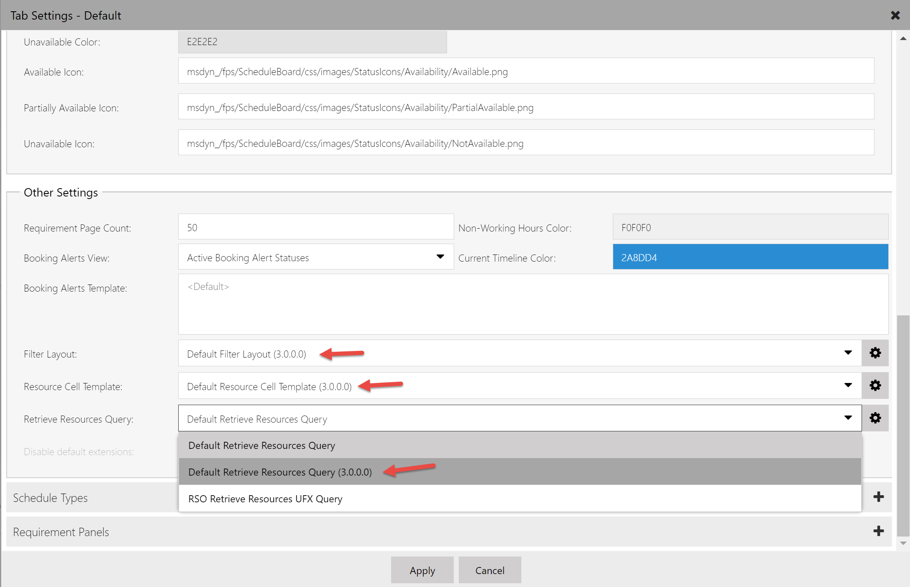

Universal Resource Scheduling (URS) enables organizations to schedule interactions between customers and company resources. For scenarios where the customer is expected to travel to the company's location, the facility scheduling feature can coordinate physical spaces and related resources.

Typical examples include:

**Reserving a physical space**

- Reserve a room for an event or party
- Reserve a room for an exercise class
- Reserve a bay at a mechanic shop
- Reserve a boat

**Reserving an appointment with a person at a facility**

- Laptop repair at a Microsoft retail store
- Wealth management consultation at bank branch
- Doctor's office with related nurse and doctor

In this article, we explore a few example scenarios using facility scheduling.

## Prerequisites

- Universal Resource Scheduling (URS) v3.0
- Field Service v8.0 (for work orders, if applicable)

In general, to use facility scheduling, you create a facility resource, configure a requirement that calls for facility resources, and book the requirement.

## Create a facility resource

1. Go to **Resource Scheduling > Resources** and select **New**. Enter facility as the **Resource Type**, a name for the facility, and the time zone.

1. On the **Scheduling** tab, enter the following information:

   - **Start/end location**: Organizational Unit Address.
   - **Organizational Unit**: The organizational unit where the facility is located. The parent organization must have a latitude and longitude value that represents the location of the facility. This allows the schedule assistant to consider the facility’s location when displaying available results.
   - **Display on Schedule Board**: Yes
   - **Enable for Availability Search**: Yes

1. Select **Save**.

1. (Optional) Add related characteristics, territory, resource roles, work hours to distinguish facility resources from other facilities and resources.

1. Select **Save & Close**.

## Create a requirement for a facility

1. Go to **Resource Scheduling > Requirement Groups** and select **New**. Enter the requirement name and select **Save**.

1. In the bottom pane, select the requirement group and then **Requirement**. Enter a name for the requirement, time range, and duration.

1. Select the requirement and then **Open Form**.

1. On the **Scheduling** tab, enter the following information:

   - **Work Location**: Facility
   - **Latitude** and **Longitude**: Customer's location

1. Select **Save & Close**.

## Book the requirement

1. On the requirement record, select **Book** to trigger the schedule assistant. The schedule assistant considers availability of resources and other set requirement constraints, such as characteristics, organizational units, categories, etc.

**Facility travel time and distance** calculations in the preceding schedule assistant example represent the time and distance between the facility resource (as defined by the location of the related organizational unit) and the customer's location (as defined by the latitude and longitude values on the requirement). The schedule assistant's radius filter filters based on this travel calculation.

**Filtering work location to location agnostic** removes travel time and distance calculations from schedule assistant results. 

## Configuration considerations

### Choosing the right work location on requirements

Let's take a look at the following work location types:

- Facility
- Onsite
- Location agnostic

> [!div class="mx-imgBorder"]
> 

  - **Facility** work location implies the interaction takes place at the facility and travel time is calculated as the distance between the customer location and the facility location. The requirement's latitude and longitude fields are used as the customer location. It also means at least one facility or facility pool must return in schedule assistant search results in order for a resource to be returned.
  
  - **On Site** work location implies the interaction takes place at the customer location and travel time is calculated as the distance between the customer location and the resource (typically field technician) location, which is variable based on the resource's schedule that day. The requirement's latitude and longitude fields are used as the customer location. As a result, facility resources and facility pools are excluded from the results.

  - **Location Agnostic** work location implies the interaction takes place remotely and the location of the customer nor the resource is considered for scheduling. Travel time isn't applicable and isn't calculated. Facility resources can still be returned as part of the schedule assistant search, but travel time won't be displayed or considered in ranking.

### "Part of Same" options on requirement groups

  - **Same Location**: Same location means that only teams of resources working at the same location will be returned. This uses the logic expressed in this document to determine the location, using the Resource Associations (msdyn_bookableresourceassociations) and the Bookable Resource Group (bookableresourcegroup) entities. Using this option, regardless of which specific facility or facility pool other non-facility resources may be associated to, all that matters is that the resources are at the same physical location (organizational unit).

  - **Same Resource Tree**: This option adds an extra layer of stringency to the search. It means that the teams assembled must actually be associated to the same facility or facility pool in order to be returned as a team. For example, let’s assume there's one physical location, Location A. 

    There are 2 facilities at location A: facility 1 and facility 2. If resource 1 is associated to facility 1, and "Same Resource Tree" is selected, the one team that can be assembled is facility 1 + resource 1. Facility 2 and resource 1 can't be returned. This combo could however be returned if “Same Location” is the only option selected. 

    It works the same with facility pools. Let’s assume there's one physical location, Location A. At location A are 2 facilities, facility 1 and facility 2, and a facility pool (facility pool 1). If resource 1 is associated to facility pool 1, and “Same Resource Tree” is selected, the one team that can be assembled is facility pool 1 (or one of it’s child facilities) + resource 1. 
   
 > [!Note]
 > If neither of these two options are selected on the requirement relationship (msdyn_requirementrelationship), and work location is set to facility, the schedule assistant search will execute as if “Same Resource Tree” was selected. 

  - **Same Organizational Unit**: An even more stringent option is same organizational unit. This option ensures that the parent organizational unit of the resources are the same. It doesn't check the bookable resource group or the bookable resource association entity. It only checks the parent organizational unit.

    If your implementation uses requirements that are location agnostic, this option may be used without either of the other two options; however, it completely ignores the two aforementioned entities (associations and groups). This could work in a simple implementation where resources are always staffed at the same location, and you don't need the advanced location search functionality of the work location “facility.”

> [!Note]
> The **Part of Same** field schema name is **msdyn_requirementrelationship**

### When to use "facility with capacity," "multiple facilities," and "facility pool"

- **Facility with capacity**: this option is configured by adding a capacity to a single facility. It's most useful when schedulers care most about not overbooking, and either don't need to schedule specific facilities or can handle coordination in person when customers arrive at the facility.

- **Multiple facilities**: this option is configured by creating multiple facility resources and relating them to each other through an organizational unit. This option makes the most sense when each facility needs to be scheduled individually.  

- **Facility pool**: this option is configured by creating a facility pool and adding facilities as pool members. This option makes the most sense when schedulers want to (1) utilize capacity scheduling by having the facility pool capacity increase and decrease as facilities are added or removed and (2) use local scheduling where bookings are first assigned to the facility pool and then later assigned to pool members. Example: a hotel (facility pool) is first scheduled for a weekend and travelers are assigned specific rooms (facility pool members) at a later date when they arrive. 

- When upgrading from Field Service v7.x to v8.x, facility type resources may not appear in schedule assistant results due to default filter settings. To fix this, go to **Field Service** > **Schedule Board**. Double-click on a schedule board tab, and then **Open Default Settings** in the upper right. Scroll down to **Other Settings**. Set **Retreive Resources Query** to 3.0.0.0 as seen in the following screenshot. **Filter Layout** and **Resource Cell Template** should also be set to 3.0.0.0.
> [!div class="mx-imgBorder"]
> 

## Additional notes

- For requirements that aren't part of a requirement group, only facility or facility pool resources can return in the schedule assistant if **Work Location** is set to **Facility**.
- A resource can't be related to two facilities (child or association) at the same time.
- There's currently no specific way to visualize every resource related to a facility on the schedule board. The closest way to achieve this is to filter by organizational units. 
- Manually scheduling a single requirement to a facility won't create records for all resources related to the facility.

### Facility pool location

The location for a facility pool is taken from the parent organizational unit. If a facility resource is a member of a facility pool, the location of the facility is taken from the pool resource. For example, if you create a facility with a location/organizational unit of **location A**, and you add this facility to a pool, which is located at **location B**, the facility is considered as located at **location B** for as long as it remains in the pool.

### Booking location

When a team is selected and booked, the latitude and longitude of the booked facility/facility pool's location will be stored on the booking record. The work location will also be set based on the work location used when booking in the schedule assistant. In the following conditions, the work location, latitude, and longitude will still be set on the booking: 
- If bookings are created without using the schedule assistant
- If the requirement's work location is set to facility
- There are latitude and longitude values on the requirement
