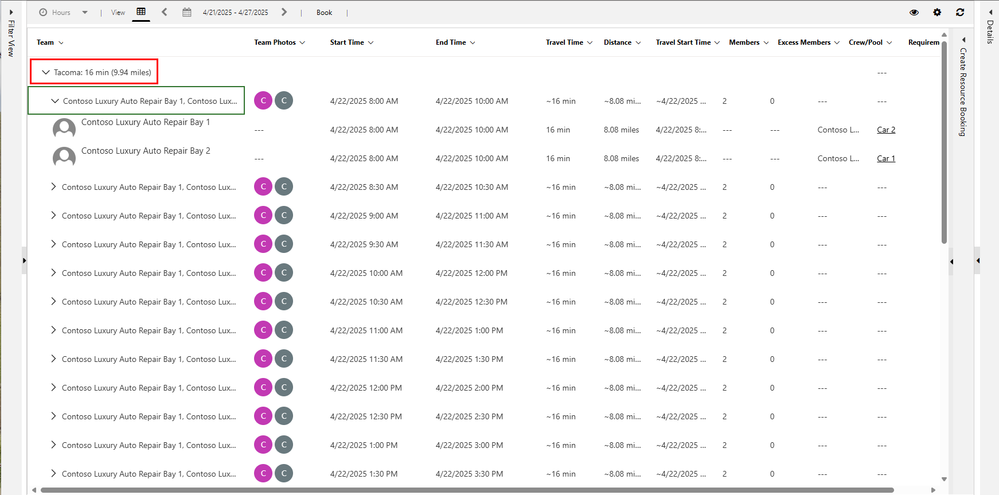
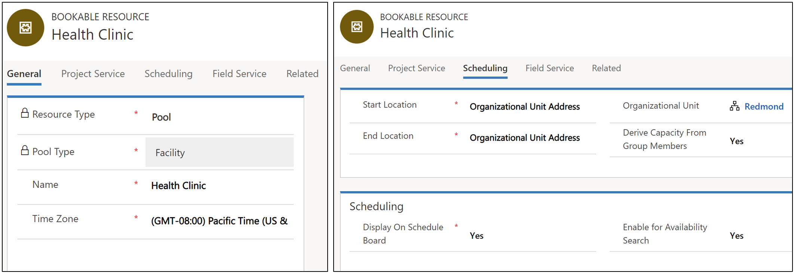
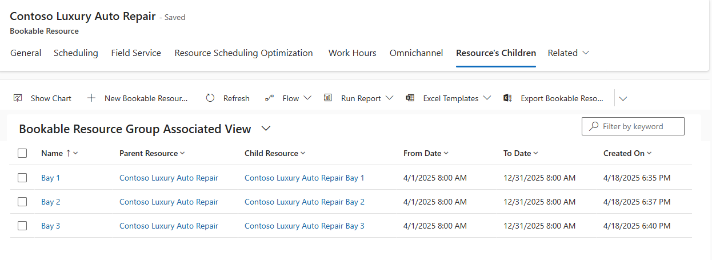
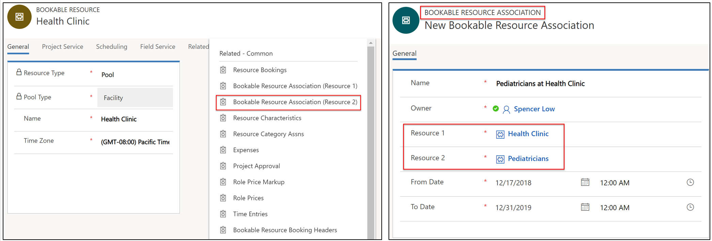
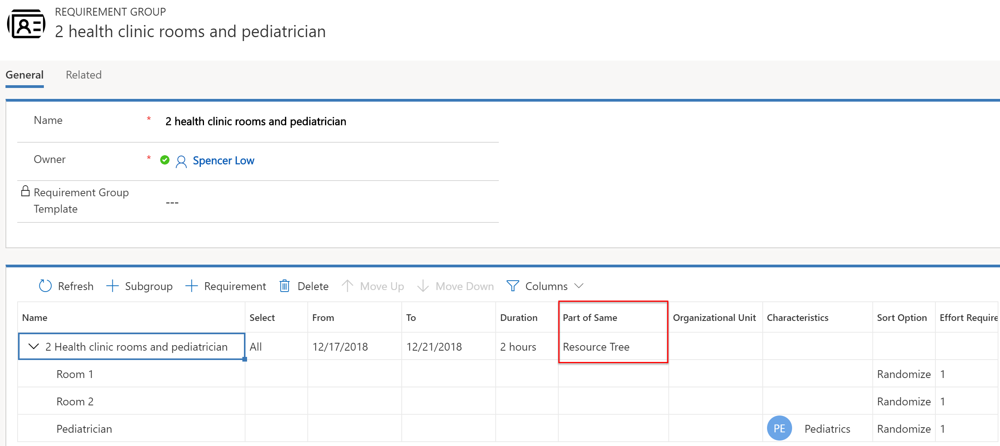
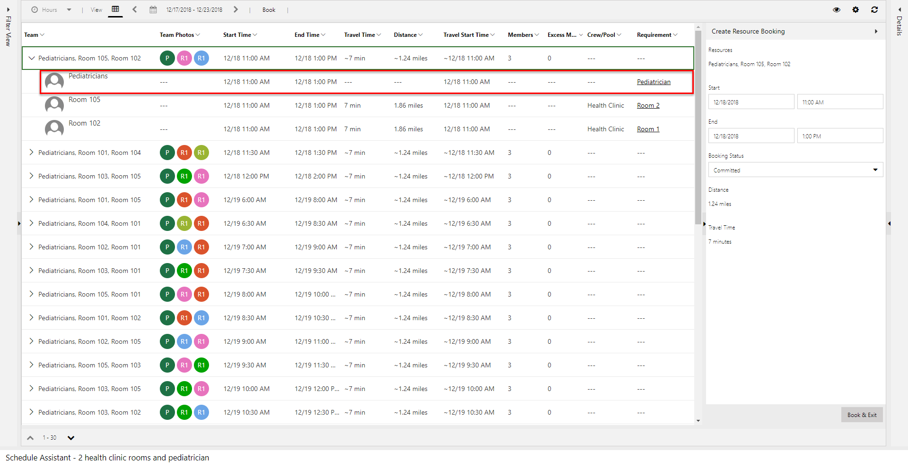

Universal Resource Scheduling (URS) enables organizations to schedule interactions between customers and company resources. For scenarios where the customer is expected to travel to the company's location, the facility scheduling feature can coordinate physical spaces and related resources.

Typical examples include:

**Reserving a physical space**

- Reserve a room for an event or party
- Reserve a room for an exercise class
- Reserve a bay at a mechanic shop
- Reserve a boat

**Reserving an appointment with a person at a facility**

- Laptop repair at a Microsoft retail store
- Wealth management consultation at bank branch
- Doctor's office with related nurse and doctor

## Prerequisites

- Universal Resource Scheduling (URS) v3.0
- Field Service v8.0 (for work orders, if applicable)

In general, to use facility scheduling, you create a facility resource, configure a requirement that calls for the facility resource, and book the requirement. In the following example, an auto repair shop in Redmond, WA. wants to schedule their auto repair bay.

Create a facility resource to represent the repair shop, create a requirement to represent the customer's request for an appointment, and then book the appointment.

## Create a facility resource

1. Go to **Resource Scheduling > Resources** and select **New**. Enter *Facility* as the **Resource Type**, a name for the facility, and the time zone.

1. On the **Scheduling** tab, enter the following information:

   - **Start/end location**: Organizational Unit Address.
   - **Organizational Unit**: The organizational unit where the facility is located. The organization must have a latitude and longitude value that represents the location of the facility.
   - **Display on Schedule Board**: Yes
   - **Enable for Availability Search**: Yes

1. Select **Save**.

1. (Optional) Add related characteristics, territory, resource roles, work hours to distinguish facility resources from other facilities and resources.

   For example, if an auto repair shop has ASE-certified mechanics or offers shuttle service, you can add them as characteristics or resource roles to the facility resource. This can influence which facility resources are filtered and displayed on the schedule board or which facility resources are returned during a schedule assistant search.

1. Select **Save & Close**.

## Create a requirement for a facility

1. Go to **Resource Scheduling > Requirement Groups** and select **New**. Enter the requirement name and select **Save**.

1. In the bottom pane, select the requirement group and then **Requirement**. Enter a name for the requirement, time range, and duration.

   :::image type="content" source="../../field-service/media/scheduling-facility-requirement-group.png" alt-text="Screenshot of a requirement in a requirment group with Open Form highlighted.":::

1. Select the requirement and then **Open Form**.

1. On the **General** tab, select **Facility** for the **Resource Type** to indicate this requirement requires a facility. Schedule assistant looks for facility resources to fulfill this requirement.

1. On the **Scheduling** tab, enter the following information:

   - **Work Location**: Facility
   - **Latitude** and **Longitude**: Latitude and logitude coordinates of the customer's location

1. Select **Save & Close**.

## Book the requirement

1. On the requirement record, select **Book**.

   The schedule assistant automatically sets the **Work Location** filter to *Facility*. It considers availability of resources and other set requirement constraints, such as characteristics, organizational units, and categories.

   > [!TIP]
   > Requirements that are part of a requirement group are scheduled via the **Book** button to trigger the schedule assistant. They aren't available to drag and drop on the schedule board. If your facility has single requirements, you can create the requirements through **Resource Requirements** and use the schedule board.

   :::image type="content" source="../../field-service/media/scheduling-facility-requirement-group.png" alt-text="Screenshot of a requirement in a requirment group with Open Form highlighted.":::

   The **Facility travel time and distance** calculations represent the time and distance between the facility resource (defined by the organizational unit location) and the customer's location (defined by the latitude and longitude on the requirement).

1. To remove the travel time and distance calculations from schedule assistant results, change the **Work Location** filter to *Location Agnostic*.

1. To book an appointment, select a time and then select **Book & Exit**.

## View a facility on the schedule board

To view facility resources on the schedule board, filter by resource type and/or organizational units.

:::image type="content" source="../../field-service/media/scheduling-facility-schedule-board-filter.png" alt-text="Screenshot of a booking to a facility on the schedule board.":::

Facility resources are displayed on the schedule board map based on the location of the related organizational unit.

## Facility scheduling examples

### Scenario 1: Schedule a facility with 5 generic spaces

An auto repair shop has 5 identical bays and schedulers don't need to book each bay specifically. They must, however, ensure that no more than 5 repairs are booked across all bays during any one time slot.

1. [Create a facility resource](facility-scheduling.md#create-a-facility-resource). On the **Work Hours** tab, enable **Capacity** and set it to 5.

1. [Create requirements](facility-scheduling.md#create-a-requirement-for-a-facility).

1. Book the requirements at the facility. When booking the facility resource, it shows as available and can be double-booked up to the capacity limit (in this case, 5 times).

> [!Note]
> Capacity scheduling is not intended for booking the same requirement multiple times, but rather to book multiple requirements. Rebooking a previously booked requirement will cancel the existing booking and create a new one.

### Scenario 2: Schedule a facility and related resource

An auto repair shop offers transmission repairs including luxury cars. They have a mechanic that specializes in luxury cars. Schedulers want to schedule the specialized mechanic at their facility. You can associate a resource (user, account, or contact) to a facility.

1. [Create a facility resource](facility-scheduling.md#create-a-facility-resource) for the auto repair shop.

1. Create a resource to represent the specialized mechanic.

   - Set the resource type to **User, Account, or Contact**.
   - The Start/end location should be set to **Organizational Unit Address** and the organizational unit should be set to the same organizational unit of the facility resource (in this case, the auto repair shop). This is **recommended but not required**.

1. Associate the specialized mechanic resource to the facility resource.

   - From the facility resource, select **Related > Bookable Resource Association (Resource 2)**. This related entity is called Resource Associations (**msdyn_bookableresourceassociations**).
   - Select **New Bookable Resource Association**.
   - Enter a name, timeframe, and select the mechanic resource for **Resource 1**.

   :::image type="content" source="../../field-service/media/scheduling-facility-associate-resource.png" alt-text="Screenshot of a booking to a facility on the schedule board.":::

1. [Create a requirement group](facility-scheduling.md#create-a-requirement-for-a-facility) with one requirement for the facility (doctor's office) and another requirement for the doctor resource. Set the **Work Location** on each requirement to **Facility**.

   - Set **Select** to **All** so that all requirements must be met.
   - Set **Part of Same** to **Resource Tree** so that resources from different locations aren't recommended for work at this facility. As an example, a doctor associated with Facility B shouldn't be paired with Facility A. Find more details about this setting in the configuration considerations section of this article.

1. Book the requirement group. Scheduling the requirement group creates a booking for the facility resource and the mechanic resource.

   :::image type="content" source="../../field-service/media/scheduling-facility-schedule-board-2-resources.png" alt-text="Screenshot of two bookings for each requirement in the requirement group, one for the facility and one for the mechanic resource.":::

> [!Note]
> Travel time and distance are calculated as the time and distance for the customer to travel to the facility. There is no travel calculation considered for the mechanic resource, as it's assumed they will be at the facility at the required time.

## Scenario 3: Schedule a facility with 3 specific spaces

An auto repair shop wants to schedule each individual bay at their facility. Create a pool of facilities to represent the auto repair shop and each individual bay.

1. [Create a facility resource](facility-scheduling.md#create-a-facility-resource) for the auto repair shop where the **Resource Type = Pool** and **Pool Type = Facility**.

1. Create multiple facility resources to represent each bay.

   - Set **Resource Type** to **Facility** on each resource.
   - Set the **Start/End Location** to **Organizational Unit Address** and select an organizational unit to represent the location of the rooms.  

1. Add each bay as a child resource to the repair shop facility resource pool

   - Open the auto repair shop facility pool resource, and go to **Related > Resource Children**.
   - Add each bay resource as a child record to the parent facility pool.

   :::image type="content" source="../../field-service/media/scheduling-facility-room-specific-children.png" alt-text="Screenshot of all bay resources related as children to the auto repair shop facility.":::

1. [Create a requirement group](facility-scheduling.md#create-a-requirement-for-a-facility). In this example, we're looking for 2 specific bays within the same auto repair shop.

   - Set **Part of Same** to **Same Location** to ensure each bay is at the same physical address.
   - For each requirement, set the **Resource Type** to **Facility**.
   - For each requirement, set the **Work Location** to **Facility** and the latitude and longitude fields for customer's location.

> [!Note]
> Latitude and longitude fields on all requirements within a group must be equal; updating the values on one requirement will update the others.

### 5. Book the requirement group
Select **Book** from the requirement group to trigger the schedule assistant.

> [!div class="mx-imgBorder"]
> 

In the preceding screenshot's results, two specific rooms are recommended at the same location. The travel time and distance is calculated from the customer's location (latitude and longitude values on the requirement records) and the location of the facility resources (resource children organizational units). 

## Scenario 5: Schedule a facility with 5 specific rooms and 5 related resources

In this scenario, schedulers want to schedule specific rooms within a doctor's office to a pool of available pediatric doctors who work at the health clinic.

This scenario is configured by creating a pool of facilities and a pool of doctors, and associating them together with **Resource Associations** (**msdyn_bookableresourceassociations**).

### 1. Create a facility pool 
 
Using the same process we used in scenario 4, create a facility pool resource to represent the doctor's office. 

> [!div class="mx-imgBorder"]
> 

### 2. Create facility resources for each room

Next, create facility resources to represent each room in the doctor's office facility pool.

Then add each room as a resource child to the doctor's office (health clinic) facility pool resource. The organizational unit of the office facility pool and the room facilities should be the same.

> [!div class="mx-imgBorder"]
> 

### 3. Create a pool of pediatric doctors
 
Create a new resource pool to represent the pediatric doctors. 
 
Set **Resource Type** to **Pool** and set **Pool Type** to **Contacts, Users, Accounts**, as doctors are personnel.

As is true of all resource records, you can add characteristics to define and distinguish differences among resources. In this example, "pediatrics" could be a skill to add to a doctor resource.

Set **Derive Capacity from Group Members** to **Yes**. This means the capacity of the pool is based on how many doctors are associated to it.

> [!div class="mx-imgBorder"]
> 

Create resources to represent doctors and add them as resource children to the pediatric doctors pool.

> [!div class="mx-imgBorder"]
> 

### 5. Associate doctor pool to facility pool

Next, navigate to the original facility pool (health clinic), and go to **Related > Bookable Resource Association**.

Set the **Resource 2** field to the pediatric doctor pool resource, as seen in the following screenshot.

> [!div class="mx-imgBorder"]
> 

### 6. Create a requirement group for rooms and doctors
 
Navigate to **Universal Resource Scheduling > Requirement Groups > +New**.

In this example, we created a requirement group that calls for two rooms (facilities) and a pediatric doctor.

Setting **Part of Same** to **Resource Tree** ensures rooms and pediatricians are related to same facility resource through resource children or resource association.

For each room requirement, set the resource type to facility.

> [!div class="mx-imgBorder"]
> 

The resource types you choose for the pediatrician doctor requirement affects schedule assistant results.

**On the requirement, if Resource Type = Pool and Pool Type =  Users, Accounts, Contacts**, the pediatrician pool resource shows in the results.

> [!div class="mx-imgBorder"]
> 

This allows you to book the pediatrician pool and assign a specific pediatric doctor at a later time. Whether pediatricians show as results depend on capacity (as derived from the number of doctors in the pool). Using the pool allows schedulers to book appointments based on capacity without having to assign a specific doctor at the time of scheduling.

**On the requirement, if Resource Type = Users, Accounts, Contacts, (Not Pools)**, specific doctor resources show in results, as seen in the following screenshot.

> [!div class="mx-imgBorder"]
> 

> [!Note]
> Use fulfillment preferences to display schedule assistant results in neat hourly timeslots.

## Configuration considerations

### Choosing the right work location on requirements

Let's take a look at the following work location types:

- Facility
- Onsite
- Location agnostic

> [!div class="mx-imgBorder"]
> 

  - **Facility** work location implies the interaction takes place at the facility and travel time is calculated as the distance between the customer location and the facility location. The requirement's latitude and longitude fields are used as the customer location. It also means at least one facility or facility pool must return in schedule assistant search results in order for a resource to be returned.
  
  - **On Site** work location implies the interaction takes place at the customer location and travel time is calculated as the distance between the customer location and the resource (typically field technician) location, which is variable based on the resource's schedule that day. The requirement's latitude and longitude fields are used as the customer location. As a result, facility resources and facility pools are excluded from the results.

  - **Location Agnostic** work location implies the interaction takes place remotely and the location of the customer nor the resource is considered for scheduling. Travel time isn't applicable and isn't calculated. Facility resources can still be returned as part of the schedule assistant search, but travel time won't be displayed or considered in ranking.

### "Part of Same" options on requirement groups

  - **Same Location**: Same location means that only teams of resources working at the same location will be returned. This uses the logic expressed in this document to determine the location, using the Resource Associations (msdyn_bookableresourceassociations) and the Bookable Resource Group (bookableresourcegroup) entities. Using this option, regardless of which specific facility or facility pool other non-facility resources may be associated to, all that matters is that the resources are at the same physical location (organizational unit).

  - **Same Resource Tree**: This option adds an extra layer of stringency to the search. It means that the teams assembled must actually be associated to the same facility or facility pool in order to be returned as a team. For example, let’s assume there's one physical location, Location A. 

    There are 2 facilities at location A: facility 1 and facility 2. If resource 1 is associated to facility 1, and "Same Resource Tree" is selected, the one team that can be assembled is facility 1 + resource 1. Facility 2 and resource 1 can't be returned. This combo could however be returned if “Same Location” is the only option selected. 

    It works the same with facility pools. Let’s assume there's one physical location, Location A. At location A are 2 facilities, facility 1 and facility 2, and a facility pool (facility pool 1). If resource 1 is associated to facility pool 1, and “Same Resource Tree” is selected, the one team that can be assembled is facility pool 1 (or one of it’s child facilities) + resource 1. 
   
 > [!Note]
 > If neither of these two options are selected on the requirement relationship (msdyn_requirementrelationship), and work location is set to facility, the schedule assistant search will execute as if “Same Resource Tree” was selected. 

  - **Same Organizational Unit**: An even more stringent option is same organizational unit. This option ensures that the parent organizational unit of the resources are the same. It doesn't check the bookable resource group or the bookable resource association entity. It only checks the parent organizational unit.

    If your implementation uses requirements that are location agnostic, this option may be used without either of the other two options; however, it completely ignores the two aforementioned entities (associations and groups). This could work in a simple implementation where resources are always staffed at the same location, and you don't need the advanced location search functionality of the work location “facility.”

> [!Note]
> The **Part of Same** field schema name is **msdyn_requirementrelationship**

### When to use "facility with capacity," "multiple facilities," and "facility pool"

- **Facility with capacity**: this option is configured by adding a capacity to a single facility. It's most useful when schedulers care most about not overbooking, and either don't need to schedule specific facilities or can handle coordination in person when customers arrive at the facility.

- **Multiple facilities**: this option is configured by creating multiple facility resources and relating them to each other through an organizational unit. This option makes the most sense when each facility needs to be scheduled individually.  

- **Facility pool**: this option is configured by creating a facility pool and adding facilities as pool members. This option makes the most sense when schedulers want to (1) utilize capacity scheduling by having the facility pool capacity increase and decrease as facilities are added or removed and (2) use local scheduling where bookings are first assigned to the facility pool and then later assigned to pool members. Example: a hotel (facility pool) is first scheduled for a weekend and travelers are assigned specific rooms (facility pool members) at a later date when they arrive. 

- When upgrading from Field Service v7.x to v8.x, facility type resources may not appear in schedule assistant results due to default filter settings. To fix this, go to **Field Service** > **Schedule Board**. Double-click on a schedule board tab, and then **Open Default Settings** in the upper right. Scroll down to **Other Settings**. Set **Retreive Resources Query** to 3.0.0.0 as seen in the following screenshot. **Filter Layout** and **Resource Cell Template** should also be set to 3.0.0.0.
> [!div class="mx-imgBorder"]
> 

## Additional notes

- For requirements that aren't part of a requirement group, only facility or facility pool resources can return in the schedule assistant if **Work Location** is set to **Facility**.
- A resource can't be related to two facilities (child or association) at the same time.
- There's currently no specific way to visualize every resource related to a facility on the schedule board. The closest way to achieve this is to filter by organizational units. 
- Manually scheduling a single requirement to a facility won't create records for all resources related to the facility.

### Facility pool location

The location for a facility pool is taken from the parent organizational unit. If a facility resource is a member of a facility pool, the location of the facility is taken from the pool resource. For example, if you create a facility with a location/organizational unit of **location A**, and you add this facility to a pool, which is located at **location B**, the facility is considered as located at **location B** for as long as it remains in the pool.

### Booking location

When a team is selected and booked, the latitude and longitude of the booked facility/facility pool's location will be stored on the booking record. The work location will also be set based on the work location used when booking in the schedule assistant. In the following conditions, the work location, latitude, and longitude will still be set on the booking: 
- If bookings are created without using the schedule assistant
- If the requirement's work location is set to facility
- There are latitude and longitude values on the requirement
