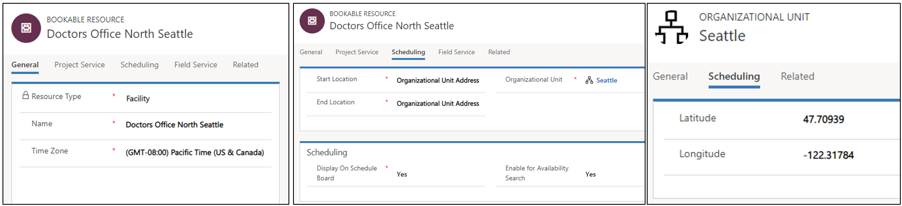
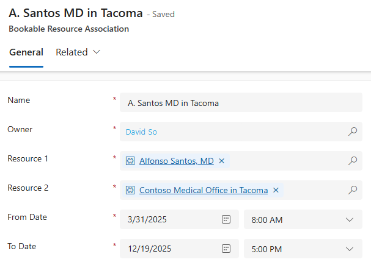
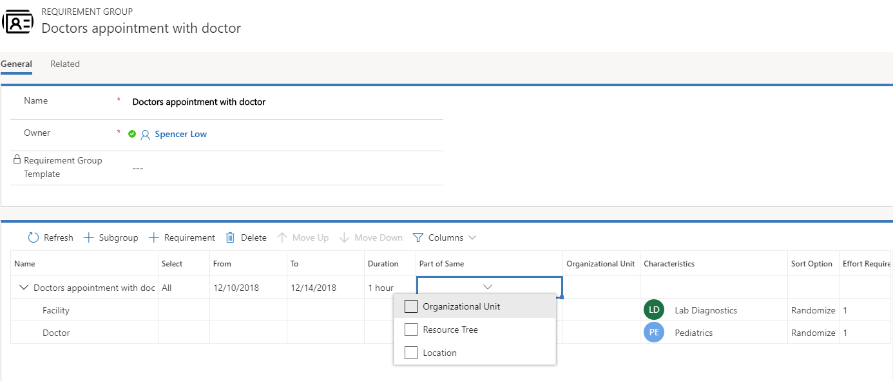
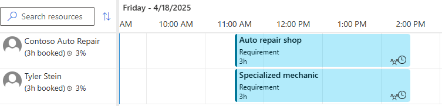

Universal Resource Scheduling enables organizations to schedule interactions between customers and company resources. Facility scheduling coordinates physical spaces and related resources.

Typical examples include reserving a room for an event or a doctor appointment in a doctor's office.

## Schedule a facility and related resource

For this example scenario, we'll schedule a doctor's office and doctor at the same facility at the same time.

In order to schedule groups of resources to perform a task together at a facility, non-facility resources can be associated to facility/facility pool resources through the **Resource Associations entity (msdyn_bookableresourceassociations)**.

Resources such as people, equipment, or pool resources may be associated to a facility or facility pool with date effectivity. This means resources will perform work at the facility location during the expressed date range, and they are not eligible for “onsite” work for which they would have to leave the facility and travel to a customer's location. This is extremely important as it relates to using the option **Same Resource Tree**.

### Create a facility resource

First, create a resource to represent the doctor's office. Choose the **Facility** resource type and set start and end location to **Organizational Unit Address**.

> [!div class="mx-imgBorder"]
> 

### Create a doctor resource

Create a resource to represent a doctor. Set the resource type to *User*, *Account*, or *Contact*, based on your business needs.

The user resource type is typically designated for employees who access Dynamics 365 data. Contact and account resource types are typically for resources that need to be scheduled but don't access data.

Set start and end location to **Organizational Unit Address** and set the organizational unit to the same organizational unit of the facility resource.

### Associate the doctor resource to the facility resource

From the facility resource, go to **Related > Bookable Resource Association**(*msdyn_bookableresourceassociations*). Associate the doctor resource and the facility resource.

In the following screenshot, Abraham McCormick represents a doctor and is associated to Doctors Office North Seattle.

> [!div class="mx-imgBorder"]
> 

### Create a requirement group

Create a requirement group that includes the facility and the person.

> [!div class="mx-imgBorder"]
> 

<!-- this step isn't working, it misses how to map the two resources for the same booking-->

Set the **Work Location** on each requirement to **Facility**, indicating the work will take place at the doctor's office.

On the requirement group, choose the **All** option in the **Select** column to ensure both requirements get fulfilled. In the the **Part of Same** column, choose **Resource Tree** to ensure no resources from other locations get recommended.

Scheduling the requirement group creates a booking for the facility resource and the doctor resource.

> [!div class="mx-imgBorder"]
> 

## Configuration considerations

<!-- need feedback how to scrub/restructure this info-->

###  Choosing the right work location on requirements

Universal Resource Scheduling includes default work location options:

  - **Facility** work location implies the interaction takes place at the facility and travel time is calculated as the distance between the customer location and the facility location. The requirement's latitude and longitude fields are used as the customer location. It also means at least one facility or facility pool must return in schedule assistant search results in order for a resource(s) to be returned.
  
  - **On Site** work location implies the interaction takes place at the customer location and travel time is calculated as the distance between the customer location and the resource (typically field technician) location, which is variable based on the resource's schedule that day. The requirement's latitude and longitude fields are used as the customer location. As a result, facility resources and facility pools will be excluded from the results.

  - **Location Agnostic** work location implies the interaction takes place remotely and the location of the customer nor the resource is considered for scheduling. Travel time is not applicable and is not calculated. Facility resources can still be returned as part of the schedule assistant search, but travel time will not be displayed or considered in ranking.

### "Part of Same" options on requirement groups

  - **Same Location**: Same location means that only teams of resources working at the same location will be returned. This uses the logic expressed in this document to determine the location, using the Resource Associations (msdyn_bookableresourceassociations) and the Bookable Resource Group (bookableresourcegroup) entities. Using this option, regardless of which specific facility or facility pool other non-facility resources may be associated to, all that matters is that the resources are at the same physical location (organizational unit).

  - **Same Resource Tree**: This option adds an extra layer of stringency to the search. It means that the teams assembled must actually be associated to the same facility or facility pool in order to be returned as a team. For example, let’s assume there is one physical location, Location A. 

    There are 2 facilities at location A: facility 1 and facility 2. If resource 1 is associated to facility 1, and "Same Resource Tree" is selected, the one team that can be assembled is facility 1 + resource 1. Facility 2 and resource 1 cannot be returned. This combo could however be returned if “Same Location” is the only option selected. 

    It works the same with facility pools. Let’s assume there is one physical location, Location A. At location A are 2 facilities, facility 1 and facility 2, as well as a facility pool (facility pool 1). If resource 1 is associated to facility pool 1, and “Same Resource Tree” is selected, the one team that can be assembled is facility pool 1 (or one of it’s child facilities) + resource 1. 
   
 > [!Note]
 > If neither of these two options are selected on the requirement relationship (msdyn_requirementrelationship), and work location is set to facility, the schedule assistant search will execute as if “Same Resource Tree” was selected. 

  - **Same Organizational Unit**: An even more stringent option is same organizational unit. This option ensures that the parent organizational unit of the resources are the same. It does not check the bookable resource group or the bookable resource association entity. It only checks the parent organizational unit.

    If your implementation uses requirements that are location agnostic, this option may be used without either of the other two options; however, it completely ignores the two aforementioned entities (associations and groups). This could work in a simple implementation where resources are always staffed at the same location, and you do not need the advanced location search functionality of the work location “facility.”

> [!Note]
> The **Part of Same** field schema name is **msdyn_requirementrelationship**

### When to use "facility with capacity," "multiple facilities," and "facility pool"

- **Facility with capacity**: this option is configured by adding a capacity to a single facility. It's most useful when schedulers care most about not overbooking, and either don't need to schedule specific facilities or can handle coordination in person when customers arrive at the facility.

- **Multiple facilities**: this option is configured by creating multiple facility resources and relating them to each other through an organizational unit. This option makes the most sense when each facility needs to be scheduled individually.  

- **Facility pool**: this option is configured by creating a facility pool and adding facilities as pool members. This option makes the most sense when schedulers want to (1) utilize capacity scheduling by having the facility pool capacity increase and decrease as facilities are added or removed and (2) use local scheduling where bookings are first assigned to the facility pool and then later assigned to pool members. Example: a hotel (facility pool) is first scheduled for a weekend and travelers are assigned specific rooms (facility pool members) at a later date when they arrive. 

## Additional notes

- For requirements that are not part of a requirement group, only facility or facility pool resources can return in the schedule assistant if **Work Location** is set to **Facility**.
- A resource can't be related to two facilities (child or association) at the same time.
- Manually scheduling a single requirement to a facility will not create records for all resources related to the facility.

### Facility pool location

The location for a facility pool is taken from the parent organizational unit. If a facility resource is a member of a facility pool, the location of the facility is taken from the pool resource.
