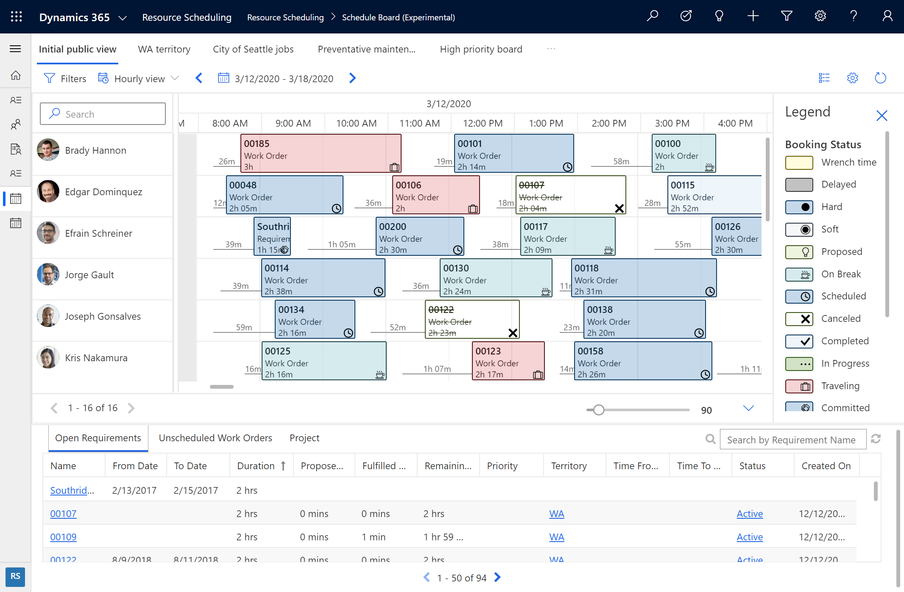
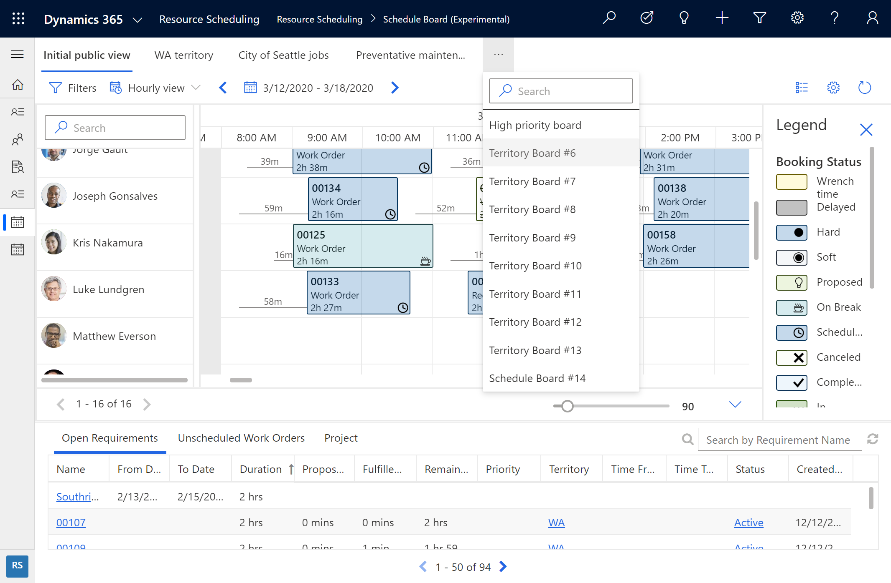
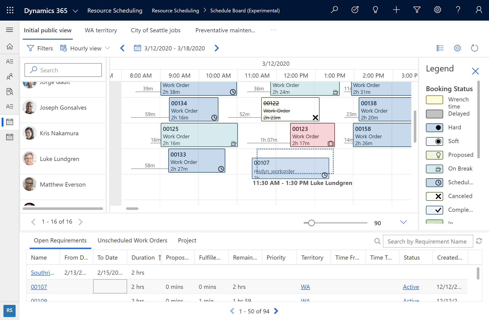
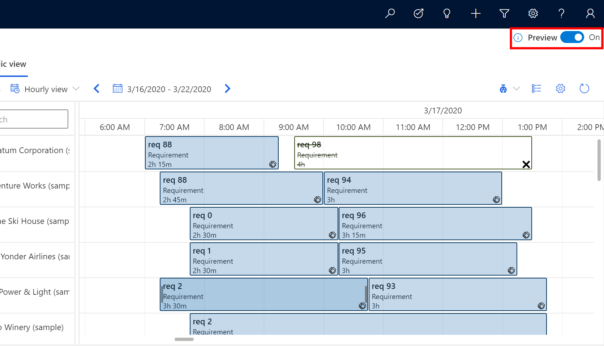
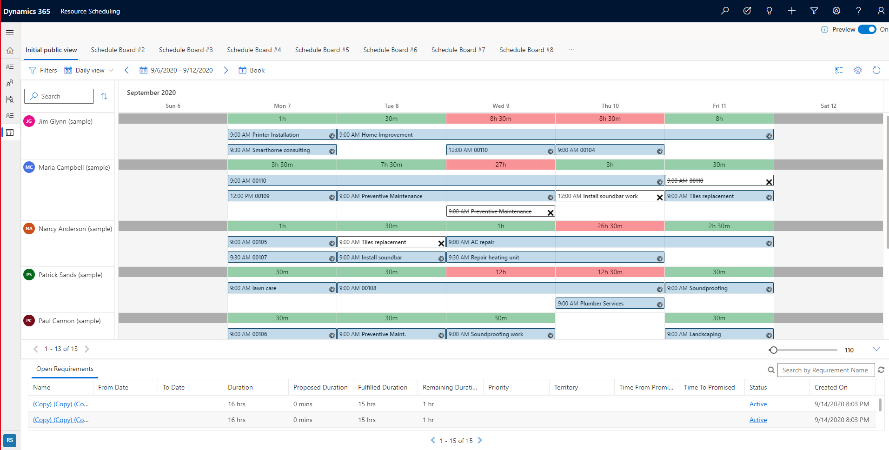
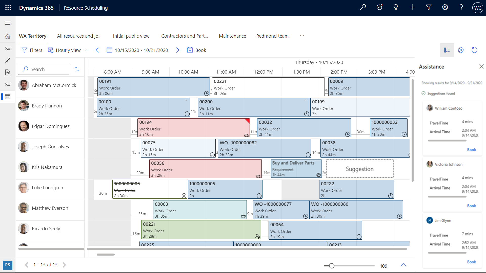
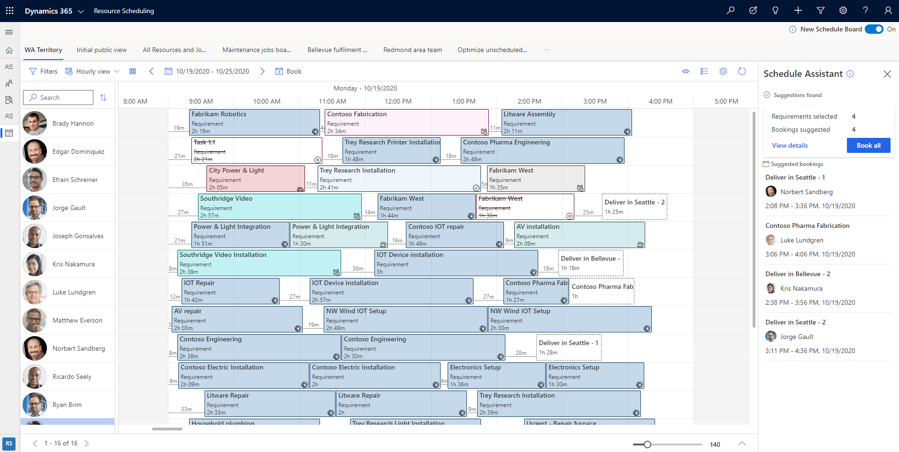
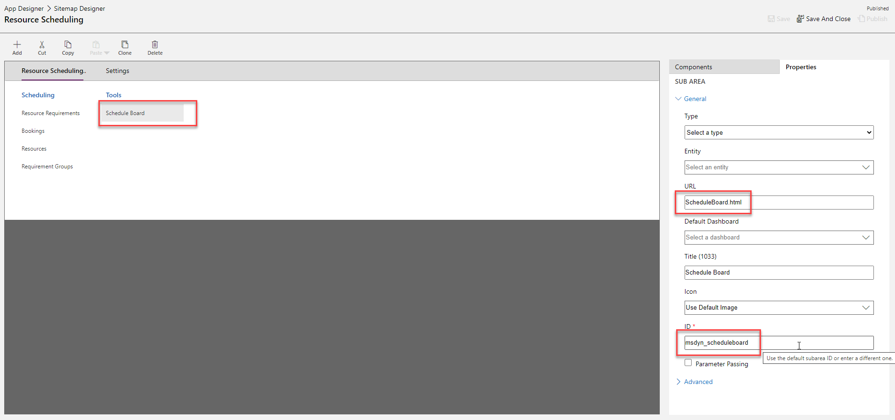
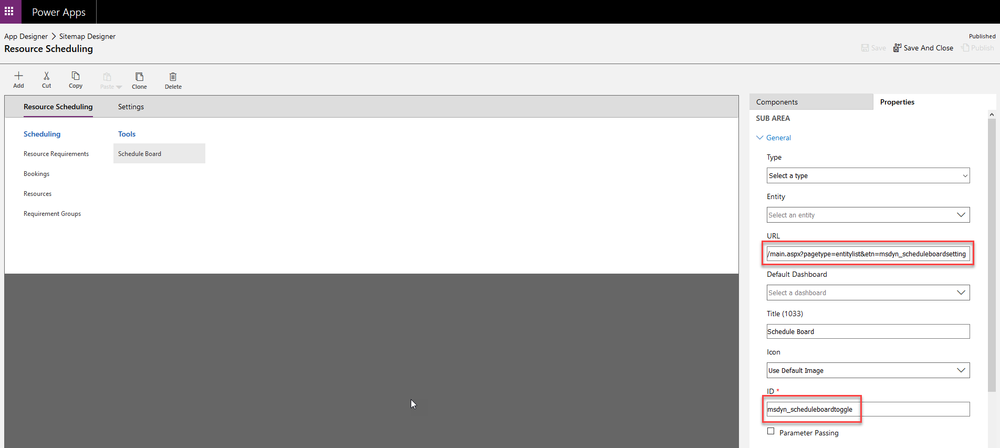

In this article, we'll take a look at what's new, and how to switch to the new schedule board in your environment. 


> [!div class="mx-imgBorder"]
> 

The new schedule board is faster, with better usability, and it lays the foundation for new capabilities for multi-day scheduling and intelligent interactions.

> [!div class="mx-imgBorder"]
> 


### Performance


The new schedule board is faster and more responsive when: 

- Loading the schedule board
- Selecting schedule board tabs
- Dragging and dropping work orders
- Rescheduling bookings


> [!div class="mx-imgBorder"]
> 

### Usability and accessibility

The new schedule board is a Power Apps Component Framework (PCF) control built on the Unified Client Interface, making it more flexible, supportable, and accessible. The new schedule board will work better on different screen sizes and across form factors. 

New color schemes and ways of depicting travel time make it easier for dispatchers to see statuses and details.

> [!div class="mx-imgBorder"]
> 

For instance, the previous screenshot shows a new "ghost booking" feature that helps dispatchers know if a booking will fit into a schedule before the booking is even scheduled.

### Foundation for new capabilities

The new schedule board provides the foundation for future releases that will provide dispatchers insights and recommendations to improve schedules.

## Prerequisites

- The next generation schedule board is generally available. 
- Dynamics 365 Field Service version 8.8.30.103+
 

## Enable new schedule board

Go to the schedule board and use the toggle button in the top right of the schedule board to switch between the current and new schedule boards. 

> [!div class="mx-imgBorder"]
> 


## Select and filter resources

schedule-board-new-select-resources1

schedule-board-new-select-resources2

## Resource cards

schedule-board-new-resource-card

## Map view of requirements and resources

schedule-board-new-map9

schedule-board-new-map3

## Daily view

The new schedule board supports a daily view of scheduled jobs and supports dragging and dropping to the schedule.

> [!div class="mx-imgBorder"]
> 

Scheduled requirements with a short duration will display across the entire day to make it easier to view details. Hover over the requirement or double-click to see the actual duration. 

> [!div class="mx-imgBorder"]
> 

## Weekly and monthly views


## Schedule resources

Beyond manual drag and drop scheduling, organizations using resource scheduling optimization can select one or more requirements from the new schedule board and either have the system **Suggest resources** or **Book resources**. This feature is currently in Preview for the organizations using Resource Scheduling Optimization.


> [!div class="mx-imgBorder"]
> 

Selecting **Suggest resources** will display recommended resources in the right panel for the dispatcher to book.


> [!div class="mx-imgBorder"]
> 

Selecting **Book resources** will find the most optimal resources and book them without additional actions from the dispatcher.

> [!div class="mx-imgBorder"]
> 

**Suggest resources** and **Book resource** capabilities on the new schedule board are currently only available for organizations using resource scheduling optimization.

## Optimization goals

## Edit multi-day bookings

schedule-board-new-edit-multiday-bookings

## Configuration considerations

- The new schedule board is currently supported on Microsoft Edge, Chrome, and Firefox browsers. Currently, Internet Explorer 11 is not supported.

### When to use the new versus current schedule board

The new schedule board is recommended for manual scheduling scenarios and for organizations that want to get up and running with a scheduling solution for dispatchers; the new schedule board is designed and built to deliver improved performance and usability. Users who perform drag-and-drop scheduling or users who only need to see the schedule board can use the new schedule board during preview. Also, organizations using resource scheduling optimization should consider using the new schedule board because the resource scheduling optimization capabilities are embbeded.

The in-market schedule board is recommended for more complex scheduling scenarios like assisted scheduling, multi-resource scheduling, using requirement groups, and so on. 

Use the following feature comparison table to understand which version of the schedule board is right for your business.

| Feature   | Category   | New schedule board     | Old schedule board | Details   |
| --------- | ---------- | ------ | ------ | ---- |
| Manual scheduling     | Dispatcher | Yes   | Yes   | Dispatcher can manually select a resource and create a booking for an unscheduled requirement by interactions like dragging and dropping the requirements, selecting an open timeslot, and using booking panel.    |
| Assisted scheduling           | Dispatcher | For existing resource scheduling optimization customers, it is available in 2020 release wave 2. For other customers, it will be available in 2021 release wave 1 | Yes         | Dispatcher can select an unscheduled requirement on the requirement panel and select "Find Availability," which opens up the schedule assistant view, and shows the available timeslots for the available resources. Dispatcher can choose a timeslot and create a booking.       |
| Automated scheduling          | Dispatcher | For existing resource scheduling optimization customers, it is available in 2020 release wave 2. For other customers, it will be available in 2021 release wave 1 | No                 | The default capabilities of resource scheduling optimizer functionality is made available in the schedule board. This enables dispatchers to manage schedules from a requirements or resources point of view with the organization's business goals applied automatically by the optimizer.                    |
| View modes - Hourly, daily    | Dispatcher | Yes                               | Yes                | Show the resources and their bookings on the hourly and daily views of the schedule board.          |
| View modes - Weekly, monthly  | Dispatcher | Yes    | Yes        | Show the resources and their bookings on the weekly and monthly views of the schedule board.      |
| View types - List view        | Dispatcher | Yes        | Yes                | List view is a simple view, in which bookings of the resources are shown as a simple list. This list view provides accessible view to the Users to browse and create Bookings                                               |
| View types - Map view         | Dispatcher | Yes         | Yes                |        |
| View types - Details view     | Dispatcher | 2021 release wave 2                        | Yes                | Details view is a configurable view, to show and add details of a resource, requirement, or a booking record.     |
| Multi-resource scheduling     | Dispatcher | 2021 release wave 1         | Yes      | Requirement groups allow you to define groups of resources that would be appropriate for a job and to then schedule all those resources with a single search. With requirement groups, you can mix and match the different types of resources—such as individual field technicians, a whole crew, equipment, or facilities—needed for a job              |
| Multi-day assisted scheduling | Dispatcher | 2021 release wave 1                   | Yes                | Work orders and scheduling requirements can be scheduled across multiple days and weeks. A common example is scheduling a 40-hour work order across an entire work week where the field technician is expected to perform more detailed work at the same location each day.      |
| Multi-day manual scheduling   | Dispatcher | Yes                    | Yes                | Work orders and scheduling requirements can be scheduled across multiple days and weeks. A common example is scheduling a 40-hour work order across an entire work week where the field technician is expected to perform more detailed work at the same location each day.       |
| Pools and crews       | Dispatcher | 2021 release wave 1         | Yes                | Resource pool scheduling allows you to assemble groups of similar resources to manage capacity and give schedulers the option to assign specific resources at a later time.<br>Resource crews allow dispatchers to search and schedule multiple resources at once. This can include a group of employees, subcontractors, equipment, facilities, or any combination thereof who will perform the same work during a period of time. Crews speed up and simplify the scheduling process and allow team members to work together more consistently.                               |
| Configuration                 | Admin      | 2021 release wave 2       | Yes                | Admin can create new tabs on the schedule board and configure changes on the board, tab settings, and scheduler settings      |
| Extensibility       | Admin      | 2021 release wave 2            | Yes                | Admin can extend the schedule board and use extensibility on some of features like<br>Custom Booking template (Hours) - HTML<br>Custom Booking alerts - HTML<br>Custom Resource Cell Template - HTML<br>Custom Filter Layout - Universal FetchXML<br>SB/SA Retrieve Resources Query - Universal FetchXML<br>SB/SA Retrieve Constraints query - Universal FetchXML<br>Custom Web resource support<br>Client Extensions (support for JavaScript, Stylesheets and Localizations files)<br>Booking Rules (Support for custom business logic via JavaScript on the booking creation) |
 
Continue to use the current schedule board for common functions like:
- Creating and deleting schedule board tabs. 
- Schedule board tab settings.
- Schedule board configurations like number of days in a view or applying filter territories.


### Add new schedule board to custom sitemap area

When using a custom sitemap or an app module, you'll need to update the sitemap to consume the new schedule board preview.

The following snippet is what it looks like before:

```<SubArea Id="msdyn_ScheduleBoardSubArea" ResourceId="SitemapDesigner.NewSubArea" VectorIcon="$webresource:msdyn_/Icons/SVG/Calendar.svg" Url="$webresource:msdyn_/fps/ScheduleBoard/ScheduleBoard.html" Client="All,Outlook,OutlookLaptopClient,OutlookWorkstationClient,Web" AvailableOffline="true" PassParams="false" Sku="All,OnPremise,Live,SPLA">```

> [!div class="mx-imgBorder"]
> 

The next snippet is what it looks like after:

```<SubArea Id="msdyn_ScheduleBoardSubArea" ResourceId="SitemapDesigner.NewSubArea" VectorIcon="$webresource:msdyn_/Icons/SVG/Calendar.svg" Url="/main.aspx?pagetype=entitylist&amp;etn=msdyn_scheduleboardsetting" Client="All,Outlook,OutlookLaptopClient,OutlookWorkstationClient,Web" AvailableOffline="true" PassParams="false" Sku="All,OnPremise,Live,SPLA">```
​

> [!div class="mx-imgBorder"]
> 

**URL:**

```/main.aspx?pagetype=entitylist&etn=msdyn_scheduleboardsetting```

**ID:**

```msdyn_scheduleboardtoggle```

## Additional notes

The schedule board is only supported in Unified Client Interface web (Field Service v8.x+) and not in tablets or phones.

### Uninstall schedule board

To uninstall the new schedule board solution ("Resource Scheduling Controls"), perform the following steps.

1. Go to the **Schedule Board Settings** entity customization form.
2. Remove the new schedule board preview control from the grid.
3. Save and publish the changes.
4. Go to the resource scheduling app, clear the browser's cache, and reload schedule board. The old schedule board will load without the toggle in the top right of the screen.
5. Once the solution is uninstalled, the new schedule board will not be available for the environment until you upgrade your Field Service app to the latest available version.
