In this article, we'll take a look at what's new, and how to switch to the new schedule board in your environment. 

> [!div class="mx-imgBorder"]
> 

For a guided walkthrough, check out the following video outlining Wave 2 2021 updates to the new schedule board.

> [!VIDEO https://www.microsoft.com/videoplayer/embed/RWP7dS]

## Improvements

The new schedule board is faster, with better usability, and it lays the foundation for new capabilities for multi-day scheduling and intelligent interactions.

> [!div class="mx-imgBorder"]
> 

### Usability and accessibility

The schedule board is a Power Apps Component Framework (PCF) control built on the Unified Client Interface, making it more flexible, supportable, and accessible. The new schedule board will work better on different screen sizes and across form factors. 

New color schemes and ways of depicting travel time make it easier for dispatchers to see statuses and details.

> [!div class="mx-imgBorder"]
> 

For instance, the previous screenshot shows a new "ghost booking" feature that helps dispatchers know if a booking will fit into a schedule before the booking is even scheduled.

### Foundation for new capabilities

The new schedule board provides the foundation for future releases that will provide dispatchers insights and recommendations to improve schedules.

## Prerequisites

- The next generation schedule board is generally available. 
- Dynamics 365 Field Service version 8.8.30.103+

## Enable new schedule board for your organization

The new schedule board isn't turned on by default, so you'll have to enable it in order to use it in your organization.

To enable the new schedule board, go to **Scheduling** > **Administration** > **Scheduling Parameters** and switch on the **Enable new Schedule Board** toggle.

> [!div class="mx-imgBorder"]
> 

## Select and filter resources

Choose which resources should display on each schedule board tab.

Expand the filter pane and choose **Select Resources**.

> [!div class="mx-imgBorder"]
> 

From the list of available resources on the left, move the ones you want to display on the schedule board to the right. Then **Apply**.

> [!div class="mx-imgBorder"]
> 

## Resource cards

Right-click a resource's name and then choose **View Resource Card** to see more, like the resource's skill set (characteristics) and roles. From here, you can also initiate a message, email, or phone call.

> [!div class="mx-imgBorder"]
> 

## Map view of requirements and resources

Select the map icon in the upper right of the schedule board to display the resources and requirements on a map.

> [!div class="mx-imgBorder"]
> 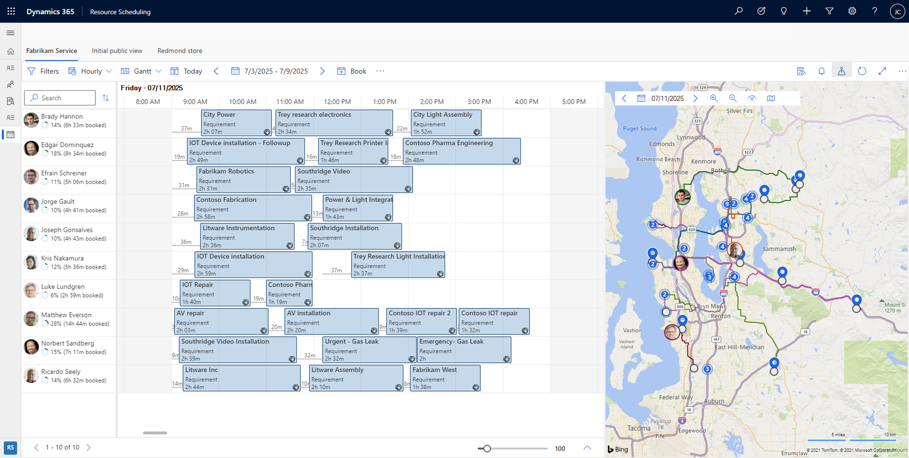

After expanding the map view, select a resource's name to see their route. The numbers indicate the order the resource is scheduled to arrive at each job (requirement) location.

> [!div class="mx-imgBorder"]
> 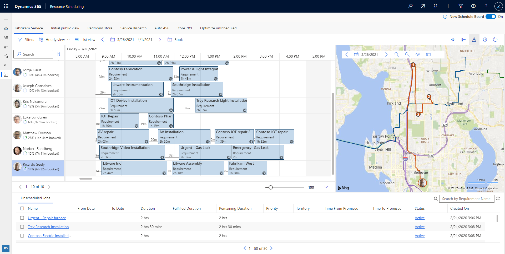
 
At a zoomed-out view of the map, the requirements and resources are grouped together, and you can see a count of requirements and resources. This count helps you quickly identify a geographical area with more unscheduled jobs, and then start scheduling the jobs to nearest resources. 

> [!div class="mx-imgBorder"]
> 

You can drag an unscheduled requirement pin from the map to the resource timeline and schedule it to that resource. 

> [!div class="mx-imgBorder"]
> 

> [!div class="mx-imgBorder"]
> 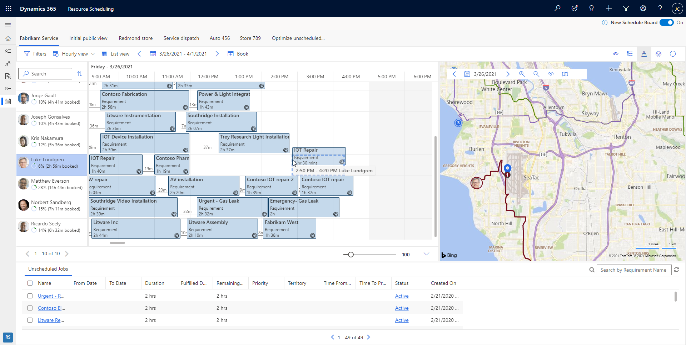

You can also drag the resource route to a nearby unscheduled requirement to schedule it and add it to the resource route. 

> [!div class="mx-imgBorder"]
> 

> [!div class="mx-imgBorder"]
> 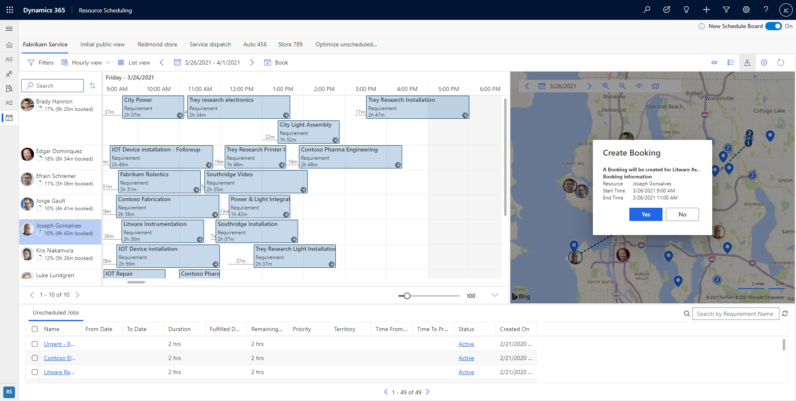

## Daily view

The new schedule board supports a daily view of scheduled jobs and supports dragging-and-dropping to the schedule.

> [!div class="mx-imgBorder"]
> 

Scheduled requirements with a short duration will display across the entire day to make it easier to view details. Hover over the requirement or double-click to see the actual duration. 

> [!div class="mx-imgBorder"]
> 

## Weekly and monthly views

Switch to the weekly or monthly views to see scheduled jobs at a higher level. Select a resource's time slot and a requirement below to trigger the booking panel.

> [!div class="mx-imgBorder"]
> 

The booking panel will help you schedule a work order across multiple days and choose how the work should be divided each day.

## Find availability (schedule assistant)

The schedule assistant is also available in the new schedule board experience. By selecting a booking requirement from the bottom panel, and then **Find availability**, you'll trigger the schedule assistant. 

> [!div class="mx-imgBorder"]
> 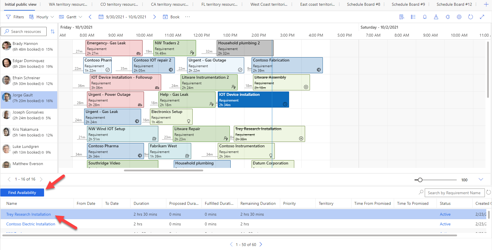

From the schedule assistant, you'll see available resources and can plan accordingly for the work.

> [!div class="mx-imgBorder"]
> 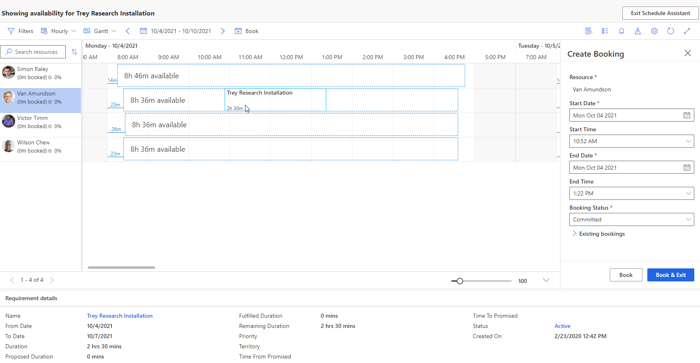

## Find availability (schedule assistant) list view

Select **Gantt** then **List** to change the schedule assistant view to show a list of available resources.

Select column headers to sort results in ascending or descending order.

> [!div class="mx-imgBorder"]
> 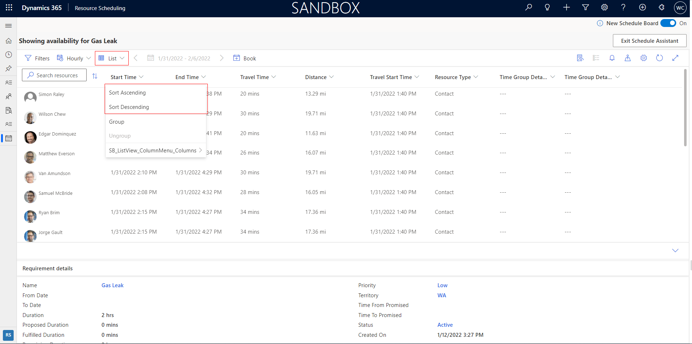

Select **Group** to group available resources by the column value. In the following example, we grouped time slots by resource type (in this case, by contact or user). 

> [!div class="mx-imgBorder"]
> 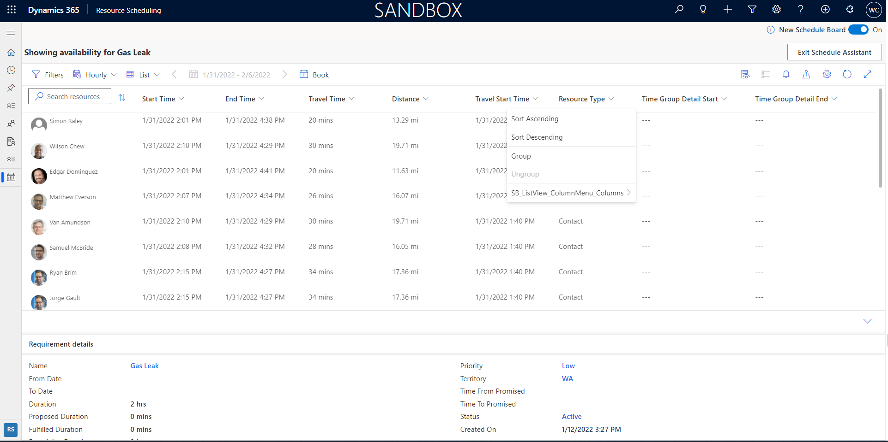

Grouping resources helps dispatchers make better sense of availability based on different attributes.

> [!div class="mx-imgBorder"]
> 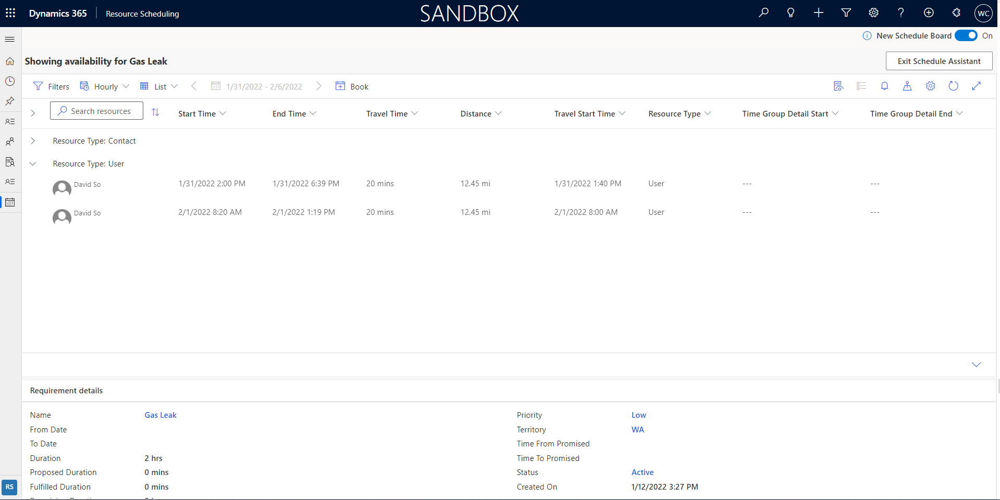


## Move a booking
Alternatively, move a booking to the next day by selecting the booking, then select the **Ellipses [...] icon** next to the **Book** button, as seen in the following screenshot. Select **Move bookings**.

> [!div class="mx-imgBorder"]
> 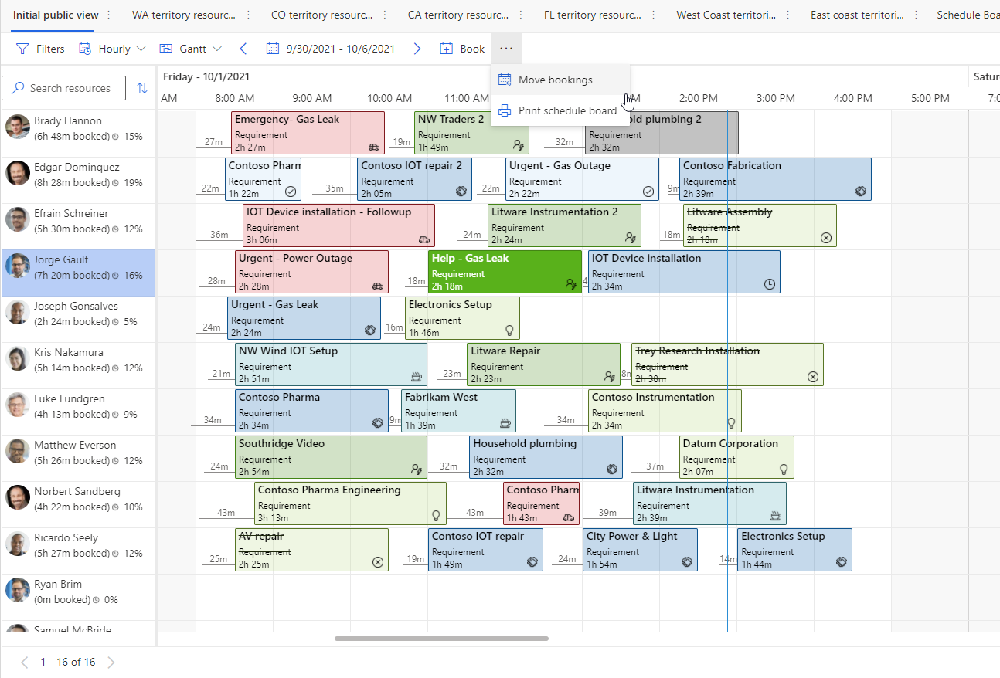

## Move bookings to a new resource, a new start date and time, or both

With Field Service v8.8.39+, the new schedule board provides an easy way to reassign and reschedule bookings in the same action. Bookings can be moved to resources on the current schedule board tab or to resources on other schedule board tabs.

### Move a booking to a resource on the current schedule board tab, or change the start date/time, or both

Right-click on a booking and select **Move to**.

Then reassign this booking to any resource on the current schedule board tab, or change the start date and the start time of the booking. 

Select **Update** to apply the changes.

> [!div class="mx-imgBorder"]
> 

### Move a booking to a resource on a different schedule board tab, or change the start date or time, or both

Right-click on a booking and select **Move to**. Select the filter icon in the resource field and change the filter from *Resources on this tab* to *All resources*.

Now you can reassign this booking to any resource on any tab, and change the start date and start time of the booking. Select **Update** to apply the changes.

> [!div class="mx-imgBorder"]
> 

## Booking details panel

To see more details about a booking on the schedule board, open the details panel by selecting the details icon, as seen in the following screenshot. 

> [!div class="mx-imgBorder"]
> 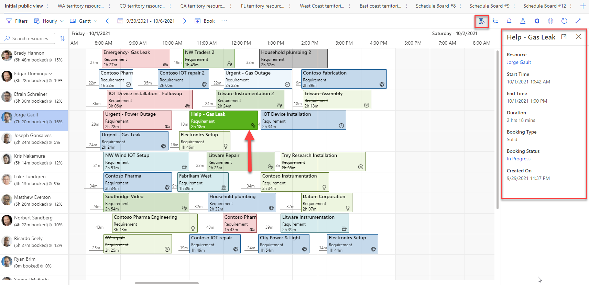

## Booking alerts panel

To see a list of active booking alerts, select the **Bell** icon, as seen in the following screenshot.

> [!div class="mx-imgBorder"]
> 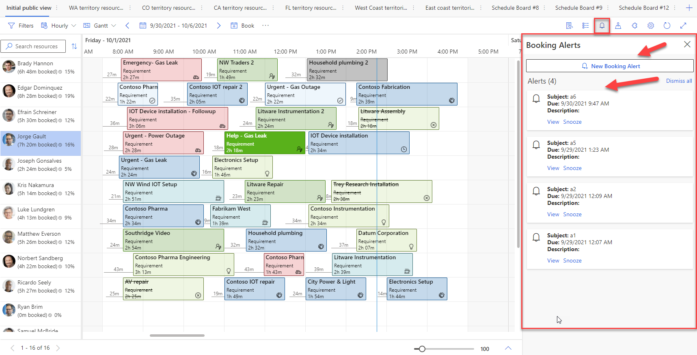

From the booking alerts panel, you can also create a new booking alert, close an existing booking alert, or dismiss all booking alerts. See the following screenshot for reference. 

> [!div class="mx-imgBorder"]
> 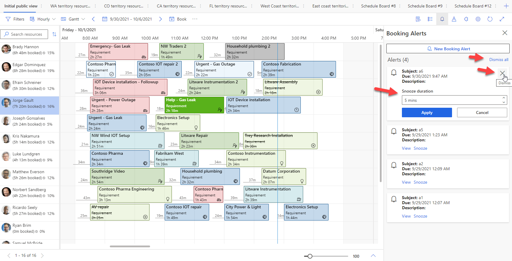

## Full screen mode

Full screen mode on the new schedule board makes it easier for dispatchers and schedulers to focus on the details and make the most of their screen space.

Select the **Expand** icon in the top-right of the new schedule board to enter into full screen mode. 

> [!div class="mx-imgBorder"]
> 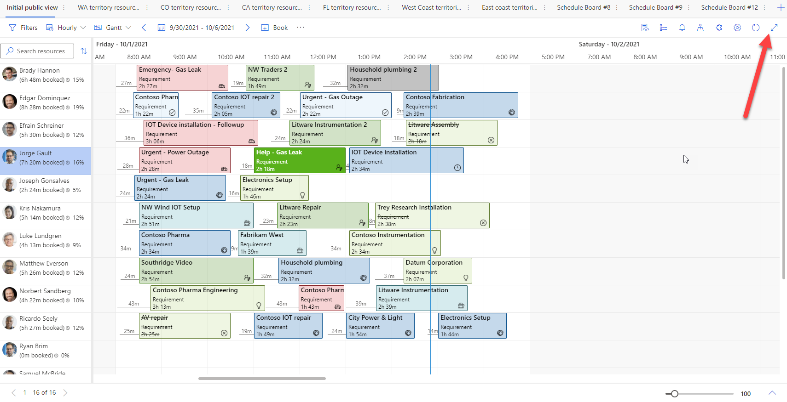

## Get driving directions

From the new schedule board, you can get driving directions for a frontline worker between their last job site to their next job site.

To get driving directions, right-click on the booking, and select **Get driving directions**.

> [!div class="mx-imgBorder"]
> 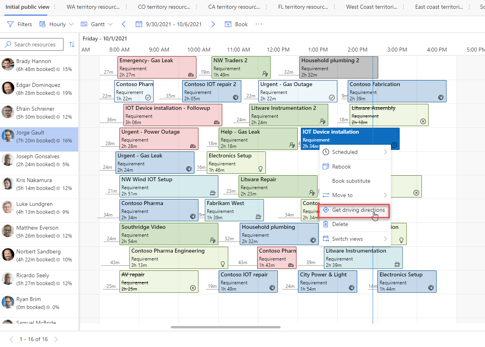

A map view will open, showing directions between the frontline worker's last job site to the next.

> [!div class="mx-imgBorder"]
> 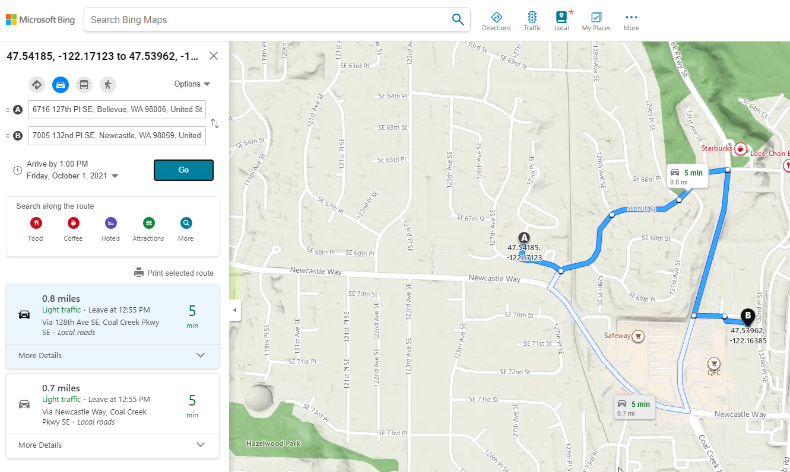

You can also get driving directions for a frontline worker's entire day of bookings. Right-click on the resource in the resource list, and select **Get driving directions**.

> [!div class="mx-imgBorder"]
> 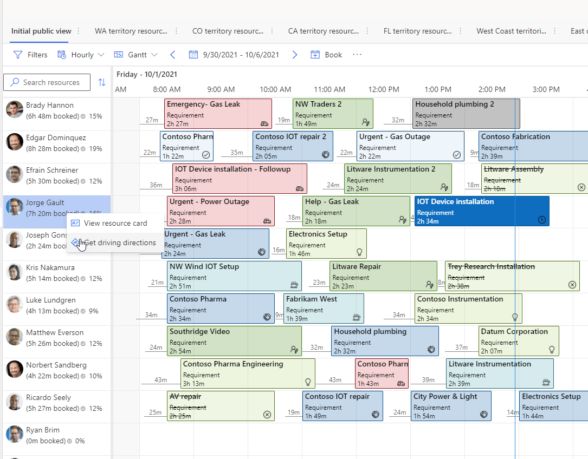

Select the day for which you'd like to generate driving directions for the selected resource.

> [!div class="mx-imgBorder"]
> 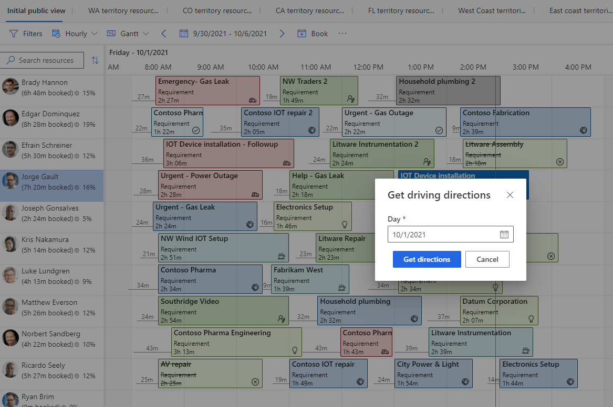

A map view will open showing the day's worth of bookings for the selected resource.

> [!div class="mx-imgBorder"]
> 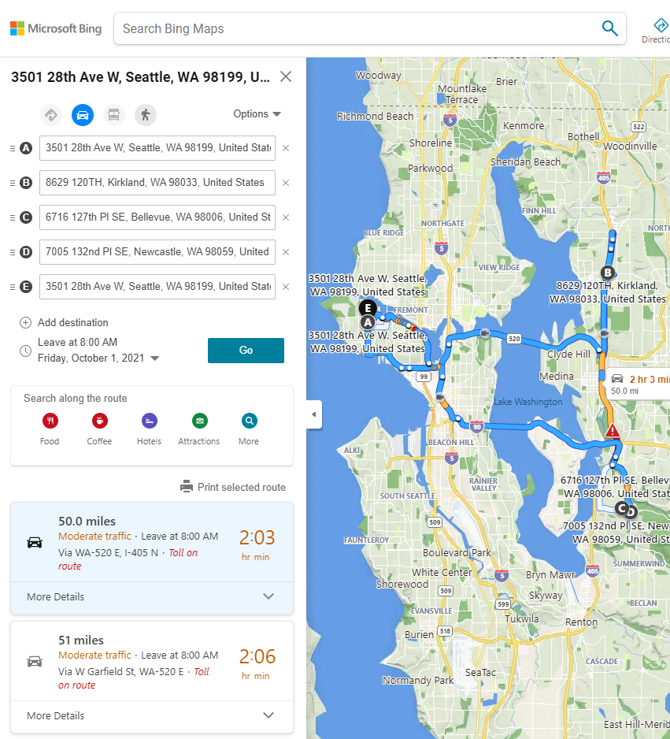

## Edit multi-day bookings

Dispatchers can right-click a multi-day booking, select edit and change how many hours are assigned for each day, week, or month. 

> [!div class="mx-imgBorder"]
> 

## Create a new schedule board tab

To create a new schedule board tab, select the **[+] icon** in the tab list on the schedule board, as seen in the following screenshot.

> [!div class="mx-imgBorder"]
> 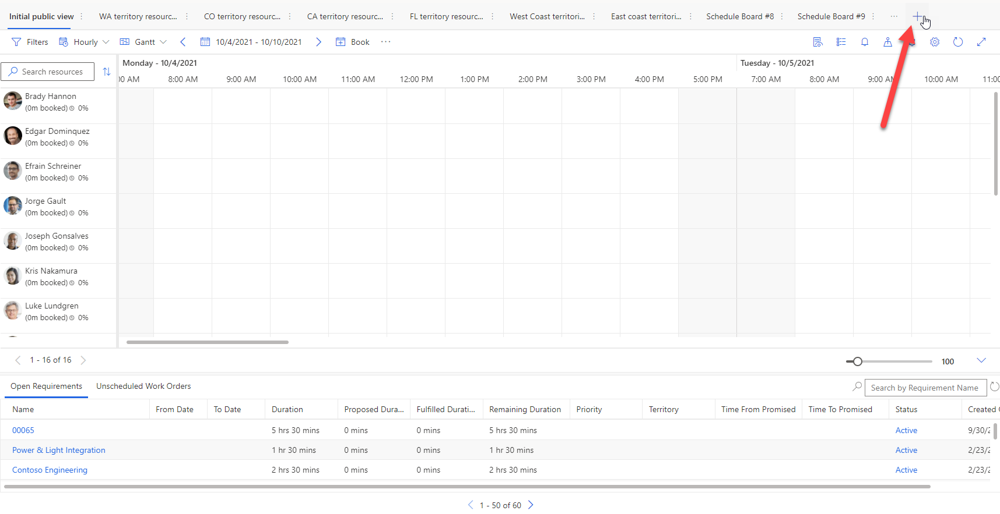

Fill in the relevant details about your new schedule board tab, and then **Add** when done.

> [!div class="mx-imgBorder"]
> 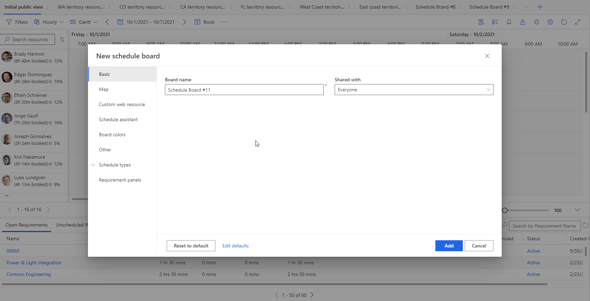

Rearranging schedule board tabs is currently not supported. 

## Custom web resource panel

Use the Schedule Board **Client Extension Framework** to add custom web resources to the schedule board, which could be HTML, JavaScript, a custom app built on Power Apps, and so on. 

To see a custom web resource, select the web resource icon in the menu, as seen in the following screenshot.

> [!div class="mx-imgBorder"]
> 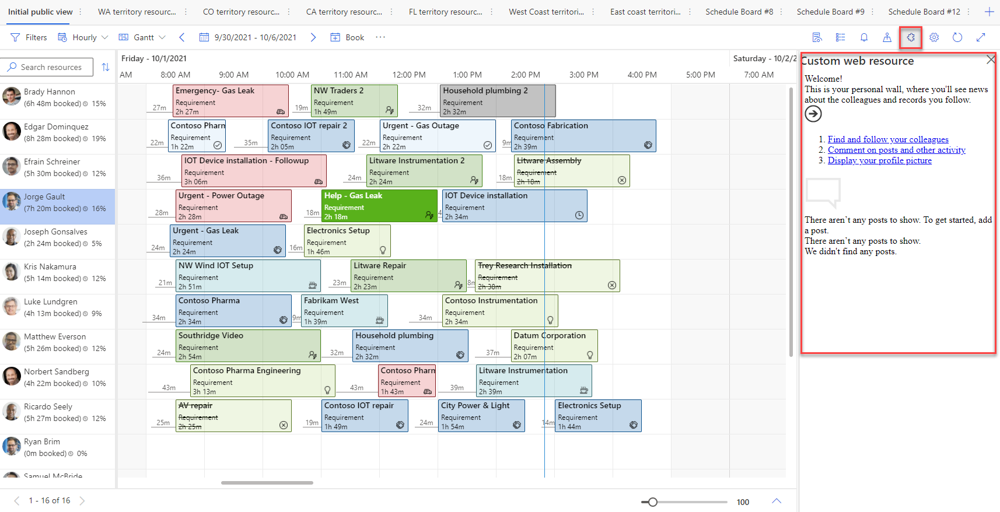

## Schedule board settings

Use the **Gear icon** to open the schedule board settings panel on the new schedule board. 

> [!div class="mx-imgBorder"]
> 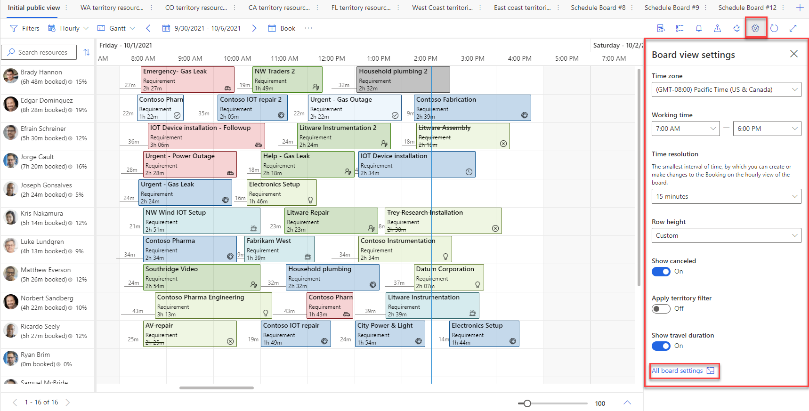

> [!div class="mx-imgBorder"]
> 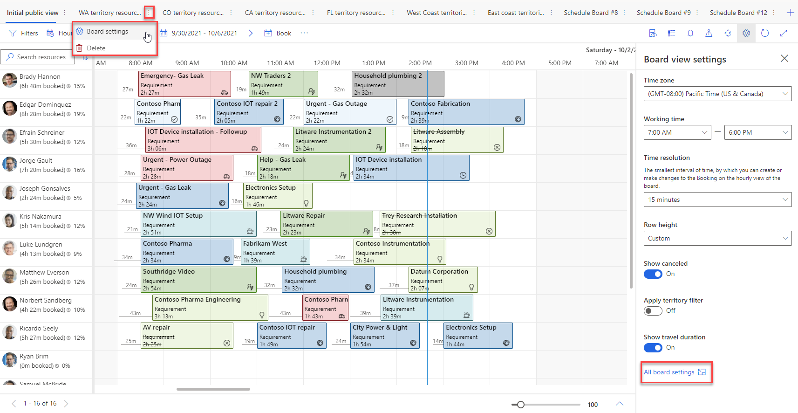

> [!div class="mx-imgBorder"]
> 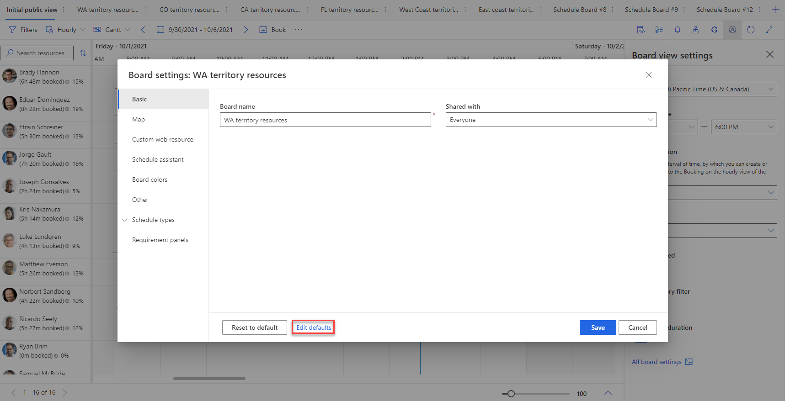

> [!div class="mx-imgBorder"]
> 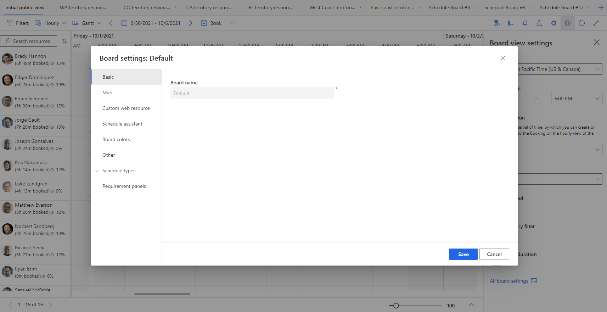

> [!div class="mx-imgBorder"]
> 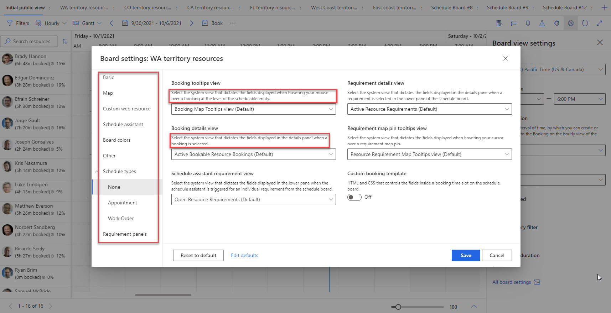

## Automated Scheduling (Resource Scheduling Optimization)

> [!Note]
> The following features like **suggest resources, book resources, single resource optimization, and optimization goals** are only available for organizations using [Resource Scheduling Optimization](../../field-service/rso-overview.md).

Organizations using [Resource Scheduling Optimization](../../field-service/rso-overview.md) will find more capabilities in the schedule board. 

### Suggest resources

> [!div class="mx-imgBorder"]
> 

Selecting **Suggest resources** will display recommended resources in the right panel for the dispatcher to book.


> [!div class="mx-imgBorder"]
> 

### Book resources

Selecting **Book resources** will find the most optimal resources and book them without further actions from the dispatcher.

> [!div class="mx-imgBorder"]
> 

### Single Resource Optimization 

Sometimes you might need to optimize only a single resource's schedule, rather than a set of available resources. Single resource optimization provides a quick way to reoptimize a resource's schedule and travel route after schedule changes have occurred during the day - this functionality is now available on the new schedule board. You can right-click a resource from any schedule board view and select Optimize Schedule.

> [!div class="mx-imgBorder"]
> 

> [!div class="mx-imgBorder"]
> 
> 
> [!div class="mx-imgBorder"]
> 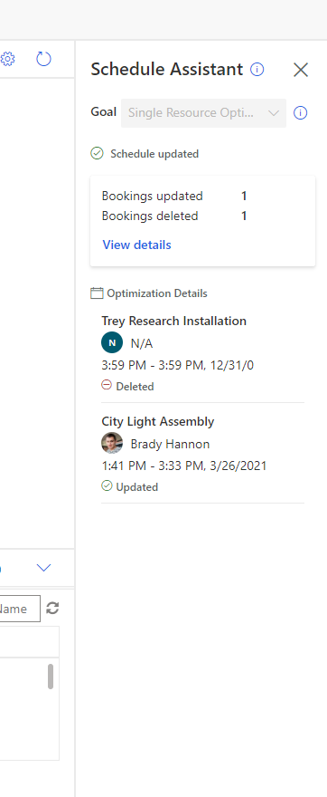

### Optimization goals

The schedule board supports optimization goals. After selecting suggested resources, dispatchers can edit the optimization goal, which dictates how resources are recommended. 

> [!div class="mx-imgBorder"]
> 

There's a default optimization goal that applies to the entire system and serves as the default for optimization requests. Dispatchers can also edit the default optimization goal for each schedule board. Finally, dispatchers can edit the optimization goal for a single optimization request by selecting **Suggest Resources**. 

### Add new schedule board to custom sitemap area

When using a custom sitemap or an app module, you'll need to update the sitemap to consume the new schedule board preview.

```<SubArea Id="msdyn_ScheduleBoardSubArea" ResourceId="SitemapDesigner.NewSubArea" VectorIcon="$webresource:msdyn_/Icons/SVG/Calendar.svg" Url="/main.aspx?pagetype=entitylist&amp;etn=msdyn_scheduleboardsetting" Client="All,Outlook,OutlookLaptopClient,OutlookWorkstationClient,Web" AvailableOffline="true" PassParams="false" Sku="All,OnPremise,Live,SPLA">```

> [!div class="mx-imgBorder"]
> 

**URL:**

```/main.aspx?pagetype=entitylist&etn=msdyn_scheduleboardsetting```

**ID:**

```msdyn_scheduleboardtoggle```

## Additional notes

- The schedule board is only supported in Unified Interface web (Field Service v8.x+) and not in tablets or phones.
- The booking status colors that appear on the schedule board have lower opacity than the defined booking status colors. This behavior is similar to the Outlook calendar. When a booking is selected on the schedule board, the booking color will appear with normal opacity.
