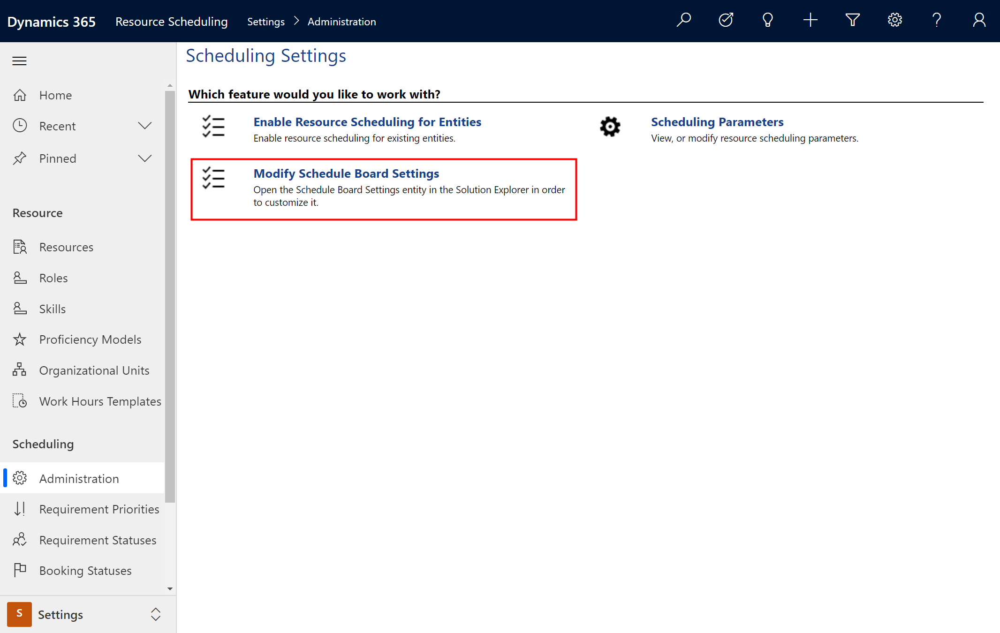
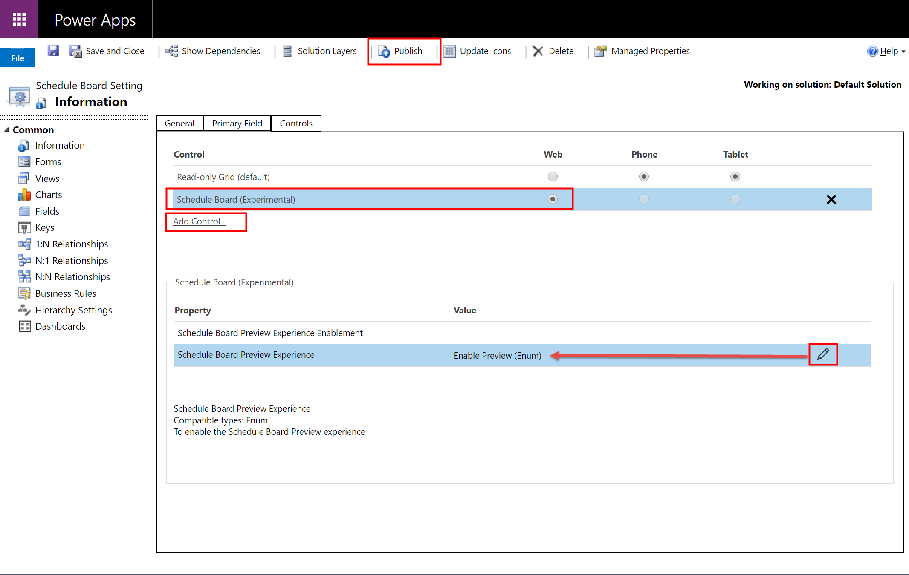

A fully redesigned schedule board is available as a public preview in the April 2020 release of Dynamics 365 Field Service. In this article, we'll take a look at what's new, and how to preview the new schedule board in your environment. 

The new schedule board is faster, with better usability, and it lays the foundation for new capabilities for multi-day scheduling and intelligent interactions.

> [!div class="mx-imgBorder"]
> 


### Performance

The new schedule board is faster and more responsive when: 

- Loading the schedule board
- Selecting schedule board tabs
- Dragging and dropping work orders
- Rescheduling bookings


> [!div class="mx-imgBorder"]
> 

### Usability and accessibility

The new schedule board is a Power Apps Component Framework (PCF) control built on the Unified Client Interface, making it more flexible, supportable, and accessible. The new schedule board will work better on different screen sizes and across form factors. 

New color schemes and ways of depicting travel time make it easier for dispatchers to see statuses and details.

> [!div class="mx-imgBorder"]
> 

For instance, the previous screenshot shows a new "ghost booking" feature that helps dispatchers know if a booking will fit into a schedule before the booking is even scheduled.

### Foundation for new capabilities

The new schedule board provides the foundation for future releases that will provide dispatchers insights and recommendations to improve schedules.

## Prerequisites

> [!Note]
> The new schedule board is released as a public preview in April 2020. It has limited capabilities during the preview period. 

 

## Enable new schedule board preview

Once you enable the new schedule board, you'll see it in your environment alongside the current schedule board. Once the new schedule board functionality matches the current schedule board, the new will replace the current.

To enable the new schedule board, sign in as a system administrator.

Go to **Resource Scheduling** > **Settings** > **Administration** > **Modify Schedule Board Settings**.


> [!div class="mx-imgBorder"]
> 

1. Go to **Controls** tab.
1. Enable it for web experience.
2. Select the edit button then **Enable Preview**.
3. Publish changes.

> [!div class="mx-imgBorder"]
> 

Go to the schedule board and use the toggle button in the top right of the schedule board to switch between the current and preview schedule boards. 


> [!div class="mx-imgBorder"]
> 

## Configuration considerations

- During preview, the new schedule board is only available in English. 
- The new schedule board will currently only appear within the Universal Resource Scheduling app - not yet available in other apps.
- After enabling the preview, if you uninstall the Universal Resource Scheduling solution, you'll have to disable the schedule board again.
- The new schedule board is currently supported on Microsoft Edge, Chrome, and Firefox browsers. Currently, Internet Explorer 11 is not supported.

### When to use the new versus current schedule board

Users who perform simple drag and drop scheduling or users who only need to view the schedule board can use the new schedule board during preview. Other users should continue to use the current schedule board.

Continue to use the **current** schedule board for common functions like:
- Creating and deleting schedule board tabs. 
- Schedule board tab settings.
- Schedule board configurations like number of days in a view or applying filter territories.
- Map view and scheduling.
- Days, weeks, and months view.

### Add new schedule board to custom sitemap area

When using a custom sitemap or an app module, you'll need to update the sitemap to consume the new schedule board preview.

The following snippet is what it looks like before:

```<SubArea Id="msdyn_ScheduleBoardSubArea" ResourceId="SitemapDesigner.NewSubArea" VectorIcon="$webresource:msdyn_/Icons/SVG/Calendar.svg" Url="$webresource:msdyn_/fps/ScheduleBoard/ScheduleBoard.html" Client="All,Outlook,OutlookLaptopClient,OutlookWorkstationClient,Web" AvailableOffline="true" PassParams="false" Sku="All,OnPremise,Live,SPLA">```

> [!div class="mx-imgBorder"]
> 

The next snippet is what it looks like after:

```<SubArea Id="msdyn_ScheduleBoardSubArea" ResourceId="SitemapDesigner.NewSubArea" VectorIcon="$webresource:msdyn_/Icons/SVG/Calendar.svg" Url="/main.aspx?pagetype=entitylist&amp;etn=msdyn_scheduleboardsetting" Client="All,Outlook,OutlookLaptopClient,OutlookWorkstationClient,Web" AvailableOffline="true" PassParams="false" Sku="All,OnPremise,Live,SPLA">```
​

> [!div class="mx-imgBorder"]
> 

**URL:**

```/main.aspx?pagetype=entitylist&etn=msdyn_scheduleboardsetting```

**ID:**

```msdyn_scheduleboardtoggle```

## Additional notes

The schedule board is only supported in Unified Client Interface web (Field Service v8.x+) and not in tablets or phones.

### Uninstall schedule board preview

To uninstall the new schedule board preview solution ("Resource Scheduling Controls"), perform the following steps.

1. Go to the **Schedule Board Settings** entity customization form.
2. Remove the new schedule board preview control from the grid.
3. Save and publish the changes.
4. Go to the resource scheduling app, clear the browser's cache, and reload schedule board. The old schedule board will load without the preview toggle in the top right of the screen.
5. Once the solution is uninstalled, the new schedule board will not be available for the environment until you upgrade your Field Service app to the latest available version.
