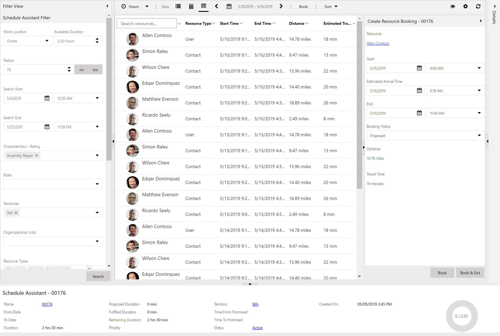
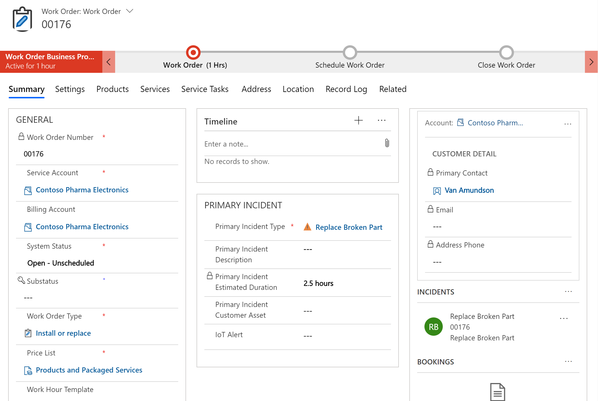
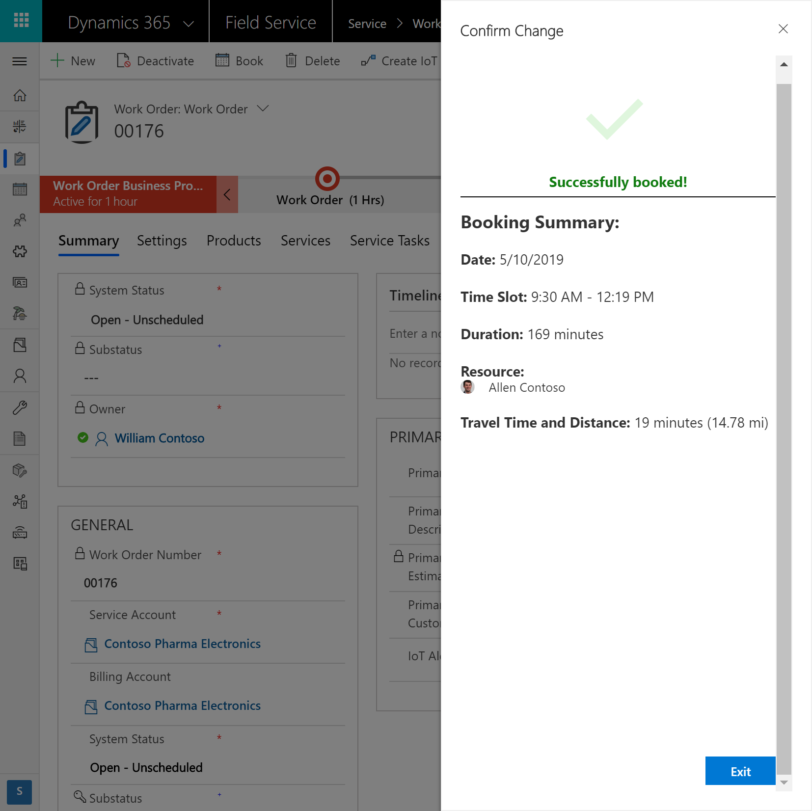
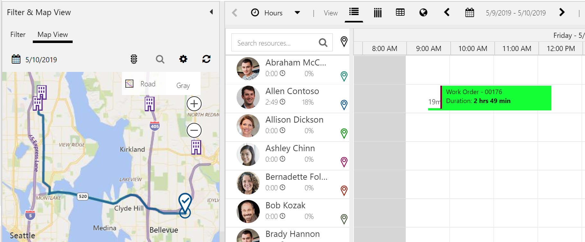
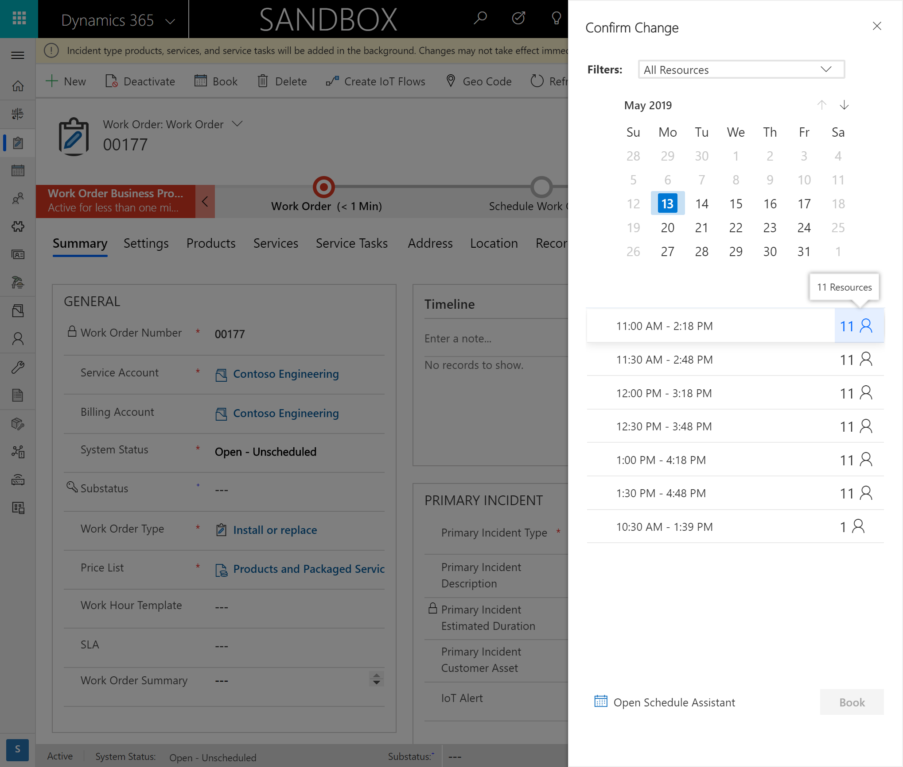
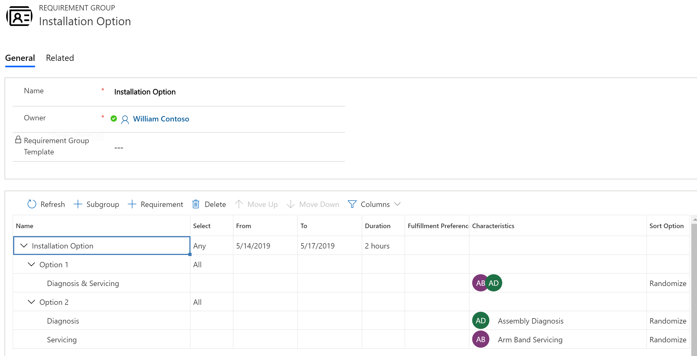
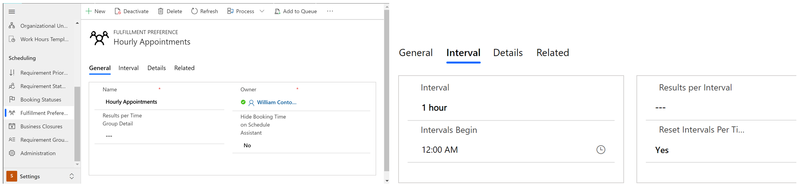
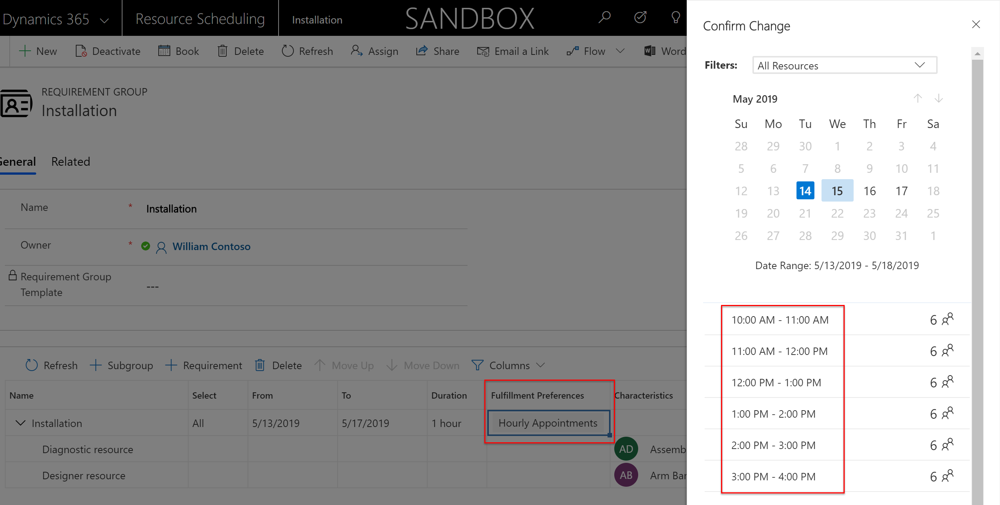

Quick scheduling (sometimes referred to as “quick book”) simplifies the schedule assistant experience to make scheduling easier and quicker.

Within the same window of a work order, a single click brings up a pane showing available booking time slots.

> [!div class="mx-imgBorder"]
> 

This is useful in several scenarios:

- Organizations with a high volume of bookings that they need to quickly schedule.
- Organizations with call-center workers who might need to schedule while they are on the phone with a customer, and need to do so quickly to respect the caller's time. 
- Organizations with schedulers who don't need to see the extra details provided by the schedule assistant or manipulate the filters to make a resource assignment.
- People for whom scheduling is not their primary job. For example, customer service representatives spend most of their time handling customer issues, and the few times they need to schedule, it should be quick and easy.

When quick scheduling is not enabled, the **Book** button defaults to the full schedule assistant experience, which displays additional information and filter options for more comprehensive resource assigning.

<!--note from editor: Throughout the screenshots in this topic, the people names are not on the approved fictitious names list.   -->

> [!div class="mx-imgBorder"]
> 

## Prerequisites

- Dynamics 365 Field Service version 8.7 or later. See the “Additional notes” section at the end of this article for more details.

- Quick scheduling must be enabled: 
  - Go to **Resource Scheduling** > **Settings** > **Administration** > **Enable Resource Scheduling for Entities**.

  - Select an entity to display the entity's **Booking Setup Metadata**.

  - Set **Enable Quick Book** to **Yes**.

    > [!div class="mx-imgBorder"]
    > 

In the preceding example, we enabled quick book for the work order entity, meaning quick book will trigger from the work order form and requirements created by work orders. The process is the same for enabling quick booking for other entities you have enabled for scheduling. 

<!--note from editor: RE: terminology consistency: Is the feature called "quick book" or "quick booking"? OK to use "quick book" as a verb?   -->

However, not all scheduling relates to other entities. Some organizations use requirements on their own for scheduling. Organizations like this should enable quick book for the **Default Metadata Settings (none)** option.

> [!div class="mx-imgBorder"]
> 

## Quick book a single resource

### 1. Create a work order

First, create a work order or another entity that is enabled for scheduling and quick booking.

> [!div class="mx-imgBorder"]
> 

Then, go to the related requirement and add additional attributes.

> [!div class="mx-imgBorder"]
> 

In this example screenshot, we are looking for a resource who is available within the specified date range, who has the "Assembly Repair" skill, and who is part of the "Seattle" organizational unit.

### 2. Select Book

From the requirement or the work order, select **Book** in the top ribbon. This opens the quick book pane. If quick book is not enabled, the **Book** button triggers the schedule assistant interface.

Next, select a time slot, and then select **Book** in the lower-right side of the pane.

> [!div class="mx-imgBorder"]
> 

> [!div class="mx-imgBorder"]
> 

In the background, the system chooses an available resource that also meets requirement criteria like skills and organizational unit. 

If the requirement is location-based, as in the case of onsite work orders or facilities, the system chooses the closest resource. The closest resource is determined based on the resource's starting location or previous work order location. 

For location-agnostic requirements, the system chooses the first available resource based on alphabetical order of the resource's first name. 

> [!div class="mx-imgBorder"]
> 

### 3. Filter options 
Although quick scheduling is designed for quick and easy scheduling, there are a few simple filters in the quick book pane.

The date range is taken from the requirement date range and can be changed.

> [!NOTE]
> Time parameters on the work order like **Date Window Start and End** are passed down to requirements and are factored into quick booking.

The **Filters** option allows you to search through all resources (meaning all resources that meet the requirement criteria) or select a specific resource to quick book (only if the selected resource meets the criteria).

Additionally, you can select the resource icon next to a time slot to see a simple list of applicable resources for that time slot. See the following screenshot for reference.

> [!div class="mx-imgBorder"]
> 

This displays more details like travel time and distance, but still has a simpler interface with fewer details than the full schedule assistant. The schedule assistant can still be triggered by selecting the **Open Schedule Assistant** link at the bottom of the quick book pane.

> [!div class="mx-imgBorder"]
> 

## Quick book multiple resources

Quick scheduling also works with requirement groups, which allow organizations to schedule multiple resources at once. 

### 1. Create a requirement group

Go to **Resource Scheduling** > **Requirement Groups** > **New**. 

Use the requirement group control to define the multiple resources needed. Each row represents a resource requirement.

In the following screenshot example, we need two resources, each with different skills but part of the same Seattle organizational unit, and we need them for two hours.

> [!div class="mx-imgBorder"]
> 

For further details, see the [topic on requirement groups](../../field-service/multi-resource-scheduling-requirement-groups.md).

Select a row, and open the form to edit more fields.

> [!div class="mx-imgBorder"]
> 

These requirements call for resource types **contact**, **user**, and **account** and have a work location of **Onsite** with a defined location (latitude and longitude). This means we are sending resources to the customer's location.
> [!div class="mx-imgBorder"]
> 

Next, from the requirement group control, select **Book** to trigger quick book.

Again, you can select a time slot and then **Book** to assign the requirement group to multiple resources, or you can select the resource icon to see different combinations of resources that fulfill the requirement group.

> [!div class="mx-imgBorder"]
> 

The results are displayed in order of average travel time and distance. Because each resource might be traveling from a different location, travel time and distance are calculated as averages. 

Lastly, as discussed in the [requirement groups topic](../../field-service/multi-resource-scheduling-requirement-groups.md), requirement groups can include different option sets, and quick book will respect these. In the following example, we want to schedule a single resource with both required skills *or* two resources, each with one of the required skills.

> [!div class="mx-imgBorder"]
> 

To use requirement groups as part of the work order process, associate a requirement group template to an incident type. See more details in the [requirement groups for work orders](https://docs.microsoft.com/dynamics365/customer-engagement/field-service/multi-resource-scheduling-requirement-groups#requirement-groups-for-work-orders) section of the requirement groups topic. Additionally, you can use requirement groups for customer service scenarios. Visit the [customer service scheduling topic](https://docs.microsoft.com/dynamics365/customer-engagement/customer-service/basics-service-service-scheduling) to learn more.

## Configuration considerations

- After quick booking a *single requirement*, selecting **Book** again for the same requirement creates an additional booking and will not rebook the previous one. Selecting **Book** again for a *requirement group* will trigger the rebook process, which cancels previous bookings.
  
- If you have enabled quick book, you enable it for your entire organization; it can't be enabled only for specific users or security roles. 

- Quick Scheduling does not support fulfillment preferences with time groups.

### Consider using fulfillment preferences with quick scheduling

The purpose of quick scheduling is to simplify the scheduling process. Fulfillment preferences further simplify scheduling by organizing quick book (or schedule assistant) results in neat time blocks. By default, quick scheduling uses a fulfillment preference with 30-minute intervals for single requirements, and 30-minute intervals with 10 results per interval for requirement groups. To apply a custom fulfillment preference and override the default:

1. Create a fulfillment preference. In this example, we created a fulfillment preference with 1-hour intervals.

    > [!div class="mx-imgBorder"]
    > 

2. Add the fulfillment preference to a requirement and quick book. The quick book results will appear in hourly intervals.

    > [!div class="mx-imgBorder"]
    > 

See our [topic on fulfillment preferences](../../field-service/set-up-time-groups.md) for more information. 

## Additional notes
- The confirmation message shown after quick book is currently not configurable. 
- When quick book is enabled and applicable to the schedulable entity, it triggers wherever the **Book** button is displayed.
- Quick book is **disabled** by default in Dynamics 365 Field Service version 8.7 (Universal Resource Scheduling version 3.7) but is **enabled** by default in Field Service versions 8.8 and later (Universal Resource Scheduling versions 3.8 and later).
- With Field Service version 8.7 (Universal Resource Scheduling version 3.7), quick book is not applicable to onsite requirements. With Field Service version 8.8 and later and Universal Resource Scheduling version 3.8 and later, quick book is applicable to onsite, facility, and location-agnostic requirements.
- When quick scheduling an entity that does not have a related requirement, the time zones of search results appear in GMT (UTC) timezone. For example, if you enable the leads entity for scheduling, you'll see a book button at the top of the leads form. The leads record will not have a related requirement record by default, but you can still book it with quick scheduling. The timezone of recommended timeslots will be in GMT (UTC). If you create a requirement for the leads record and then quick book, the search results will appear in the timezone noted on the requirement based on the requirement calendar. If there is no timezone on the requirement calendar, quick book will use the timezone of the user who created the requirement. If the user doesn't have an associated timezone, then GMT (UTC) timezone will be used.
