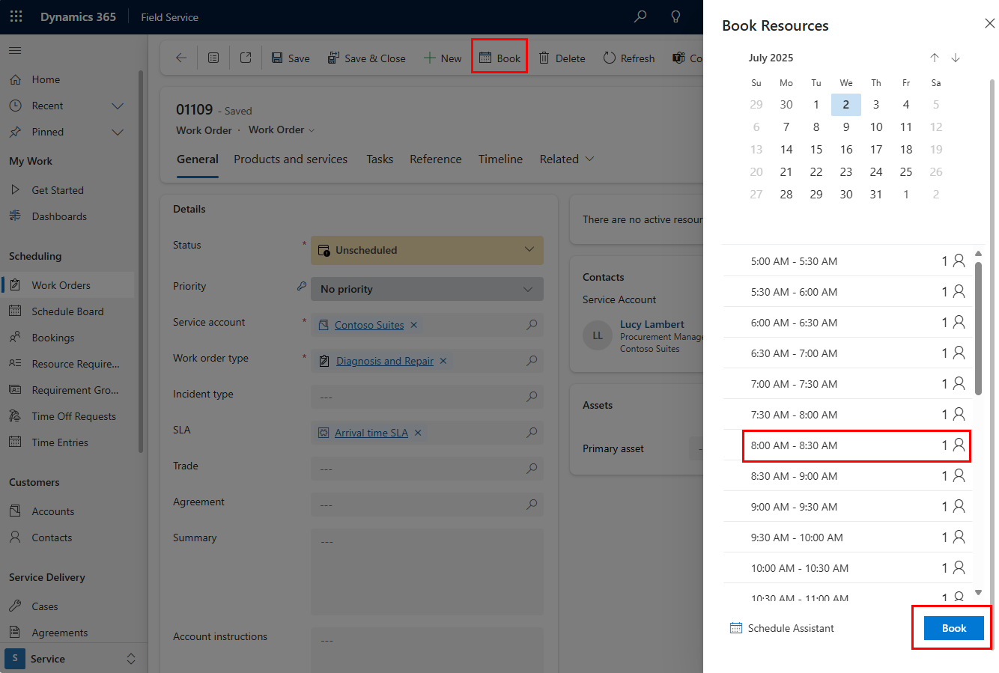

Quick scheduling (sometimes referred to as “quick book”) simplifies the schedule assistant experience.

Without leaving a record, use a scheduling pane to see available booking time slots.

## Prerequisites

- An admin [enabled the quick book setting in the booking setup metadata](../../field-service/schedule-new-entity.md). If the setting is disabled, booking controls [launch the schedule assistant](../../field-service/schedule-assistant.md) instead.

- Quick scheduling is enabled or disabled for each entity that is enabled for scheduling. For example, you can enable quick scheduling for work orders, while still using the full schedule assistant for projects. For requirements with no parent entity, use the **Default Metadata Settings (none)* option.

>[!CAUTION]
> Quick Scheduling does not support fulfillment preferences with time groups.

## Quickly book a job

1. Open a bookable entity or a resource requirement and select **Book**.

1. In the **Book Resources** pane, choose the suggested time slot and select **Book** to confirm.

> [!div class="mx-imgBorder"]
> 

The system chooses an available resource that also meets other requirement criteria like skills and organizational unit. If the requirement is location-based, the system chooses the closest resource. For location-agnostic requirements, the system chooses the first available resource based on alphabetical order of the resource's first name.

To use your preferred time slots, [define intervals with fulfillment preferences](../../field-service/set-up-time-groups.md). However, quick book doesn't support time groups.

> [!NOTE]
> After quick booking a *single requirement*, selecting **Book** again for the same requirement creates an additional booking and will not rebook the previous one. Selecting **Book** again for a *requirement group* triggers the rebook process, which cancels previous bookings.

## Filter options for quick book

There are a few basic filters for the quick book pane.

- You can change the date range, which the system derives from the requirement. If there's no start or end date on the requirement, the search window defaults to 60 days from today.

- Select the resource icon next to a time slot to see the list of matching resources and choose your preferred option. The list also includes some details like travel time and distance.

- Select **Schedule Assistant** in the quick book pane to [launch the full experience of the schedule assistant](../../field-service/schedule-assistant.md) with more filter options.
