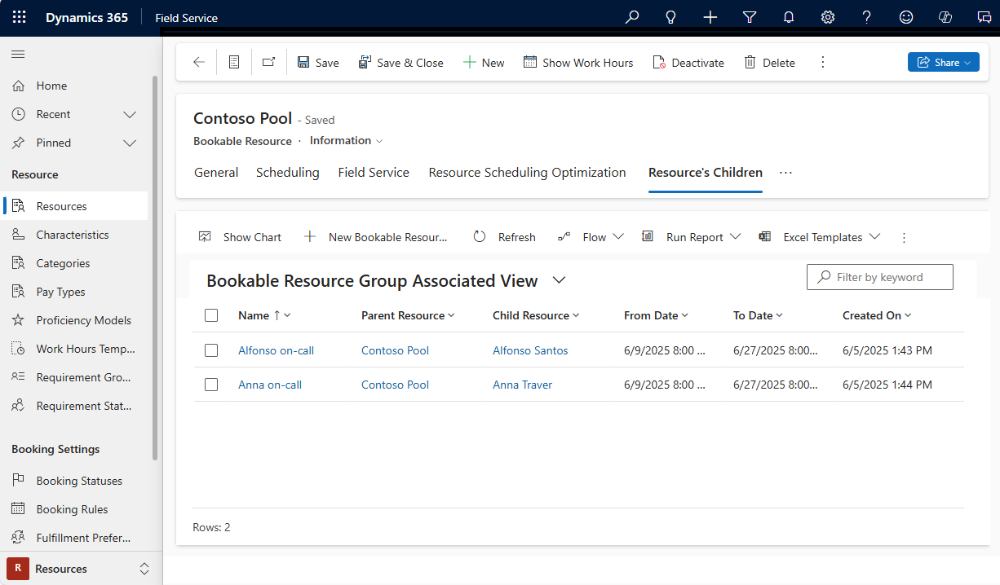

Resource pools are groups of similar resources. Dispatchers manage capacity and get the option to assign resources later.

Resource pool scheduling is useful in several situations:

- Avoid booking specific resources right away. For example, a hotel checks room availability (pool) and assigns a room (resource) to guests when they arrive.  

- Collect requirements centrally but let a local manager book them. For example, a repair shop chain takes appointments through a call center. The central agent books the appointment to the customer's preferred location (pool). The local store manager assigns appointments to an available specialist (resource).

- Dispatchers know the capacity of a pool but not yet the specific resource it will contain.  For example, a trade show offers different booth options. it considers the capacity of booths (pool) when booking, but assigns the specific booths (resource) later.

- Enable overbooking for expected cancellations. For example, a hotel has a fixed number of rooms, but may inflate capacity and take more reservations than available rooms to account for cancellations.

## Create a resource pool

We recommended creating pools that use the same resource type. If you want to create groups with different types of resources, [create a crew](../../field-service/resource-crews.md).

1. In the **Resources** area, under **Resource**, select **Resources** and select **New**.  

1. On the **General** tab, set **Resource Type** to **Pool** and choose a **Pool Type**. Choose between facility, equipment, or a combination of account, contact, and user.

1. Enter a **Name** and choose a **Time Zone**.

1. On the **Scheduling** tab, choose a **Start Location** and **End Location**. Choose **Organizational Unit Address** to represent a physical location where the pool works, or **Location Agnostic** for a pool of resources work remotely.
  
  > [!NOTE]
  > Don't choose the *Resource address* option.

1. Choose an option for **Derive Capacity From Group Members**:
   - **Yes**: Pool capacity changes when adding or removing pool members.
   - **No**: The system sets the capacity of the pool but you can change it. Adding and removing pool members won't change the capacity.

1. Add more resource attributes to consider for scheduling. Consider the pool as a standard resource as it relates to adding attributes like [characteristics](../../field-service/set-up-characteristics.md) or [territories](../../field-service/set-up-territories.md).

## Add pool members

Add members to a pool through the bookable resource group entity.

> [!div class="mx-imgBorder"]
> 

1. On a resource pool record, go to **Related** > **Resource's Children**.

1. Select **Add New Bookable Resource Group** and enter a **Name** for the resource. Choose a **Child Resource** and set a date range for the pool membership. Crews and other pools cannot be made a child of a pool.

## Book a pool with the schedule assistant

1. Select **Book** on a requirement form to open the schedule assistant.

1. The schedule assistant can return the pool and individual pool members based on the configuration of the requirement.

1. Select the pool resource and a time slot and select **Book & Exit**.

> [!NOTE]
> The schedule assistant won't return resource pools for onsite work requirements.

## Manage a pool on the schedule board

On the **Schedule Board**, open the **Filters** pane and set the **Resource Types** filter to *Pool*.

Select **Save as default** to set the default view for the selected schedule board tab.

Right-click the resource pool and select **View Group Members** to see the pool and pool members.

### Assign pool bookings

Assign specific resources to a requirement booked to a pool.

There are three ways to change a booking assignment:

1. **Manually drag and drop**: Select and drag a booking from the resource pool and drag it to one of the pool members.

1. **Substitution**: Right-click a booking in the resource pool, select **Substitute Resource** and choose a pool member.

1. **Rebook**: Right-click a pool booking and select **Rebook**. Edit the filter criteria to no longer search for pools, but to search for Contact, User, and Account type resources.

The duration resets to the default booking duration. Edit the end time to match the original duration. Then, cancel the original pool booking.

## Additional notes

- **Location of Pool Members**: If a resource is the child of a pool through a bookable resource groups (bookableresourcegroup) record, the location of the child resource is taken from the pool. Additionally, if a resource pool is related to a facility or facility pool resource through bookable resource association (msdyn_bookableresourceassociation), the location is taken from the facility or facility pool.

- When a pool resource has **Derive Capacity from Group Members** set to **Yes**, the pool's total capacity for a given time slot is affected by: 
  - The number of pool members.
  - The dates the pool members are part of the pool.
  - The working hours of the pool members.

- Resources that are a member of the pool will not show as available in the schedule assistant if the pool is fully booked for the time period, even if the individual resource is not booked for the period.

- Pool resources will not show as available in the schedule assistant unless at least one child resource of the pool is available during the time period.
