Resource pool scheduling allows you to assemble groups of similar resources to manage capacity and give schedulers the option to assign specific resources at a later time. 

Resource pool scheduling is useful for several scenarios, including:

-	To avoid being forced to book specific resources up front, and instead book the “resource pool” while ensuring no over-commitment. For example, a hotel must search for generic room availability, but travelers are not assigned a specific room until they arrive at the hotel.  

-	To shield central schedulers from details, and leave those details to a local resource manager. For example, customers make laptop repair appointments by calling a central dispatch service, who books appointments at Microsoft Retail stores countrywide. Each morning, the manager of the local store assigns specific specialists.

-	Specific resources may not yet be named, but capacity of the pool is established. Schedulers can still schedule since capacity of the pool can be set as if all the resources were named. For example, a tradeshow offers different booth options to sponsors. Capacity of booths is considered when booking, but specific booths will be confirmed later. Organizers can take reservations well in advance of having a defined floor layout; the layout may even be decided based on how many reservations there are. 

-	To deliberately enable overbooking for expected cancellations. For example, a doctor's office has a fixed number of rooms to help patients, but may inflate capacity and schedule more appointments than rooms in order to account for cancellations.

In this topic, we'll walk through 2 hypothetical scenarios to explain resource pool scheduling:

1. Schedule a pool, then assign specific resources later
2. Overbook a pool for expected cancellations

## Prerequisites 

To use resource pool scheduling, you'll need Universal Resource Scheduling (URS) v3.0.

## Scenario 1: Schedule a pool; assign specific resources later

In our first scenario, the office staff at a health clinic wants to book patient appointments with pediatricians. Because there are five pediatricians working each day, the office staff must ensure that no more than five appointments are scheduled during any single time slot. However, though appointments are booked weeks or even months in advance, specific pediatricians are not assigned to an appointment until the day before because of variable schedules. 

To accommodate this scenario, we will create a pool to represent the pediatricians, schedule appointments to the pediatrician pool, and then reassign appointments to specific doctors within the pool. 

### Step 1: Create a resource pool
   
   1. From either the Field Service or Universal Resource Scheduling solution, go to **Resources** > **Active Bookable Resources** view > select **+New**.  

> [!div class="mx-imgBorder"]
> 

> [!div class="mx-imgBorder"]
> 

   2. Set **Resource Type** to **Pool**. A new field will appear called “Pool Type.”
   3. Set **Pool Type** to **Account, Contact, User** because this pool will consist of people resources (pediatricians, in our example).
      1. Note that pool types can either be set to: Facility, Equipment, or any combination of Account/Contact/User.
      2. We recommended creating homogeneous pools. Since you may not be naming specific resources at all, set up pools in a way that the resources who are named later can actually fulfill the backlog of work scheduled to the pool. For example, if you schedule a “facility” requirement to a pool, the pool should consist of of facility resources who can later be assigned.
   4. Enter a **Name**.
   5. Select a **Time Zone**.

> [!div class="mx-imgBorder"]
> 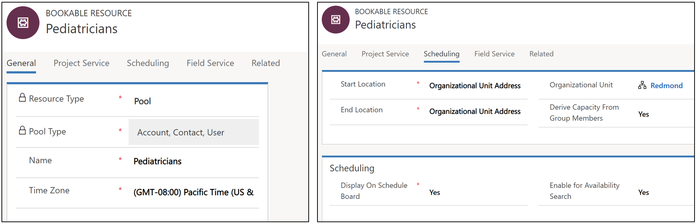

  6. Set **Start Location** and **End Location** to **Organizational Unit Address**, and assign an organizational unit with latitude and longitude values because the pediatricians work at a defined health clinic.
     1. Start and End Locations can be set to either **Organizational Unit Address** to represent a physical location where the pool works, or **Location Agnostic** for a pool of resources that will perform work remotely (for example, customer service phone calls). Resource address is not an option, as pools are currently excluded from **Onsite** scheduling (requirements where Work Location is set to Onsite).
  7. Set **Derive Capacity From Group Members** to **Yes**.
     1. **Setting to Yes**: Capacity will increase and decrease as pool members are added to or removed from the pool. In our example scenario, we set to "yes" because it allows us to add 5 pediatricians to the pool in the next step. This also allows the pediatrician pool to be booked up to 5 times for any single time slot. 
     2. **Setting to No**: The capacity of the pool will default to one and can be manually edited. Pool members can still be added and removed. See scenario 2 in this article for more details.  
  8. Add more pool resource attributes.
     1. You can add any additional information about the pool that you would like considered when it comes to scheduling. Consider the pool as a standard resource as it relates to adding skills, roles, organizational units, territories, and so on. For example, if you have a requirement that requires “skill A,” when searching for availability using the schedule assistant, only pools with “skill A” will be considered.

### Step 2: Add pool members

Members can be added to a pool through the bookable resource group entity (bookableresourcegroup).

1. From the pool you just created, go to **Related > Resource Children**.

> [!div class="mx-imgBorder"]
> 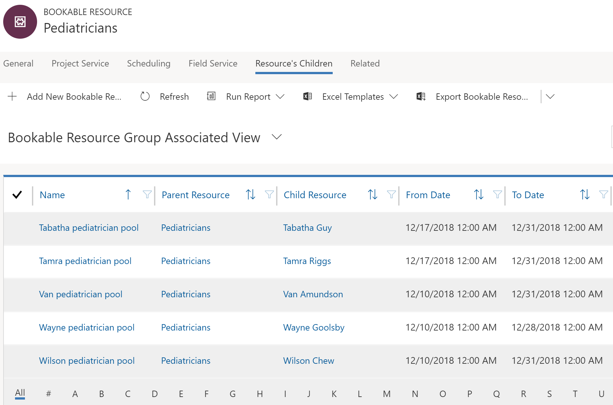

2. Select **+Add New Bookable Resource Group**, and:
   1. Assign a **Name**.
   2. In the **Resource 2** field, select the resource you would like to add to the pool.
   3. Select a **Date Range** during which the resource will be part of the pool. This will effect capacity if the pool is set to derive capacity from pool members.
   4. Repeat these steps for each pool member.

> [!Note]
> Resources can be associated as children of the pool with date effectivity. For example, on Monday, Resources 1, 2, and 3 can make up the pool, while on Tuesday, resources 4, 5, and 6 can make up the pool. To do this: 
> 1. Create a new bookable resource group record.
> 2. Set the parent resource to the pool, and the child resource to the resource that is in that pool.
> 3. Set the **From Date** to the date and time that the resource is part of the pool and set the **To Date** to the date and time when the resource is no longer associated to the pool. 

### Step 3: Add the pool to the schedule board

1. Next up, go to **Universal Resource Scheduling** > **Schedule Board**.
2. Add the pool resource by adjusting the schedule board filters the same way you would add any resource to the schedule board.
   1. In this example, we select **Resource Types** of **Pool** and **Pool Types** of **Account, Contact, User** because this matches our pediatrician resource pool. 
3. Right-click the resource pool and select **View Resources in Split View** to see the pool and pool members.
4. Select **Options > Save Current Filters as Default** to save the changes made to the schedule board tab for the next time you visit.

> [!div class="mx-imgBorder"]
> 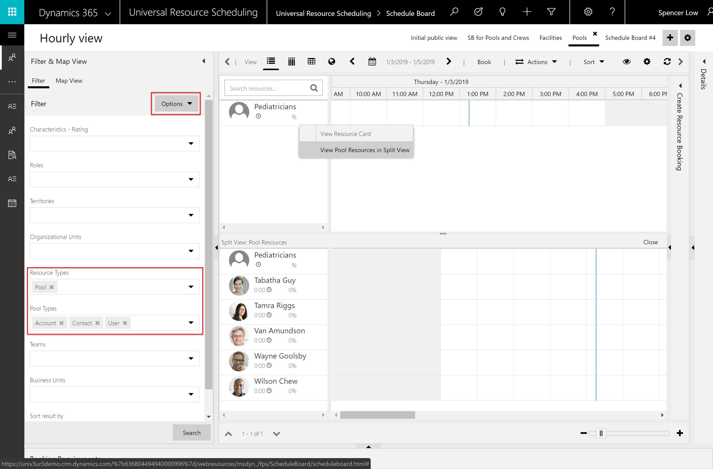

### Step 4: Create a single requirement

Now we will schedule a requirement to our newly created resource pool.

1. Go to **Universal Resource Scheduling > Resource Requirements > +New**.
2. Enter a **Name**.
3. Select a **From Date** and **To date**. These values become **Search Start** and **Search End** dates in the schedule assistant.
4. Enter a **Duration**.
5. Set resource type to **Pool** and **Pool Types** to **Account, Contact, User**. This ensures our pediatrician pool shows in results.
      1. This also allows you to decide which types of resources should be searched when searching for availability using the schedule assistant on a requirement. If this field is left empty, all resource types are searched. If certain values are selected, then only those resource types are considered. 
6. Add other constraints like as characteristics. In this example, we want resources with "Pediatric" skills, as seen in the following screenshot.

> [!Note]
> In our example, the requirement group field on the requirement record is blank. This means that this is a single requirement intended to be scheduled to one resource. One benefit of single requirements is that they can be scheduled and rescheduled by manual drag and drop. This is useful if dispatchers want to manually reschedule bookings from a pool to a pool member.  
 
> [!div class="mx-imgBorder"]
> 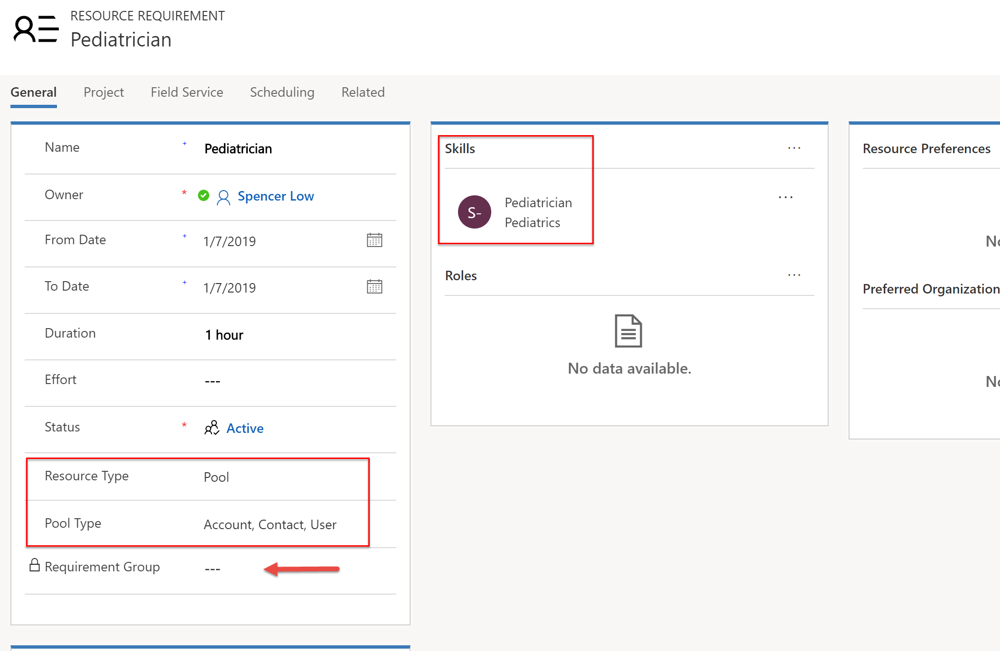

### Step 5: Book the pool

1. Select **Book** at the top of the requirement form to trigger the schedule assistant.

> [!div class="mx-imgBorder"]
> 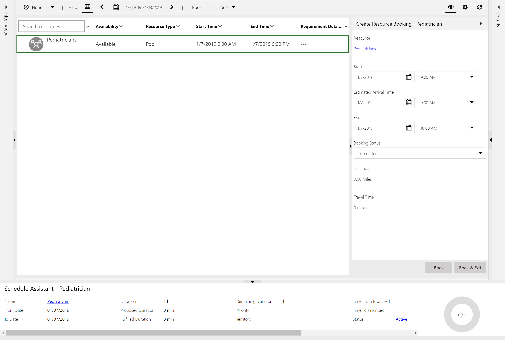

2. When searching for availability for a requirement or requirement group, both the pool and its child resources (pool members) can be returned in the results.

3. Select the pool resource and a time slot (in this example, our pediatrician pool and the 9AM - 10AM time slot), and select **Book & Exit**.

### Step 6: Book more requirements to the pool

Since a pool can be booked multiple times up to defined capacity, now we'll create another requirement and book it to the same time slot. 

The following screenshot shows a near identical requirement for another pediatrician that we will book to our pool. 

> [!div class="mx-imgBorder"]
> 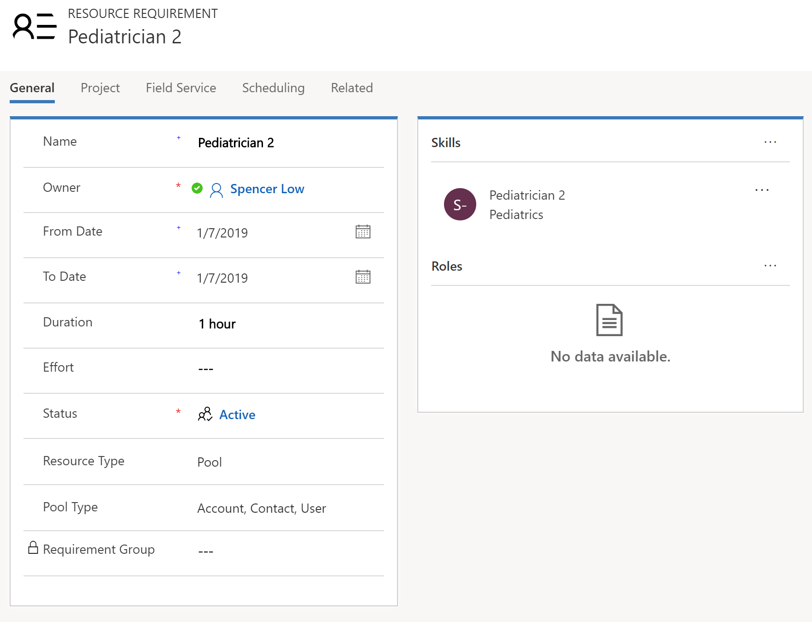

We will select the same resource pool as we did in step 5, and the same time slot at 9 AM to 10 AM.  

> [!div class="mx-imgBorder"]
> 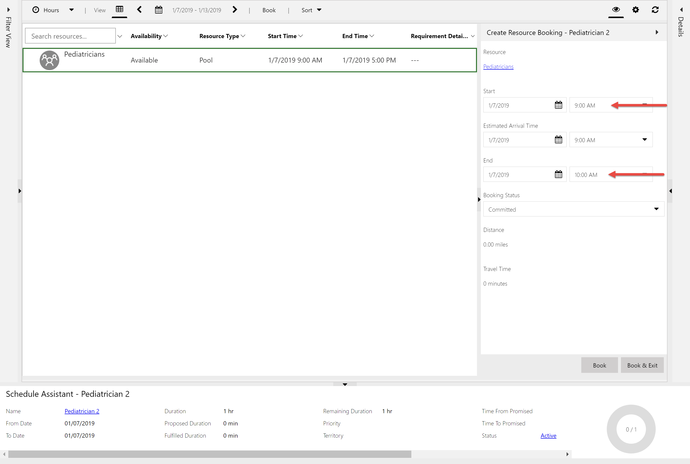

The resource pool will show as a result in the schedule assistant for the 9 AM time slot up to five times since five pediatric resources were added to the pool making the capacity five.

Next, head to the schedule board and then to the schedule board tab where your pool resource is displayed.

Load the **Hourly** Schedule Board and find your pool resource. Right click the Pool Resource and choose to **View Pool Resources in Split View**. This will split the Schedule Board and a new dedicated Schedule Board will be displayed showing just the Pool and its members. Based on the dates being displayed on the Schedule Board, only the members of the pool with membership during that date range will appear in the Pool Schedule Board. If a resource is part of the pool for only some of the days being displayed on the Schedule Board, they will be displayed, and there will be a mask showing the days where they are not part of the pool.

Here we see five bookings at the 9:00am time slot. 

> [!div class="mx-imgBorder"]
> 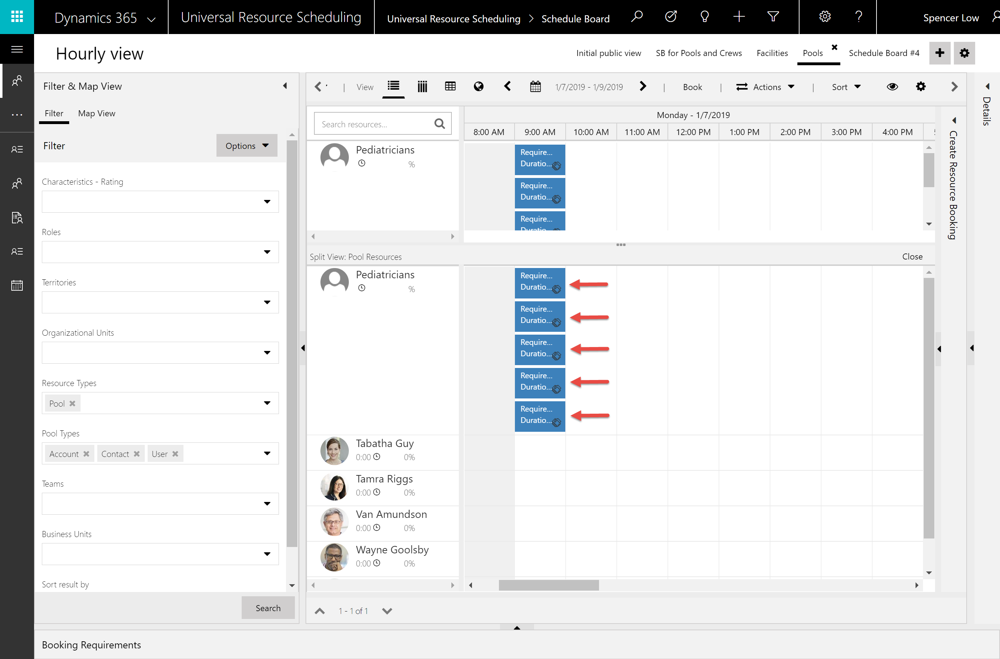

> [!Note]
> The Schedule Board **sorting** functionality applies to the split view, but the Schedule Board **filtering** functionality does not.

### Step 7. Reassign pool bookings to specific pool members

Fulfilling our scenario, the health clinic office staff members want to assign specific pediatric doctors as an appointment nears.

From the schedule board split view, we will accomplish this three ways:

1. **Manually drag and drop**: Select and drag a booking from the resource pool and drag it to one of the pool members.

> [!div class="mx-imgBorder"]
> 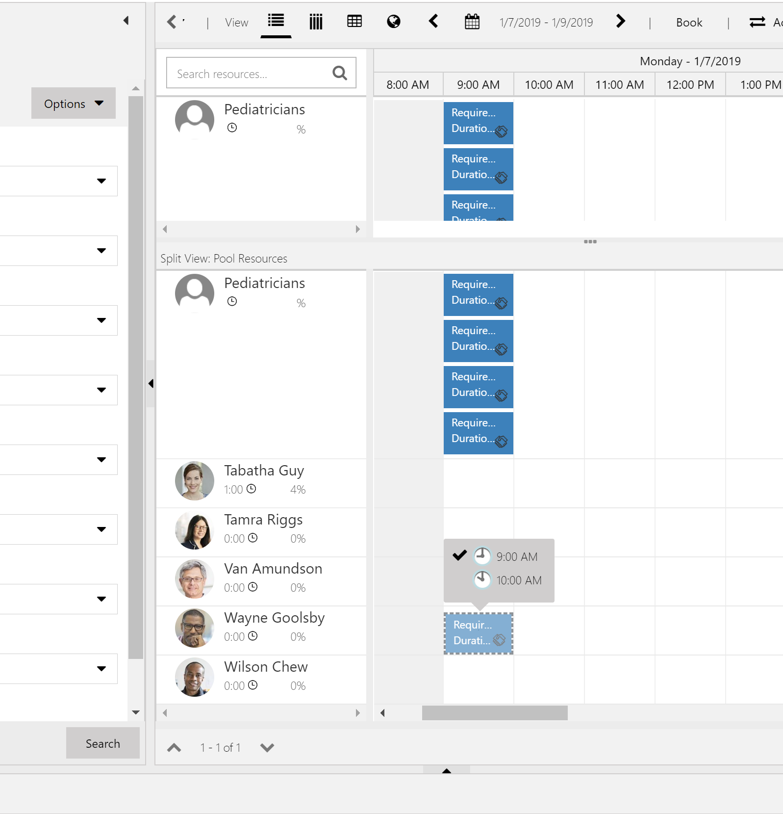

2. **Substitution**: Right-click a booking for the resource pool, select substitute resource, then select a pool member.

> [!div class="mx-imgBorder"]
> 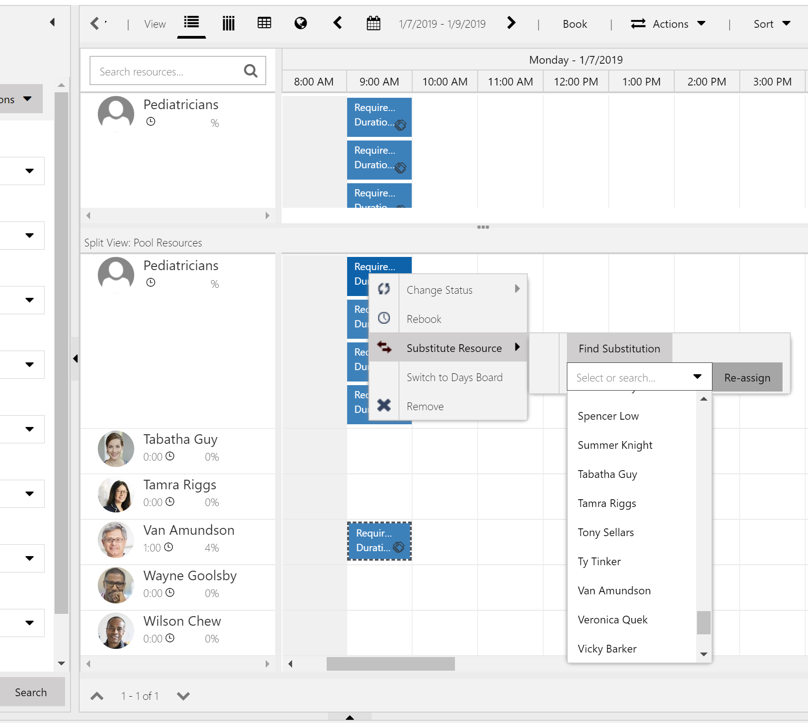

3. **Rebook**: Right-click a pool booking and select **Rebook**. Edit the filter criteria to no longer search for pools, but to search for Contact, User, and Account type resources.

> [!div class="mx-imgBorder"]
> 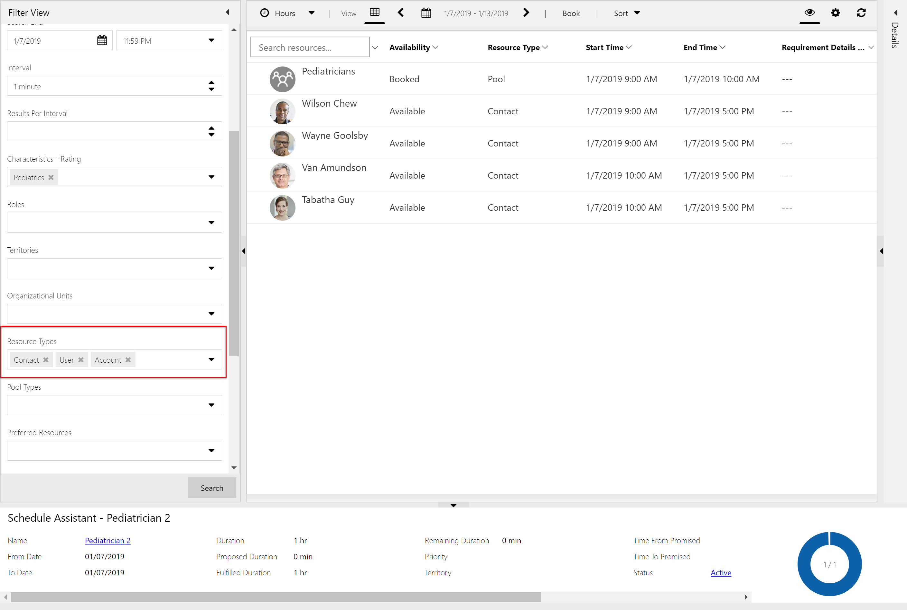

When rebooking a previously fulfilled booking, the duration will default to the default booking duration as defined in **Universal Resource Scheduling > Settings > Administration > Enable Resource Scheduling for Entities > Booking Setup Metadata**.

Therefore, as seen in the following screenshot, you must edit the end time to match the original duration.

> [!div class="mx-imgBorder"]
> 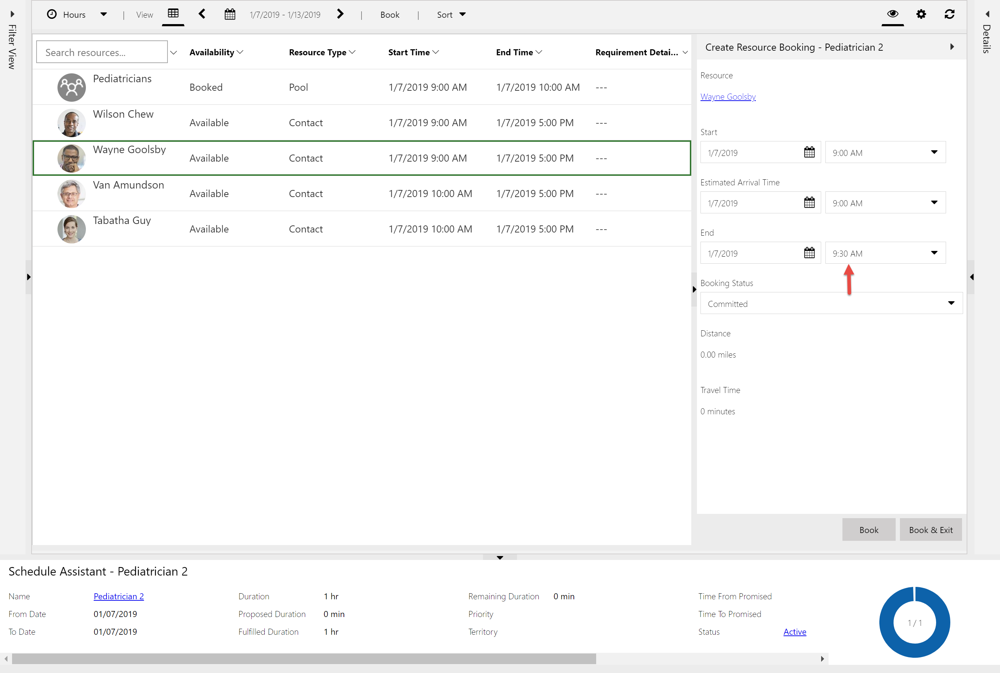

Finally, cancel the original pool booking.

> [!Note]
> You can also create a custom booking status to match your business needs, rather than changing the status to cancelled.

> [!div class="mx-imgBorder"]
> 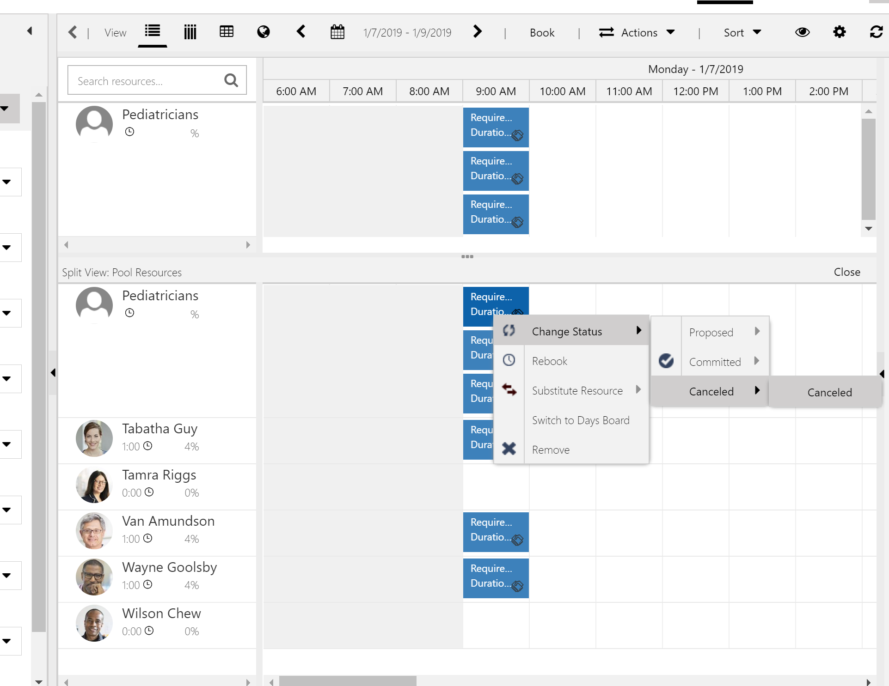

As an alternative to rebooking from the schedule board, go to the requirement record, edit the resource types, and book again. 

> [!div class="mx-imgBorder"]
> 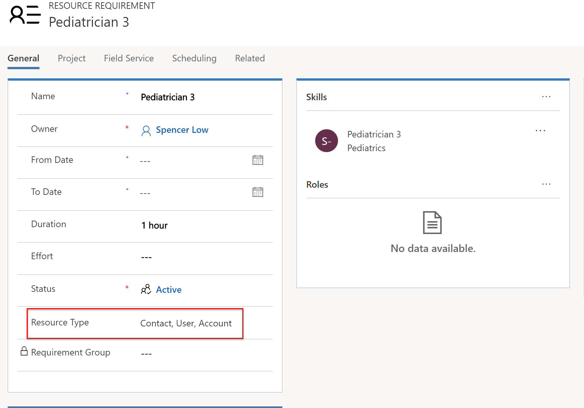

## Scenario 2: Overbook a pool for expected cancellations

In our second scenario, hotel managers want to make reservations for travelers by first checking for specific date range availability, and then assigning the traveler a specific room when she arrives. Furthermore, hotel managers want to overbook the hotel to account for expected cancellations.

To accommodate this scenario, we will create a pool of facilities with extra capacity to represent the hotel rooms, schedule reservations to the hotel pool, and finally reassign reservations to specific rooms within the hotel pool.

### Step 1. Create a pool resource

First we will create a pool resource to represent the hotel.

1. From the Field Service or Universal Resource Scheduling solutions, go to **Resources** > **Active Bookable Resources** view > and select **+New**.
2. Set **Resource Type** to **Pool**.
3. Set **Pool Type** to **Facility**.
4. Enter a Name.
5. Set **Start Location** and **End Location** to **Organizational Unit Address**.
6. Assign an **Organizational Unit** from the lookup to represent the location of the hotel.
   1. The selected organizational unit must have latitude and longitude values. 
7. Set **Derive Capacity from Group Members** to **No**.
   1. This time, we manually override capacity to allow for overbooking, rather than have the number of facilities in the pool (for instance, the number of rooms in the hotel) dictate capacity.

> [!div class="mx-imgBorder"]
> 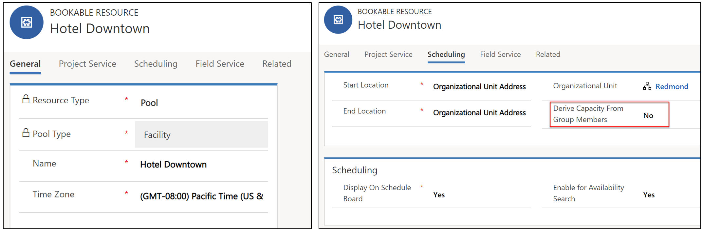

### Step 2. Create and add pool members

   1. Create resources with **Resource Type** set to **Facility** to represent each room in the hotel.
   2. Go to the hotel pool resource you created in the previous step and add each room resource as a child by selecting **Related > Resource Children**.  

> [!div class="mx-imgBorder"]
> 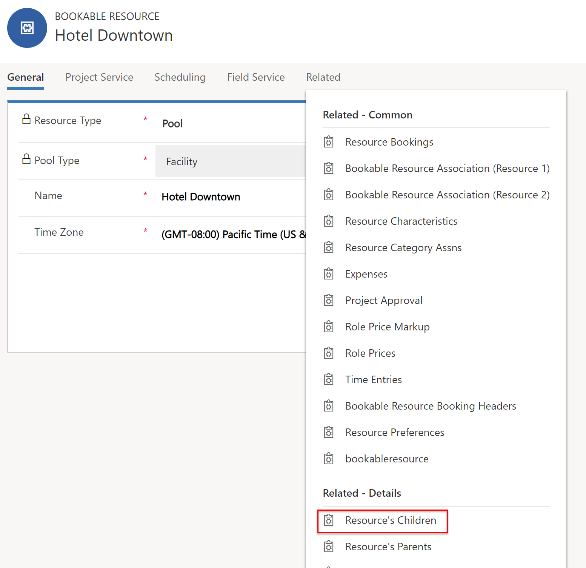

> [!div class="mx-imgBorder"]
> 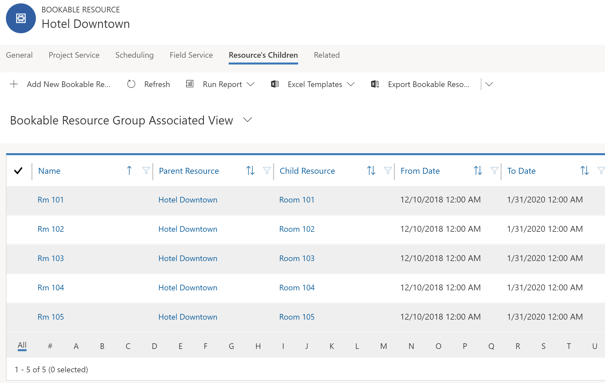

### Step 3. Manually add additional capacity

   1. While on the hotel pool resource, go to **Show Working Hours** at the top of the form.
   2. Select **Show Capacity**.
   3. Enter the desired capacity. In this example, we use a capacity of six though our pool has only five child resources (in other words, five rooms).

> [!div class="mx-imgBorder"]
> 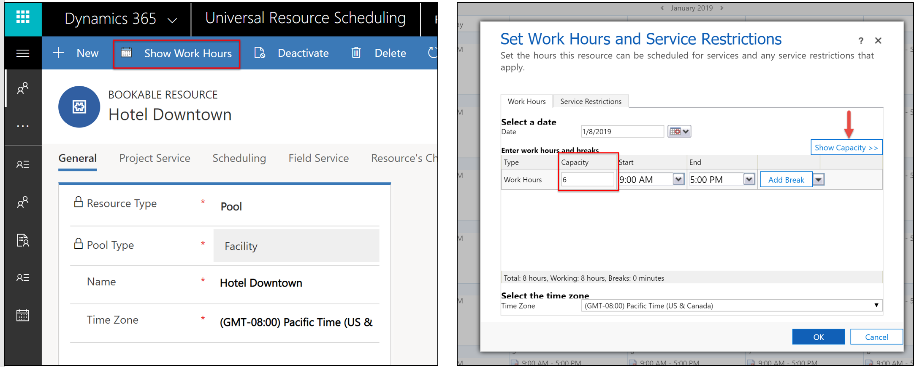

### Step 4. Create requirement

Now we will create a requirement to represent a reservation for a traveler.

1. Go to **Universal Resource Scheduling > Resource Requirements > +New**.
2. Fill out **Name**, **Date Range**, **Duration**, and any other constraints.
3. Set **Resource Type** to **Pool**.
4. Set **Pool Type** to **Facility**.
   1. This ensures our hotel pool will be considered in schedule assistant results.
5. Set **Work Location**:
   1. In our hotel booking example, work location is set to **Facility**, which means the requirement takes place at a physical space (the hotel). In order to show facilities relative to the customer's (traveler's) location, a latitude and longitude can be entered on the requirement to represent the customer's location. As a reminder, we set the hotel's location when we set up the pool resource. These settings are useful in scenarios where the hotel may have many locations and the scheduler wants to use time and distance calculations when communicating to the customer.
   2. If schedulers don't need travel or distance information about the customer, set to **Location Agnostic** and leave latitude and longitude blank. 
   3. For more information on the **Work Location** field, visit our [topic on facility scheduling](https://docs.microsoft.com/dynamics365/customer-engagement/field-service/facility-scheduling#configuration-considerations).

> [!div class="mx-imgBorder"]
> 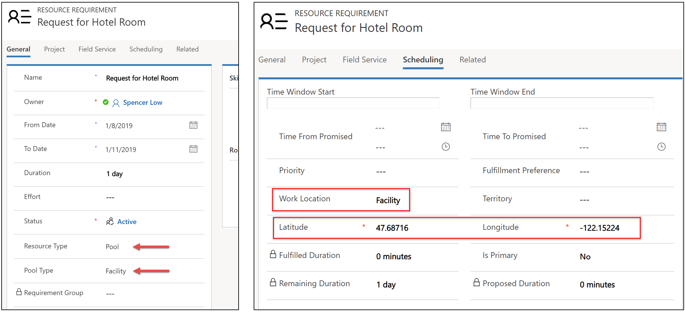

### Step 5. Book requirement

Select **Book** at the top of the requirement form to trigger the schedule assistant. Up to six requirements (reservations) can be booked for a single time slot. 

The schedule assistant results in the following screenshot assume five reservations have already been scheduled to the hotel, and the scheduler is attempting to book a sixth reservation as extra capacity.

> [!div class="mx-imgBorder"]
> 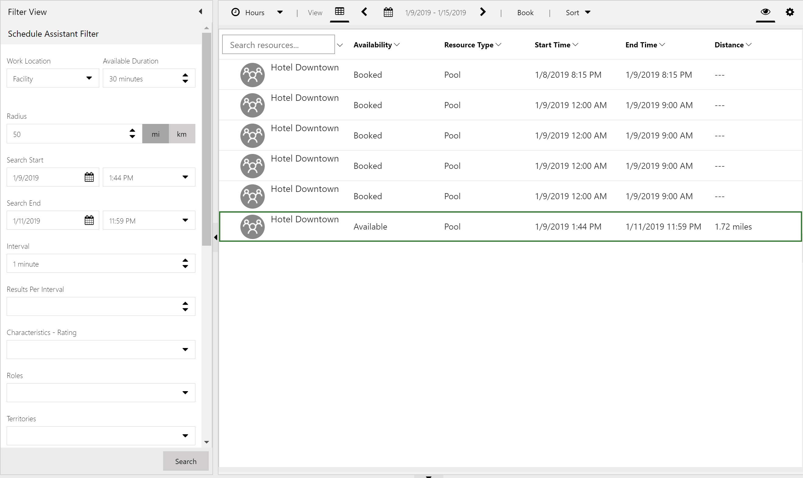

### Step 6. View overbooking on the schedule board

1. Go to **Universal Resource Scheduling** > **Schedule Board**.
2. Expose the hotel pool to the schedule board by filtering for **Resource Types** of **Pool** and **Pool Types** of **Facility**.
3. View the hotel pool and all related pool members (rooms) by right-clicking the hotel pool resource and selecting **View Pool Resources in Split View**.

> [!div class="mx-imgBorder"]
> 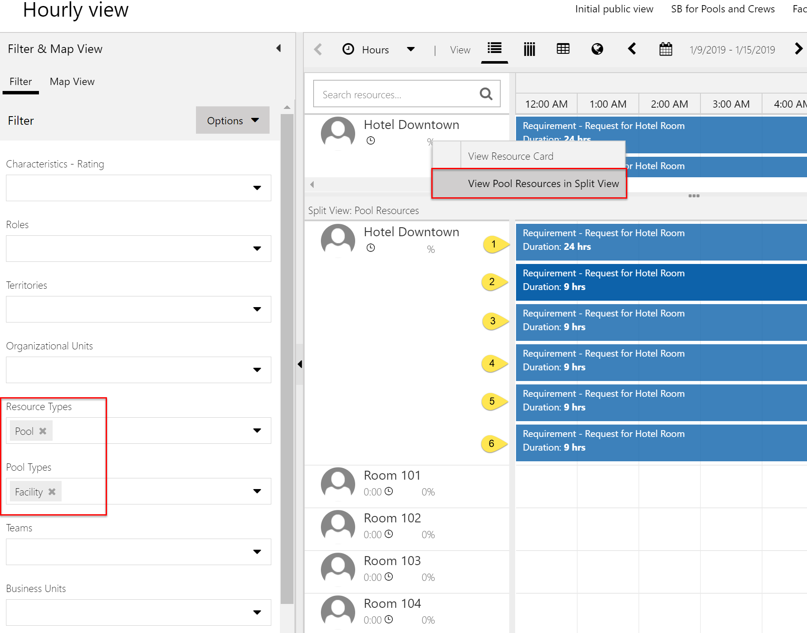

### Step 7. Reassign bookings

Reassign the hotel pool bookings to specific rooms with the three methods described in scenario 1:

1. Manually drag and drop
2. Substitution
3. Rebook

## Configuration considerations

- Resource pools will not display in schedule assistant results for requirements where **Work Location = Onsite**. By default, work order-related requirements are set to onsite. Only requirements with a **Work Location = Facility** or **Location Agnostic** will show up in schedule assistant results. 

- Crew resources and pool resources cannot be made children of a pool.

- **Location of Pool Members**: If a resource is the child of a pool through a bookable resource groups (bookableresourcegroup) record, the location of the child resource is taken from the pool. Additionally, if a resource pool is related to a facility or facility pool resource through bookable resource association (msdyn_bookableresourceassociation), the location is taken from the facility or facility pool.

- When a pool resource has **Derive Capacity from Group Members** set to **Yes**, the pool's capacity for a given time slot is effected by: 
  - the number of pool members 
  - the dates the pool members are part of the pool and 
  - the working hours of the pool members

 
### Choosing the right resource type

Whether the pool resource, pool members, or both show in schedule assistant results depends on the resource types selected on a requirement record. If the resource type **Pool** is selected, and if the resource pool has availability along with all other matching constraints expressed on the requirement, the pool itself can return as an option to book. If the resource type **Pool** is **not selected** on the requirement, pool members can still return in the results, presuming that the pool member’s resource type is checked off on the requirement. If no resource types are selected, all resource types are considered.

For example, consider a requirement that only has resource type **Account** selected, a resource with resource type **Pool**, and pool type of **Account, Contact, User**. In this example, the pool resource itself will not be returned in the schedule assistant search, but the child pool members (with resource type **Account**) will be returned by the schedule assistant. 

### Using characteristics with pools

The same logic that is applied to the requirement resource type attribute applies to all constraints. Consider the following example: a requirement has a required characteristic called **Electric Vehicle Mechanic**. There is a pool that has the characteristic **Mechanic**, but not **Electric Vehicle Mechanic**. The pool has a child member that has both the characteristics **Mechanic** and **Electric Vehicle Mechanic**. 

When running the schedule assistant on the requirement, presuming availability, the pool resource itself will not be presented to book since it is missing the required characteristic (**Electric Vehicle Mechanic**), but the pool member will be presented since the resource has the necessary characteristic for this job. The reason for this is that the pool members should have all the attributes expressed on the pool, but they may have additional attributes as well if they have specialties. Since not all the pool members have these additional attributes, like the **Electric Vehicle Mechanic**, if this requirement gets booked to the pool and the one pool member who has this characteristic is not available as the appointment time nears, what happens? Who will be assigned to this booking currently booked to the pool? You may not have other resources to pickup the work. Therefore, the idea is to book the actual resource itself to ensure that this unique job has coverage.

 
## Additional notes

- Requirement groups can't be dragged and dropped or substituted 
- When changing the working hours of a resource, capacity is not recalculated

### Pool availability affects member availability and vice versa

Being part of a pool can severely limit a resource's ability to be scheduled. Resources cannot be expected to operate as part of a pool and independently at the same time. If a pool resource itself is booked to capacity for a given time slot, pool members will not show as available for that time slot and vice versa. If all pool members are booked for a given time slot, the pool will not show as available for that time slot.

#### Example 1: Pool resource only

When searching for availability, the schedule assistant will look at the pool capacity set on the pool resource, and will subtract existing bookings that are booked to the pool resource itself, or any of the pool’s child resources. Consider a pool's capacity is set to 10. Let’s also assume there are no child resources for this pool. When finding availability using the schedule assistant, the pool will be looked at as if there are 10 resources associated to the pool. 

For example, let’s say you are searching for a 30-minute requirement. If the pool has 10 bookings from 10 to 10:30, the pool will not be recommended for the requirement between 10 AM and 10:30 AM. This is because the total capacity of the pool at 10 AM is 10, but there are 10 bookings scheduled to this pool resource at 10 AM. However, if the pool only has 9 bookings between 10 AM and 10:30 AM, then the pool can be recommended.

#### Example 2: Pool resource and child resources 

If the bookings for the pool and its members exceed the total capacity established on the pool, every resource in the pool and the pool itself is considered unavailable. But if there is overall aggregate availability, then each resource still has its own availability calculation. For example, consider if a pool resource has a capacity of 10, and there are 9 bookings between 10 AM and 10:30 AM on the pool resource, and the child resource has one booking from 10 to 10:30. In this case, since in aggregate the pool and its children have as many or more bookings (10) than the capacity on the Pool (10), the entire pool and its child resources are considered unavailable for that timeframe (10:00 AM to 10:30 AM). 

However, if the pool resource has 8 bookings and the child resource has 1 booking, since this is a total of 9 bookings, the pool and its child resources will not be removed between 10 and 10:30. In this case, the pool itself will show as available, however the child resource will not return as available since there is already a booking at 10 AM for the child resource.

### Pools vs. crews: when to use each?

One main difference between pools and crews is crews are expected to do work together and bookings cascade (at least by default). This means scheduling a crew will create bookings for crew members, whereas booking a pool does not create bookings for pool members. Additionally, crews can be a compilation of different types of resources such as a person and a piece of equipment. In contrast, pools are designed to be homogeneous meaning entirely people, equipment, or facilities.
