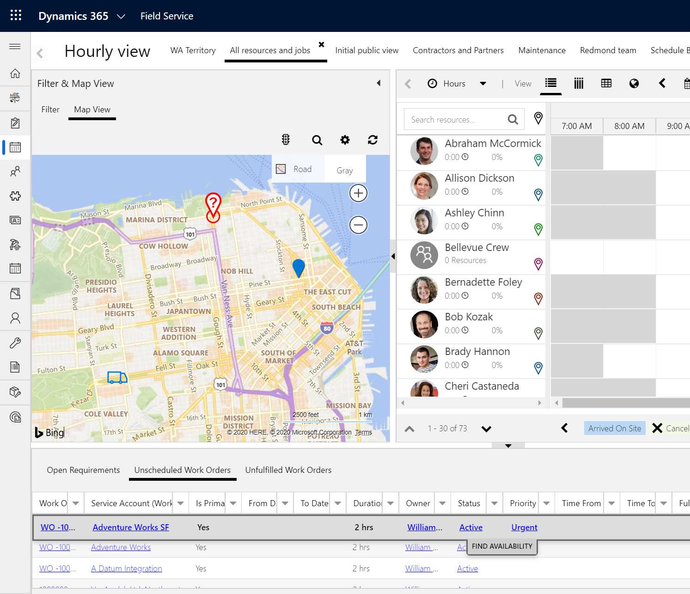
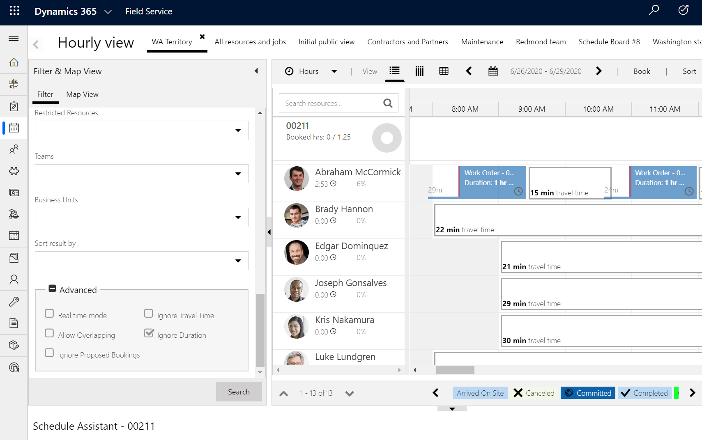
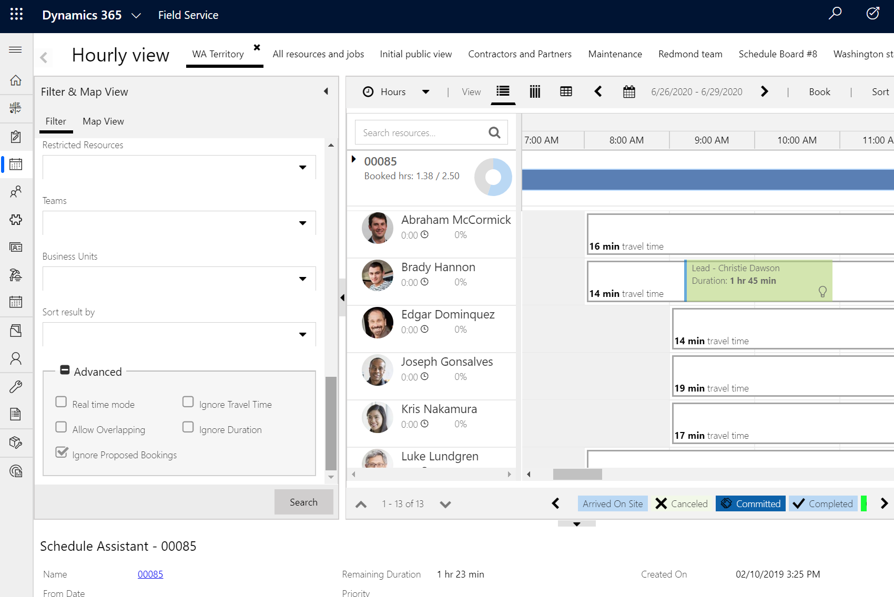
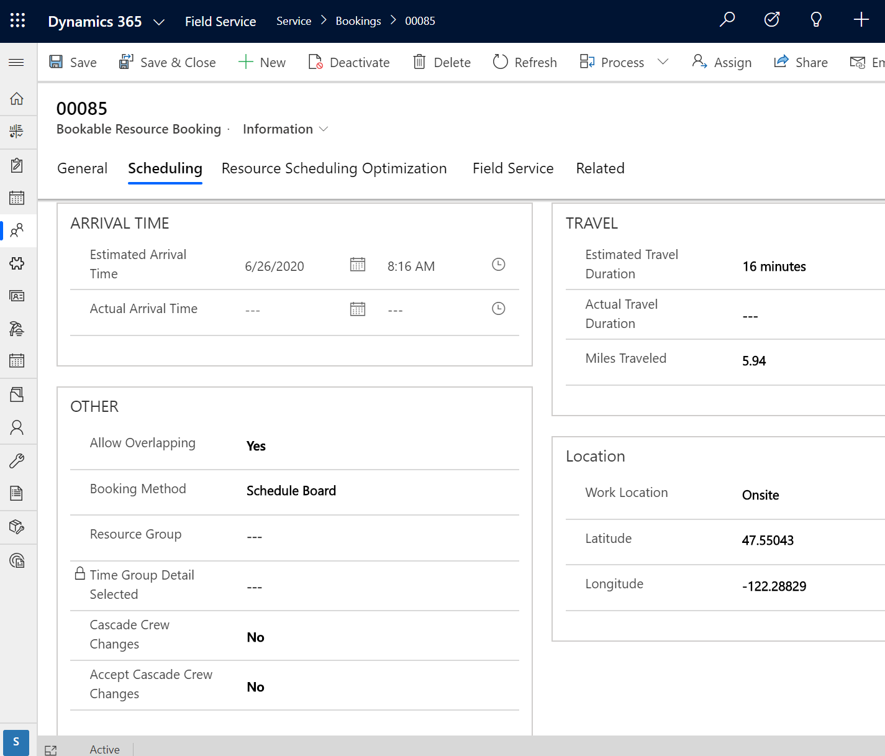
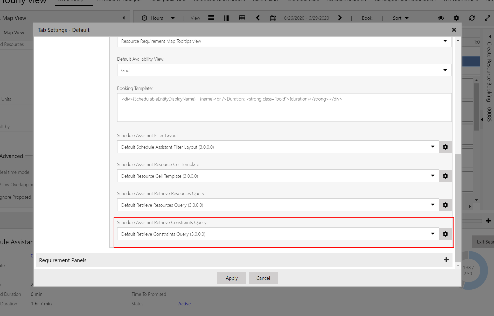

Beyond the standard filters exposed within the schedule assistant's filter panel, you'll find a few advanced filters that provide additional granularity for scheduling needs.

> [!div class="mx-imgBorder"]
> 

In this article, we'll take a look at the schedule assistant's advanced filters:

- Real-time mode
- Ignore travel time
- Allow overlapping
- Ignore duration
- Ignore proposed bookings

> [!Note]
> For more information, see the video  [Schedule Assistant: advanced filters](https://youtu.be/s6yvVv99Bnw).

## Prerequisites

The schedule assistant is a part Universal Resource Scheduling, which is included and installed with Dynamics 365 Field Service, Project Service Automation, and Customer Service.

## Real-time mode

Filtering by real-time mode can be useful in emergency scenarios where a dispatcher needs to book the closest possible resource, so that they can arrive onsite more quickly.

The schedule assistant will use the location of the technician's mobile device when calculating the estimated travel time to arrive at the work order location. The "real time" location is displayed on the schedule board map as a truck icon.


> [!div class="mx-imgBorder"]
> 

The mobile device's location is collected from the time of the last sync to a defined threshold in the past. The time threshold for when the acceptable location of a previous sync is defined in the **Geo Location Expires After X Minutes** field found in **Resource Scheduling app** > **Settings** > **Administration** > **Scheduling parameters**.

See the article on [geofencing](../../field-service/geofencing.md) to learn how to set up location auditing and sharing.

## Ignore travel time

Sometimes, a dispatcher may want to ignore the travel time when finding available resources. One example is if the resource can work overtime or if the job location is exceptionally far away. 

For cases when the calculated travel time is not needed, selecting **Ignore travel time** in the schedule assistant's advanced filters will produce results that ignore the estimated travel time when determining if a resource has enough time available in their schedule.

## Ignore duration

The schedule assistant will ignore the requirement duration when determining if a resource has enough time available in their schedule.

> [!div class="mx-imgBorder"]
> 

## Ignore proposed bookings

Many organizations will mark their bookings with a booking status of **Proposed** until a customer or client commits to the schedule. In such cases, dispatchers may want to view those time slots as available for other work that is more important or ready to be committed.

With the **Ignore proposed bookings** advanced filter, the schedule assistant will ignore bookings where the Booking status is **Proposed**, and will treat that time slot as available.

> [!div class="mx-imgBorder"]
> 

## Allow overlapping

The schedule assistant will double book on top of bookings where the **Allow Overlap** field is set to **Yes**.

> [!div class="mx-imgBorder"]
> .

This filter is similar to the **Ignore proposed bookings** filter, except it's unrelated to the booking status because any booking can be set to allow overlapping.

## Configuration considerations

### Default values and sorting

When the schedule assistant is triggered, you'll see that some fields have default values. For example, schedule assistant search results are listed in alphabetical order by default. These default values can be changed in the **Schedule Assistant Retrieve Constraints Query**.

> [!div class="mx-imgBorder"]
> 

To get there, double-click on the schedule board tab. Open default settings in the top right. Under the schedule types section, select the gear icon next to **Default Retrieve Constraints Query**.

From here, you can edit the XML to define how the schedule assistant searches for each entity that is available for scheduling.

## Additional notes

Do not edit the schedule assistant **Retrieve Constraints Query** for the territory shown below. It can damage the schedule assistant logic.

```<Territories ufx:select="lookup-to-list(Requirement/msdyn_territory)" />```
