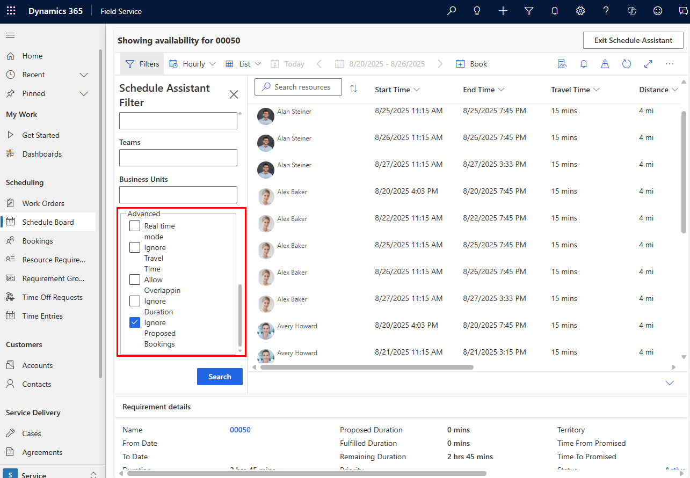

The schedule assistant includes advanced filters that provide more granularity for scheduling needs.

> [!div class="mx-imgBorder"]
> 

## Real time mode

Helps find the closest possible resource to arrive onsite more quickly.

The schedule assistant will use the location of the technician's mobile device when calculating the estimated travel time to arrive at the work order location. A truck icon represents the technician's location on the schedule board map.

The mobile device sends location information from the last sync to a defined threshold in the past. Define the time threshold in the [**Geo Location Expires After X Minutes** setting for scheduling parameters](../../field-service/scheduling-parameters-settings.md#geo-data).

See the article on [geofencing](../../field-service/geofencing.md) to learn how to set up location auditing and sharing.

## Ignore travel time

Ignores the estimated travel time and only checks if a resource has enough time available in their schedule.

## Ignore duration

Ignores the requirement duration when determining if a resource has enough time available in their schedule.

## Ignore proposed bookings

Ignores bookings with a **Proposed** booking status and the time slot as available.

Some organizations use the proposed status for bookings until their customer confirms the schedule. Dispatchers could use those time slots to expedite committed work.

## Allow overlapping

Shows bookings that with the **Allow Overlap** field set to **Yes** on the bookable resource booking form.

