>[!Note]
> In this article, we take a high-level tour of the schedule assistant. For a more in-depth tutorial, check out this [full video walkthrough of the schedule assistant](https://youtu.be/QOrePYZ9fds), which includes some practical examples.

The schedule assistant is a semi-automated feature in Dynamics 365 Field Service that helps dispatchers assign work orders and other jobs to the closest and most appropriate resources.

When triggered by a dispatcher, the schedule assistant will recommend resources that match relevant requirements, like time windows or skills needed. The system will also then show projected travel time for the recommended resources, which helps dispatchers plan work accordingly.

When the dispatcher identifies the right resource for the job, they can then book the work to the resource, who can then see it on their schedule.

In this article, we'll take a tour of the schedule assistant in Field Service.

> [!div class="mx-imgBorder"]
> 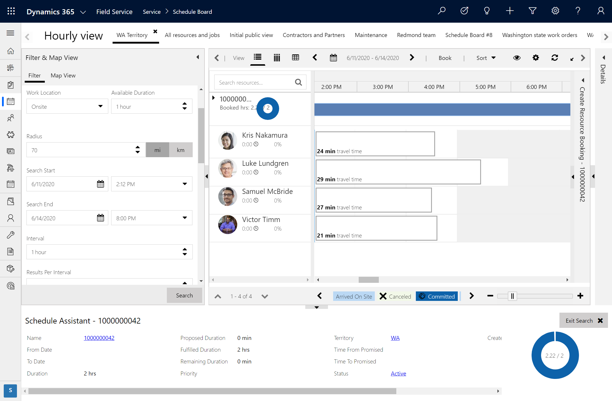

## Prerequisites

The schedule assistant is a part of the Universal Resource Scheduling solution, which is included and installed with Dynamics 365 Field Service, Project Service Automation, and Customer Service.

## Matching requirements and resources

The schedule assistant's primary objective is to match up work with the right resources. In Field Service, work is typically represented by a work order, which includes information like:

- Location
- Time
- Territory
- Time windows

> [!div class="mx-imgBorder"]
> 

When a work order is created, a resource requirement is automatically generated. From the work order form, go to **Related** > **Requirements**. On the requirement, you can add more details about the work, like:

- Characteristics
- Roles
- Business units
- Resource preferences

> [!div class="mx-imgBorder"]
> 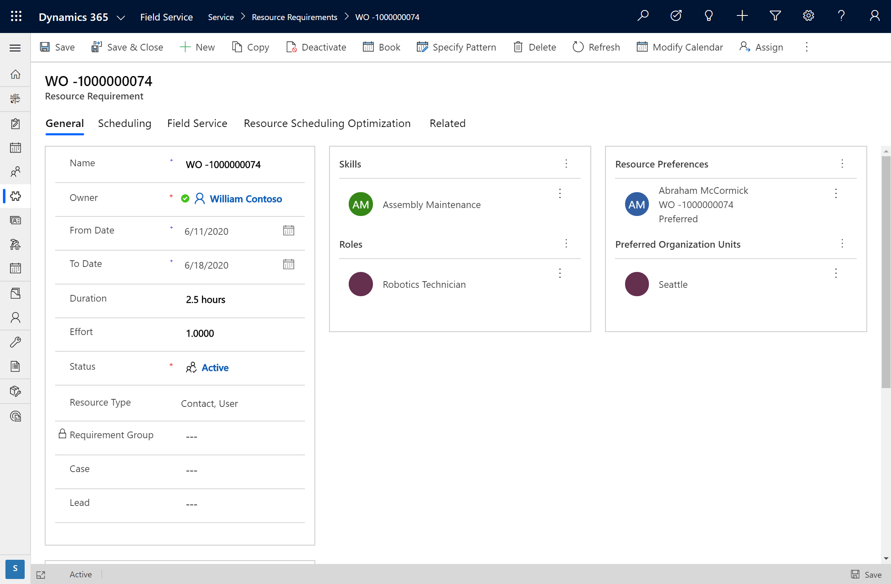

The schedule assistant uses these details on work orders and requirements to filter resources.

> [!div class="mx-imgBorder"]
> 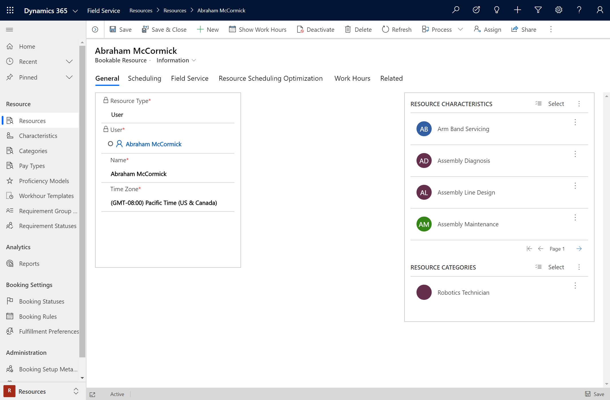

## Trigger schedule assistant

When your work order or requirement has relevant details and you're ready to schedule, there are a few ways to trigger the schedule assistant:

- Directly from the schedule board, as seen in the following screenshot:

> [!div class="mx-imgBorder"]
> 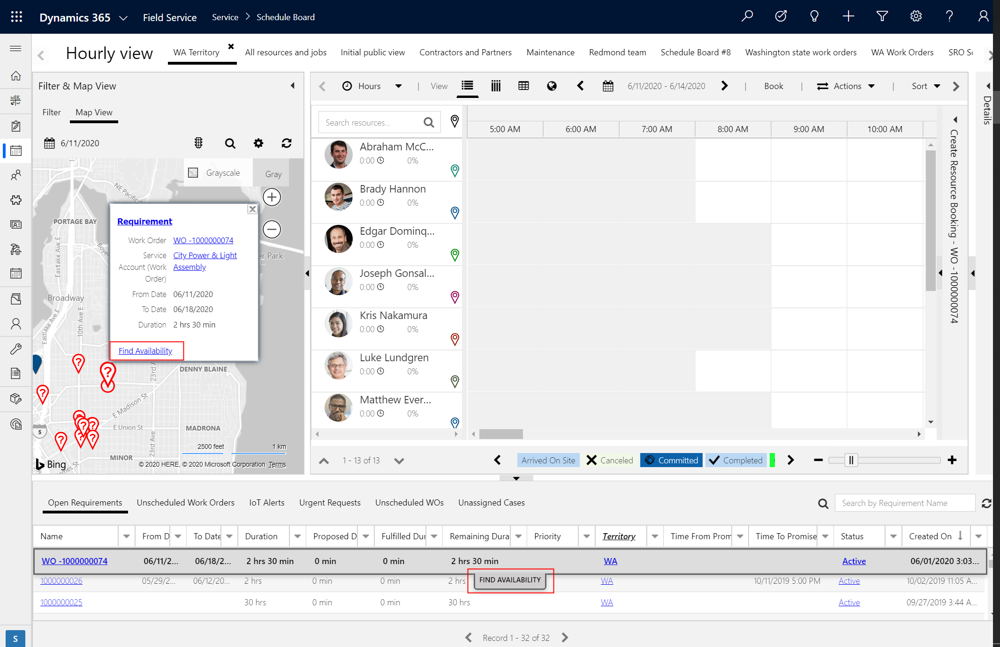

- From the top of the work order form
- From the top of the requirement form
- From the list after selecting a work order record
  
> [!div class="mx-imgBorder"]
> 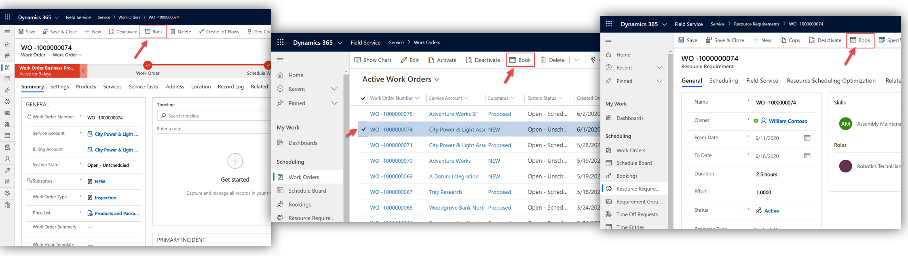

## Schedule assistant filters

Once the schedule assistant runs, the details from the work order and requirement are filters in the left pane. Dispatchers can fine-tune results by adjusting filters to meet their scheduling needs.

The filter pane includes work-related options, including:

- Work location
- Work start and end
- Characteristics
- Roles
- Territories
- Organizational units
- Resource types
- Resource pool types
- Preferred resources

> [!div class="mx-imgBorder"]
> 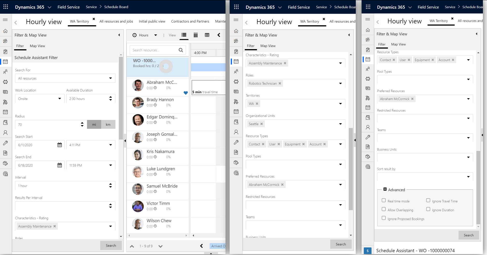

### Location

Based on both the locations of the work order and the bookable resource, the schedule assistant filters resources outside of the defined radius, and then shows estimated driving time for each resource.

> [!div class="mx-imgBorder"]
> 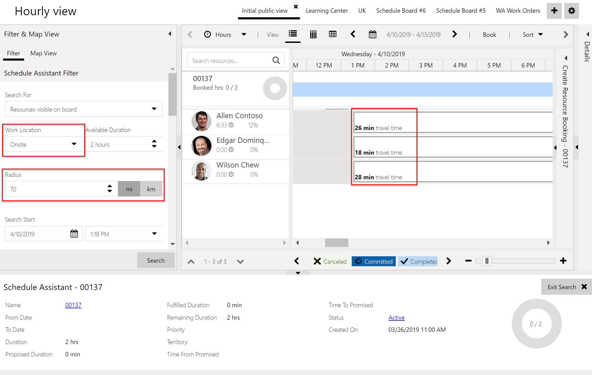

These same travel time estimates are shown in the grid view of the schedule assistant, as seen in the following screenshot.

> [!div class="mx-imgBorder"]
> 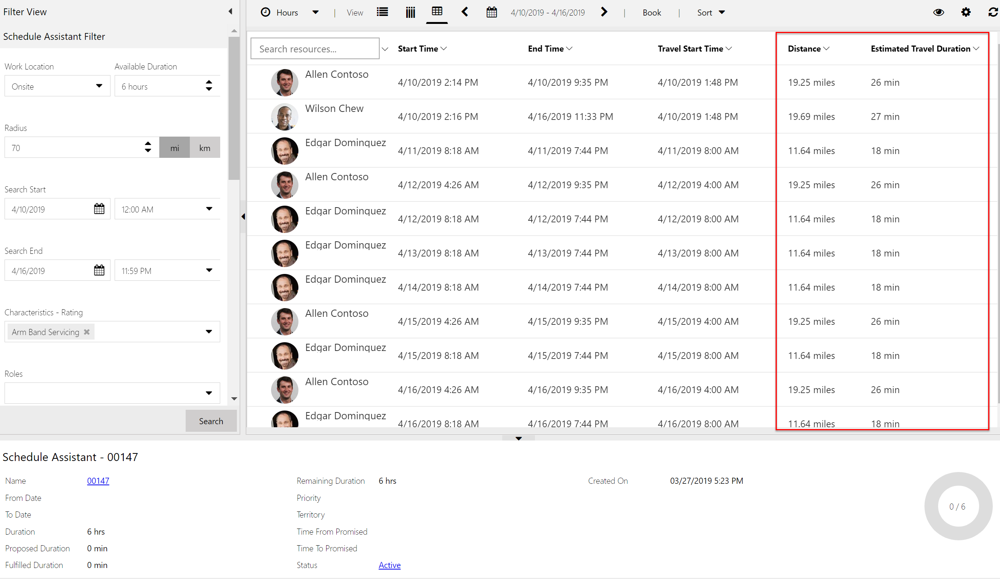

## Rescheduling work

Need to rebook work? From the schedule board, just right-click the booked work, and then **Rebook**. This will trigger the schedule assistant.

> [!div class="mx-imgBorder"]
> 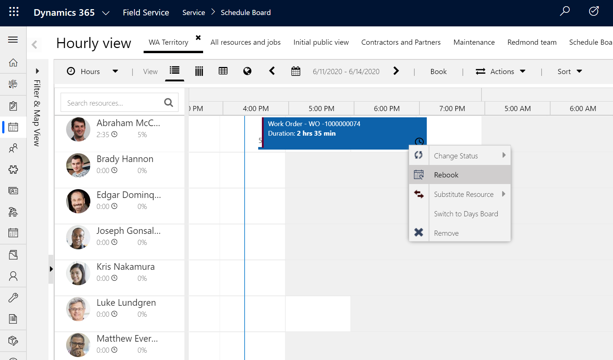

## Book the same work order again

You can also schedule the same job to multiple resources with the schedule assistant.

Trigger the schedule assistant for a given work order and book it to a resource's time slot; however, before exiting the search, select another resource's time slot and select **Book** again.

## Book entities other than work orders

You can book several other entity types via the schedule assistant - Dynamics 365 Sales leads, for example.

> [!div class="mx-imgBorder"]
> 

For more information, see the article on how to [enable an entity for scheduling](../../field-service/schedule-new-entity.md).

## Multi-resource scheduling (Requirement groups)

Need a group of resources to perform work? Use the schedule assistant to book multiple resources at once using requirement groups. Go to the Field Service app, then to **Requirement Groups**. 

> [!div class="mx-imgBorder"]
> 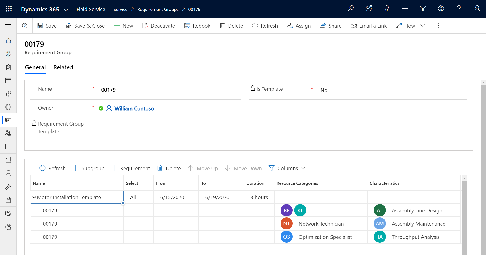

After using the grid format to create multiple requirements, select **Book** at the top of the form to trigger the schedule assistant.

The schedule assistant will find different combinations of resources that meet the different requirements and can all arrive at the job location at the same time.

> [!div class="mx-imgBorder"]
> 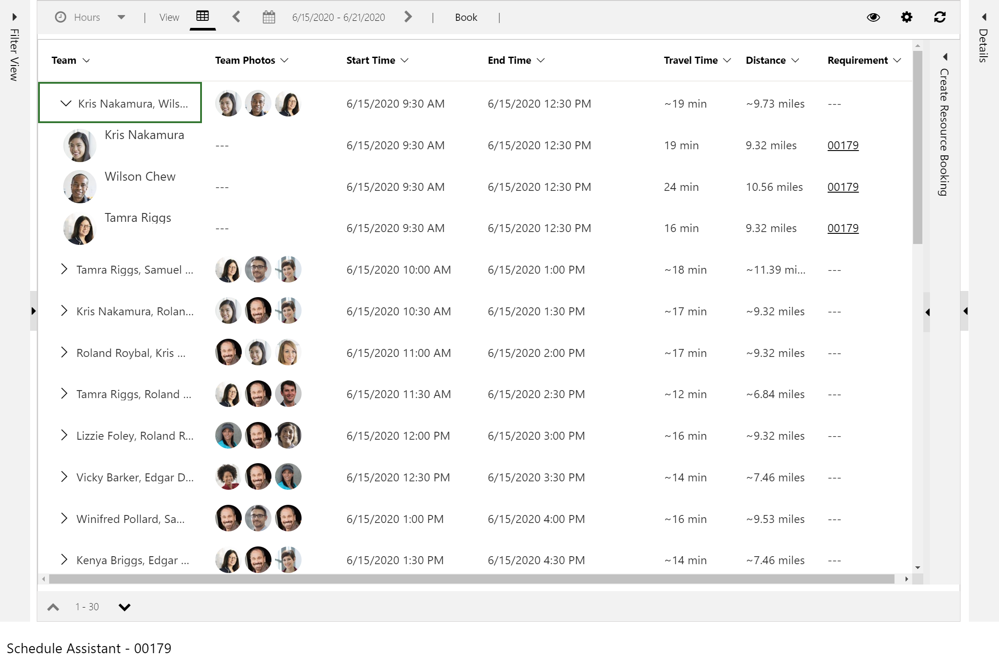

For more information on setting up requirement groups, see the article [Multi-resource scheduling with Requirement groups](../../field-service/multi-resource-scheduling-requirement-groups.md).

## Learn more about the schedule assistant

To learn more about the schedule assistant and the many ways it can be put to use, check out the following articles.

- [Schedule with travel time and distance](https://docs.microsoft.com/dynamics365/field-service/schedule-with-travel-time): Explore how travel time and distance are calculated and visualized for dispatchers during manual scheduling, semi-automated scheduling with the schedule assistant, and automated scheduling with Resource Scheduling Optimization (RSO)

- [Schedule within time constraints](https://docs.microsoft.com/dynamics365/field-service/schedule-time-constraints): When scheduling a work order, case, quote, or any entity enabled for scheduling, you can set date and time parameters to control when the requirement is booked.

- [Resource preferences](https://docs.microsoft.com/dynamics365/field-service/resource-preferences): Resource preferences allow dispatchers to give preference to specific resources over others when scheduling with the schedule assistant or resource scheduling optimization.

- [Quick scheduling in Field Service](https://docs.microsoft.com/dynamics365/field-service/quick-scheduling): Quick scheduling (sometimes referred to as "quick book") simplifies the schedule assistant experience to make scheduling easier and quicker.

- [Schedule work over multiple days](https://docs.microsoft.com/dynamics365/field-service/schedule-multi-day-work): Work orders and scheduling requirements can be scheduled across multiple days and weeks. This article explores a few common scenarios.

- [Resource crew scheduling](https://docs.microsoft.com/dynamics365/field-service/resource-crews): Resource crews allow dispatchers to search and schedule multiple resources at once. This can include a group of employees, subcontractors, equipment, facilities, or any combination thereof who will perform the same work during a period of time. This article walks through how to set up resource crews.

- [Resource pool scheduling](https://docs.microsoft.com/dynamics365/field-service/resource-pools): Resource pool scheduling allows you to assemble groups of similar resources to manage capacity and give schedulers the option to assign specific resources at a later time. This article walks through two common scenarios.

- [Facility scheduling](https://docs.microsoft.com/dynamics365/field-service/facility-scheduling): For scenarios where a customer is expected to travel to the company's location, the facility scheduling feature can coordinate physical spaces and related resources.

## Configuration considerations

### Time zone for schedule assistant search results

You can view and edit the time zone the schedule assistant's search results are displayed in by triggering the schedule assistant and selecting the gear icon in the top-right corner.

> [!div class="mx-imgBorder"]
> 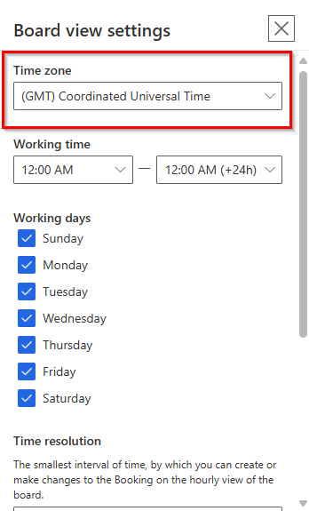

The time zone value is derived from the time zone on the requirement being scheduled. Go to the requirement, then **Modify Calendar** to view and edit the requirement time zone.

> [!div class="mx-imgBorder"]
> 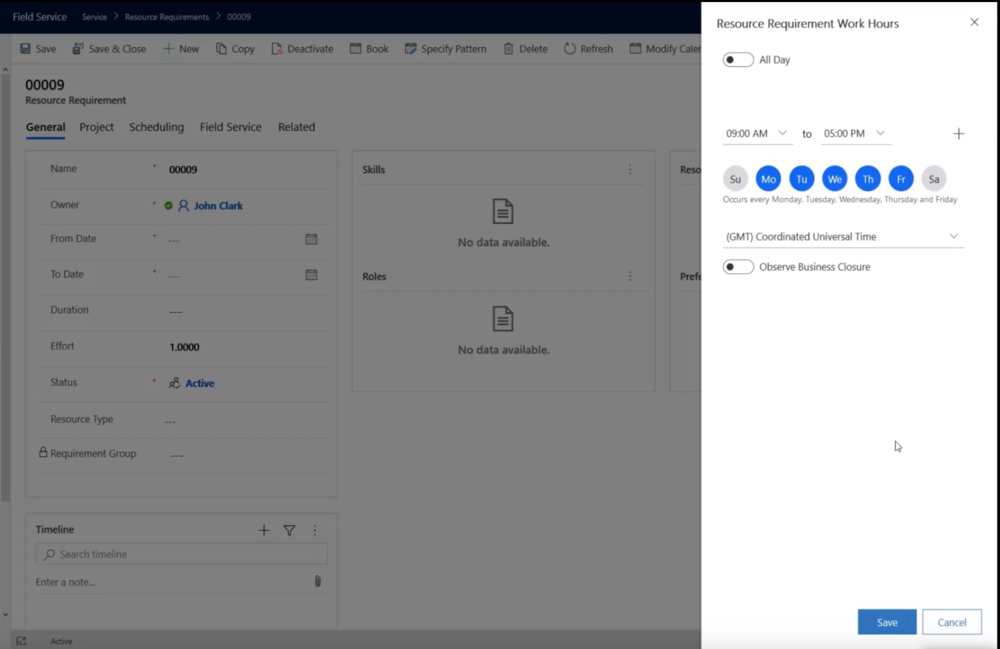

The requirement time zone is derived from the following values in the following order:

1. The time zone of the work hours template noted on both the requirement and the related work order, if applicable.
2. The time zone of the user that created the requirement (the owner). If the owner is changed, the time zone is not changed. The user's time zone is defined in **Personalization Settings**.
3. The time zone of the default schedule board tab of the system.

### Resource requirment deletion

When a resource requirement record is created, a calendar record is created. In Field Service **v8.8.40** or later, when a resource requirement is deleted, additional logic is added to check if the calendar is used by any of the Dynamics 365 out of the box entities; if the calendar is not used, then the calendar record is also deleted. A similar behavior is also put in place for the work hours templates. This deletion of the calendars improves the schedule assistant's performance. 
