Scheduler settings let you define the layout and functions of schedule board tabs.

There are two levels of settings for the schedule board. **Board view settings** contains a set of basic settings that mainly define the layout of a schedule board. Board settings contain more detailed settings and enable customizations.

## Board view settings

The board view settings show in a pane and apply only to the selected schedule board tab.

Open the **Schedule Board**, choose the tab to configure and select **Scheduler settings**.

:::image type="content" source="../../field-service/media/scheduler-settings.png" alt-text="Screenshot of the Board view settings pane on the Schedule Board.":::

- **Time Zone**: Sets the time zone that the schedule board uses. The times for bookings in different time zones adapt to the selection.
- **Time resolution**: Time intervals for the hourly view.
- **Row height**: Defines the height of resource rows.
- **Show canceled**: Shows or hides canceled bookings.

Select **All board settings** to see more settings.

## Board settings

Board settings are more detailed and let you define settings for a specific board tab and default settings that apply to all tabs. You can get to the board settings in two ways: 

- Select the vertical ellipsis &vellip; next to the schedule board tab name and choose **Board settings**.
- Open the **Scheduler settings** and select **All board settings**.

:::image type="content" source="../../field-service/media/schedule-board-tab-settings-access.png" alt-text="Screenshot of accessing schedule board tab settings.":::

When you access the schedule board tab settings, you'll see the following: 

- **Name:** This is the name displayed at the top of the schedule board.

- **Shared With:** Decides which users can view the schedule board tab
  - Everyone
  - Specific People: after choosing this option, you can select the specific people to share the schedule board with by doing an advanced find of the **Schedule Board Settings** entity and sharing the related schedule board record with the specific users.
  - Just Me

> [!Note]
> Users with **Field Service - Administrator**, **Field Service - Dispatcher**, and **Field Service - Resource** security roles can edit schedule board tab settings of schedule boards they create or are shared with them (meaning the **Shared With** field = **Everyone** or **Specific People** AND the schedule board is shared with their user record).

> [!div class="mx-imgBorder"]
> 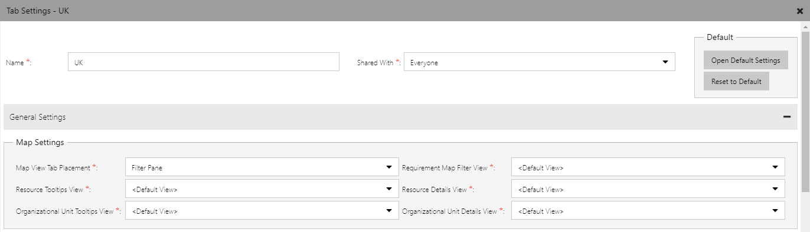


- **Open Default Settings:** Lets you choose the default tab settings when new schedule boards are created. When values in a particular schedule board tab setting show **< Default View >**, this means the value is coming from the default tab settings. As seen the following screenshot, when the **Open Default Settings** button is selected, the **< Default View >** values are replaced by the actual values and you are now editing default schedule board tab settings.


> [!div class="mx-imgBorder"]
> 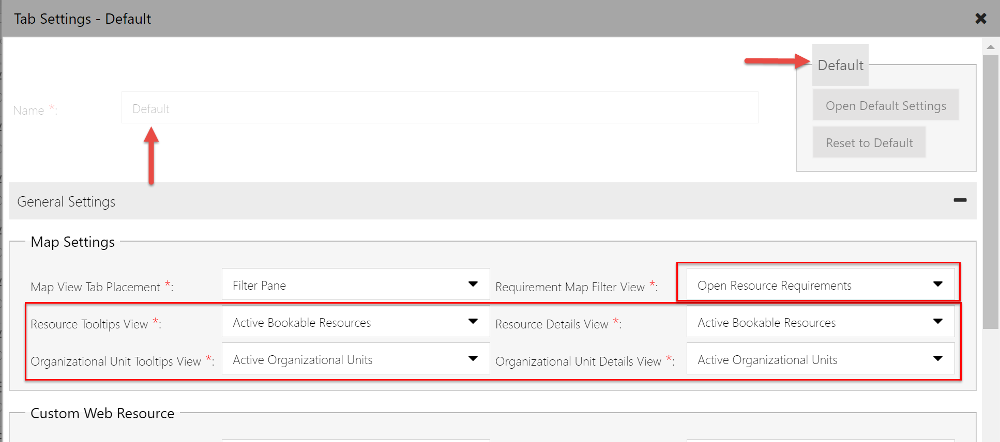

- **Reset to Default:** This will reset the current tab setting values to the values outlined in the default settings.

## Map settings

The **Map Settings** section is where you specify the placement of the map and the views displayed when selecting or hovering over map records.
 
### Map view tab placement

When set to **Filter Pane**, the map will be placed on the left-hand side. This allows schedulers to see both the map and the details of the selected record at the same time.

> [!div class="mx-imgBorder"]
> 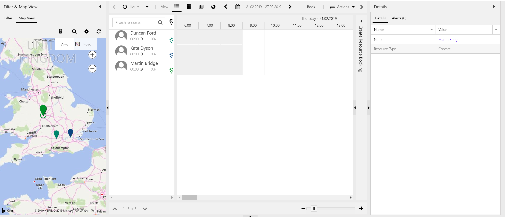
 
When set to **Details Pane**, the map will be placed on the right-hand side. This allows schedulers to see both the filter pane and the map at the same time. 
 
> [!div class="mx-imgBorder"]
> 
 
### Requirement map filter view

This view defines the resource requirement records displayed on the map. The setting lists public views related to the resource requirement entity for selection. Resource requirements must have a latitude and longitude to display it on the map. When a requirement with a valid latitude and longitude is selected, the corresponding pin will be shown on the map, provided the requirement selected is included in the selected requirement view for this setting **Requirement map filter view**. We strongly recommend making a copy of the default view and applying your changes to the copy.

### Resource tooltips view

This view defines the fields displayed in a tooltip that appears when a scheduler hovers over a resource map pin. The setting lists views that are based on the bookable resource entity; only public views are available for selection. Even though you can change existing views, it's better to copy the default view and apply changes to the copy.

> [!div class="mx-imgBorder"]
> 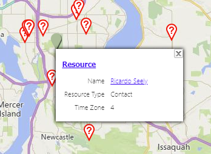

### Resource details view

This view defines the fields displayed in the details pane when a resource map pin is selected. The details pane is on the right-hand side of the schedule board and may need to be expanded. The setting lists public views related to the bookable resource entity for selection. 

> [!div class="mx-imgBorder"]
> 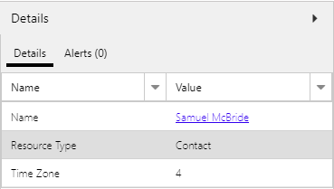


### Organizational unit tooltips view

This view defines the fields displayed in a tooltip that appears when a scheduler hovers over a organizational unit map pin. The setting lists public views related to the organizational unit entity for selection. Even though you can change existing views, it's better to copy the default view and apply changes to the copy.

> [!div class="mx-imgBorder"]
> 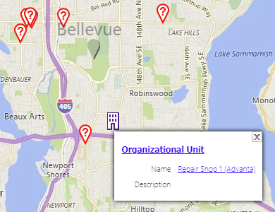


### Organizational unit details view

This view defines the fields displayed in the details pane when an organizational unit map pin is selected. The details pane is on the right-hand side of the schedule board and may have to be expanded. The setting lists public views related to the organizational unit entity for selection.
 
> [!div class="mx-imgBorder"]
> 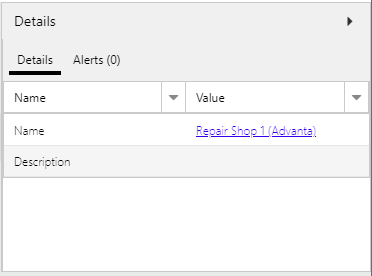
 

## Custom web resource

Web resources represent files that can be used to extend the Microsoft Dynamics 365 web application, such as HTML files, JavaScript, and Silverlight applications. This section allows you to access web resources from the schedule board, which can help dispatchers perform more functions and increase utilization. 

- **Tab Name:** the chosen web resource will be displayed in the details pane on the right-hand side of the schedule board. A new tab with the name entered here will appear next to the alerts tab. In the following example screenshot, "Web Resource" was entered for the tab name.

- **Web Resource:** select a web resource from your Dynamics 365 organization.

> [!div class="mx-imgBorder"]
> 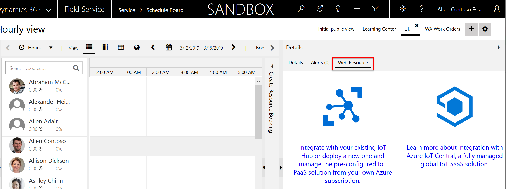

## Schedule board colors

The colors that represent a resource's utilization on the days, weeks, and months view of the schedule board are configurable here by entering HTML hex color codes. See an example of colors chosen and the effects in the following screenshot.  

> [!div class="mx-imgBorder"]
> 

To illustrate how these colors affect the schedule board, see the following example. In our example, we have a day view of the schedule board where each resource works 12 hours each day, and the range is 2 days. The colors are configured as follows:

- **Fully Booked:** Blue because the total booking duration (12 hours) equals the working hours for that particular resource's day.

- **Partially Booked:** Light Blue diagonal lines because the total booking duration (7 hours) is less than the working hours for that particular resource's day.

- **Overbooked:** Red because the total booking duration (14 hours) exceeds the working hours for that particular resource's day.

- **Not booked:** White because no bookings exist for that resource for that day.

> [!div class="mx-imgBorder"]
> 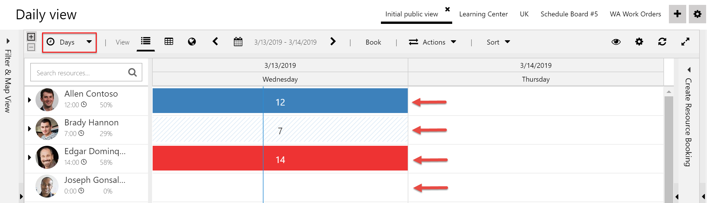

## Schedule assistant

### Search for

This setting decides the default value for the **Search For** field in the schedule assistant filter pane. 

- Set to **All resources** to search for all applicable resources in the system that meet the schedule assistant filters for the requirement. 

- Set to **Resources visible on board** to search for resources that meet the schedule assistant filters for that requirement *and* meet the current schedule board resource filters. This schedule assistant filter value can still be manually changed by the dispatcher at the time of scheduling. If a scheduler is responsible for a specific schedule board and specific resources, then we recommend **Resources visible on board** because this ensures the scheduler cannot schedule requirements to other resources they are not responsible for. 

  For smaller organizations or organizations with less rigid resource and line of business divisions, the **All resources** setting will allow schedulers to search across all applicable resources across the entire organization. 

### Unavailable resources 

This setting determines how unavailable resources appear when the schedule assistant is triggered from the **Find availability** function on the schedule board. 

- Set to **Unavailable resources do not appear** to ensure that resources who do not meet schedule assistant filter criteria are temporarily removed from the view of available resources. 

- Set to **Unavailable resources appear dimmed (when searching for resources visible on board)** to ensure that resources who do not meet schedule assistant filter criteria remain on the schedule board, but appear dimmed. For schedule boards with many resources, using the **Unavailable resources do not appear** setting can reduce the need to scroll and make it easier for scheduler to compare available resources. When the schedule assistant is opened, the **Search For** filter on the filter panel must be changed to **Resources visible on board** to see the unavailable resources, which appear dimmed. 

### Book based on 

Though booking an onsite requirement (typically a work order) will always have a total duration that equals travel time plus requirement duration, this setting changes the schedule assistant visualization to make it easier to understand when travel time starts and when the estimated arrival time is. 

- Set to **Start of Travel** to visualize the booking start as when travel begins. 
  
- Set to **Estimated Arrival** to visualize the booking start as when the resource is estimated to arrive on site. Consider whether the scheduler is communicating with the customer in real time; customers are typically more interested in when the resource will arrive at their location, so administrators should make it easier for the scheduler to communicate this time by selecting the **Estimated Arrival**. See this [blog post](https://blogs.msdn.microsoft.com/crm/2018/04/02/whats-new-in-universal-resource-scheduling-for-dynamics-365-april-2018-update/#BookbyETA) for more details.

### Available Color, Partially Available Color, Unavailable Color

The colors selected in the schedule assistant section represent how resource availability (or unavailability) appears when the schedule assistant is triggered from the days, weeks, or months view.  

> [!div class="mx-imgBorder"]
> 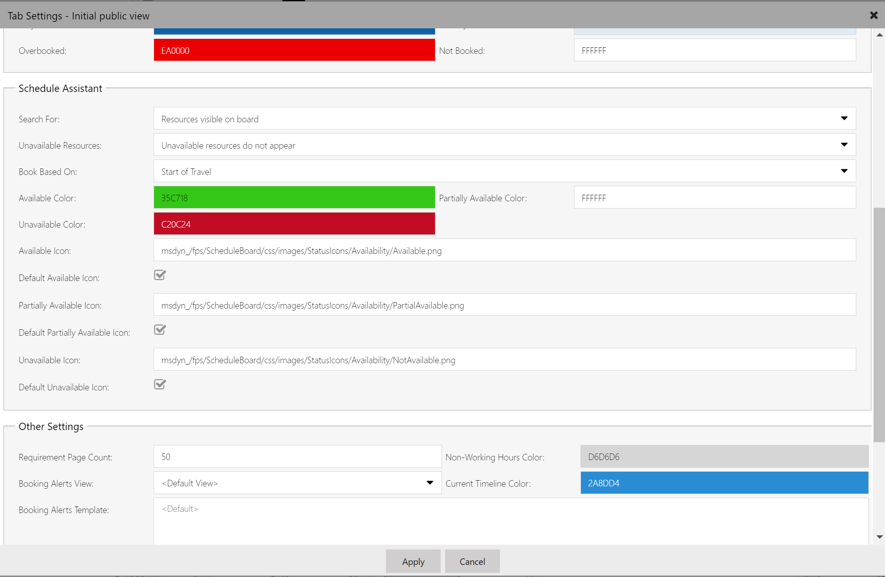

> [!div class="mx-imgBorder"]
> 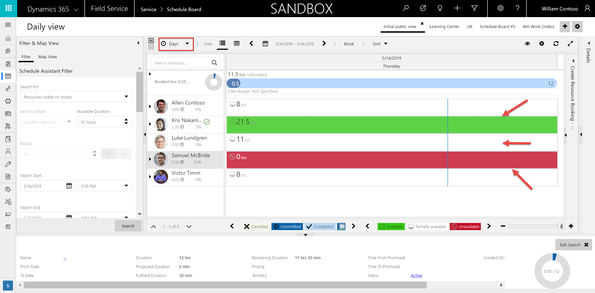

### Available Icon, Partially Available Icon, Unavailable Icon

The icons selected in the Schedule Assistant section also apply when the schedule assistant is triggered from the days, weeks, or months view and are displayed along with the colors chosen in the previous settings to represent if resources are available or unavailable. 

> [!div class="mx-imgBorder"]
> 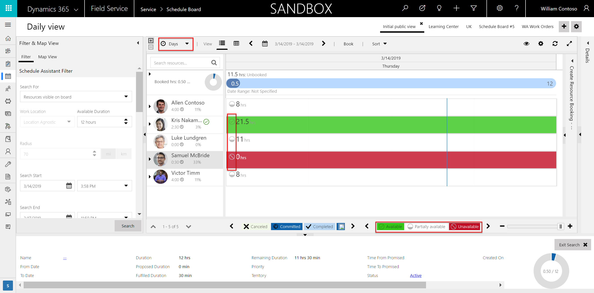

If the **Default Available Icon**, **Default Partially Available Icon**, or **Default Unavailable Icon** boxes are unchecked, then no icons will appear.

The icons can be customized by uploading new image files in **Customizations > Customize the System > Web Resources** and referencing the path in tab settings. 

## Other settings 

### Requirement Page Count

This controls the maximum number of resource requirement records displayed on a single page in the lower pane of the schedule board. See the following screenshot for reference.


> [!div class="mx-imgBorder"]
> 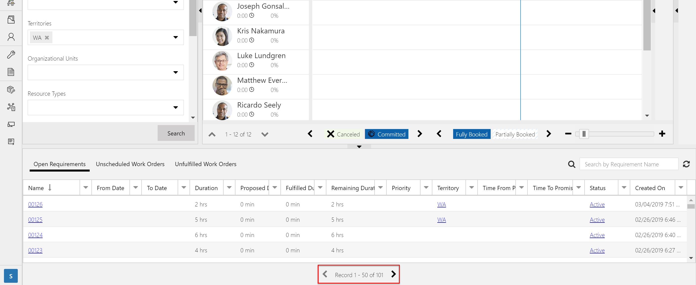

### Non-Working Hours Color

This controls the color of the shaded area when a resource is not working, as defined by the resource's working hours and time off requests.

> [!div class="mx-imgBorder"]
> 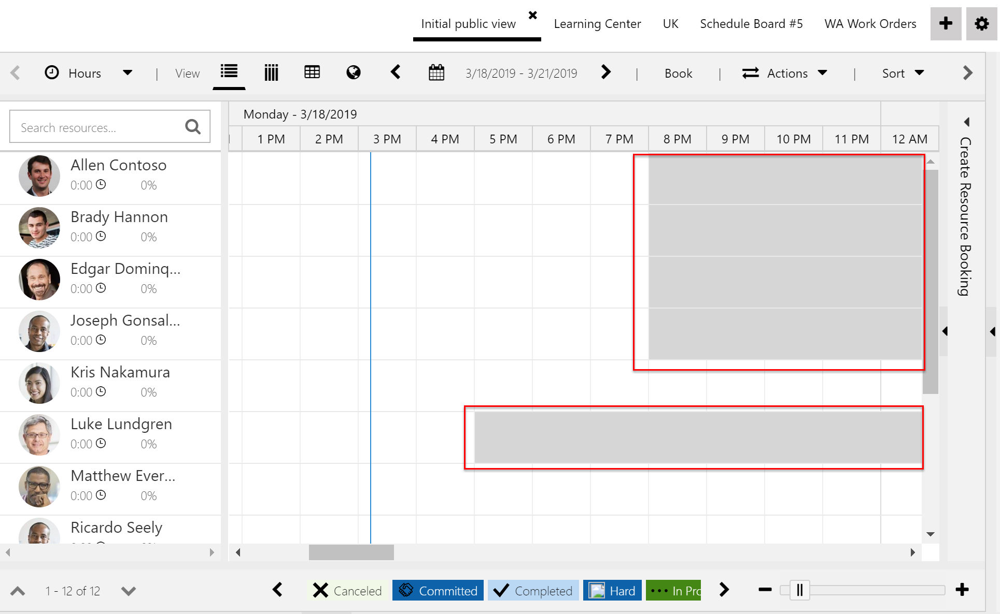

### Current Timeline Color

This controls the color of the vertical line that runs down the schedule board to indicate the current time of that particular schedule board.


> [!div class="mx-imgBorder"]
> 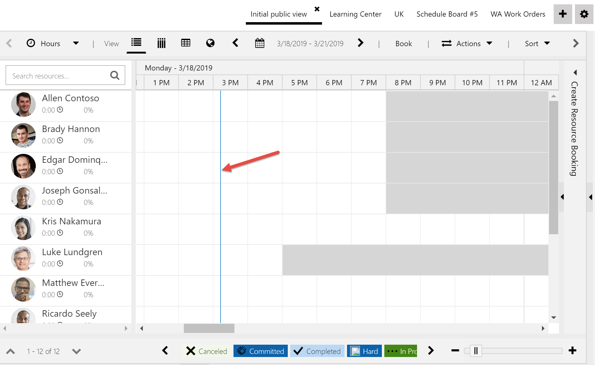

### Booking Alerts View

This is a system view that can filter which booking alerts records are eligible to show up in the Alerts view in the right-hand Details pane of the schedule board. 

For example, consider a scenario where the business has booking alerts being triggered based on events related to work orders, projects, and cases. What if the particular schedule board tab only deals with work order requirements and the dispatcher should only see booking alerts related to work orders? In this case, a booking alert system view can be used to filter to only booking alerts related to work orders to be eligible in the right-hand alerts pane. Note that booking alerts still need to be triggered based on an alarm or workflow, but the view chosen here can further filter. 


> [!div class="mx-imgBorder"]
> 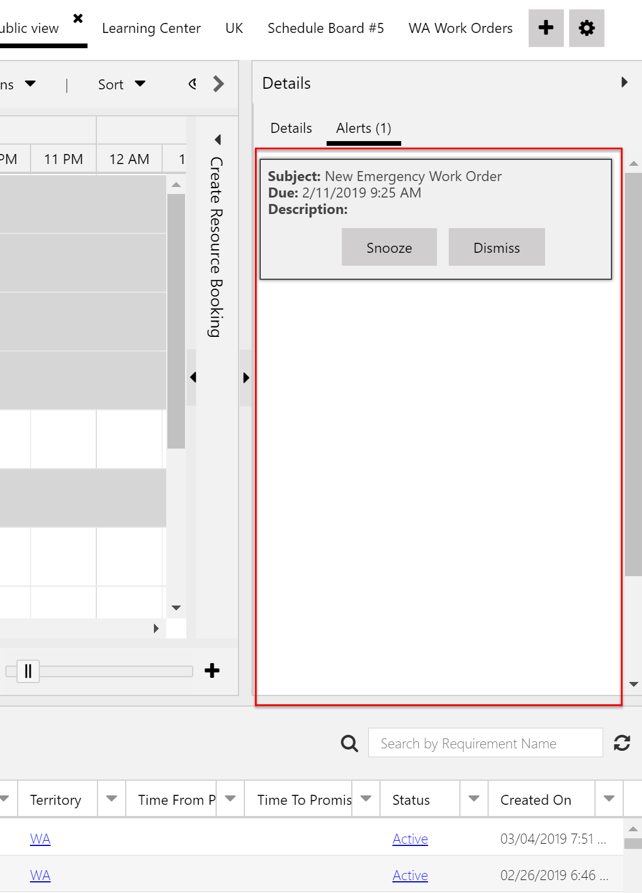

### Booking Alerts Template

Given a booking alert shows in the alerts pane, the HTML entered here dictates the fields in the alert box.

For reference, the default HTML is as follows:

```
    <b class="bold">Subject: </b>{msdyn_msdyn_bookingalert_msdyn_bookingalertstatus_BookingAlert.subject}<br />
    <b class="bold">Due: </b>{msdyn_nexttimetoshow}<br />
    <b class="bold">Description: </b><br />
    {msdyn_msdyn_bookingalert_msdyn_bookingalertstatus_BookingAlert.description}
```

> [!div class="mx-imgBorder"]
> 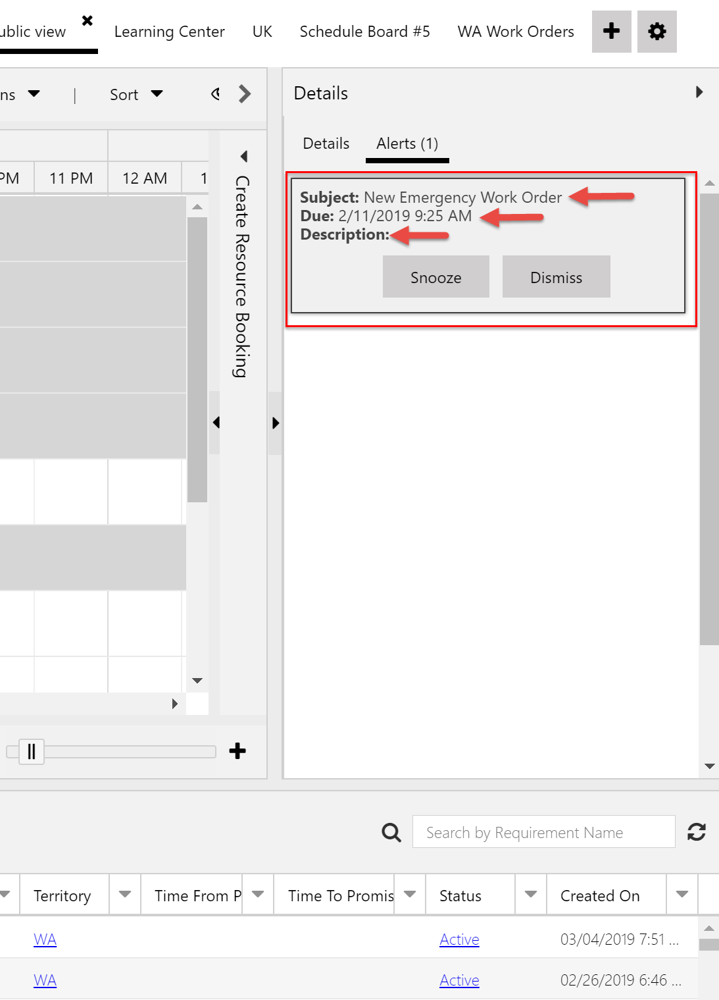

### Filter Layout

This controls the fields displayed in the filter pane on the left-hand side of the schedule board. These fields are used to filter which resources are displayed on the board.

> [!div class="mx-imgBorder"]
> 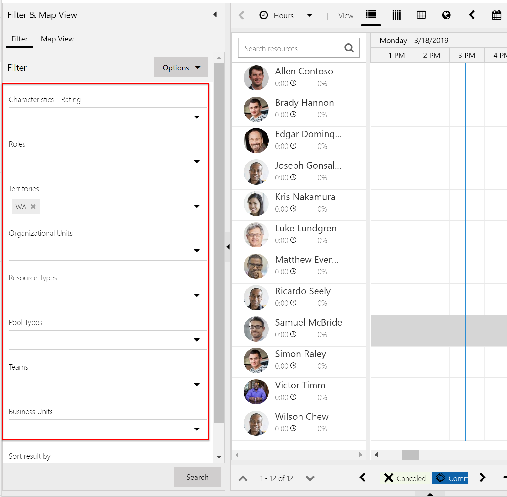

### Resource Cell Template

This controls the images, values, fields displayed in the box that holds the resource's name and utilization on the schedule board.

> [!div class="mx-imgBorder"]
> 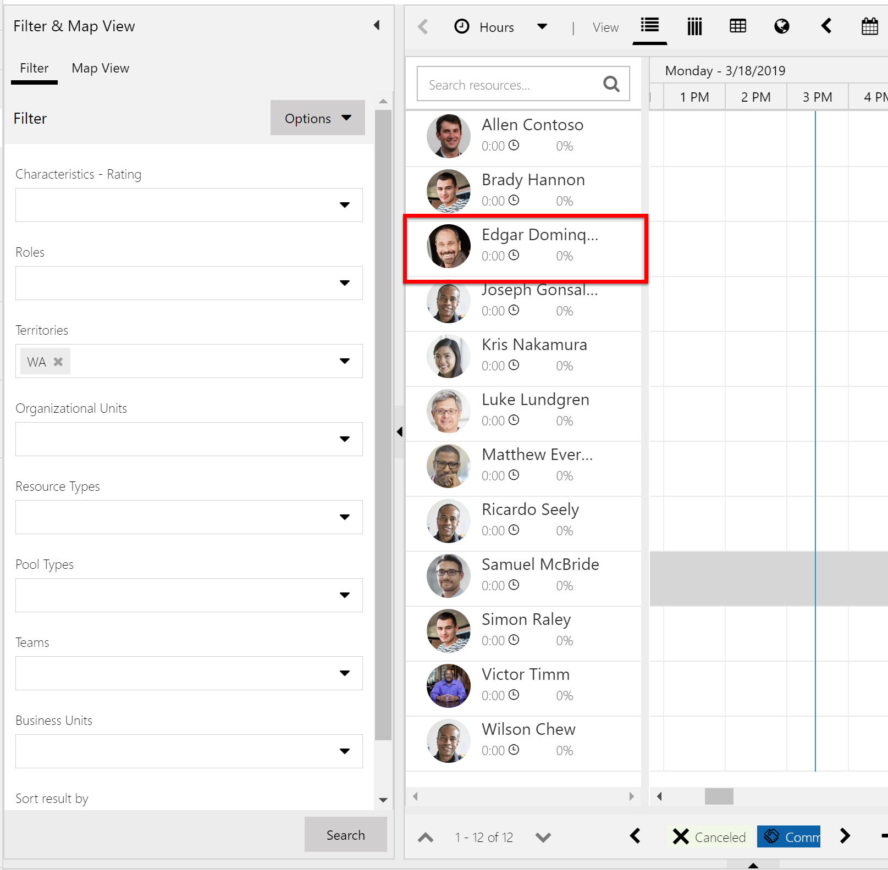

### Retrieve Resources Query

Here you will find XML that defines how resource records are fetched, filtered, and sorted when the schedule board loads. **Retrieve Resources Query** can use filter layout and resource cell templates to perform filtering and sorting in the background. 

One scenario this enables is filtering resources without having to expose the filter field in the filter layout. Instead, the filtering happens in the background as the schedule board loads, without additional input from the dispatcher. 


### Disable Default Extensions

Using the Schedule Board Client Extension framework, you can modify the CSS, add your own JavaScript files, and localize the schedule board. This means that you can change labels and wording on certain supported areas of the board. You can always exclude certain boards from inheriting client extensions applied to the default board by disabling default extensions on that board.

For more details on editing filter layouts, resource cell templates, and client extensions, see this [blog post](https://blogs.msdn.microsoft.com/crm/2017/10/16/blog-post-july-2017-update-for-field-service-and-project-service-automation-universal-resource-scheduling-part-1/) and [this topic on schedule board extensibility](/dynamics365/customer-engagement/common-scheduler/developer/extensibility-release-notes).

## Schedule types

The following settings are dependent on the entity being scheduled. Though requirement records are always scheduled, the requirement can be related to work orders, cases, custom entities, or related to nothing at all. First, select the schedulable entity on the left to edit the settings for when that entity is scheduled. Select **None** to edit default settings and the settings for when a requirement is scheduled by itself, unrelated to a work item such as work orders or projects. 

### Booking Tooltips View

Select the system view that dictates the fields displayed when hovering your mouse over a booking.

> [!div class="mx-imgBorder"]
> 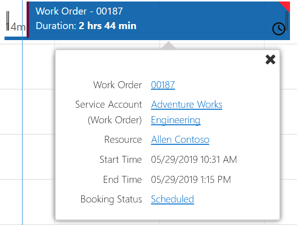

### Booking Details View

Select the system view that dictates the fields displayed in the details pane when a booking is selected.

> [!div class="mx-imgBorder"]
> 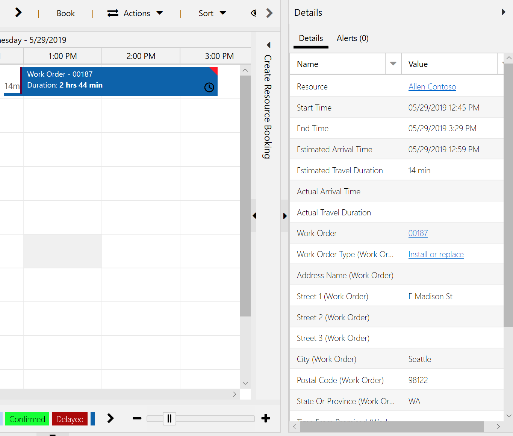

### Schedule Assistant Requirement View

Select the system view that dictates the fields displayed in the lower pane when the schedule assistant is triggered for an individual requirement from the schedule board.

> [!div class="mx-imgBorder"]
> 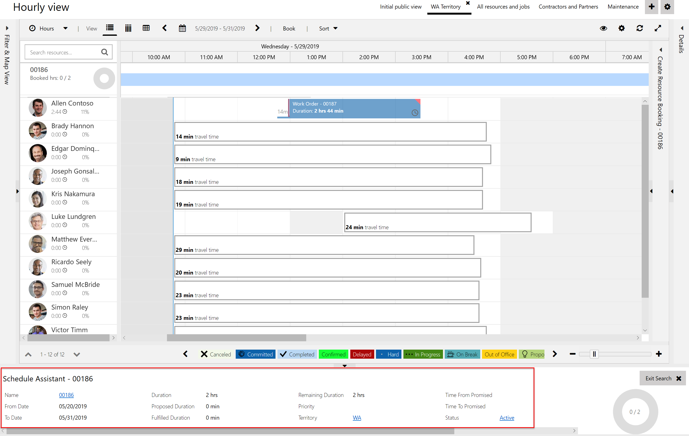

### Requirement Details View

Select the system view that dictates the fields displayed in the details pane when a requirement is selected in the lower pane of the schedule board.


> [!div class="mx-imgBorder"]
> 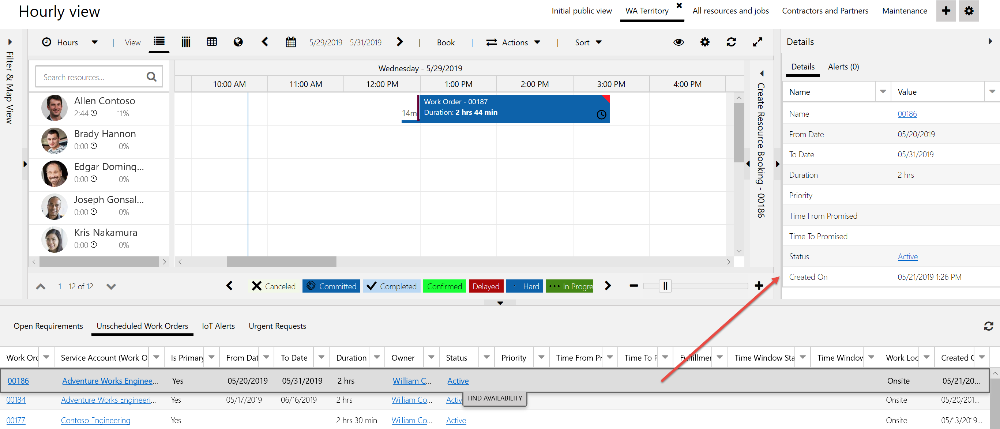

### Requirement Map Pin Tooltips View

Select the system view that dictates the fields displayed when hovering your cursor over a requirement map pin.

> [!div class="mx-imgBorder"]
> 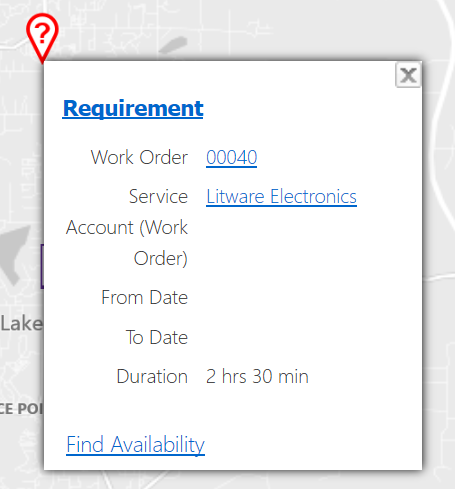

### Booking Template

HTML and CSS that controls the fields inside a booking time slot on the schedule board.

Here is the default work order HTML:

```
<div>{SchedulableEntityDisplayName} - {name}<br />Duration: <strong class="bold">{duration}</strong></div>
```

This HTML results in the following:

> [!div class="mx-imgBorder"]
> 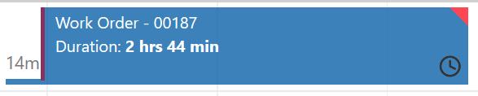


> [!Note]
> The following schedule types settings can only be edited from the default settings. 

### Schedule Assistant Filter Layout

This controls the fields displayed in the filter pane on the left-hand side of the schedule assistant. These fields are used to filter which resources are displayed in schedule assistant results. A common example is the default values for **Search Start** and **Search End**.


> [!div class="mx-imgBorder"]
> 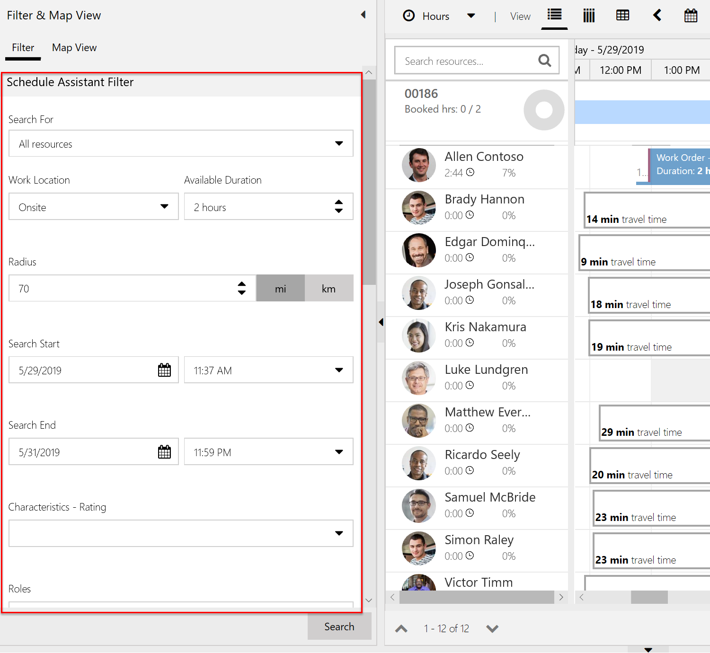

### Schedule Assistant Resource Cell Template

This controls the images, values, and fields displayed in the box that holds the resource's name and utilization in the schedule assistant.

### Schedule Assistant Retrieve Resources Query

Here you will find XML that defines how resource records are fetched, filtered, and sorted when the schedule assistant is triggered. **Schedule Assistant Retrieve Resources Query** can use schedule assistant filter layout and schedule assistant resource cell templates to perform filtering and sorting in the background. 

One scenario this enables is performing additional resource filtering when the schedule assistant is triggered without input from the dispatcher.

### Schedule Assistant Retrieve Constraints Query

Here you will find XML that defines how resource records are filtered based on attributes from the requirement. Whereas the **Schedule Assistant Retrieve Resources**  query can filter schedule assistant resources based on **Resource** attributes, the **Schedule Assistant Retrieve Constraints** query can use **Requirement** attributes to further filter resource results.

## Requirement Panels

Use this section to control the requirement views at the bottom of the schedule board. Select a requirement system view, enter a name, select the plus icon (+) to add it, then select Apply. After adding views, you can change the order in which they appear on the schedule board with the up and down arrows.

> [!div class="mx-imgBorder"]
> 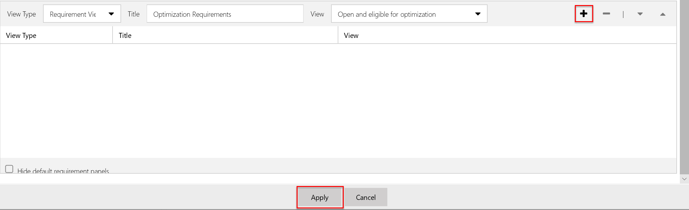

It will then appear in the lower panel.

> [!div class="mx-imgBorder"]
> 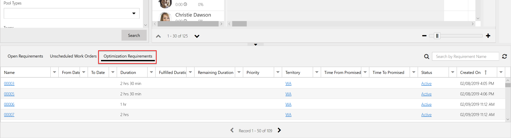

Field Service and Universal Resource Scheduling come with default requirement views such as "Open Requirements" and "Unscheduled Work Orders". Select the **Hide default requirement panels** to remove them from the lower pane. 

## Additional notes

Some of the extensible schedule board settings are only available on the hourly view, and not on the daily, weekly, and monthly views. The following configuration settings are only available in the hourly view: 

- Non-working hours color.
- Booking details view.
- Booking tooltips view.
- Booking template.
