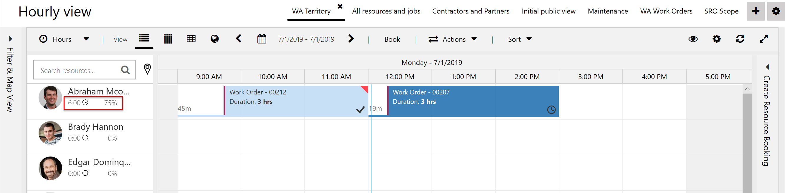
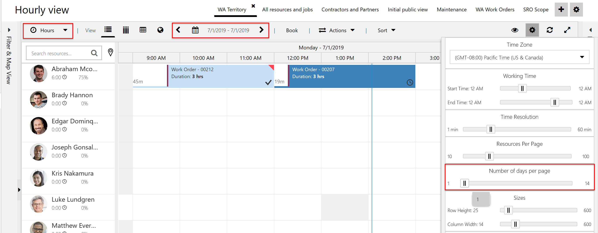
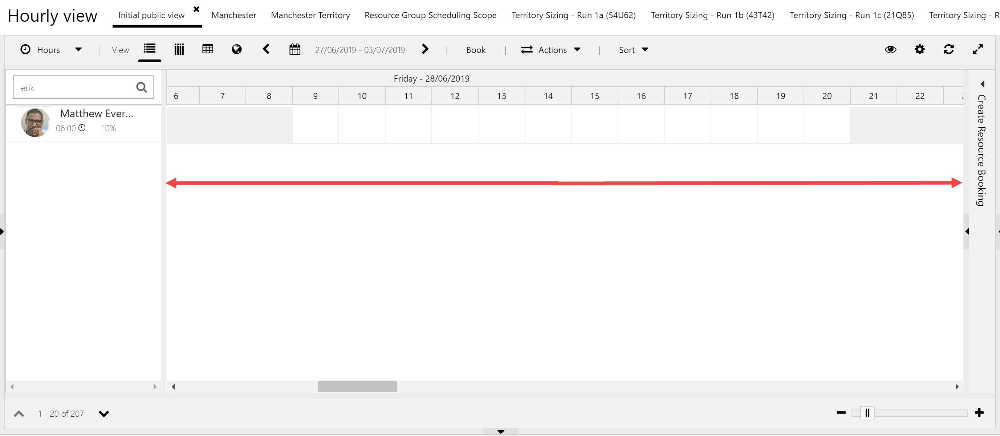
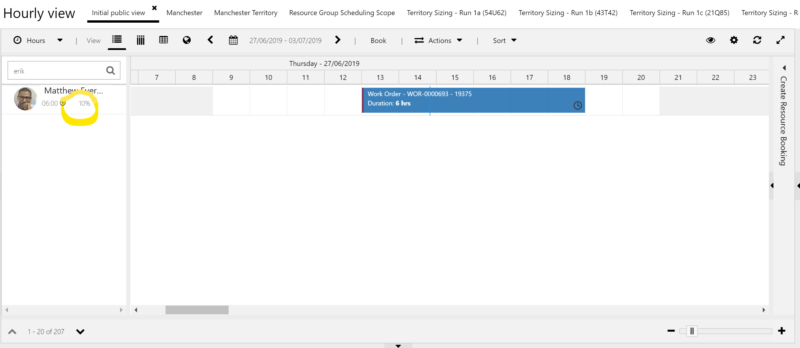
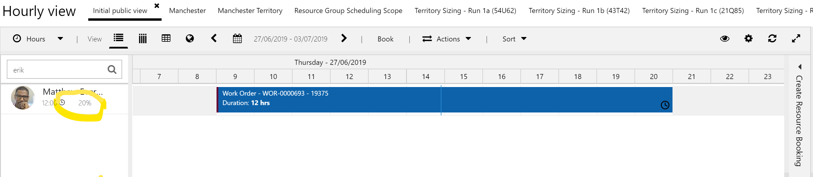
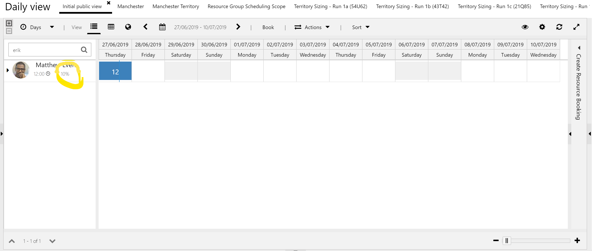
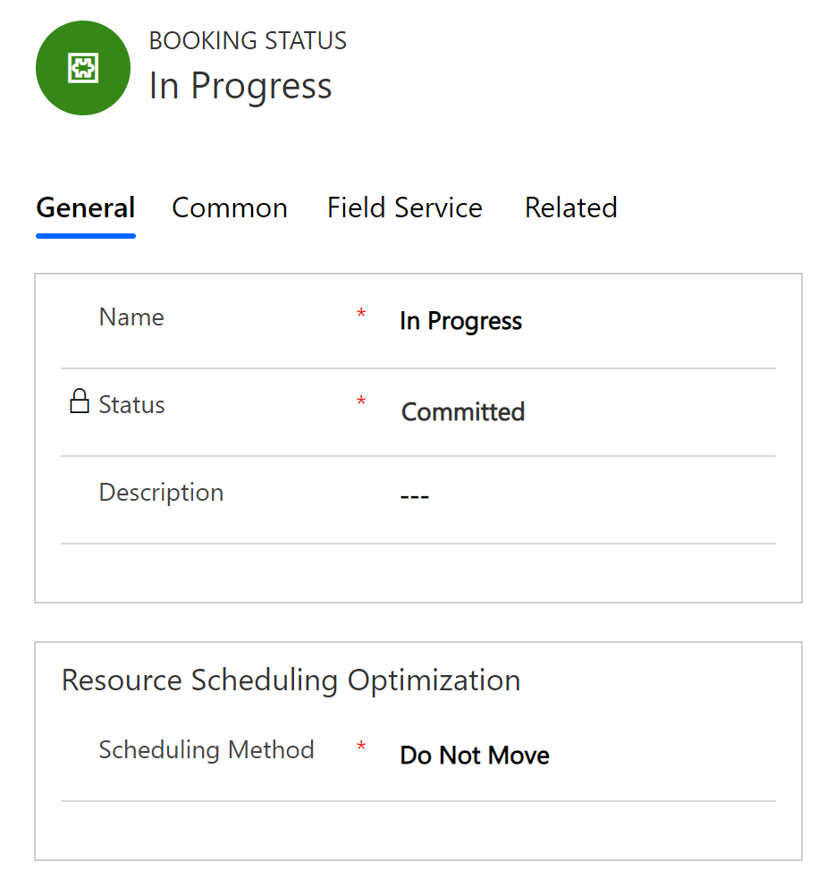
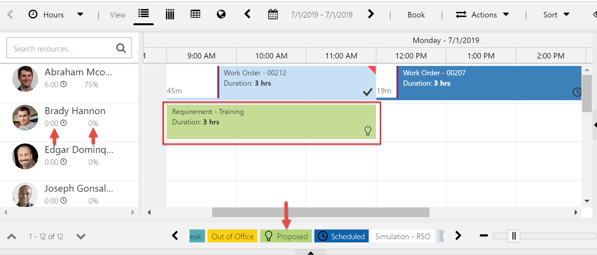
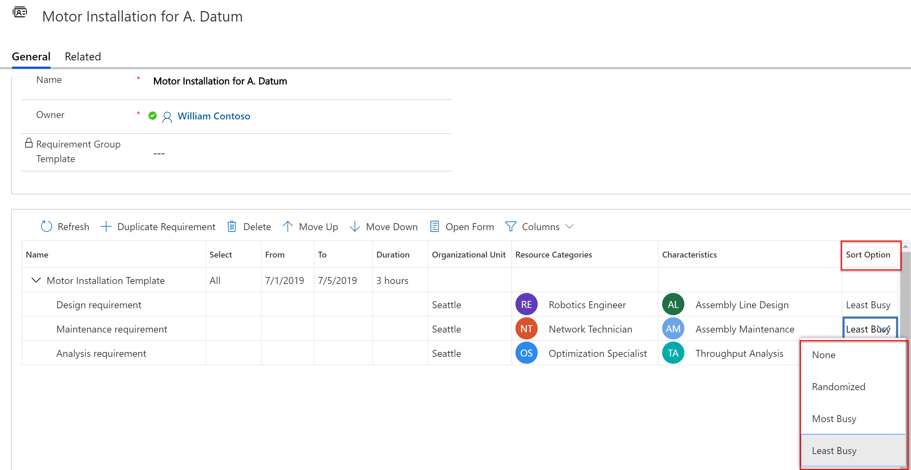

Dispatchers and service managers need to understand resource utilization to make better scheduling decisions, whether those decisions entail assigning work orders to field technicians or reserving equipment for customer jobs.  

Utilization is the amount of time a resource is scheduled to work. It is calculated as the percentage of booked time versus working hours. In all schedule board views, utilization is automatically calculated and displayed in each resource's cell.

> [!div class="mx-imgBorder"]
> 

In this topic, we will look at how resource utilization is calculated and displayed in both the **Hours** and **Days** views of the schedule board.

## Prerequisites

Utilization is calculated and displayed on the schedule board for all versions of Field Service.

## Hours view

For each resource, utilization percentage is derived from **Total Booked Hours** divided by **Total Working Hours** in the schedule board timeframe.

- **Total Booked Hours** is the sum of the hours booked to the resource.

- **Total Working Hours** is the sum of the resource's working hours.

> [!Note]
> Working hours are defined on each **Bookable Resource** record. Go to **Resource Scheduling** > **Resources**. See the topic on [setting up bookable resources](../../field-service/set-up-bookable-resources.md) for more details.

These values will change based on how many hours, days, and weeks you are viewing, and these are edited by selecting a view, a date range, and how many days to display.

> [!div class="mx-imgBorder"]
> 

This is because as you view more days, the bookings and working hours will vary. 

In the hourly view, the total working hours will be the sum of the hours seen on the schedule board as you scroll from the far left to the far right. 

> [!div class="mx-imgBorder"]
> 
 
In the previous screenshot example, Matthew works a **12-hour shift** from 9 AM to 9 PM, and this shift repeats for **5 days**. Users will see this as they scroll from left to right across the schedule board.

Therefore, Matthew’s total working hours in this hourly view are 12 multiplied by 5, resulting in 60 hours.

If Matthew is booked for a single 6-hour work order, then his utilization is 6 divided by 60, resulting in 10 percent, as shown in his resource card.
 
> [!div class="mx-imgBorder"]
> 

If the duration of the work order is increased to 12 hours, then his utilization is 12 divided by 60, resulting in 20 percent, as shown in the following screenshot.
 
> [!div class="mx-imgBorder"]
> 

## Days view

In the **Days** view, the total working hours will be the sum of the hours seen on the schedule board.

In our example case, we see 10 days, so Matthew’s total working hours are 12 multiplied by 10, resulting in 120 hours.

Matthew already has a 12-hour booking for one day, so his utilization percentage becomes 12 divided by 120, resulting in 10 percent.
 
> [!div class="mx-imgBorder"]
> 

## Configuration considerations

### Proposed and canceled bookings do not contribute to utilization

Though the field service process uses many field service booking statuses such as traveling, in progress, on break, and completed, each of those relate to a booking status of either **Committed**, **Proposed**, or **Canceled**. The purpose of a proposed status is to suggest work that needs to be confirmed, while the canceled status is used to notify stakeholders that the booking is no longer scheduled. 

For example, the **In Progress** status is categorized as **Committed** through the status field on the booking status entity, as seen in the following screenshot.

> [!div class="mx-imgBorder"]
> 

Bookings that have a **Proposed** or **Canceled** booking status are ignored for utilization. 

As seen in the following example, Brady was assigned a **Proposed** booking, but his utilization remained at 0 percent.

> [!div class="mx-imgBorder"]
> 

### Sort schedule assistant results by utilization

When using the schedule assistant to book requirement groups, dispatchers have the option to sort results by utilization.

> [!div class="mx-imgBorder"]
> 
