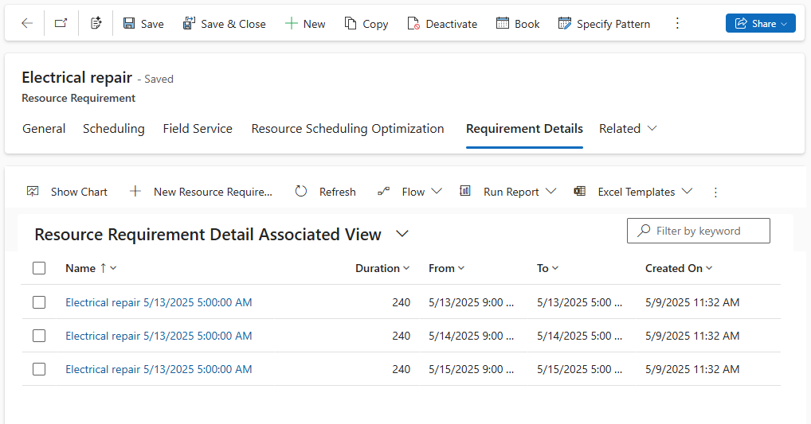

Requirements can be scheduled across multiple days and weeks. Dispatchers can schedule multi-day work in between existing bookings, by double-booking existing schedules, or as a continuous block of time.

> [!TIP]
> If the work you wish to schedule spans multiple weeks or has dependencies on previous steps and milestones, consider using [Dynamics 365 Project Service with Gantt chart functionality](/dynamics365/project-operations/psa/schedule-project-work-breakdown-structure).

## Schedule a multi-day requirement manually on the schedule board

Manually scheduling a multi-day requirement on the schedule board allows you to choose the allocation method to determine the breakdown of the bookings created when scheduling. If you are using requirement details to define the allocation method, manually scheduling the requirement will ignore them. Use the [schedule assistant](#schedule-a-multi-day-requirement-with-the-schedule-assistant) instead.

1. Open the schedule board on the hourly view and select a multi-day requirement in the requirements pane.

2. Then, select a resource on the board for which you would like to schedule the multi-day work order requirement and select **Book**.

    :::image type="content" source="../../field-service/media/scheduling-board-multi-day-booking.png" alt-text="Screenshot of the scheduling board with a multi-day requirement.":::

    > [!CAUTION]
    > Don't drag and drop multi-day requirement to a resource on the hourly board view. It will create a long continuous booking through non-working hours.

3. In the **Create Booking** pane, review and update the values as needed. Choose the **Booking Method** to define how to spread the requirement over multiple days.

    - Full Capacity: Books the resource’s full capacity for the specified from and to dates without regard to the resource's remaining capacity or the duration of the requirement.
    - Remaining Capacity: Books the resource’s available capacity within the specified date range.
    - Percentage Capacity: Books the resource for a percentage of capacity for the specified from and to dates.
    - Evenly Distribute Hours: Books the resource for a specified number of hours, distributing the time evenly per day over the specified from and to dates.
    - Front Load Hours: Books the resource for a specified number of hours, front-loading the per-day hours over the specified from and to dates. The front load method considers existing bookings and available capacity.
    - Fixed Time: Books the resource regardless of working hours for the time frame you define when creating the booking.

    > [!NOTE]
    > Full Capacity, Percentage Capacity, Evenly Distribute Hours, and Fixed time can lead to overbooking.

4. Select **Book** and the system creates multiple bookings across multiple days.

## Schedule a multi-day requirement with the schedule assistant

> [!NOTE]
> This scenario schedules a requirement without a related work order. To schedule a multi-day work order with the schedule assistant, you'll need to manually add a related requirement with an allocation method to a schedulable entity and delete or disregard the automatically created ones. Alternatively, you can manually create requirement detail records with **Specify Pattern** for the auto-created requirement. The requirement needs an allocation method set before saving and the requirements that are automatically created by schedulable entities have an allocation method of **None** by default.

1. Create a multi-day requirement record with an allocation method set. Provide details such as skills, roles, resource preferences, and service territory to define the eligible resources.

1. On the requirement records, go to **Related** > **Requirement Details**.

   The system automatically creates requirement details and splits them into segments based on the duration and the allocation method. The requirement details are based on the requirement's calendar. Edit them by selecting **Modify Calendar** on the resource requirement record.

   > [!div class="mx-imgBorder"]
   > 

1. Select **Book** to launch the schedule assistant for the multi-day requirement.

Resources with availability and that meet the other attributes will show as results. Choose a resource, the dates, and select **Book** to create multiple bookings according to the pattern of the allocation method.

## Schedule a multi-day requirement to multiple resources

1. From a multi-day resource requirement, go to **Related** > **Requirement Details** and select **Specify Pattern**. Edit and override the requirement details pattern created by the allocation method.

1. Select **Book**.

1. Choose a resource and specific days for just that resource, then select **Book** (*not* **Book & Exit**).

1. Then, choose another resource and specific days for only that resource and select **Book** again.

1. The system creates bookings for each resource on the days selected.

> [!NOTE]
>
> - Resources don't need continuous availability in a single block. For example, if the requirement is a resource for five hours in a day, resources with five total hours of availability show in schedule assistant results.
>
> - The system can't schedule requirement groups for multiple days.

### Next steps

- [Allocation methods](/dynamics365/project-operations/psa/FAQ-allocation-methods)
- [Multi-resource scheduling](../../field-service/multi-resource-scheduling-requirement-groups.md)
