Work orders and scheduling requirements can be scheduled across multiple days and weeks. A common example is scheduling a 40-hour work order across an entire work week where the field technician is expected to perform more detailed work at the same location each day. 

Dispatchers can schedule multi-day work in between existing bookings, by double-booking existing schedules, or as a continuous block of time. 

When scheduling multi-day work orders or requirements, dispatchers can choose an allocation method that dictates how the duration is split up throughout the days and weeks.

Allocation methods include: 

- Full capacity
- Percentage capacity
- Distribute evenly
- Front load

For more information, see the topic on [allocation methods](https://docs.microsoft.com/dynamics365/customer-engagement/project-service/faq-allocation-methods).

Let's explore multi-day scheduling and allocation methods by configuring 3 scenarios:

1. Schedule a 30-hour installation work order manually from the schedule board.

2. Schedule a 30-hour requirement with the schedule assistant.

3. Schedule and divide a 30-hour requirement among 2 resources with the schedule assistant.

## Prerequisites

If the work you wish to schedule spans multiple weeks or has dependencies on previous steps and milestones, consider using Dynamics 365 Project Service, which has [Gantt chart functionality](https://docs.microsoft.com/dynamics365/customer-engagement/project-service/schedule-project-work-breakdown-structure). 

## Scenario 1: Schedule a multi-day work order manually on the schedule board

Create a work order with a duration longer than 1 day. 

This can be done in the following ways:

- Adding a primary incident type with a long duration (in the following screenshot, 1.25 days = 30 hours).
- Adding multiple incident types where the sum of each incident duration adds up to more than 1 day.
- Not adding any incident types but entering a duration on the related resource requirement after the work order is created and saved.

> [!div class="mx-imgBorder"]
> 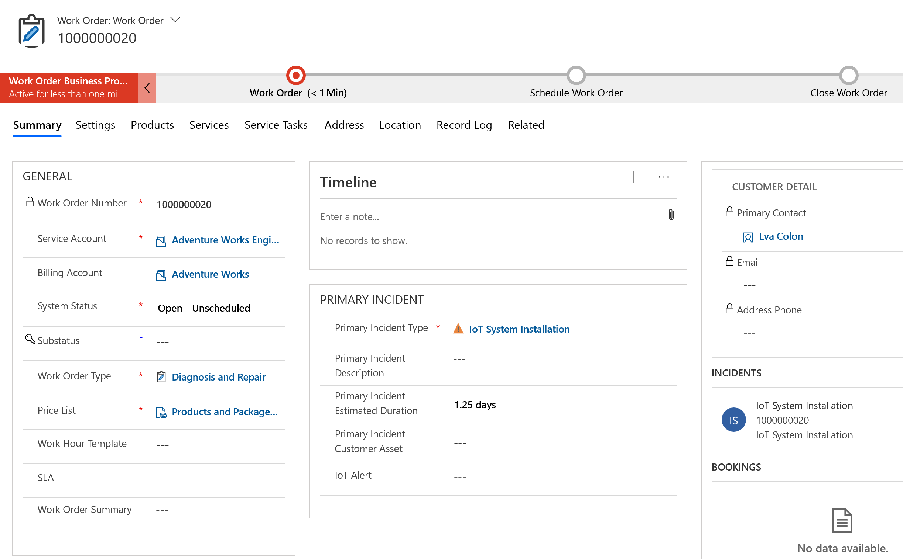

After the work order is saved, a resource requirement is automatically created. Access it by going to **Related** > **Requirement** from the work order section menu. 

If you have not done so, enter a multi-day duration in the **Duration** field, along with **From Date** and **To Date**, which describes the date range the multi-day work should be spread across. 

> [!div class="mx-imgBorder"]
> 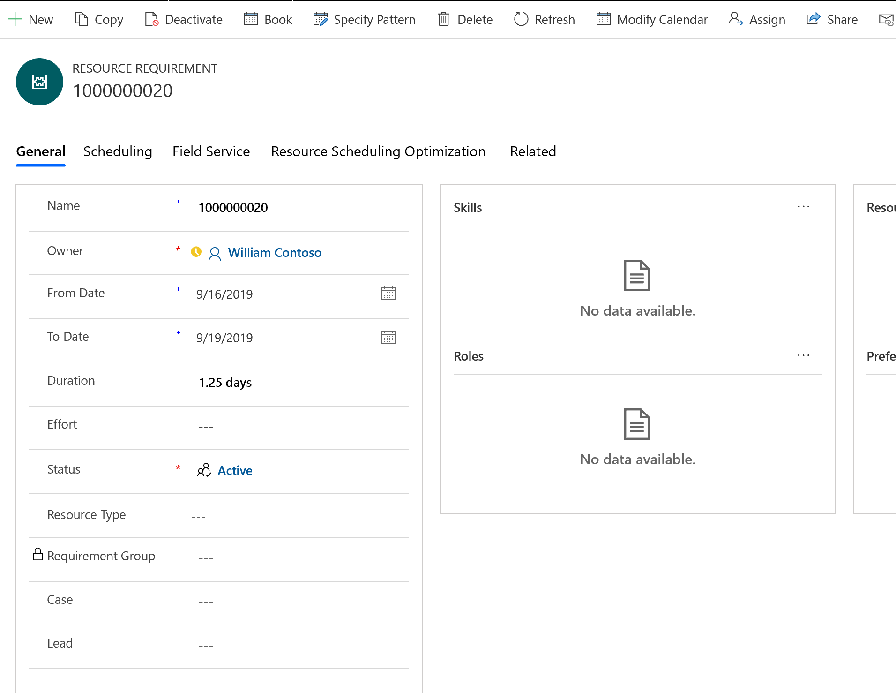

The requirement **From Date** and **To Date** will populate with the **Date Window Start** and **Date Window End** work order field values.

Next, go to the **Hours** view of the schedule board and select the multi-day work order requirement in the lower pane.

Then select a resource on the board for which you would like to schedule the multi-day work order requirement. Do not drag and drop.

> [!Note]
> Dragging and dropping a multi-day requirement onto the Hours view will create a long continuous booking through non-working hours.

A **Create Resource Booking** pane will display on the right where you can confirm or edit:

- **Start Date and End Date**: populated from the requirement's **From Date** and **To Date** fields.

- **Booking Status**: Work order requirements are typically given a booking status of **Scheduled** by default but you can choose from your organization's statuses here.

- **Booking Method**: Select the **Allocation Method** to define the pattern of how the requirement should be spread across the start and end dates. 

> [!div class="mx-imgBorder"]
> 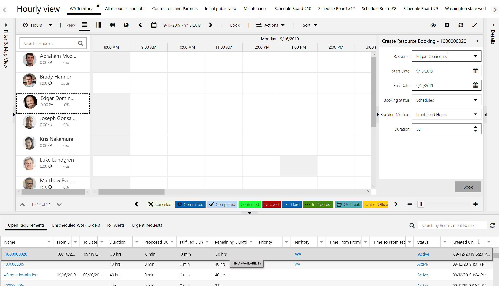

After selecting **Book**, the system will create multiple bookings across multiple days.

> [!div class="mx-imgBorder"]
> 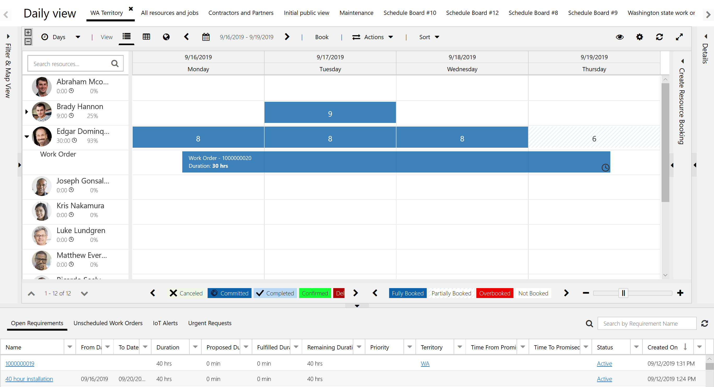

On the **Days** view of the schedule board, you can more easily see the booking pattern. In our example, we chose **Front Load Hours** as our booking method, so the bookings filled the resource's available time with the leftover duration on the last day. 

> [!Note]
> Using **Front Load Hours** as the booking method creates multiple bookings *around* the resource's existing schedule in instances where other bookings exist for the scheduled resource.

> [!div class="mx-imgBorder"]
> 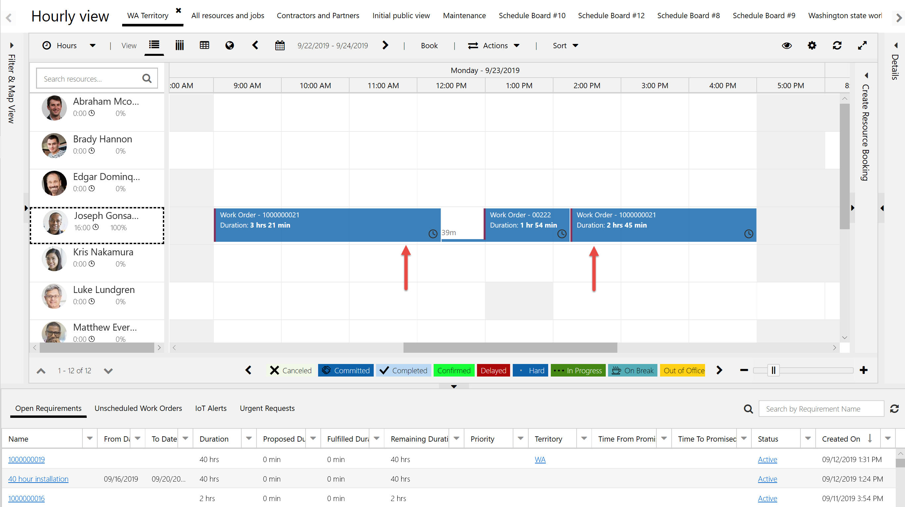

Dragging and dropping a multi-day requirement on the **Days** view will trigger the **Create Resource Booking** side panel to schedule multi-day bookings like above.

> [!div class="mx-imgBorder"]
> 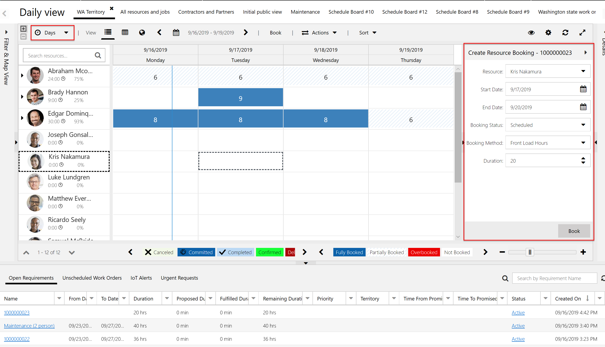

## Scenario 2: Schedule a multi-day requirement with the schedule assistant

Unlike the previous scenario, rather than starting by creating a work order, we will start by creating a resource requirement.

Go to **Resource Scheduling** > **Resource Requirements** > **+New**.

Enter a **Name**.

The **From Date** and **To Date** fields represent the date range the multi-day requirement should be spread across.

For **Allocation Method**, select one of the following:

- Full capacity
- Percentage capacity
- Distribute evenly
- Front load

For more details on each of these, see the topic on [Allocation methods](https://docs.microsoft.com/dynamics365/customer-engagement/project-service/faq-allocation-methods).

> [!Note]
> You need to set an allocation method before saving.

For **Duration**, enter a multi-day duration. In our example, it's 30 hours.

**Save**.

> [!div class="mx-imgBorder"]
> 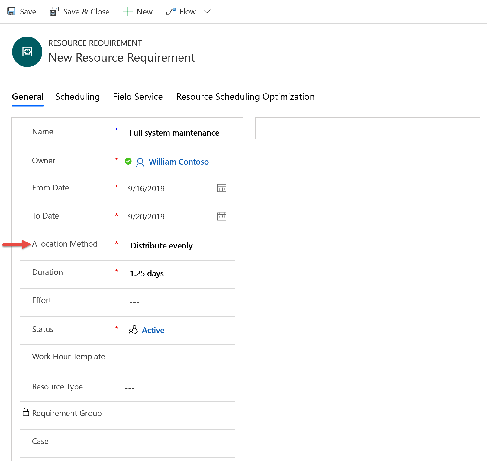

Next, enter other requirement details such as skills, roles, resource preferences, and service territory. These will help define the eligible resources.

> [!div class="mx-imgBorder"]
> 

From the newly created requirement, go to **Related** > **Requirement Details**.

Requirement details are automatically created to split up the requirement into time segments and are based on the duration and the allocation method. In our example in the following screenshot, a 30-hour requirement split up between 5 days is 6 hours, or 360 minutes each day.  

> [!div class="mx-imgBorder"]
> 

The requirement details are based on the requirement's calendar, which you can edit by selecting **Modify Calendar** in the top ribbon of the requirement.

> [!div class="mx-imgBorder"]
> 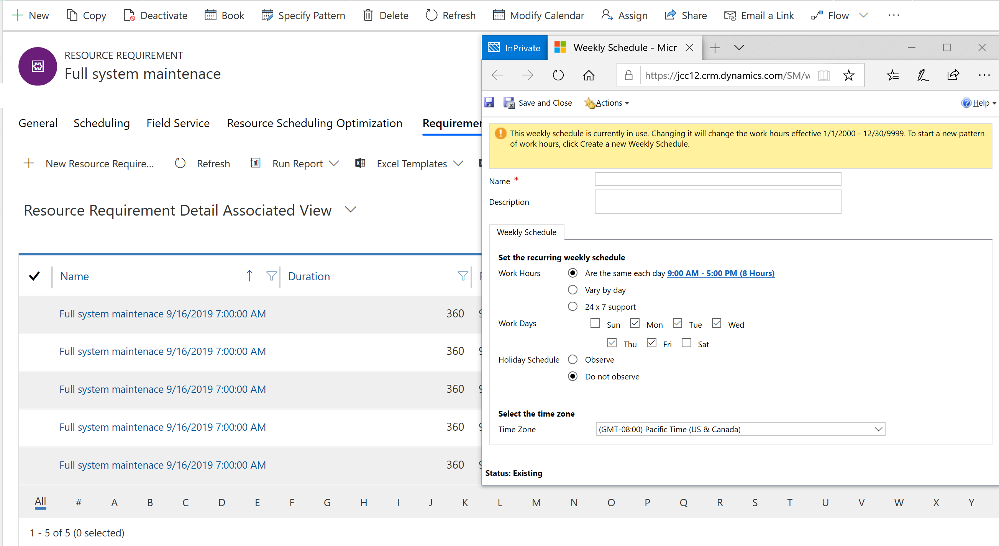

Then select **Book** to trigger the schedule assistant for this multi-day requirement.

Resources with availability and that meet the other attributes will show as results. Simply select a resource, the dates, and then **Book**. This will create multiple bookings across the date range according to the pattern of the allocation method.

> [!div class="mx-imgBorder"]
> 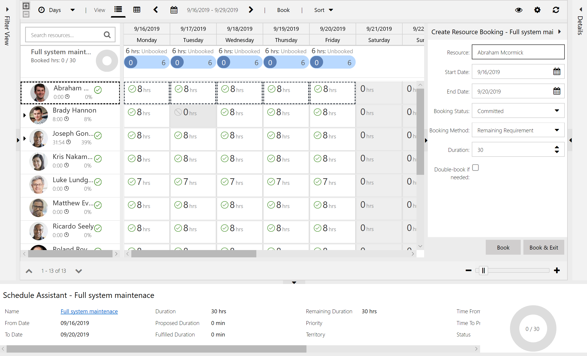

Once booked, you'll see the resource's availability decrease and the fulfilled duration increase. In our example, 30 hours of duration were fulfilled, 6 of 6 hours booked each day; and the resource's 8 hours of availability was reduced to 2 hours each day.

> [!div class="mx-imgBorder"]
> 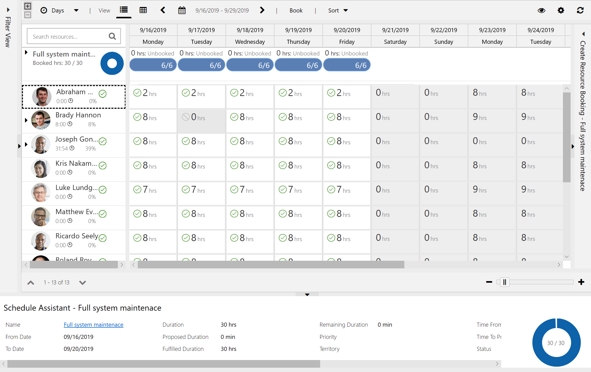

> [!Note]
> This scenario scheduled a requirement without a related work order. To schedule a multi-day work order with the schedule assistant, you'll need to manually add a related requirement with an allocation method to a work order and delete or disregard the automatically created one. Alternatively, you can manually create requirement detail records with **Specify Pattern** for the auto-created requirement. This is because you need to set an allocation method before saving and the requirements that are automatically created by work orders have an allocation method of **None** by default. 

## Scenario 3: Schedule a multi-day requirement to multiple resources

Like scenario 2, you'll first need to manually create a multi-day requirement. The requirement can exist on its own or be related to a work order.

> [!div class="mx-imgBorder"]
> 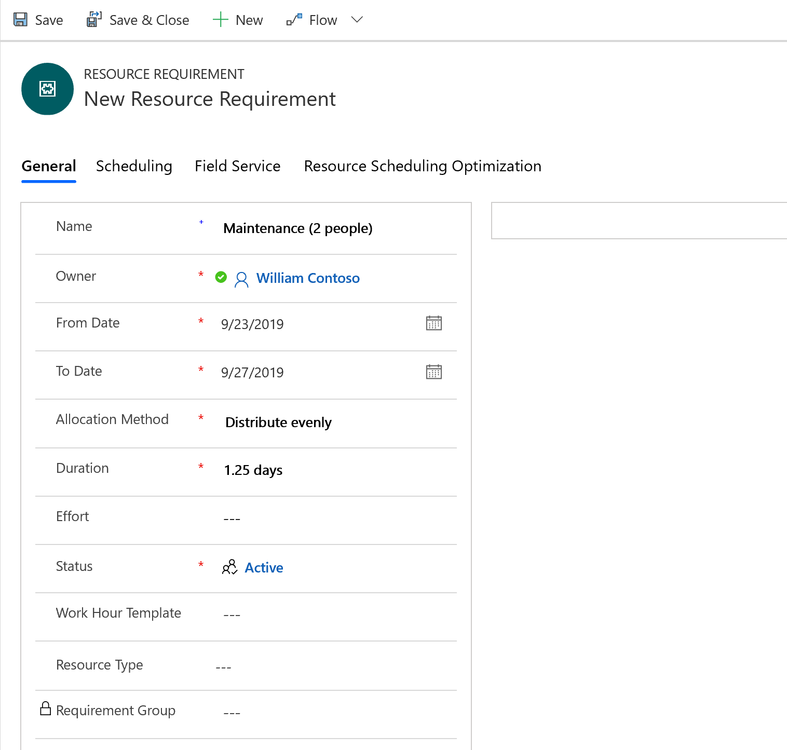

From the newly created requirement, go to **Related** > **Requirement Details** then choose **Specify Pattern** from the top ribbon. 

This allows you to edit and override the requirement details pattern created by the allocation method.

> [!div class="mx-imgBorder"]
> 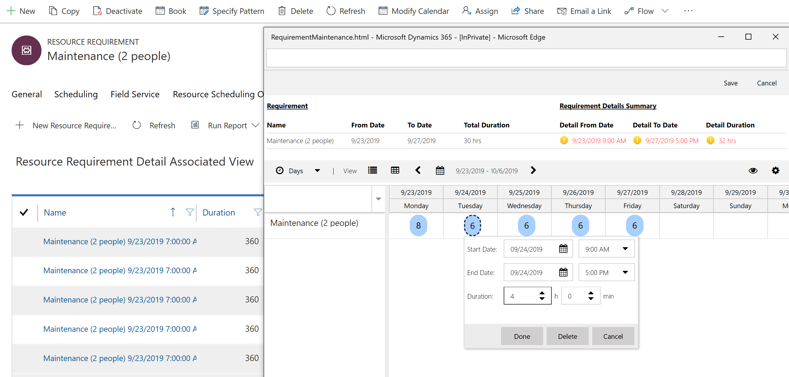

Select **Book**.

Select a resource and specific days for just that resource, then choose **Book** (*not* **Book & Exit**, as that will close the schedule assistant)

> [!div class="mx-imgBorder"]
> 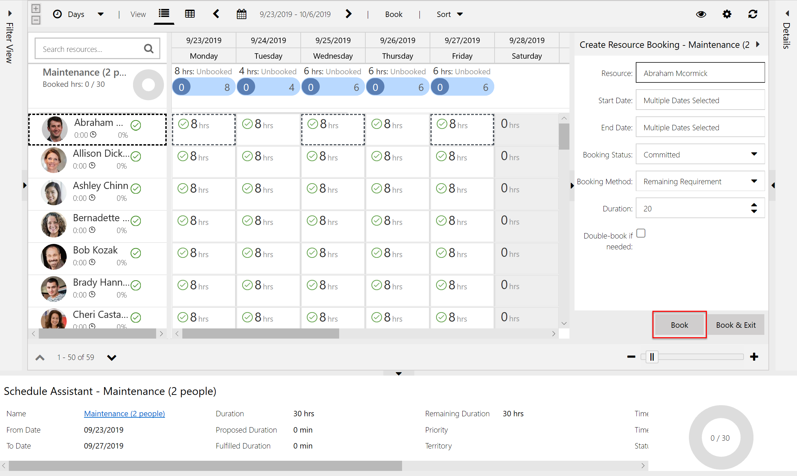

Then choose another resource and specific days for only that resource. Then choose **Book** again.

> [!div class="mx-imgBorder"]
> 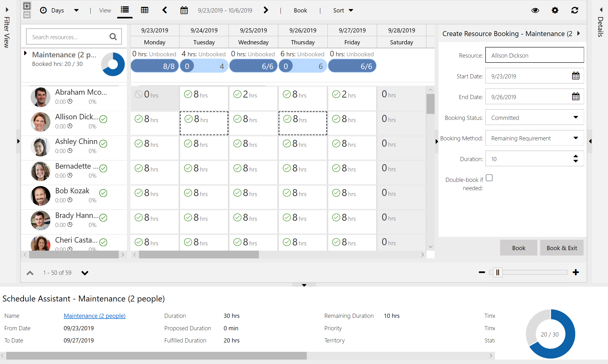

Bookings are created for each resource on the days selected. Availability for each scheduled resource is updated as well.

> [!div class="mx-imgBorder"]
> 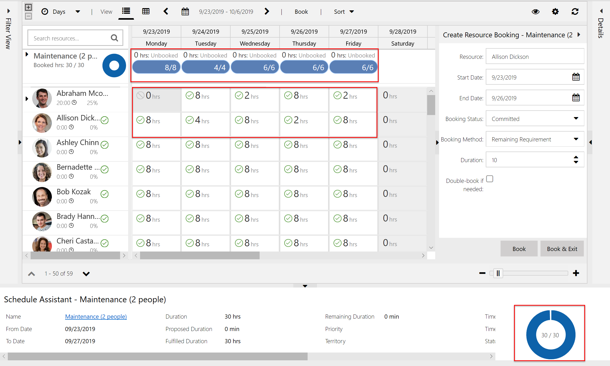

## Configuration considerations

- Each requirement has its own calendar that you can view and edit from the **Modify Calendar** option in the top ribbon menu. The calendar is important because it allows you to edit the time zone of the requirement and how the schedule assistant results should be displayed. 

> [!div class="mx-imgBorder"]
> 

- The Booking Methods **Full Capacity**, **Percent Capacity**, and **Remaining Capacity** reflect the Bookable Resource's working hours calendar. For example, if the Bookable Resource's working hours calendar is 9:00 AM - 5:00 PM, Monday - Friday, and you select **Full Capacity** as the allocation method, it will assume **Full Capacity** means the total time of the resource's calendar (which can be less than the requirement duration).
- Availability does not need to be continuous. For example, if a dispatcher needs to schedule a resource for 4 hours one day, that resource will show as available as long as there is 4 total hours of availability, not necessarily in a single block. 
- You can manually create requirement details as needed to schedule multi-day work according to a custom pattern. 
- You cannot schedule more hours than are available in a defined week. For example, if the calendar is 9:00 AM - 5:00 PM, Monday - Friday, which equates to 40 hours per week, you cannot schedule more than 40 hours in one week. This would have to be done manually.
- Front load versus full capacity allocation methods: Front load will schedule around existing bookings, and full capacity will schedule in addition to existing bookings, overbooking as needed.

## Additional notes
- Requirement groups cannot be scheduled for multiple days. 
- The schedule assistant will filter available resources for multi-day work by their location, but travel time will not be calculated and added to the resulting bookings.
- As you book requirements, multi-day or otherwise, the system tracks fulfilled duration and remaining duration. These field values compare total booked time with the duration of the requirement. 

### See also

- [Allocation methods](https://docs.microsoft.com/dynamics365/customer-engagement/project-service/faq-allocation-methods)
- [Multi-resource scheduling](../../field-service/multi-resource-scheduling-requirement-groups.md)
