Dynamics 365 Field Service uses [Universal Resource Scheduling](../../field-service/universal-resource-scheduling-for-field-service.md) to schedule work orders to the most appropriate resources by enabling the work order entity for scheduling by default. Considering your business processes, other entities may also be enabled for scheduling, including custom entities. 

Enabling an entity for scheduling allows dispatchers to schedule that entity through the schedule board, the schedule assistant, and even resource scheduling optimization (RSO). 

In this article, we'll look at how to enable an entity for scheduling and show how it works on the schedule board. 

For the purposes of this article, let's consider an example. A solar energy company must perform consultations over the phone and on site at their customers' homes before a solar panel installation can take place because details regarding the home's structure, location, and local laws need to be discussed as part of the qualification process. The solar panel company would like to use the schedule board and other scheduling tools to assign leads to appropriate sales resources in order to perform the consultation and qualification process with potential customers. 

To configure this scenario, we will enable the **Lead** entity for scheduling and add a new requirement view to the schedule board that specifically relates to lead resource requirements. 

## Prerequisites

- Field Service v6.1+
- Must be logged in as a user with **Field Service - Administrator** or **System Administrator** security roles

## Enable an entity for scheduling 

To enable an entity for scheduling, go to **Resource Scheduling** > **Administration** > **Enable Resource Scheduling for Entities**.

> [!div class="mx-imgBorder"]
> 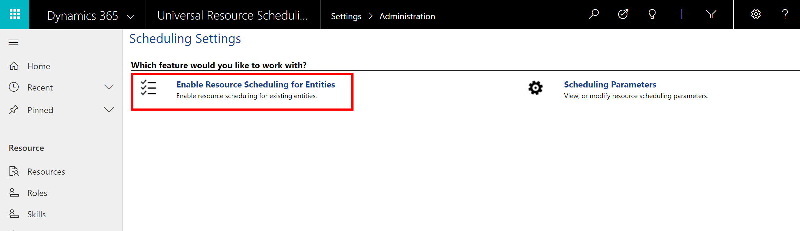
 
You will see a list of entities that have been enabled for scheduling. **Appointments**, **Projects**, and **Work Orders** are enabled for scheduling by default if you have Dynamics 365 Field Service or Project Service Automation solutions installed.

You will see a section called **Setup Wizard - Enable Scheduling** that lets you set up a new entity for scheduling. For the following fields: 

- **Add Entity:** Select the entity from the list of entities in your Dynamics 365 organization. For our example, we will choose the **Lead** entity.

- **Booking Relationship:** Select **Create New Relationship**.

- **Requirement Relationship:** Select **Create New Relationship**.

> [!div class="mx-imgBorder"]
> 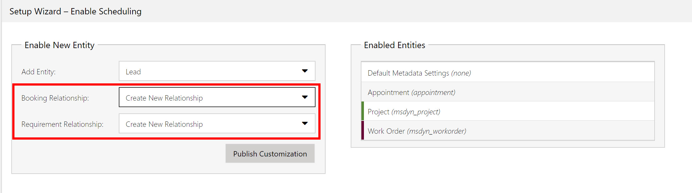

> [!Note]
> If you have previously created relationships from the entity to the bookable resource booking or resource requirement entities, then they can be selected here as well. 
 
Next, select **Publish Customization**.  

To edit settings for how leads are booked, double-click **Leads** once it appears in the **Enabled Entities** section. For example, default booking statuses and whether the entity is enabled for [quick scheduling](../../field-service/quick-scheduling.md) can be edited. 

> [!div class="mx-imgBorder"]
> 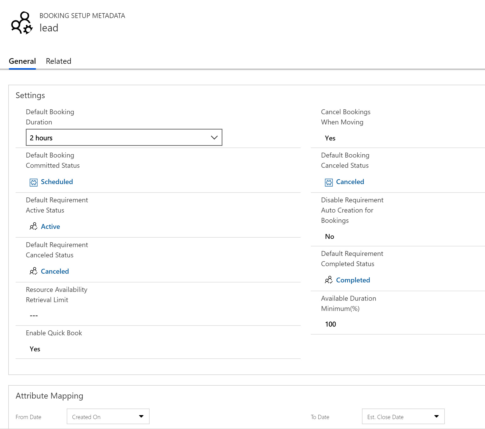
  
You have successfully enabled an entity for scheduling when:

1. **Resource Requirements** shows as a related entity. 
2. The **Book** button appears in the top ribbon.

> [!div class="mx-imgBorder"]
> 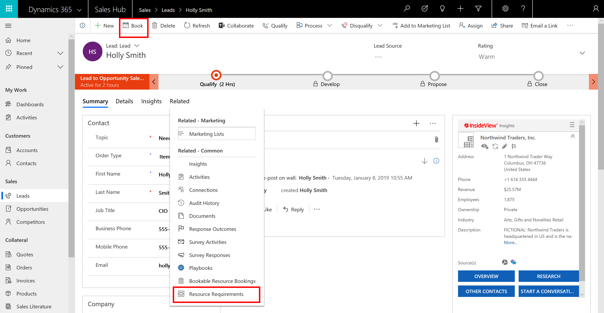

Before scheduling a lead, a related resource requirement must be created. These can be created manually or created by a custom workflow. 

To create a resource requirement, go to the **Related** tab on the entity and choose **Resource Requirements**.

> [!Note]
> As part of the Field Service solution, requirements are automatically created when work orders are created.

Select **New** to create the new resource requirement. 

> [!div class="mx-imgBorder"]
> 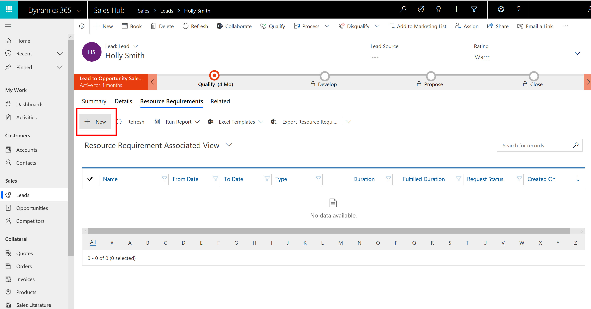
 
Enter the information that will provide details on what requirements are needed for a resource to be scheduled to this lead. Details might include dates, duration, priority, and territory. 

> [!div class="mx-imgBorder"]
> 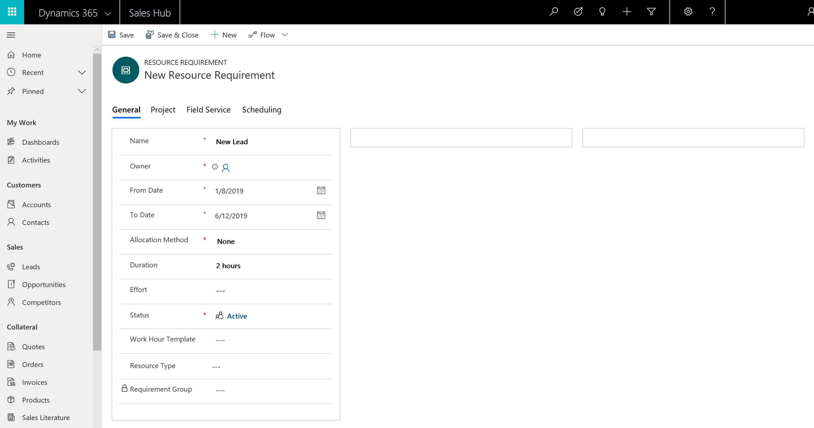

Once the requirement is created, you can book the lead to resources by selecting the **Book** button.

> [!div class="mx-imgBorder"]
> 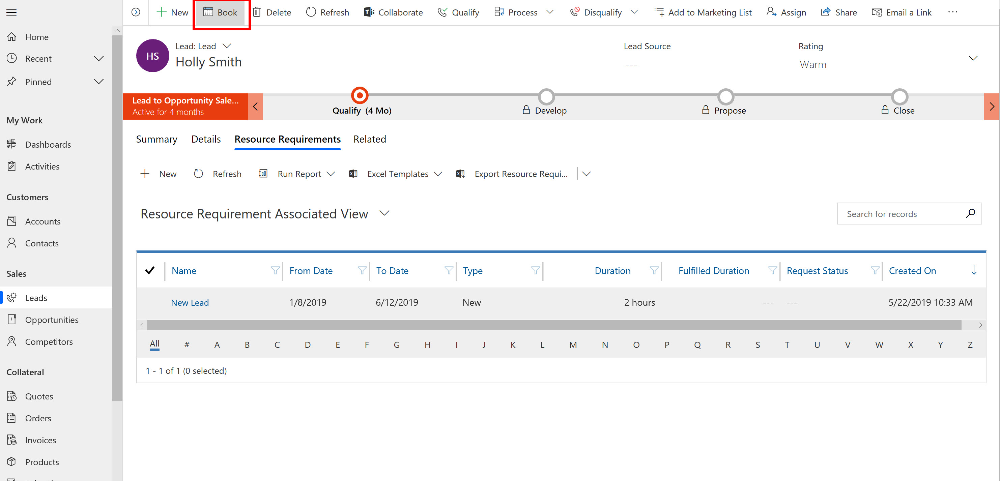

This will trigger the schedule assistant and display available resources that meet the criteria on the requirement.

If quick book is enabled for the entity, the **Book** button will trigger the quick scheduler panel, which also shows available resources that meet the criteria on the requirement.

> [!div class="mx-imgBorder"]
> 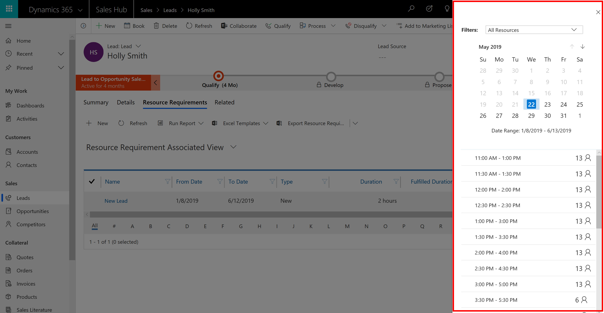
 
Once the lead is booked, a new **Bookable Resource Booking** record is created and is also shown as a related entity.  

> [!div class="mx-imgBorder"]
> 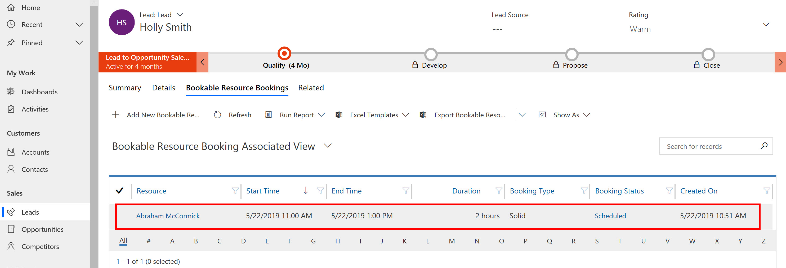

Next, let's talk about scheduling lead requirements from the schedule board.
  

## Add a requirement view to the schedule board

After creating a requirement for the lead, it will appear in the **Open Requirements** view in the lower pane of the schedule board that shows all open requirements related to any schedulable entity. This is a default view for resource scheduling.

> [!div class="mx-imgBorder"]
> 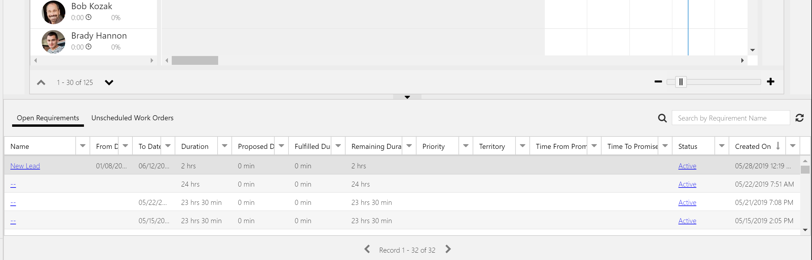

However, the views in the lower pane of the schedule board are simply system views and can be edited and added to. It's common to add custom resource requirements views for work orders (or leads in our example). Let's create a schedule board view that shows only leads to be scheduled.

Go to **Settings** > **Customizations** > **Entities** > **Resource Requirement** > **Views**.  

> [!div class="mx-imgBorder"]
> 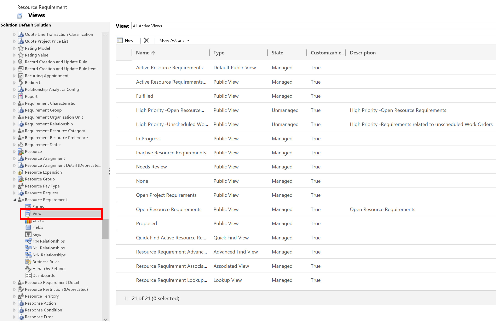

Create a new view and add fields to the view that provide details for what you are scheduling. Use the drop-down to capture fields from the entity (in this case, **Lead**). 

> [!div class="mx-imgBorder"]
> 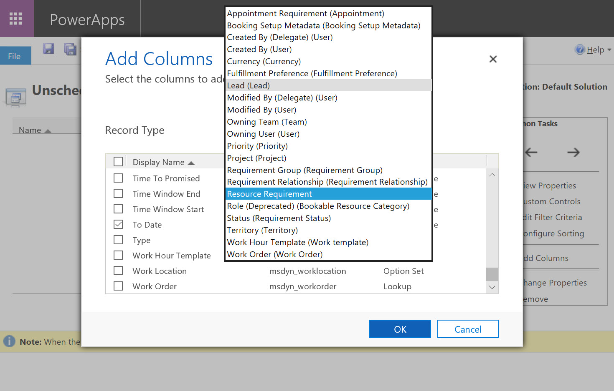

Name the view using the properties or **Save As** functions. In this example, we will call it our new view "Unscheduled Leads." 

> [!div class="mx-imgBorder"]
> 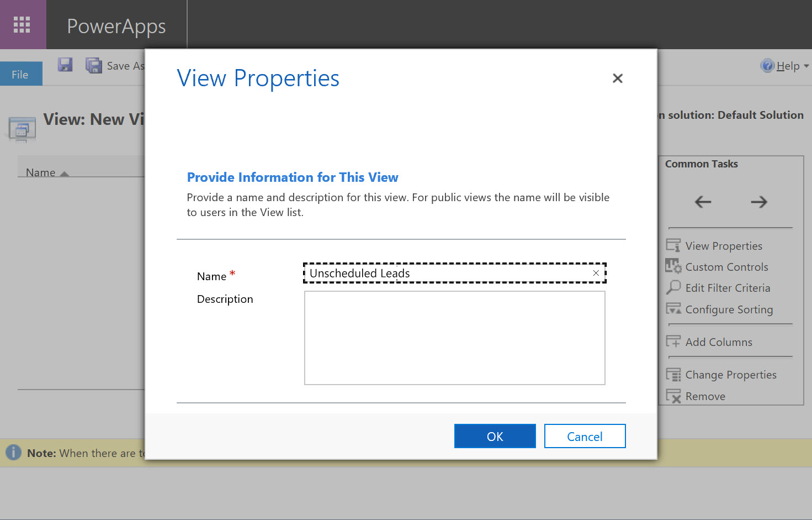
 
Most importantly, edit the filter criteria to show the appropriate records. To ensure only the lead resource requirements will be displayed, select the **Lead** entity and filter the records appropriately.  

> [!div class="mx-imgBorder"]
> 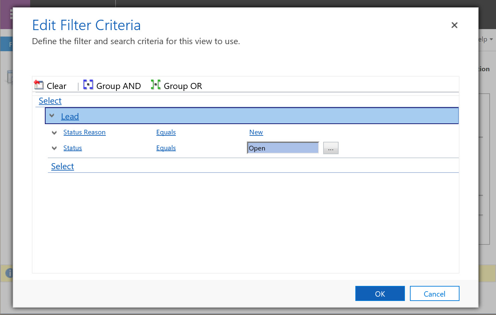
 
**Save**, then **Close & Publish**.  

Finally, we'll need to edit the schedule board we will be using in order to schedule the entity. 

Go to the schedule board and select the plus sign icon (+) to add a new tab.

> [!div class="mx-imgBorder"]
> 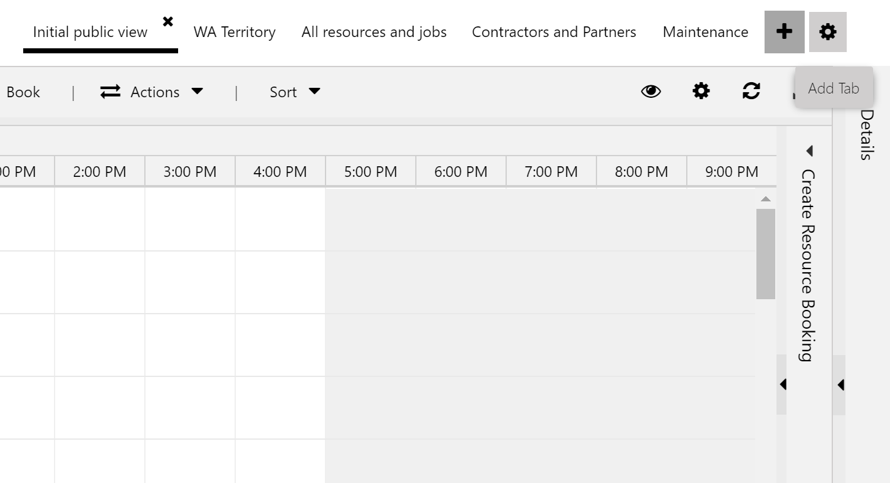

> [!div class="mx-imgBorder"]
> 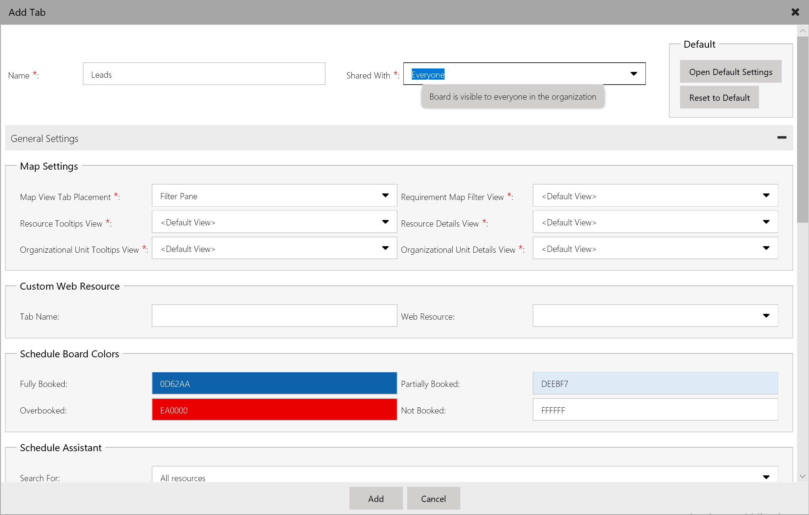

In the **Requirement Panels** section, add a **Title** and select the new view. 

Select the plus sign icon (+) to add the view.  

> [!div class="mx-imgBorder"]
> 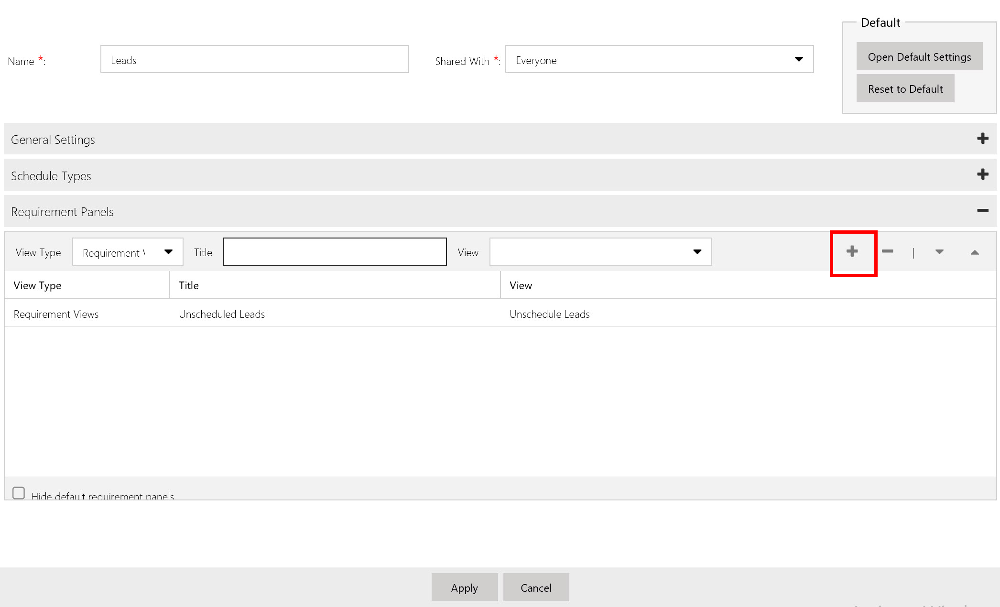
 
Select **Hide default requirement panels** if you don’t want to display the other tabs.  

> [!div class="mx-imgBorder"]
> 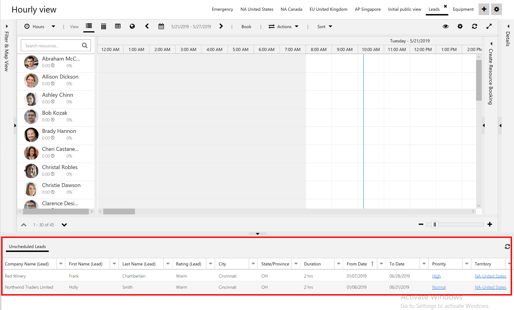

> [!Note]
> You may have many lead records in the system, but if there are no requirements related to the leads, then no records will show on the schedule board. Resource requirements will need to be created for each lead you want to schedule either manually or through a workflow to auto create upon creation of a lead.  

## Appointment scheduling with Universal Resource Scheduling

Appointments are enabled for scheduling by default when Universal Resource Scheduling is installed.

**(Deprecated)**: You can configure the system to automatically create a booking when an appointment is created.

> [!Note]
> As of April 01, 2021, this configuration has been deprecated. Read more details in the [deprecation notice](deprecations-scheduling.md/#deprecated-appointment-handling) and plan to move to the [new method](../../field-service/appointment-scheduling.md) of including appointments in resource scheduling, without needing corresponding bookings.

Go to **Settings** > **Administration** > **System Settings** > **Calendar** and set **Scheduling Engine** to **Universal Resource Scheduling**.

> [!div class="mx-imgBorder"]
> 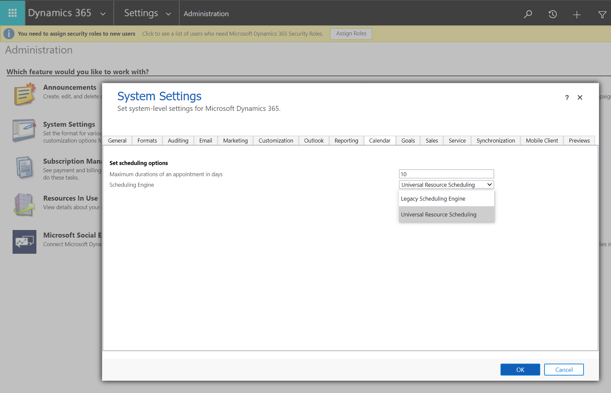

Create an appointment and add relevant details.

In the **Required** field, enter a user record. If the user record has an associated bookable resource, a booking will be created for that resource with the same start and end time as the appointment.

> [!div class="mx-imgBorder"]
> 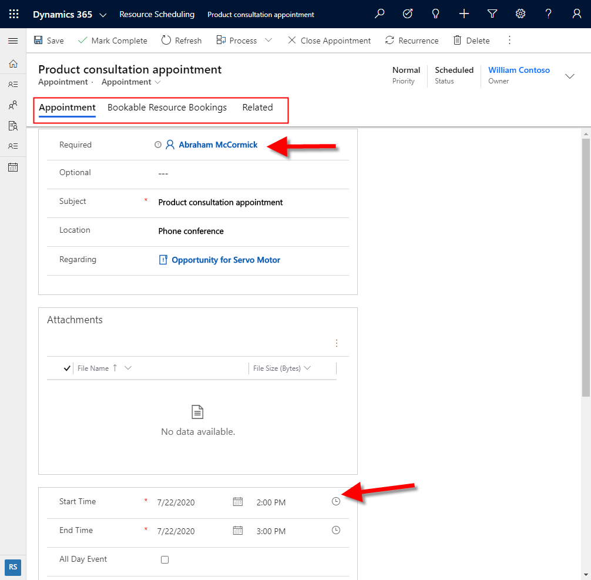

Once saved, you can see the related booking on the appointment form by going to **Related** > **Bookable Resource Bookings**. Like all bookings, it's visible on the schedule board for the right time slot and resource.

> [!div class="mx-imgBorder"]
> 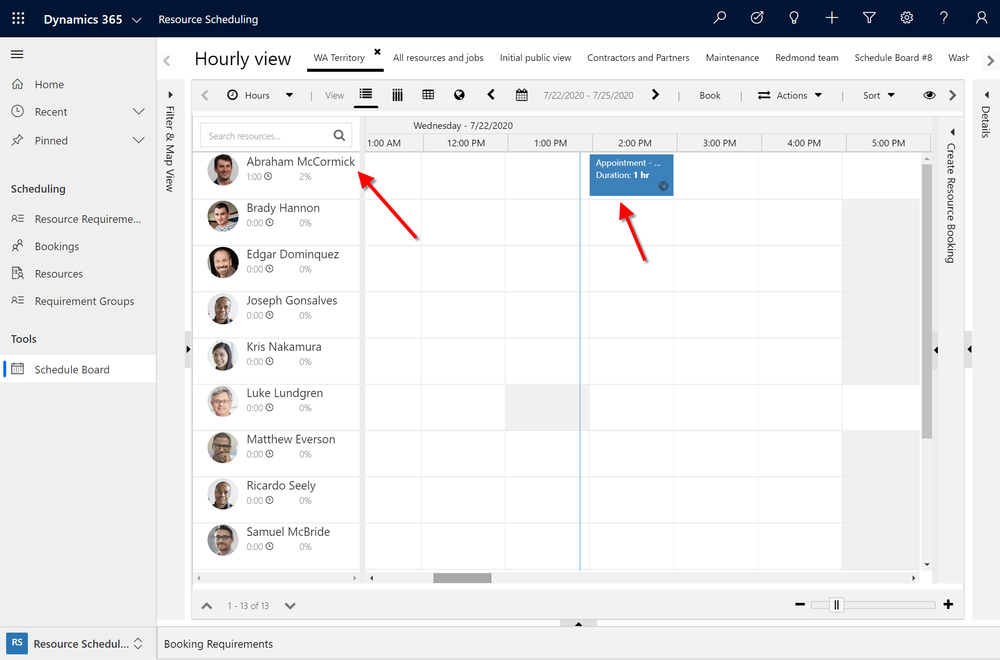

Unlike other entities enabled for scheduling, the appointment form will not have a **Book** button in the top ribbon nor will there be an associated resource requirement. Creating an appointment is inherently like creating a booking.

## Configuration considerations

### Onsite leads

If resources must perform work on site at the customer's location, travel time and distances should be considered when scheduling. In these cases, we recommend using the work order entity, as it is designed for on-site service. However, if you would like to schedule leads to be performed on site:

1. Create a lead.
2. Create a related resource requirement.
3. On the requirement, set **Work Location** to **Onsite**.
4. On the requirement, add **Latitude** and **Longitude** values. These serve as the lead location and can be compared to the locations of resources in the system during scheduling.

> [!div class="mx-imgBorder"]
> 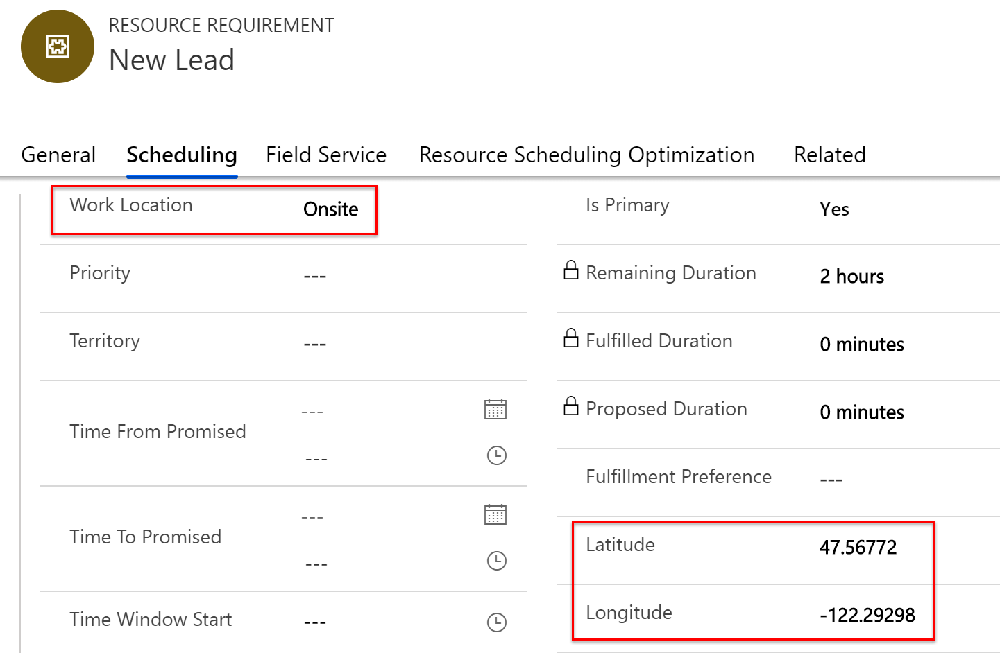

1. *(Optional)* Consider going to the **Lead Booking Setup Metadata** and adding a default **Work Location** for when lead requirements are related and mapping requirement latitude and longitude fields to lead latitude and longitude fields for auto population. 

> [!div class="mx-imgBorder"]
> 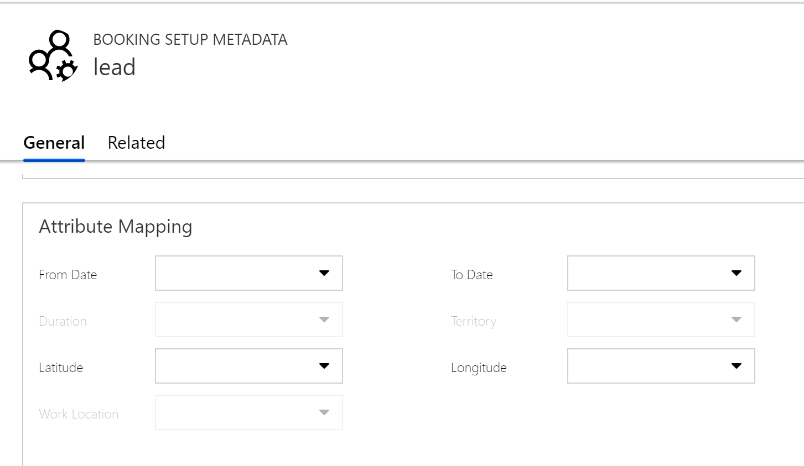

## Additional notes
- If the entity you want to enable for scheduling is not displayed in the **Add Entity** list, go to the managed properties of the entity (**Settings** > **Customizations**) and set the **Can be customized** setting to **True**. For more information, see our [article on managed properties](https://docs.microsoft.com/dynamics365/customer-engagement/customize/set-managed-properties).

- To turn off scheduling for a previously enabled entity, select **Deactivate** in the ribbon on the **Booking Setup Metadata** record.
