When scheduling a work order, case, quote, or any entity enabled for scheduling, you can set date and time parameters to control when the requirement is booked.

This is done by entering date and time values on the work order form in the preference section, or similar fields on the requirement form if you're scheduling entities other than work orders.

> [!div class="mx-imgBorder"]
> 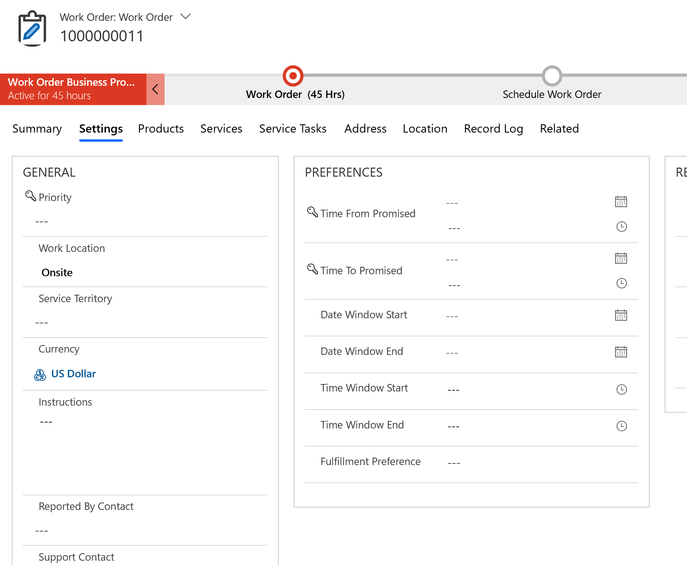

For instance, we will consider the following scheduling scenarios throughout this topic: 

**Scenario 1: Schedule between two dates**

An installation work order must be scheduled and is expected to be completed this week.

- Example: 9/10/2019 - 9/15/2019
- Enter **Date window start** and **Date window end**
- Considered by schedule assistant and Resource Scheduling Optimization (RSO)

**Scenario 2: Schedule between two times of day**

 A diagnosis and repair work order must be scheduled before the end of the day tomorrow.

- Example: 9:00 AM - 5:00 PM
- Enter **Time window start** and **Time window end**
- Considered by RSO

**Scenario 3: Schedule between two dates and times**

An inspection work order should be automatically scheduled for completion in the afternoon some day within the next two weeks.

- Example: 9/10/2019 9:00 AM - 9/11/2019 5:00 PM
- Enter **Time from promised** and **Time to promised**
- Considered by the schedule board, schedule assistant, and RSO

Let's configure these 3 scenarios to understand how dispatchers can schedule work orders within time constraints. 

## Prerequisites

- Any version of Dynamics 365 Field Service.

- Understand that Resource Scheduling Optimization considers all date and time parameters, but the schedule board and schedule assistant do not. See the scenarios at the beginning of this topic to understand which scheduling methods consider which date and time parameters.

## Scenario 1: Schedule between 2 dates

In this scenario, an installation work order must be scheduled and needs to be completed this week.

From the work order, complete the **Date Window Start** and **Date Window End** fields to represent the week the work order should be scheduled and completed within.

> [!div class="mx-imgBorder"]
> 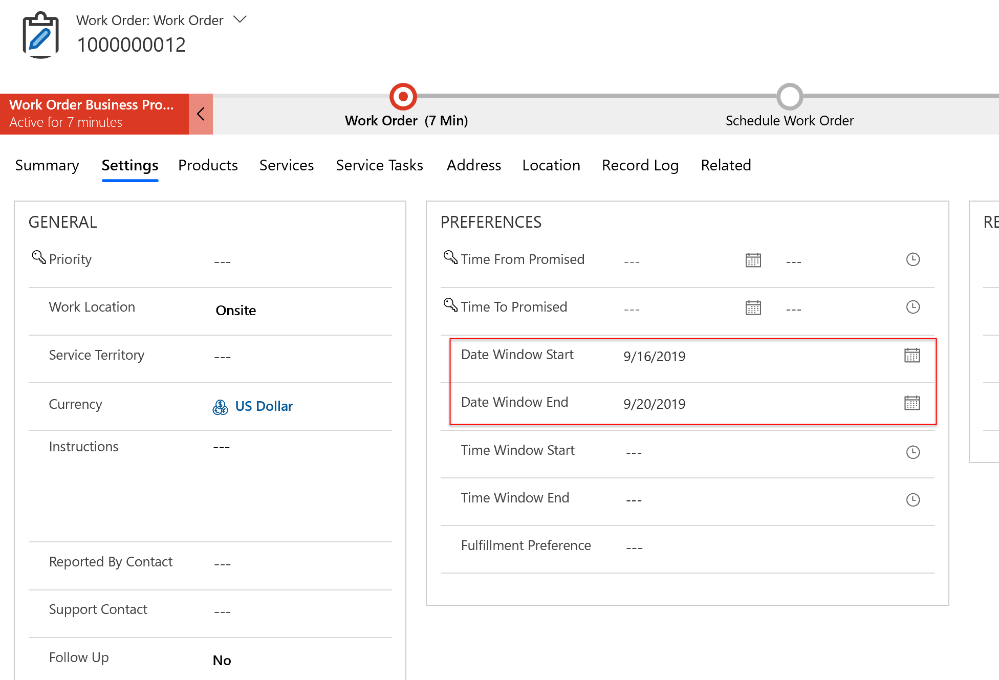

This will automatically populate the **From Date** and **To Date** fields on the related work order resource requirement and vice versa. This is true for the other fields in the **Preferences** section as well, such as **Time Promised** and **Time Window**. 

> [!div class="mx-imgBorder"]
> 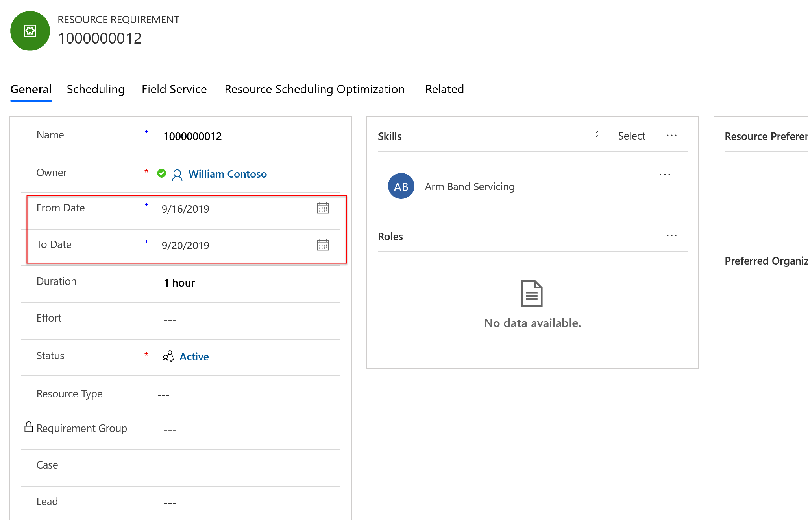

When attempting to schedule this work order with the schedule assistant - from either the **Book** button on the form or from the **Find Availability** search on the schedule board - these date values will populate the **Search Start** and **Search End** filters. Resources that are available for the entire duration of the work order within the date range will display as options.

> [!div class="mx-imgBorder"]
> 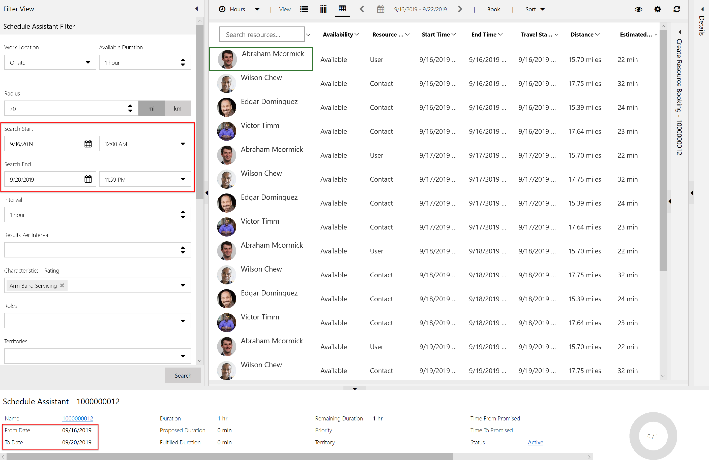

> [!Note]
> If the current time (time of scheduling) is later than the search start, search start will become the current time because you cannot schedule a work order in the past.

## Scenario 2: Schedule between two times of day

In this next scenario, a diagnosis and repair work order must be scheduled before the end of the day tomorrow.

To schedule based on a date *and* time, simply complete **Time From Promised** and **Time To Promised** on the work order.

> [!div class="mx-imgBorder"]
> 

These values will be passed to the related requirement and appear as new filters when the schedule assistant is triggered.

> [!div class="mx-imgBorder"]
> 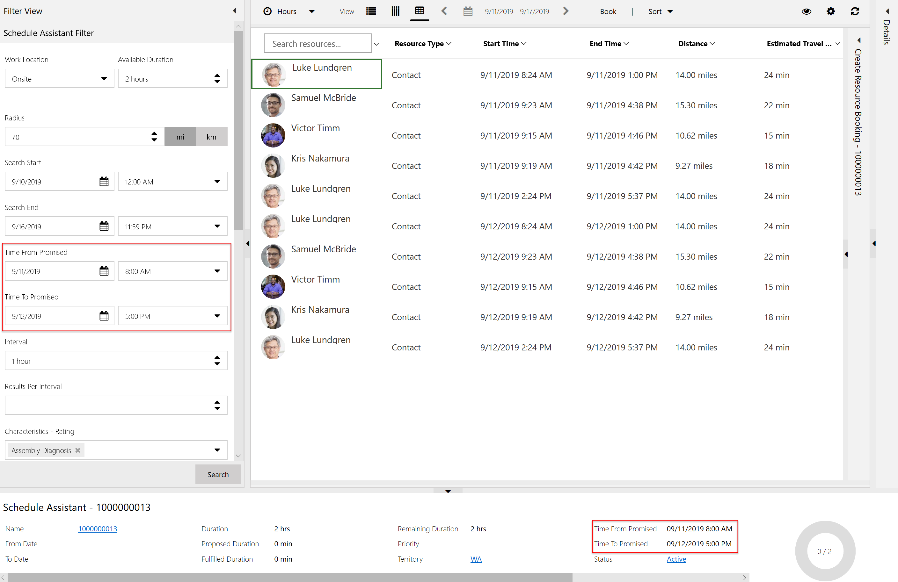

**Time From Promised** and **Time To Promised** implies that the estimated arrival time must fall within the time range for which the resource has availability for the duration of the work order. This is based on the resource's working hours, and is not necessarily completed before the end of **Time To Promised**. This differs from date window start and end.

> [!div class="mx-imgBorder"]
> 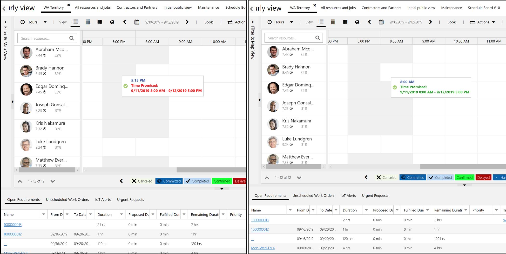

Furthermore, when manually dragging and dropping a requirement on the schedule board, a popup will warn the dispatcher if the estimated arrival time falls within the promised time window or not.

> [!Note]
> **Time From Promised** and **Time To Promised** is a continuous time range that does not consider the service organization's or the customers' working hours. For example, if the time from and to promised is set to 9/10/2019 9:00 AM - 9/15/2019 5:00 PM, then any time during this range is eligible as long as resources are working.

Finally, setting up [service level agreements (SLAs) for work orders](../../field-service/sla-work-orders.md) will populate the time from and time to promised fields in order to help dispatchers schedule to meet the SLAs.

## Scenario 3: Automated scheduling with time parameters (RSO)

In our next scenario, an inspection work order needs to automatically be scheduled in the afternoon within a date range.

To automatically schedule work orders and other entities, you must use the Resource Scheduling Optimization app (RSO). Unlike the schedule assistant and the schedule board, RSO will consider all 3 time parameters when automatically booking work orders to resources.

First, on the work order, set a date range in the **Date Window Start** and **Date Window End**. 

Next, set a **Time Window Start** and **Time Window End** that represents a time of day the work order should be automatically scheduled.

> [!div class="mx-imgBorder"]
> 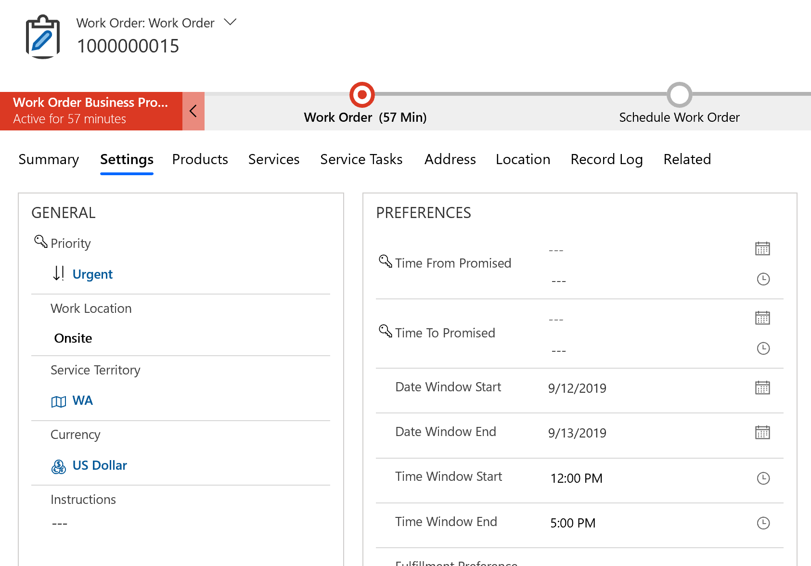

> [!Note]
> For this scenario, we recommend using **Date Window** along with **Time Window** rather than **Time Promised**, as **Time Promised** will take priority over the other parameters during optimization.

When setting up RSO, make sure **Scheduling Windows** is a constraint in the optimization goal you are running RSO with. For more information, see the [topic on RSO configuration](../../field-service/rso-configuration.md). If you're new to RSO, see the [RSO quickstart guide](../../field-service/rso-quickstart.md).

> [!div class="mx-imgBorder"]
> 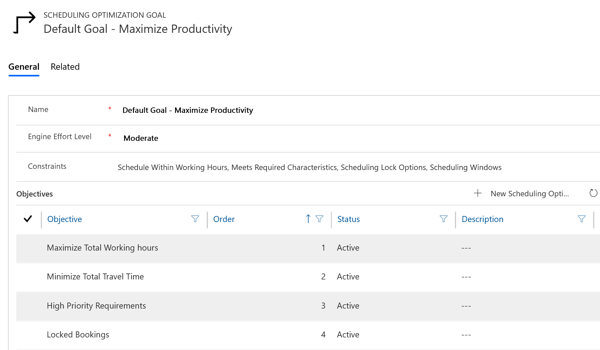

After running RSO, you'll see the results on the schedule board. In our example, the work order could have been scheduled for either 9/12 or 9/13 based on the date window of the work order; whichever day it is scheduled, it should be scheduled in the afternoon between 12:00 PM and 5:00 PM. 

> [!div class="mx-imgBorder"]
> 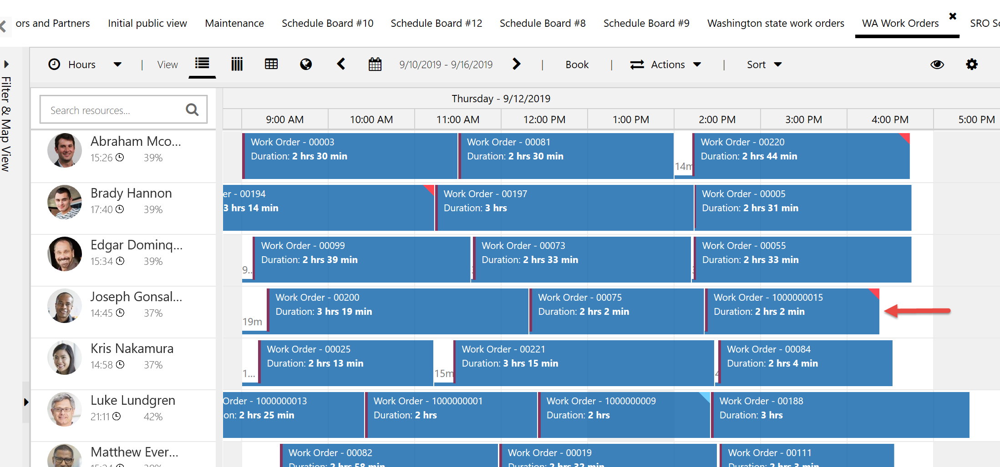

## Configuration considerations

### Modify calendar
You can define a time zone on the requirement to help dispatchers view schedule assistant results in the time zone of the customer, and it allows for dispatchers to work in different time zones than the resources. From the requirement, select **Modify Calendar** in the ribbon menu, then choose a **Time Zone** from the dropdown, then save and close.

When you book the requirement, the start times of the schedule results will reflect the chosen time zone. 

### Booking rules

Dynamics 365 Field Service can perform custom booking rule validations, called **Booking Rules**, when creating a booking with the schedule board or schedule assistant. Booking rules are custom JavaScript functions that run prior to the **Bookable Resource Booking** record being created.  The JavaScript function can accept a parameter that will contain information for the **Bookable Resource Booking** record and must return a JavaScript object with the required properties.

In the context of scheduling within time parameters, you can create a **Booking Rule** that performs custom validation on the date and time fields or even custom date and time fields you create. For example, you could create a rule that checks if a booking starts on a Monday, Wednesday, or Friday, and if it does not, display an error message to the dispatcher on the schedule board. For more information, see the [topic on booking rules](../../field-service/set-up-booking-rules.md)

### Scheduling lock options

Scheduling lock options prevent RSO from rescheduling a booking to a different time or resource. From the booking, simply set a value in the scheduling lock options field.

> [!div class="mx-imgBorder"]
> 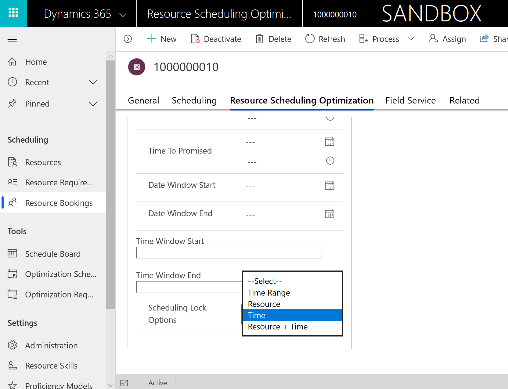

### Fulfillment preferences

Fulfillment preferences let you choose how schedule assistant results are displayed, like with neat hourly appointments or morning and afternoon time windows. They can help dispatchers schedule work orders during times that are convenient for the customer. For more information, see the [topic on fulfillment preferences](../../field-service/set-up-time-groups.md). 

### Booking setup metadata

You can define which fields on the entity enabled for scheduling should serve as the start and end dates for the related requirement. This is done in booking setup metadata. Go to **Resource Scheduling** > **Settings** > **Administration** > **Enable Resource Scheduling for Entities**, then double click an enabled entity. 

> [!div class="mx-imgBorder"]
> 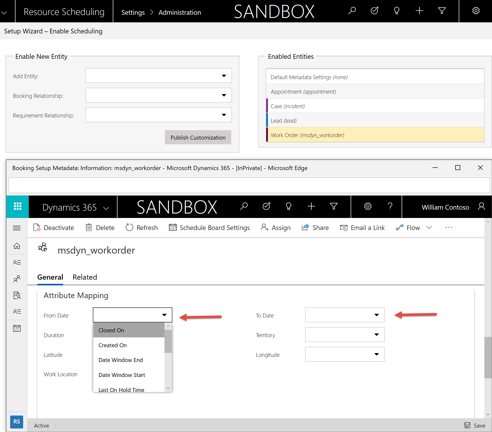

In the attribute mapping section, you can choose any date and time fields on the entity.

For example, imagine you enable **Leads** for scheduling. You can choose two date fields on the **Lead** entity (either existing or custom fields) that will automatically be the from and to dates when you attempt to schedule the Lead.

## Additional notes

> [!Note]
> Using **Date Window Start** and **Date Window End** means the work order must be completed during the date range based on the total duration of the requirement. For example, if you expect a work order to take 25 hours, but the date range is 1 day (24 hours), then no resources will return as results because no one can complete the 25 hour work order in 1 day, even if he or she works 24 hours each day as working hours.

- **Variable calendars**: Out of the box, Dynamics 365 Field Service cannot consider variable calendars where certain days and times are restricted or required for scheduling. For example, imagine a customer who requires on-site service would like the work order to be scheduled on Mondays, Wednesdays, or Fridays between 12:00 PM and 5:00 PM each day. This can't be achieved with the out-of-the-box date and time preference fields or calendar. As a possible workarounds, use notes to inform the dispatcher of the customer's time preferences, or to use **Booking Rules** to create custom logic with JavaScript.

- **Scheduling entities other than work orders**: The time parameter fields on the work order - **Date Window Start** and **Date Window End**, **Time From Promised** and **Time To Promised**, and **Time Window Start** and **Time Window End** - all exist on the resource requirement entity. This means you can use these fields when scheduling entities other than work orders, such as cases, quotes, and custom entities. 