Field service organizations often perform preventative maintenance, inspections, repairs, and other types of services by sending field technicians to multiple customer sites, and they must actively manage locations and routes. This makes understanding and minimizing travel time critical for a field service organization's success.

Using Bing Maps API by default, Dynamics 365 Field Service calculates the driving travel time and distance as field technicians travel:

- From their personal address to a work order location.
- From a company address to a work order location.
- From their current work order location to the next work order location.
- From their current location to a work order location (typically for high-priority emergencies).

In this article, we will explore how travel time and distance are calculated and visualized for dispatchers during manual scheduling, semi-automated scheduling with the schedule assistant, and automated scheduling with Resource Scheduling Optimization (RSO).

## Prerequisites

1. Connect your Dynamics 365 environment to Bing Maps. For more information, see [our article on setting this up](https://docs.microsoft.com/dynamics365/customer-engagement/field-service/perform-initial-configurations-setup#step-1-resource-scheduling). This allows you to locate resources (field technicians) and work orders, and later calculate the travel time and distances between them.
   
2. Set auto geocode addresses to **Yes**. For more information, see [our article on setting this up](https://docs.microsoft.com/dynamics365/customer-engagement/field-service/perform-initial-configurations-setup#step-2-field-service-settings). This allows you to automatically geocode accounts and work orders when addresses are entered. Geocoding an account or work order record populates latitude and longitude values, which are required for travel time and distance calculations.

3. After connecting your environment to Bing Maps, make sure your resources have defined starting and ending locations. Resources must have geocoded start and end locations in order to calculate travel times and distances. See the articles on [setting up bookable resources](../../field-service/set-up-bookable-resources.md) and [using resource types to locate resources](https://docs.microsoft.com/dynamics365/customer-engagement/field-service/set-up-bookable-resources#configuration-considerations).

4. Understand that only requirements for which **Work Location** is set to **Onsite** and for which latitude and longitude values are specified are eligible for travel time calculations. 

   In the following screenshot, a work order has **Work Location** set to **Onsite**; this is passed to the related work order requirement. When that work order requirement is scheduled to a resource, the system will look at the work location field, the location of the requirement, and the location of the resource in order to calculate travel time.

    > [!div class="mx-imgBorder"]
    > 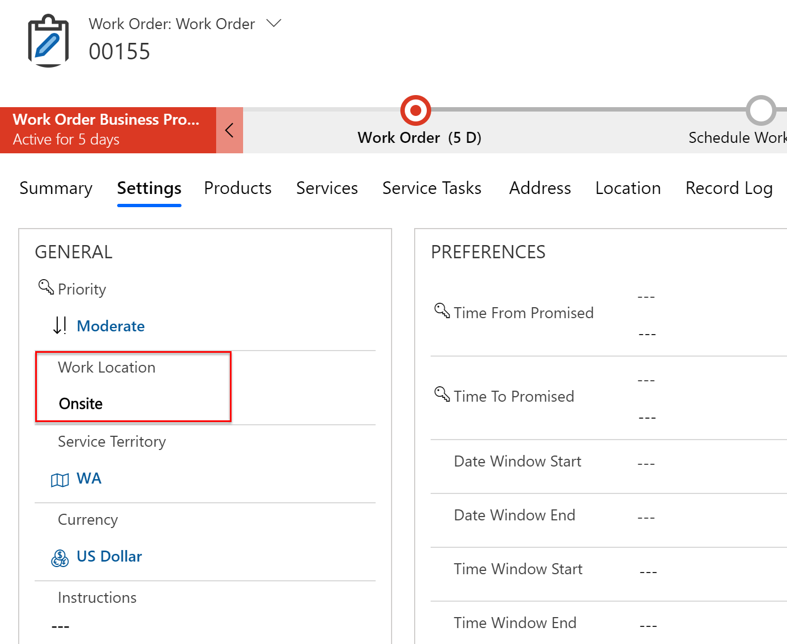

## Visualize travel time on the schedule board

After a requirement is scheduled to a resource, the booking appears on the schedule board, and, if applicable, travel time displays preceding the booking.

In the following screenshot, the travel time to the customer's location is 23 minutes, and the estimated duration of the work order is 2 hours, giving the booking a total duration of 2 hours and 23 minutes.
> [!div class="mx-imgBorder"]
> 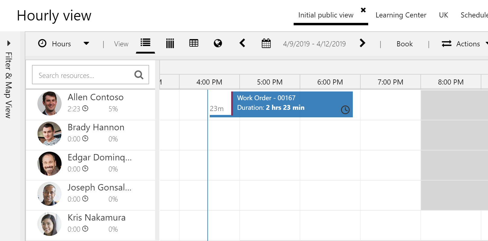

If you don't want travel time displayed as separate from the working duration, clear **Show Travel Duration** in the schedule board configuration. This makes it so the travel time and working duration appear as a single solid block, as seen in the following screenshot. 

> [!div class="mx-imgBorder"]
> 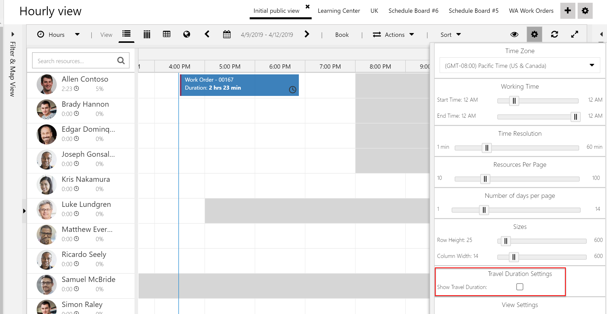

As field technicians complete work, they can update the booking status to **Traveling**. The system tracks the duration of time the booking status is set to traveling and updates the **Actual Travel Duration** accordingly, though this will not be displayed on the schedule board.

> [!div class="mx-imgBorder"]
> 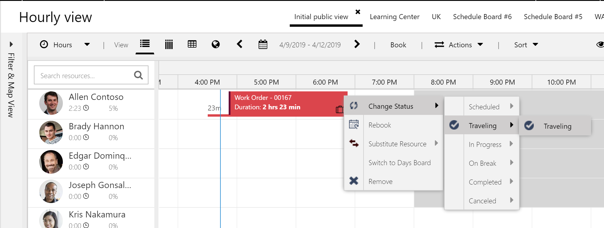

When field technicians arrive onsite, they can update the booking status to **In progress**, indicating work has begun. The system tracks the duration of time the booking status is set to **In progress** and updates the **Total Duration In Progress** booking field. Finally, when the booking is complete (in other words, the booking status is set to **Completed**), the booking **End Time** is updated, and the booking length is updated visually on the schedule board.

> [!div class="mx-imgBorder"]
> 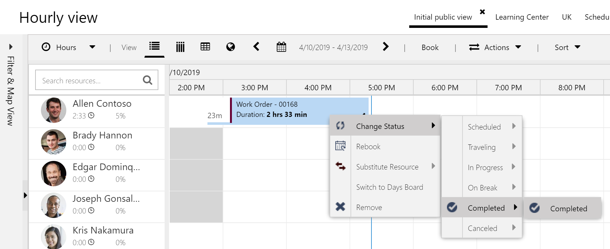

## Add travel time with manual scheduling

By default, manually scheduling a requirement by dragging and dropping on the schedule board will not calculate travel time and distance. This can be helpful for field service organizations that are not concerned with managing or optimizing their field technicians' travel but simply need to manage appointment start times. Imagine a scenario where an emergency work order arises, and the dispatcher simply wants to communicate the time that a field technician will arrive.

For example, a work order requirement that is manually scheduled to a resource at 9:00 AM implies that the field technician should arrive at the customer's location at 9:00 AM; in this scenario, it's the field technician's responsibility to manage travel arrangements. In the following screenshot, an unscheduled work order requirement was dragged from the lower requirement pane to 9:00 AM for a resource. No travel time is calculated or added to the duration of the booking, implying that all 4 hours make up the working duration.

> [!div class="mx-imgBorder"]
> 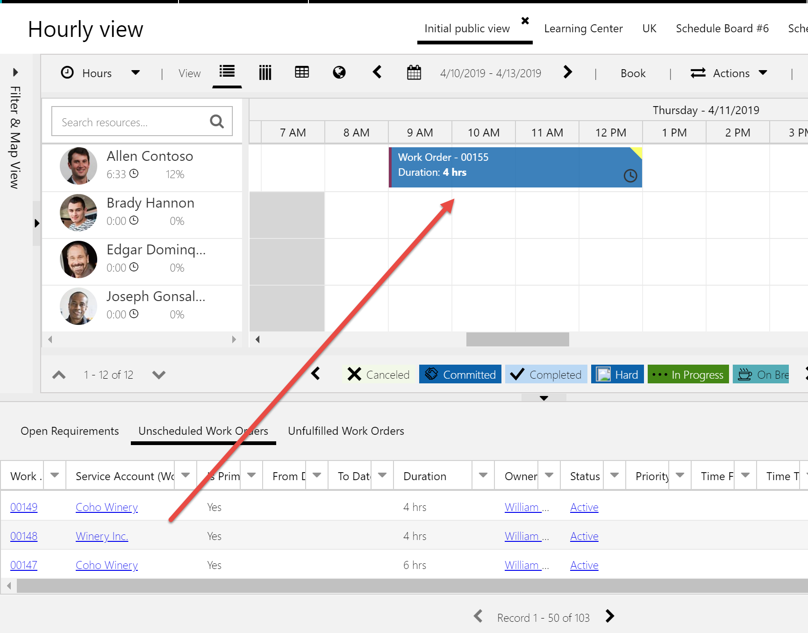

Organizations that operate in small contained geographic areas can add a generic 30 minutes to the work order durations either manually or by inflating the incident durations to roughly estimate travel but still utilize manual scheduling.

> [!NOTE]
> As of Dynamics 365 Field Service version 8.6, travel time and distance calculations can be added to bookings that are **manually scheduled**. 

In addition to completing the tasks mentioned earlier in this article, you need to go to **Resource Scheduling > Settings > Administration > Scheduling Parameters** and set **Auto Update Booking Travel** to **Enabled**.

> [!div class="mx-imgBorder"]
> 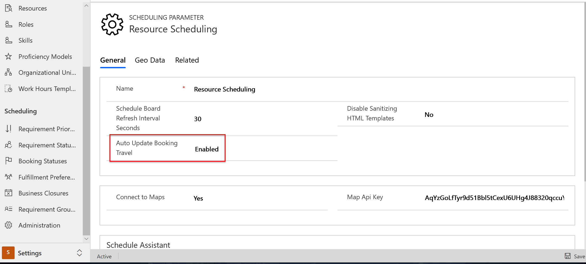

> [!NOTE]
> As of Dynamics 365 Field Service version 8.8.40.x April Wave 1 2021, **Auto Update Booking Travel** is set by default to **Enabled**. 

This will add a travel time to the booking visualization on the schedule board, displayed by a line preceding the booking, and populate the **Miles Traveled** booking field (though this is not visualized on the schedule board). 

In the following screenshot, an unscheduled work order requirement was dragged from the lower requirement pane to a resource at 10:00 AM. Similarly to before, this implies that the field technician should arrive onsite at 10:00 AM; the only difference is that the travel time to get there from a home, office, or previous job location is displayed **before** that time.

> [!div class="mx-imgBorder"]
> 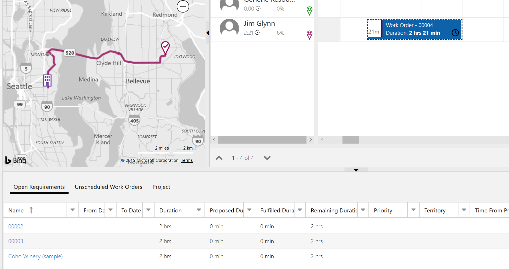

The auto-update booking travel feature will update travel time calculations as new bookings are made beyond the initial schedule. In the following screenshot, you see two onsite work order requirements scheduled back-to-back on the schedule board.

> [!div class="mx-imgBorder"]
> 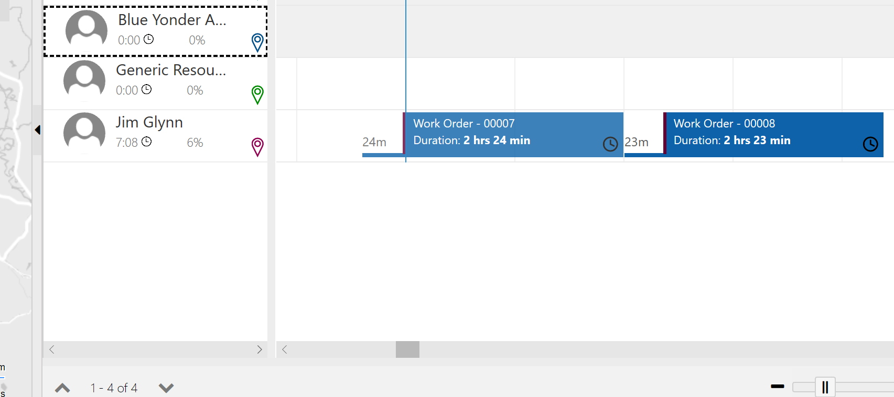

If a third onsite requirement is scheduled in between the original two, the travel time calculations are updated accordingly, based on the new route order. The order of the bookings is decided by the estimated arrival time, not the travel start time.

> [!div class="mx-imgBorder"]
> 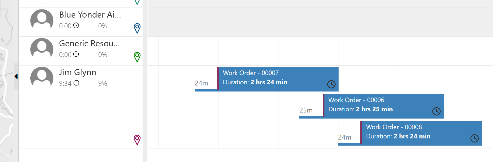

> [!NOTE]
> When updates (like in the preceding screenshot) take place, the booking start and end times are not cascaded for the rest of the day, as is evident by the overlap. Only the travel times and distances are updated. To ensure that the remaining bookings cascade, correct overlapping times, and fit inside working hours after changes, organizations should consider using Resource Schedule Optimization (RSO).

For more information on the **Auto Update Booking Travel** feature, see the additional notes section of this article.

## Add travel time with schedule assistant

The schedule assistant is designed to help dispatchers make better scheduling decisions based on travel times and distances.

Consider a scenario where a dispatcher wants to schedule a work order requirement to the field technician who is closest to the work- order location based on travel time.

When triggered from the schedule board, the schedule assistant shows resources within the distance radius filter, along with the travel time estimates from their location (home, office, previous job, or real-time location) to the work-order location.

> [!div class="mx-imgBorder"]
> 

> [!div class="mx-imgBorder"]
> 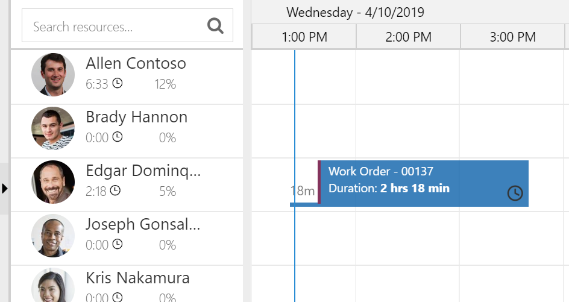

This is predicated on the following conditions:

- The work order requirement has a work location of **Onsite**. 
- The work order requirement has a location (latitude and longitude). 
- The resources displayed have defined locations.

This is also true when the schedule assistant is not triggered from the schedule board but by the **Book** button from a requirement.

In the following screenshot, travel time and distance calculations appear in the columns.

> [!div class="mx-imgBorder"]
> 

> [!NOTE]
> If the work order requirement has a work location of **Location Agnostic** or if the schedule assistant work-location filter is changed to **Location Agnostic**, then resources without locations will also be displayed, along with resources that do have locations, except that the booking will not calculate travel time.

In the following screenshot, the work location is location agnostic, and no travel times are displayed in results.

> [!div class="mx-imgBorder"]
> 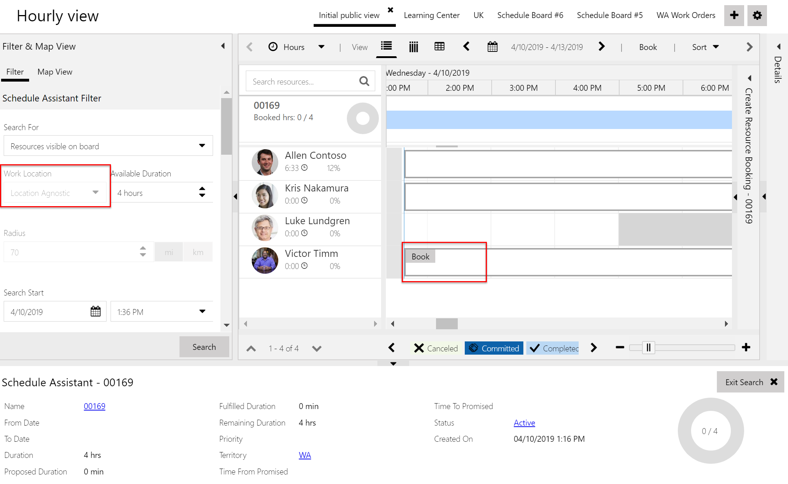

Additionally, the Auto Update Booking Travel feature (Field Service version 8.6 and later) updates subsequent bookings when using the schedule assistant.

In the following screenshot, you'll see a resource's schedule with time available at the beginning of the day, which may have been due to a cancellation.
> [!div class="mx-imgBorder"]
> 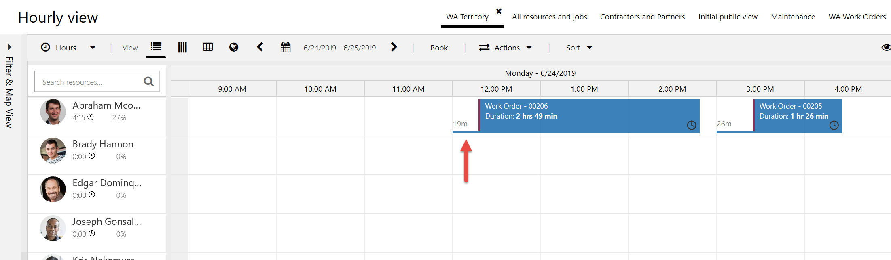

When the schedule assistant is triggered, it finds the available time slot.
> [!div class="mx-imgBorder"]
> 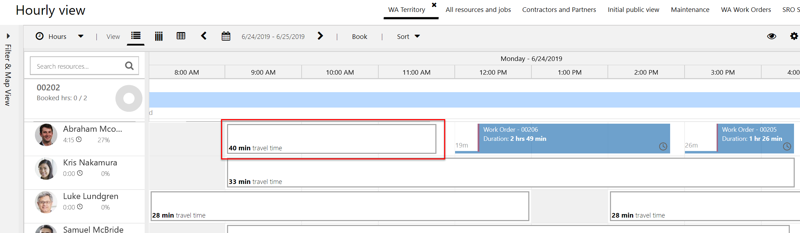

After it's booked, the travel time of the subsequent booking is updated as the location has changed.
> [!div class="mx-imgBorder"]
> 

## Add travel time with Resource Scheduling Optimization

While the schedule assistant can help dispatchers make better scheduling decisions for individual requirements, Resource Scheduling Optimization (RSO) helps dispatchers make smarter scheduling decisions across many or all requirements at once. With regard to travel, this is the difference between reducing travel times and distances and **minimizing** them. 

When the optimization runs and automatically schedules work orders or other requirements, the travel times display on the schedule board the same as with other booking methods. See the following screenshot for reference.

> [!div class="mx-imgBorder"]
> 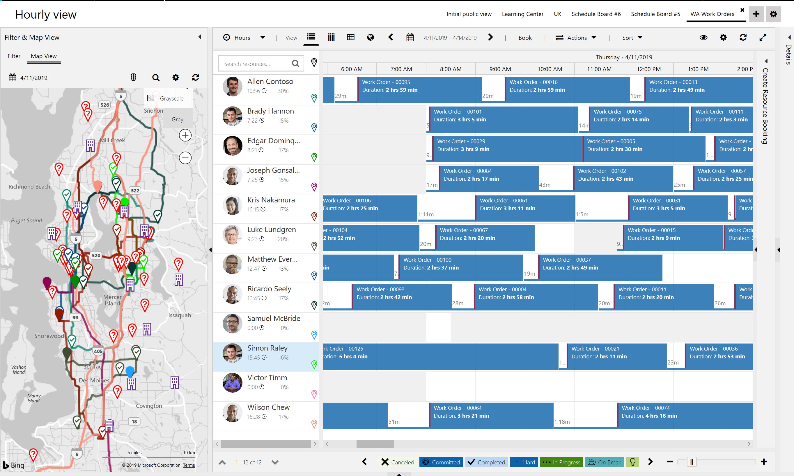

However, to better understand how RSO minimizes overall travel time, each RSO run (called a "request") displays a graph comparing total working minutes scheduled to total travel minutes for those optimized bookings. This can be compared to the same graph for requirements scheduled manually or with the schedule assistant.

> [!div class="mx-imgBorder"]
> 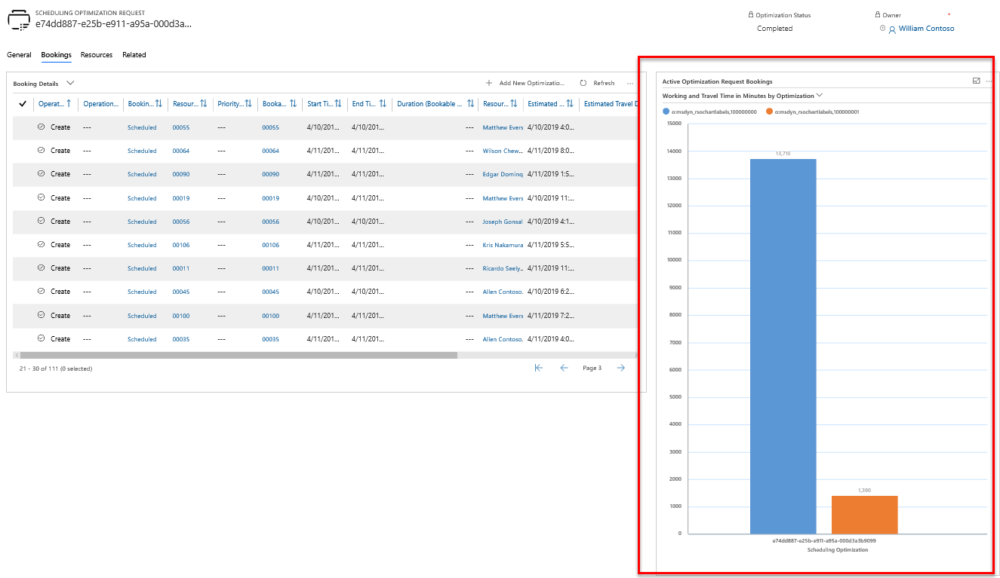

> [!NOTE]
> If the RSO is set to schedule within working hours, it will calculate time to leave at the end of the day for resources to travel to their ending location, generally a home or office.

> [!div class="mx-imgBorder"]
> 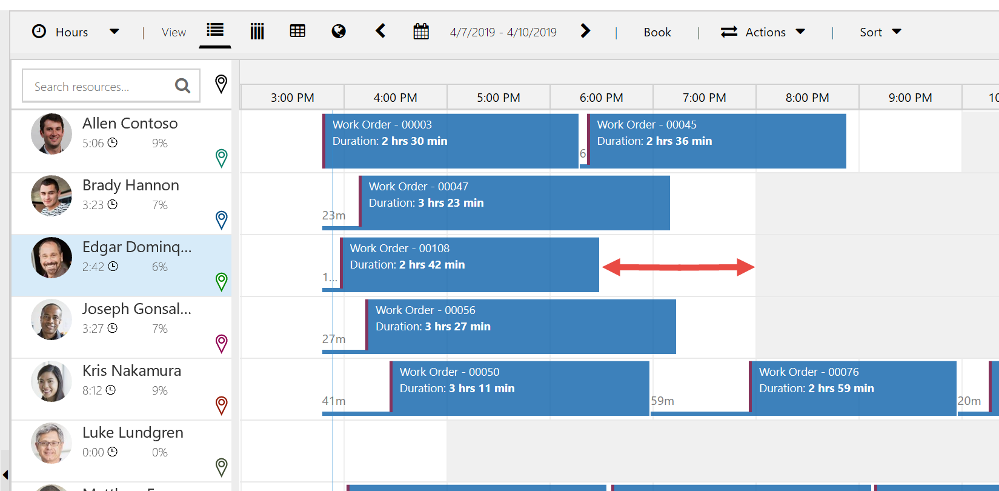

### Travel outside working hours

Many organizations want to allow technicians to begin traveling before their working hours up to a limit. Configure resource scheduling optimization to allow travel time before or after working hours as seen in the following screenshot. For more information, see the article on [allowing travel time outside of working hours with resource scheduling optimization](../../field-service/rso-travel-outside-working-hours.md).

> [!div class="mx-imgBorder"]
> 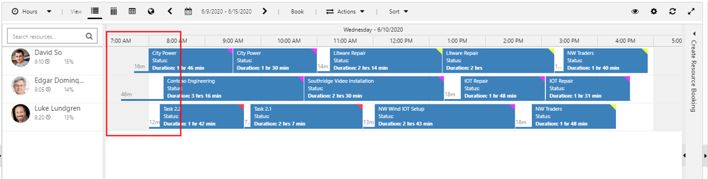

## Consider traffic when scheduling

To help with scheduling decisions, current traffic patterns and accidents can be displayed on the schedule-board map alongside technician routes. To do this, select the traffic light icon at the top of the schedule board map. See the following screenshot for reference.

> [!div class="mx-imgBorder"]
> 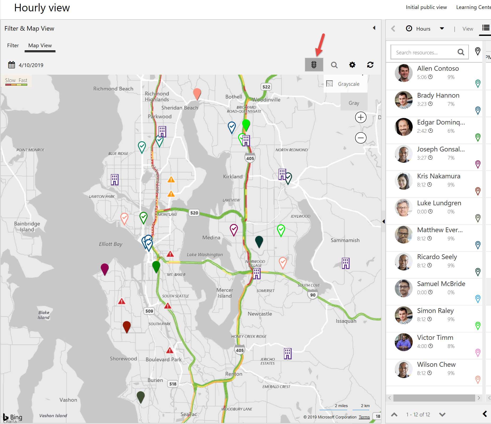

> [!NOTE]
> Travel time calculations do not reflect traffic patterns or historical travel times based on the time of day or year.

Scheduling based on real-time traffic is not applicable because most organizations schedule days or weeks in advance, and you can't predict real-time traffic ahead of time. 

Bing Maps and other mapping providers can provide real-time and historical travel-time calculations, and this information can be called with [Power Automate](https://flow.microsoft.com/galleries/public/templates/71e9c3773102499fafba51edf94ebbd7/get-travel-time-and-distance-in-current-traffic-to-reach-the-destination/) to calculate whether the current travel time is greater than the estimated travel time and automatically update the booking status accordingly.

If a field technician begins travel to their next work order and sees that the travel time is much longer than estimated by the system, they should indicate this with a custom booking status of "running late," so dispatchers can plan accordingly. 

## Predictive travel times with historical traffic information

When using resource scheduling optimization, you can take historical traffic information into account to better plan for travel times.

For more information, see our article on [predictive travel with resource scheduling optimization](../../field-service/rso-predictive-travel.md).

## Configuration considerations

- By adding a travel charge to the service account of the work order, you can charge the customer a fee for travel time and distance as work orders are completed. For more information, see the article on [adding account-related details to work orders](../../field-service/work-order-customer-account.md).
- A field technician's current location as derived from their mobile device running the Field Service Mobile app can be used for travel time and distance calculations with the scheduling assistant. This is called **Real-Time Mode**. For more information, see the article on [enabling and testing location auditing](https://docs.microsoft.com/dynamics365/customer-engagement/field-service/geofencing#step-5-test-location-auditing).
- Field Service uses the Bing Maps API for travel time and distance calculations, but other APIs such as Google Maps can be used as well.
- By default, work order requirements have a work location of **Onsite**, but default work location can be edited for each schedulable entity by going to **Resource Scheduling > Settings > Enable Resource Scheduling for Entities >**, and then selecting **Enabled Entity**.  

## Additional notes

- The out-of-the-box functionality supports travel time and distance calculations only for driving, not walking or flying.
- If **Auto Geocode Addresses** is turned on, imported records will be geocoded, as will updates to the **Address 1** field.

### Auto Update Booking Travel for Field Service version 8.6 and later**

The Auto Update Booking Travel feature for manual scheduling needs two locations to work. For example, if a resource has a starting location, and the first requirement scheduled to the resource has a location (for instance, the work location is **Onsite**), then the travel time will be calculated and visualized. If the resource does not have a starting location (for instance, if the resource start location is **Location Agnostic**), the first onsite requirement scheduled will not have a travel time. However, if an onsite requirement is scheduled after another onsite requirement, then the feature has two known locations, and the travel time between the two requirements will be calculated **even if the resource is location agnostic**.

Here are a few more notes about the **Auto Update Booking Travel** feature:

- The feature cannot be enabled or disabled based on specific users, schedule board tabs, or specific schedulable entities. 

- If technicians are required to create bookings on their Field Service mobile app, and you want to enable this feature to auto-calcualte the travel time and distance, a field on the booking form called **msdyn_ursinternalflags** must be set to **{"AutoUpdateBookingTravel":true}**. Once the booking is created in the mobile app, the travel time will be calculated. 

- The feature only applies to the Hours view of the schedule board, and travel time and distances are not updated if the bookable resource booking form is edited manually, edited with a workflow, or if the bookings are imported.

- If you have an existing onsite booking, the subsequent onsite booking calculates travel time from the previous booking up until the beginning of the next day's working hours, even if there are multiple hours in between the two onsite bookings.
  
- The time that the requirement is dragged to the schedule board is the time that the resource will arrive onsite, and the travel time is added **before** that time. This is not configurable. For example, if you schedule an onsite work order requirement at 10:00 AM by dragging the requirement to the 10:00 AM time slot, and the feature calculates 20 minutes of travel time, then the travel will begin at 9:40 AM, and the resource will arrive by 10:00 AM.
