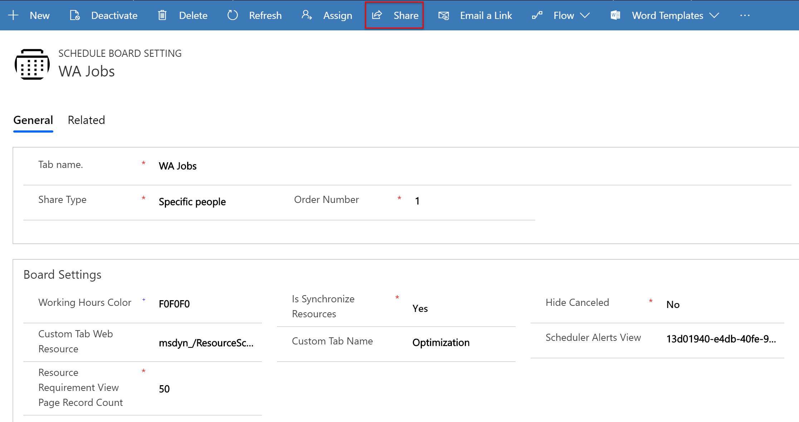

You can have multiple schedule board tabs configured for your business needs. As the owner of a schedule board tab, you can share the tab.

## Share a schedule board tab

Use the schedule board tab settings to share a tab.

1. On the schedule board, select the vertical ellipsis &vellip; next to a schedule board tab name and select **Board settings**.

   :::image type="content" source="../../field-service/media/schedule-board-tab-settings.png" alt-text="Screenshot of the vertical ellipsis and the settings option.":::

1. Under **Shared With** select one of the sharing options.

   - **Everyone** exposes the tab to all users who can access the schedule board.
   - **Just Me** restricts the tab to you only.
   - **Specific People** shares the tab with other users that you choose.

   > [!TIP]
   >  Every user with a Field Service security role gets access. Admins can also [create custom security roles](/power-platform/admin/security-roles-privileges) with the **Schedule Board Setting** privilege.
   > :::image type="content" source="../../field-service/media/schedule-board-setting-privilege.png" alt-text="Screenshot of the list of privileges with callout on the schedule board setting.":::

## Choose users to share the schedule board tab

The schedule board saves tabs as records in the *Schedule Board Settings* entity.

Go to **Settings** > **Advanced Settings** and select **Advanced Find**. In the pop-up window, look for the **Schedule Board Settings** table and select **Results**.

:::image type="content" source="../../field-service/media/advanced-find-legacy-web-client.png" alt-text="Screenshot of the advanced find pop-up in the legacy web client settings.":::

The list of records shows all schedule board tab records you have access to.

Open the schedule board record you want to share to specific people. On the schedule board setting form, select **Share** > **Manage access**.

> [!div class="mx-imgBorder"]
> 

Add users or teams to share the schedule board with. They see the schedule board tab if they have access privileges to schedule boards.
