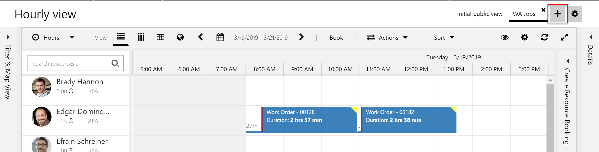
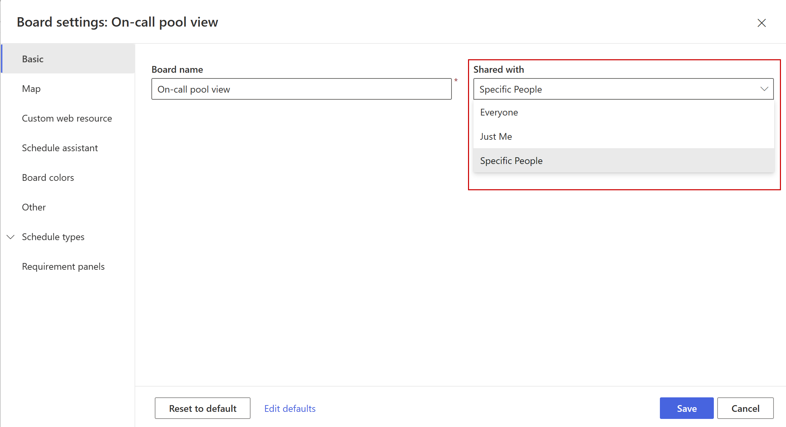
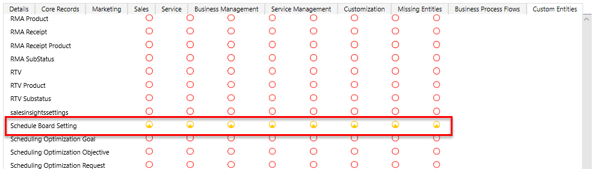
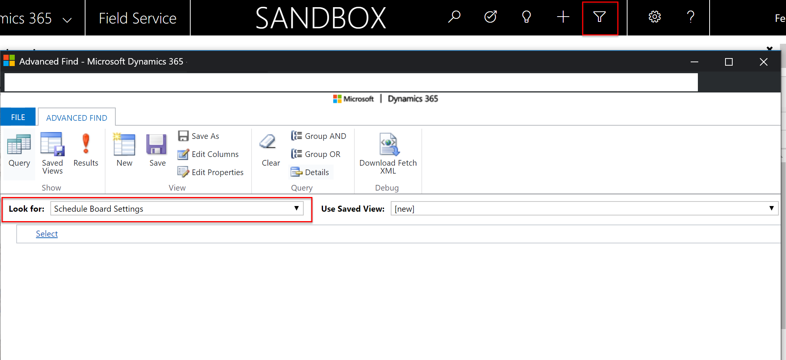
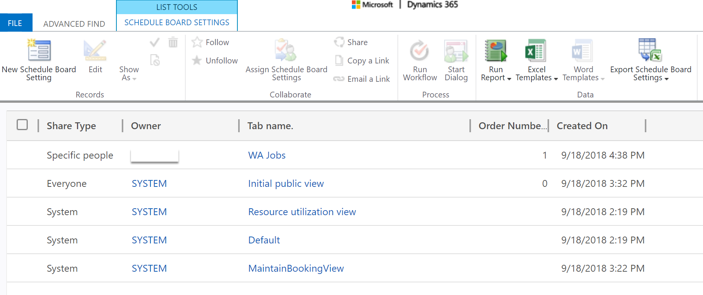
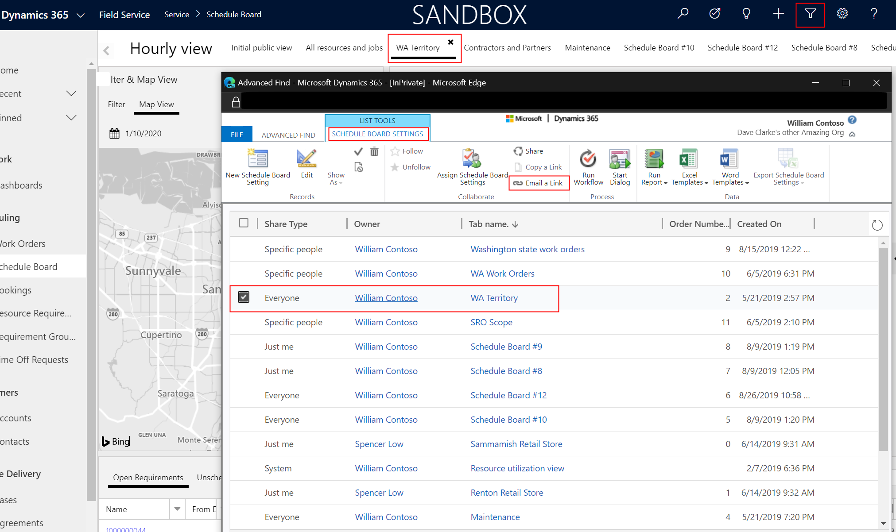

You can have multiple schedule board tabs, each showing different resources and requirements. Typically, these are divided by territory or lines of business.

A schedule board tab can be shared:

- publicly, available to all schedule board viewers (mostly dispatchers), 
- privately for just the person who created it
- only to specified people

By default, there exists a schedule board tab called **Initial Public View** that includes all resources and requirements. 

In this topic, we'll explore creating a new schedule board tab and sharing it with specific users.

## Prerequisites

- Field Service v6.1+
- Universal Resource Scheduling v1.0.2+

## Instructions

First we will walk through how to create a public and private schedule board tab, but then focus on sharing one with specific people.

Go to **Field Service > Schedule Board** and select the **+** in the top right to create a new tab.

> [!div class="mx-imgBorder"]
> 

The schedule board tab settings form will appear where you can choose various configurations for the tab. 

The **Shared With** field controls who can see the tab. 

Select **Specific People**.

> [!div class="mx-imgBorder"]
> 

Selecting **Everyone** will expose the schedule board tab to all users who can access the schedule board. Selecting **Just Me** will expose the schedule board to only the user who creates it.

Next, give appropriate security access to the users you want to share the schedule board tab with.

Go to **Settings** > **Security** and make sure each user has at least minimum user access to the **Schedule Board Settings** entity as seen in the following screenshot. This can be achieved by manually editing the users' security role or by assigning the users a copy of the **Field Service - Resource** security role. 

> [!div class="mx-imgBorder"]
> 

> [!Note]
> We recommend giving relevant users minimum security level privileges for read, write, and create. Then use the **Shared With** option (Everyone, Specific People, Just Me) on the schedule board tab settings to share appropriately. This is better than using the Dynamics 365 security model, as that could lead to oversharing. 

Next you'll need to choose the specific users to share the schedule board tab with. 

Go to **Advanced Find** and look for **Schedule Board Settings**, then select Results. All schedule board tabs are saved as records in the **Schedule Board Settings** entity.

> [!div class="mx-imgBorder"]
> 

This shows all schedule board tab records and you should see the one you just created. In our example, it's "Schedule Board #3".

> [!div class="mx-imgBorder"]
> 

Double-click the record to go to the form, and select **Share** on the top ribbon.

> [!div class="mx-imgBorder"]
> 

Finally, use the pop up screen to add users and teams to share the schedule board with. Any user or team added here can see the schedule board tab, given they also have access to the schedule board.

> [!div class="mx-imgBorder"]
> 

## Link to specific schedule board

Sometimes, you may need a link to a specific schedule board tab that dispatchers can use as a browser shortcut, to share with teammates and managers, and to reduce the load time by not having to load the entire board.

First get the GUID for the specific schedule board tab you want to link to.

A GUID is a 32 digit number in the format XXXXXXXX-XXXX-XXXX-XXXX-XXXXXXXXXXXX and each record in Dynamics 365 has a GUID as a unique identifier, including schedule baord tabs.

You can find the GUID of a schedule board tab with an advanced find of the **Schedule Board Settings** entity. Select the record that corresponds with the scheduel baord tab you want to share and use the **Email a link** button to get the GUID.

> [!div class="mx-imgBorder"]
> 

Finally, copy and paste the GUID into the template link below.

    https://[dynamics org name].crm.dynamics.com/webresources/msdyn_/fps/ScheduleBoard/scheduleboard.html?#tab=[32 digit GUID].

See the following screenshot for an example of an acceptable URL to a specific schedule board tab.

https://fieldservice.crm.dynamics.com/webresources/msdyn_/fps/ScheduleBoard/scheduleboard.html?#tab=AE595A88-A57C-E911-A95A-000D3A3B9A2B

Be sure to test the link by entering it into a browser. Note that people who follow the link will be prompted to log in to Dynamics 365 Field Service if they aren't already logged in.

## Additional notes

- Even if a schedule board tab is shared with a specific user, that user must have the minimum user permissions on the **Schedule Board Settings entity** to view it. Minimum permissions are included with the **Field Service - Administrator**, **Field Service - Dispatcher**, and **Field Service - Resource** security roles.
- We recommend giving relevant users minimum security level privileges for read, write, and create. Then use the **Shared With** option (Everyone, Specific People, Just Me) on the schedule board tab settings to share appropriately. This is better than using the Dynamics security model, as that could lead to oversharing. 
- You can share a schedule board tab with a team for convenience. 
- To edit a schedule board, it must be shared with you and you must have write privileges. 

