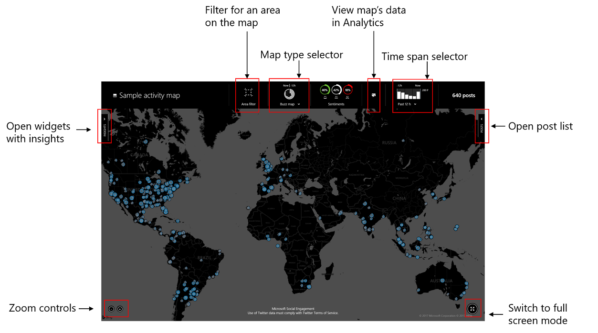
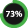
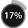
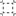
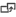

# Define activity maps to view real-time data
Using activity maps, you can view real-time posts by geographical location on an easy-to-understand map. You can further view these posts in Analytics to understand more details and associated metrics.  
  
> [!IMPORTANT]
>  You can only visualize those posts on an activity map that have location data for posts or authors. [!INCLUDE[proc_more_information](../includes/proc-more-information.md)] [See the locations for the posts](analytics-location.md), [Analyze the sources for the posts](analytics-sources.md)  
  
## Role privileges  
Every user can create activity maps in [!INCLUDE[pn_netbreeze_long](../includes/pn-social-engagement-long.md)], regardless of user role or license type. Activity maps are saved and displayed separately for every user. You can only view the activity maps you create.  
  
   
## Create an activity map  
  
1.  Go to **Activity Maps**.  
2.  On the **Activity Maps** pane, click the **Add** button .  
3.  Enter the details on the **Activity Maps Details** page.  
  
    - **Name**: Enter a name for the new activity map.  
  
    - **Default time span**: Select the default time span for which you want to view the posts for this activity map. You can change this value at any time, even when you view the map. **Options**: Past 30 minutes, Past hour, Past 12 hours, Past 24 hours.  
  
    - **Default map type**: Select the default type of the map that you want to view when you open this activity map.  
  
        - **Buzz map**: Displays the volume of posts in various locations.  
  
        - **Sentiment map:** Displays the sentiment values for the conversations, based on the location.  
  
    - **Filters**: Select the filters you want to create the activity map from. You can use **All Search Topics** or choose **Change**  to select filters. [!INCLUDE[proc_more_information](../includes/proc-more-information.md)] [Get relevant data using filters](use-filters.md)  
  
        > [!IMPORTANT]
        >  Make sure that your data set contains posts that the activity map can display. If you configure an activity map that has a data set that doesn't include location information (for example, if you filter only by Blogs, which don't support location data), the activity map won't display any data.
  
4.  When you're done, click **Save**.  
  
> [!TIP]
>  To edit an activity map, open the map details and repeat from step 3.  
  
## View an activity map  
  
> [!IMPORTANT]
>  If you have not created any activity maps, no maps will be displayed for you. [!INCLUDE[proc_more_information](../includes/proc-more-information.md)] [Create an activity map](activity-maps.md#createactivitymap)  
  
1.  Go to **Activity Maps**.  
  
2.  From the list, select the activity map, and then click the globe button  to see the default view of the selected activity map.  
  
3.  Single posts are repesented in smaller shapes than post clusters. 

An outline indicates how old a post or cluster is. New posts show a circle. The older the post, the smaller the outline. 

The Sentiment map additionally shows the colors and shapes for the corresponding sentiment values of the posts.  
  
4.  Click **Posts** on the right side of the map to view the list of posts for the map.  
  
    > [!TIP]
    >  Choose any data point on the map to view the posts corresponding to that area.  
  
5.  Click **Insights** on the left side of the map to view the phrases for the trending conversations.  
  
> [!NOTE]
>  Posts deleted or edited from any other area of [!INCLUDE[pn_netbreeze_short](../includes/pn-social-engagement-short.md)] will have applicable changes reflected in the map you are viewing in real time. For example, if you are viewing a sentiment map for a location that has a post with neutral sentiment value, and you or any other [!INCLUDE[pn_netbreeze_short](../includes/pn-social-engagement-short.md)] user edits this post’s sentiment as positive from another application area, say Analytics. Then, the new positive sentiment value will be reflected for this post on the map. You will no longer see the sentiment value as neutral for this post. [!INCLUDE[proc_more_information](../includes/proc-more-information.md)] [Understand the public perception using sentiment analysis](analytics-sentiment.md)  
  
> [!TIP]
>  Use the buttons in the lower-left corner of the map to zoom in or zoom out of the map.  
  
 **Sample activity map**  
  
   
  
## View and understand sentiment values on an activity map  
  
1.  Go to **Activity Maps**.  
  
2.  From the list, select the activity map, and then click the globe button .  
  
3.  In the header area, click **Sentiment map** if sentiment map is not your default view.  
  
4.  Read the sentiment values on the activity map: green with upward-facing triangle for positive sentiment, red with downward-facing triangle for negative, and gray with a diamond shape for neutral sentiment.  
  
    > [!TIP]
    >  In the header section, the sentiment map denotes the legend in detail. Select the appropriate button in the sentiment filter widget (next to the map legend) to filter the activity map for a specific sentiment value and view it.  
    >   
    >  Click the green button  to view only positive sentiment, the red button  to view negative sentiment, and the gray button for neutral sentiment . You can select more than one value.  
    >   
    >  When you select a specific sentiment value&mdash;for example, Positive&mdash;only posts with positive sentiment will be displayed on the map, and the positive sentiment button on the header shows 100%. All KPIs and charts will be filtered by the selection you make on the sentiment filter.  
    >   
    >  When you select all three of the sentiment values, respective percentages for all the sentiments will be displayed. [!INCLUDE[proc_more_information](../includes/proc-more-information.md)] [Understand the public perception using sentiment analysis](analytics-sentiment.md)  
  
## View and edit posts on an activity map  
  
1.  Go to **Activity Maps**.  
  
2.  From the list, select the activity map, and then click the globe button .  
  
3.  On the right side of the map, click **Posts**.  
  
4.  Select the post from the list, and then perform the required actions. [!INCLUDE[proc_more_information](../includes/proc-more-information.md)] [Work with posts](work-with-posts.md)  
  
## Understand the posts peaks on an activity map  
 Activity maps display up to 5,000 posts at a time. If your data set contains more fresh posts per hour (or for the selected time span), and the total posts cross the peak value of 5,000, older posts automatically disappear from the map’s display and you always see the latest ones. In this scenario, the header section of the activity map displays a clickable notification  that provides the current visualization details.  
  
## View conversation insights on an activity map  
 Understand the top and trending phrases of the current conversations that you’re interested in. Watch these further or work on these as required for your business. [!INCLUDE[proc_more_information](../includes/proc-more-information.md)] [Set up searches to listen to social media conversations](set-up-searches.md), [Get connected to the social conversation using Microsoft Social Engagement](get-connected-social-conversation.md)  
  
> [!TIP]
>  Phrases are refreshed when you update the data set or add a new filter.  
  
1.  Go to **Activity Maps**.  
  
2.  From the list, select the activity map, and then click the globe button .  
  
3.  On the left side of the map, click **Insights**.  
  
4.  View the trending phrases from the **Phrases** widget. [!INCLUDE[proc_more_information](../includes/proc-more-information.md)] [Find out what people are talking about](analytics-conversations.md)  
  
## Filter a specific area of an activity map  
 Filter a specific area of your activity map to have a focused view and perform any required actions.  
  
1.  Go to **Activity Maps**.  
  
2.  From the list, select the activity map, and then click the globe button .  
  
3.  In the header area, click the **Area filter** button .  
  
4.  Use the rectangular selector to focus on a specific area of the map.  
  
5.  View the real-time data for this area, and perform any required actions.  
  
    > [!NOTE]
    >  You can zoom in on this area by clicking the magnifier button .  
  
6.  When you’re done, click the area filter button again to disable it, or click  at the top of the selector.  
  
## View an activity map’s data in other areas of Social Engagement  
 View the data set selected for an activity map in other areas of [!INCLUDE[pn_netbreeze_short](../includes/pn-social-engagement-short.md)] to further understand the details and arrive at any required metrics. Click the **More options with current filters** button  in the header of an activity map.  
  
 [!INCLUDE[proc_more_information](../includes/proc-more-information.md)] [Open a data set in other areas of Social Engagement](more-options-with-data-set.md)  
  
## Delete an activity map  
 If you don't want to use an activity map anymore, you can delete it from your list.  
  
> [!IMPORTANT]
>  Deleting a activity map doesn’t affect your post quota because you only delete the maps/visualization, but not the posts themselves. [!INCLUDE[proc_more_information](../includes/proc-more-information.md)] [Work with posts](work-with-posts.md)  
  
1.  Go to **Activity Maps**.  
  
2.  Select the activity map, and then click the **Delete** button  .  
  
3.  Confirm the deletion.  
  
## View an activity map on a large screen  
 View an activity map on a large screen, in full-screen mode. You can display this large screen at prominent places as appropriate for your business to demonstrate the trends about your products, brand, or organization.  
  
> [!NOTE]
>  You can display an activity map on a large screen without a need for any user interaction for 30 days. After 30 days, you need to sign in again.  
  
1.  Go to **Activity Maps**.  
  
2.  From the list, select the activity map to view, and then click the globe button .  
  
3.  On the lower right side of the map, click the **Open the activity map in full screen** button .  
  
    > [!NOTE]
    >  -   You can hide the header for a better view of the map. Click the **Collapse header** button  to hide.  
    > -   To exit full screen, press escape or click the **Exit full screen mode** button .  
  
### See Also  
 [Get relevant data using filters](use-filters.md)   
 [Get started with Social Engagement](get-started.md)   
 [Analyze social data using widgets](analyze-social-data-using-widgets.md)   
 [Keep track of live data streams with Social Center](social-center.md)
 
