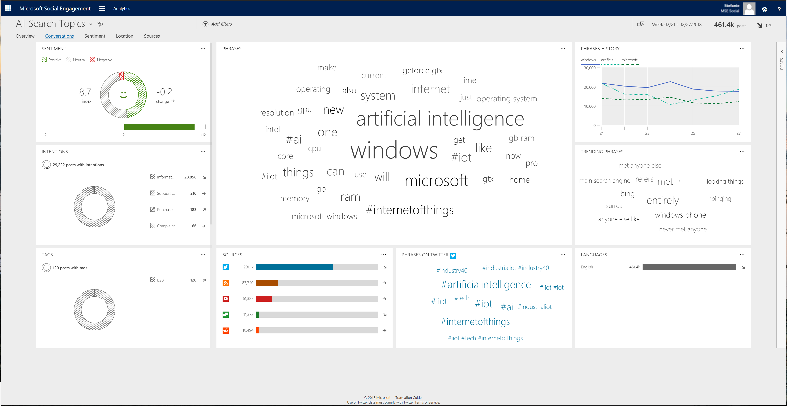

# Gain insights from public conversations

Get detailed content analytics and understand data like the most-used phrases, their volume, sources these conversations are coming from, and sentiment involved.  
  
In [!INCLUDE[pn-social-engagement-short](../includes/pn-social-engagement-short.md)], go to **Analytics > Conversations** to access the conversations page.  

## Hashtags

Lists the most popular hashtags in the content of the posts in your current data set. 

Dynamic widget. Shows only if hashtags are found in posts. Hashtags are available for Twitter, Instagram, and YouTube.

## Intentions

Lists the number and distribution of intentions (or intention tags) that were assigned to posts using the [automated intention analysis](tags.md#how-intention-analysis-works) and their trend indicator.

## Languages

Lists the five most-found languages based on the volume of posts and their trend indicator.

## Mentions

Shows the mentioned authors on [!INCLUDE[tn_twitter](../includes/tn-twitter.md)] that were found most often in the posts of your current data set. 

Dynamic widget. Shows only if the current data set contains [!INCLUDE[tn_twitter](../includes/tn-twitter.md)] posts that mention an author in the post contents. 

## Phrases

Lists often mentioned phrases, based on the posts of your current data set. The larger a phrase shows, the more posts contain this phrase.

## Phrases history

Visualizes the most mentioned phrases in the current data set by volume over time.  

## Phrases on [top source]

Lists significant phrases on the source with the most posts. The size is based on the volume of the phrases on the source.

## Sentiment

Visualizes the sentiment index based across all posts with sentiment value in the selected data set. Additionally, you find the change in sentiment index compared to the last similar time frame and its trend indicator.    
You can [manually change the sentiment values](analytics-sentiment.md) if you find a post's sentiment incorrectly analyzed. 

Dynamic widget. Shows only if the data set contains posts in at least one of the available search languages.

## Sources

Shows the number of posts in the most active sources, and summarizes how many posts were found in other sources.    
Click the **Full view** button  to expand the widget for additional details.  

## Tags
Shows the distribution of custom tags in your current data set. The Full view mode offers the top 100 tags.

Dynamic widget. Shows only if at least one post in your data is tagged with [a custom tag or an auto tag](tags.md).

> [!NOTE]
> Intentions are not included in this widget. They are only displayed in the [Intentions widget](analytics-conversations.md#intentions).

## Trending phrases

Lists significant phrases in the current data set, based on their trend indicator.  

### See Also

[Analyze social data using widgets](analyze-social-data-using-widgets.md)   
[Get to know your filters](use-filters.md)    
[Explore more options with your data set](more-options-with-data-set.md)    