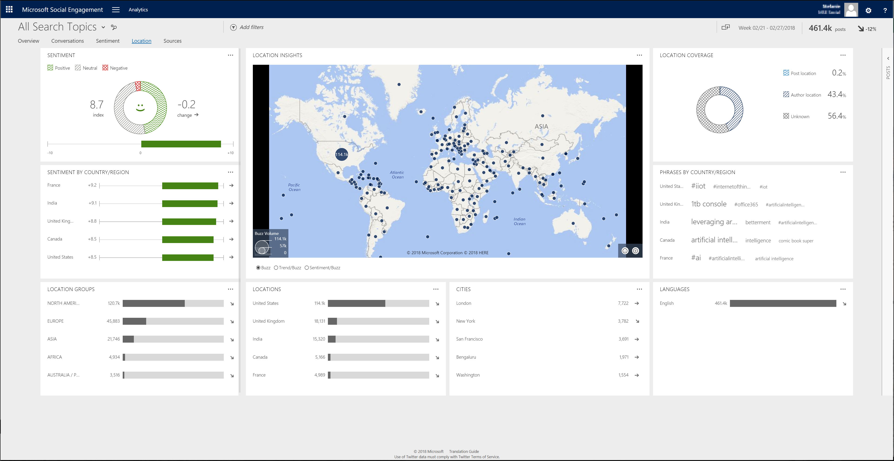

# Focus your analysis on location data

Get insights from geographical location information contained in posts or in authors’ profiles. Using the **Location** page, you can analyze your data set with a strong focus on where posts are coming from.  
  
In [!INCLUDE[pn-social-engagement-short](../includes/pn-social-engagement-short.md)], go to **Analytics** > **Conversations** to access the conversations page.  

  
## Types of location data  

In [!INCLUDE[pn_netbreeze_short](../includes/pn-social-engagement-short.md)], two types of location data are available:  
  
- **Author location:** Location data that is shared by a user through a profile, for example, on a user’s [!INCLUDE[tn_twitter](../includes/tn-twitter.md)] profile page. It is an approximate value, because the system calculates geographical coordinates. If no post location is provided by the user, the author location is considered, where available.  
  
- **Post location:** Location data that shows where (latitude/longitude) a post was published. The location can differ greatly between posts from the same author, depending on the settings that are applied when publishing the post. It is an exact value because geographical coordinates are provided with the post.  
  
Both types of location data are available under the [**Location Type** filter](use-filters.md) when defining a data set. 
  
For the United States, you can choose between two ways of grouping visualized data. To see how many posts with location data are available in each subregion, apply a filter for post location and select **Subregions**. To see posts with precise geographical information (post location data) on the map, select **Posts**.

> [!NOTE]
>  Some posts may have both post and author location. In these cases, the post location information is considered&mdash;not the author location.  
  
## Sources that provide location data  

A subset of available sources provides location data. Authors need to share their location information, so it can be processed by [!INCLUDE[pn-social-engagement-short](../includes/pn-social-engagement-short.md)].  

  
||Author location|Post location|  
|-|---------------------|-------------------|  
|[!INCLUDE[tn_twitter](../includes/tn-twitter.md)]|Yes|Yes|  
|News|Yes|No|  
|[!INCLUDE[tn_facebook](../includes/tn-facebook.md)]|No|No|  
|Blogs|No|No|  
|Videos|No|No|  
|Forums|Yes|No|  
|[!INCLUDE[tn_instagram](../includes/tn-instagram.md)]|No|Yes|  
  
## Authors

The normal view of this widget shows the top five authors and sources, based on the volume of posts and trend indicator. Select the **Full view** button  to expand the widget and find more details such as reach, source, and location for the 100 most-active authors and their posts.    
To add a filter for multiple authors at once, select the check boxes on the left side of the list for all authors that you want to include. Then select **INCLUDE** in the list header. To remove an author from the authors filter, select the check boxes on the left side of the list for all authors that you want to remove from the filter. Then select **EXCLUDE** in the list header.

> [!NOTE]
> Full view also has a **Delete** button  you can use to [delete a selected author](manage-authors.md) and the author’s posts. You must have a **Power Analyst** or **Administrator** user role to delete an author.
>  When you delete an author, none of the author’s previous posts will be available in the solution’s database; they are permanently deleted. No new posts from this author will be acquired in the future. 

## Cities

Lists the cities where most posts are coming from and their trend indicator. You can't drill down into more details from this list. 

## Languages

Lists the five most-used languages based on the volume of posts and their trend indicator.

##Locations

Lists the countries/regions where most posts are coming from and their trend indicator.

## Location coverage

Shows the percentage of posts and authors based on their location, combined with posts without location information.

## Location groups

Lists the location groups where most posts are coming from and their trend indicator.  

Dynamic widget. Shows only if posts from a country/region in the [configured location groups](manage-global-settings.md#create-and-manage-location-groups) are available. 

##Location insights

Visualizes the posts with location information on a map to find out where the posts are coming from. You can also [define an activity map](activity-maps.md) to see new posts in real-time, with additional functionality. 

 -  Single post in a specific location.
 -  Multiple posts at the same location.
 -  Clusters of posts with location data in the same area.

## Phrases by country/region

Lists the most-mentioned phrases coming from the five countries/regions with the most posts in the current data set.
  

## Sentiment

Visualizes the sentiment index across all posts with a sentiment value in the selected data set. It also shows the change in sentiment index compared to the last similar time frame and a trend indicator.    
You can [manually change the sentiment values](analytics-sentiment.md) if a post's sentiment is analyzed incorrectly. 

Dynamic widget. Shows only if the data set contains posts with sentiment value.
  
### See Also

[Analyze social data using widgets](analyze-social-data-using-widgets.md)   
[Get to know your filters](use-filters.md)    
[Explore more options with your data set](more-options-with-data-set.md)    
