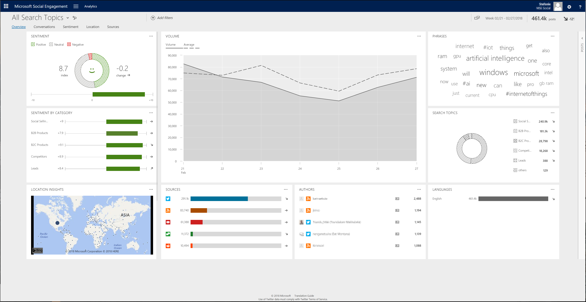

# Understand widgets on the overview page

Start your analysis with an overview of the data that your solution has acquired so far. Find key widgets that provide information such as the volume of posts, their sources, sentiment, and where the posts are coming from.  
  
In [!INCLUDE[pn-social-engagement-short](../includes/pn-social-engagement-short.md)], go to **Analytics** > **Overview** to access the overview page.  

  
> [!NOTE]
> **Overview** is the default page when you go to the Analytics area, or when you choose **[!INCLUDE[pn_netbreeze_long](../includes/pn-social-engagement-long.md)]** on the navigation bar.  

## Authors

The normal view of this widget shows the top five authors and sources, based on the volume of posts and trend indicator. Select the **Full view** button  to expand the widget and find more details such as reach, source, and location for the 100 most-active authors and their posts.    
To add a filter for multiple authors at once, select the check boxes on the left side of the list for all authors that you want to include. Then select **INCLUDE** in the list header. To remove an author from the filter, select the check boxes on the left side of the list for all authors that you want to remove from the filter. Then select **EXCLUDE** in the list header.
> [!NOTE]
> Full view also has a **Delete** button  you can use to [delete a selected author](manage-authors.md) and the author’s posts. You must have a **Power Analyst** or **Administrator** user role to delete an author.
>  When you delete an author, none of the author’s previous posts will be available in the solution’s database; they are permanently deleted. No new posts from this author will be acquired in the future.  

## Languages

Lists the five most-used languages based on the volume of posts and trend indicator.

## Location insights

Visualizes the posts with location information on a map to show where the posts are coming from. You can also [define an activity map](activity-maps.md) to see new posts in real-time, with additional functionality. 

Dynamic widget. Shows only if posts with location information are available in the selected data set.

## Phrases

Lists frequently mentioned phrases, based on the posts in your current data set. The larger a phrase appears, the more posts contain the phrase.

## Post types

Shows the volume of posts and comments on [!INCLUDE[tn_facebook](../includes/tn-facebook.md)] pages, separated by page and by author.

Dynamic widget. Shows only if the data set contains at least one search topic with a [!INCLUDE[tn_facebook](../includes/tn-facebook.md)] pages rule.

## Search topics

Shows the top five categories if you include all search topics in your data set, or search topics if you include a category in your data set, based on volume and trend indicator.

## Sentiment

Shows the sentiment index across all posts that have a sentiment value in the selected data set. It also shows changes in the sentiment index compared to the last similar time frame and the trend indicator.    
You can [manually change the sentiment values](analytics-sentiment.md) if you find that sentiment for a post is analyzed incorrectly. 

Dynamic widget. Shows only if the data set contains posts with sentiment values.

## Sentiment by category/search topic

View the sentiment index and sentiment trends for all posts that have a sentiment value in categories or search topics, sorted by volume.    
Select the **Full view** button  to expand the widget for more details.

Dynamic widget. Shows only if your data set contains posts with sentiment value. If you include all search topics in your data set, it will show the sentiment by categories. If you include a category in your data set, it will show the sentiment by search topic.

## Sources

Shows the number of posts in the most active sources and summarizes how many posts were found in other sources.    
Click the **Full view** button  to expand the widget for more details.  

## Volume

Shows the total number of posts and the average number of posts for the selected data set over time.
  
### See Also  
[Analyze social data using widgets](analyze-social-data-using-widgets.md)   
[Get to know your filters](use-filters.md)    
[Explore more options with your data set](more-options-with-data-set.md)    
[Understand the public perception using sentiment analysis](analytics-sentiment.md)
