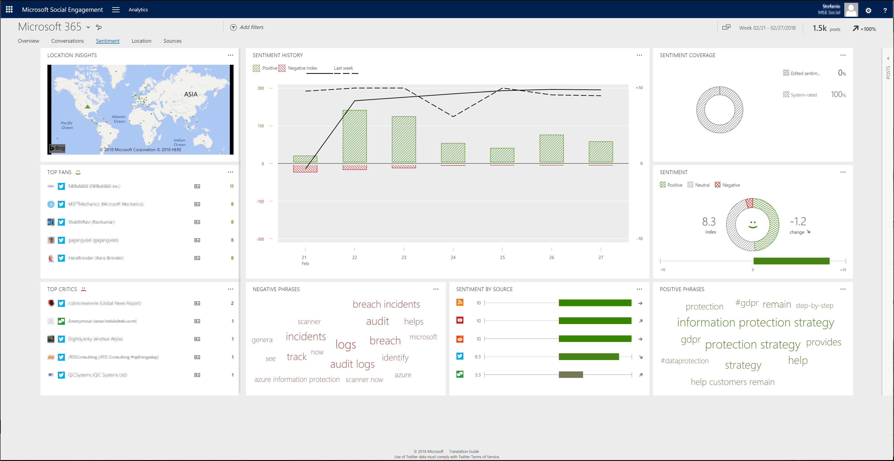

# Understand public perception using sentiment analysis

View and understand social sentiment in posts that are found by your search topics. Sentiment analysis in [!INCLUDE[pn_netbreeze_long](../includes/pn-social-engagement-long.md)] calculates the sentiment value of social posts using natural-language processing and machine learning techniques. 

In [!INCLUDE[pn-social-engagement-short](../includes/pn-social-engagement-short.md)], go to **Analytics** > **Sentiment** to learn more  about sentiment across posts in your data set.  

**Sentiment value** is the positive, negative, neutral, or unknown sentiment for a post. Occasionally, the algorithm identifies positive and negative parts of a sentence and rates the post as neutral, because the amount of positive or negative text cancel each other out. You can [edit and confirm sentiment values](work-with-posts.md) for individual posts to benefit from [adaptive learning](adaptive-learning.md) for your organization's sentiment algorithm. An unknown sentiment value indicates that the language isn’t supported by the sentiment algorithm. For more information on supported languages, download the [Microsoft Social Engagement Translation Guide](http://go.microsoft.com/fwlink/p/?LinkID=391086).

The **sentiment index** is calculated from the sentiment value of posts and normalized to a value between -10 and 10. All your active filters and parameters are considered to define the data set that the sentiment index calculates.  
  
-   A sentiment index of 10 means that there are no negative posts in your data set.  
  
-   A sentiment index of 0 means that there are equal amounts of positive and negative posts in your data set.  
  
-   A sentiment index of -10 means that there are no positive posts in your data set.  
  
Formula:  
  
`Sentiment index = (Positive posts – Negative posts)/(Positive posts + Negative posts) * 10`    

## Authors

The normal view of this widget shows the top five authors and sources, based on the volume of posts and trend indicator. Select the **Full view** button  to expand the widget and find more details such as reach, source, and location about the 100 most-active authors and their posts.    
To add a filter for multiple authors at once, select the check boxes on the left side of the list for all authors that you want to include. Then select **INCLUDE** in the list header. To remove an author from the authors filter, select the check boxes on the left side of the list for all authors that you want to remove from the filter. Then select **EXCLUDE** in the list header.
> [!NOTE]
> Full view also has a **Delete** button  that you can use to [delete a selected author](manage-authors.md) and the author’s posts. You must have a **Power Analyst** or **Administrator** user role to delete an author.
>  When you delete an author, none of the author’s posts will be available in the solution’s database; they are permanently deleted. No new posts from this author will be acquired in the future.  

## Location insights

Posts that include location information display on a map to show where the posts are coming from. You can also [define an activity map](activity-maps.md) to see new posts in real-time, with additional functionality. 

Dynamic widget. Shows only if posts with location information are available in the selected data set.

## Negative phrases

Lists often-mentioned negative phrases, based on the posts in your current data set. The larger that a phrase appears, the more posts contain this phrase.

## Positive phrases

Lists often-mentioned positive phrases, based on the posts in your current data set. The larger a phrase appears, the more posts contain this phrase.

## Sentiment

Visualizes the sentiment index across all posts that have a sentiment value in the selected data set. It also shows the change in sentiment index compared to the last similar time frame and trend indicator.    
You can [manually change the sentiment values](analytics-sentiment.md) if you find that a post's sentiment is analyzed incorrectly. 

## Sentiment coverage

Shows the relative distribution of system-rated and manually edited sentiment values. 

## Sentiment history

Shows the number of posts with sentiment value, the sentiment index, and the average sentiment value for a selected time frame.

## Sentiment by source

Lists the sentiment index for the top five sources and trend indicators.

## Top critics

Lists the authors who published the most posts with a negative sentiment value.

## Top fans

Lists the authors who published the most posts with a positive sentiment value.
  
### See Also

[Analyze social data using widgets](analyze-social-data-using-widgets.md)   
[Get to know your filters](use-filters.md)    
[Explore more options with your data set](more-options-with-data-set.md)    
