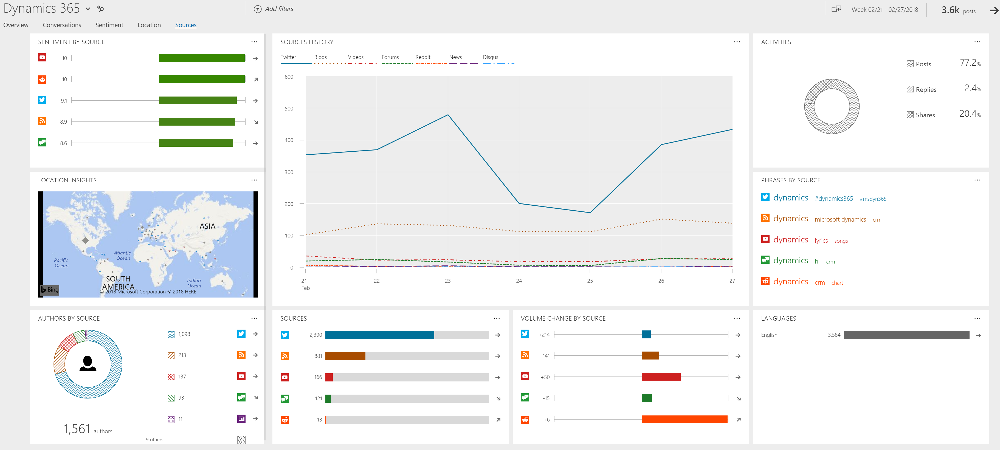

# Analyze the sources of posts in your data set

Understand which social media sources are found most often in your search topics. Find analytics such as top sources, top languages, and the sentiment analysis.  
  
In [!INCLUDE[pn-social-engagement-short](../includes/pn-social-engagement-short.md)], go to **Analytics > Sources** to find more details about sources of the posts in your data set.  

    
## Activities

Shows the type activity (post, reply, share, retweet) of posts based on the volume.

## Authors

The normal view of this widget shows the top five authors and the sources, based on the volume of their posts and their trend indicator. Select the **Full view** button  to expand the widget and find additional details such as reach, source, and location about the 100 most active authors and their posts.    
To add a filter for multiple authors at once, select the check boxes on the left side of the list for all authors that you want to include. Then select **INCLUDE** in the list header. To remove an author from the authors filter, select the check boxes on the left side of the list for all authors that you want to remove from the filter. Then select **EXCLUDE** in the list header.
> [!NOTE]
> Full view also has a **Delete** button  you can use to [delete a selected author](manage-authors.md) and the author’s posts. You must have a **Power Analyst** or **Administrator** user role to delete an author.
>  When you delete an author, none of the author’s previous posts will be available in the solution’s database; they are permanently deleted. No new posts from this author will be acquired in the future.  
  
## Authors by source

Authors by Source not only shows the most active sources, but also summarizes how many authors posted in the other sources.

## Languages

Lists the five most-found languages based on the volume of posts and their trend indicator.

##Location insights

Visualizes the posts with location information on a map to find out where the posts are coming from. You can also [define an activity map](activity-maps.md) to see new posts in real-time, with additional functionality. 

Dynamic widget. Shows only if posts with location information are available in the selected data set.

## Phrases by sources

Lists top phrases for the top five sources based on the volume.

##Sources

Shows the number of posts in the most active sources, and summarizes how many posts were found in other sources.    
Click the **Full view** button  to expand the widget for additional details.  
  
## Sources by sentiment

Lists the top five sources along with their sentiment index and trend indicator.  

## Sources history

Visualizes the volume of posts from the different sources in the selected time frame. 

##Volume change by source

Shows the change in post volume for the top five sources, compared to previous periods, and their trend indicator.

### See Also  

[Analyze social data using widgets](analyze-social-data-using-widgets.md)   
[Get to know your filters](use-filters.md)    
[Explore more options with your data set](more-options-with-data-set.md)    