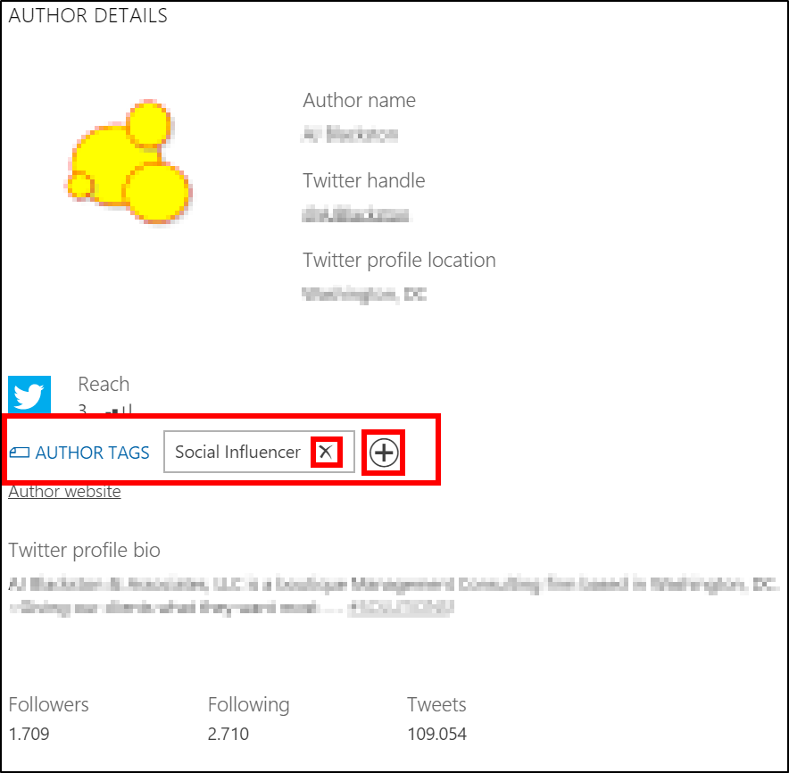

# Manage author tags

Author tags let you add tags to authors to group and classify them. For example, you can tag influencers, competitors, or fans. When authors are tagged, you can quickly find them using [filters](understand-filters.md) and you can get a heads-up when new posts from these authors are found by [setting up alerts](email-alerts.md). 
Every user can add or remove author tags when working with an author's details. You need to have an [interaction role](user-roles.md) of Responder or Manager to create new author tags.

> [!TIP]
> To review all authors that have a certain tag added, go to **Social Engagement** > **Analytics** > **Overview** and apply an **Author Tags** [filter](use-filters.md). You’ll find the 100 most active authors with this tag in the **Authors** widget when you expand it to the full view. 

## View author tags

To see the author tags added to a specific author, you need to open the **[Author Details](author-details.md)**. 

## Add or create author tags

Tag authors for quicker filtering options and to classify groups of authors.

1. In [!INCLUDE[pn-social-engagement-short](../includes/pn-social-engagement-short.md)], open the **[Author Details](author-details.md)** for the author you want to tag. 
2. Next to **Author Tags**, select  **Add author tags**.
3. Enter the name of the tag you want to add. If it’s already available, you can select it from the list. 
4. Select **Confirm** to apply the author tag.

## Remove author tags

If a tag is no longer accurate, you can remove it from the author.

1.	In [!INCLUDE[pn-social-engagement-short](../includes/pn-social-engagement-short.md)], open the **[Author Details](author-details.md)** for the author you want to remove tags from. 
2.	Next to the tag you want to remove, select  **Remove this tag**.
3.	Select **Confirm** to remove the tag.

## Change author tags

To edit the author tags that were assigned to an author, you can either [add](#add-or-create-author-tags) more author tags (up to 20 per author), or [remove](#remove-author-tags) those that don’t match anymore. 

## Export author tags data

If you want to extract the author tags that were added to a specific author, you can copy the labels of the tags and paste them into a document.

### See also

[User roles and permissions](user-roles.md)    
[Work with tags](tags.md)    
[Use filters](use-filters.md)
