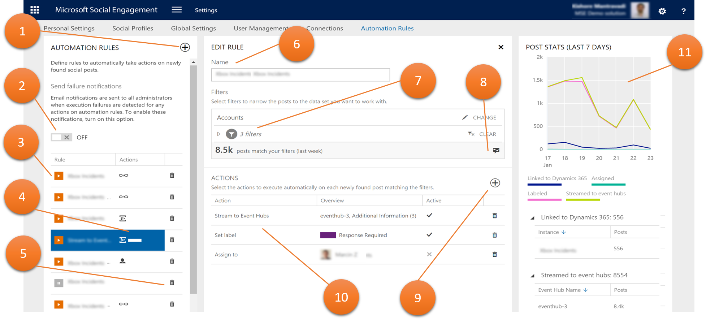
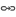

# Route posts using automation rules
Do you ever feel overwhelmed by how much noise you need to cut through on social media to find posts that are relevant to you? Using automation rules, you don’t need to go through every post manually to create new cases, leads, or events. Let automation rules take care of the routing process. Automation rules can assign posts to users or groups, create new records in [!INCLUDE[pn_crm_shortest](../includes/pn-crm-shortest.md)], or create events in [!INCLUDE[pn_microsoft_azure_event_hubs](../includes/pn-microsoft-azure-event-hubs.md)], if newly-found posts match the filters for your automation rule.  
  
   
## Prerequisites  
  
-   Your organization owns [!INCLUDE[pn_netbreeze_long](../includes/pn-social-engagement-long.md)] Enterprise licenses. [!INCLUDE[proc_more_information](../includes/proc-more-information.md)] [Microsoft Dynamics pricing and licensing](http://go.microsoft.com/fwlink/p/?LinkID=401462), [Manage licenses for Social Engagement](manage-licenses.md)  
  
-   You have a Manager or Administrator user role in [!INCLUDE[pn_netbreeze_short](../includes/pn-social-engagement-short.md)] to manage automation rules. All user roles can see how automation rules are configured. [!INCLUDE[proc_more_information](../includes/proc-more-information.md)] [Understand user roles](user-roles.md)  
  
- [!INCLUDE[pn_netbreeze_short](../includes/pn-social-engagement-short.md)] is connected to a [!INCLUDE[pn_CRM_Online](../includes/pn-crm-online.md)] Update 2016 (or later) instance. [!INCLUDE[proc_more_information](../includes/proc-more-information.md)] [Connect Dynamics 365 and Social Engagement](connect-dynamics-365-social-engagement.md)  
  
 All users, regardless of user role and license type, can see the automation rules that were defined. All users open the same data set in Analytics.  
  
   
## Elements of an automation rule  
For each automation rule, there are several navigation elements and values to define. The following screenshot  shows more about what an automation rule consists of.  
  
  
  
1.  Button to create new automation rules.  
  
2.  Switch to receive email notification if an action fails.  
  
3.  List of automation rules and their status for a quick overview.  
  
4.  Actions configured for the automation rule.   
  
5.  Button to delete the automation rule .  
  
6.  Name of the selected automation rule.  
  
7.  Filters that trigger this automation rule. For an active rule, every newly-found post matching these filters will be handled by this rule. [!INCLUDE[proc_more_information](../includes/proc-more-information.md)] [Use filters to see relevant data](use-filters.md)  
  
8.  View the data set in Analytics .  
  
9. Button to add new actions to the automation rule.  
  
10. Actions that are taken on newly-found posts matching the defined filters.  
  
11. Summary of actions taken on posts in the past 7 days.  
  
When no rule is selected, you'll see the  aggregated numbers across all automation rules. For example, If two rules stream  data to the same event hub, you will see an aggregated value for that event hub. Only the data for rules with active actions show in the chart. If an action that was removed or disabled is added or enabled again, the stats panel will show any data available for that action in the past 7 days, if it was active anytime during that period.  
  
   
## Available actions for automation rules  
The following section explains more about the available actions for automation rules.  
  
> [!TIP]
> [!INCLUDE[pn_netbreeze_short](../includes/pn-social-engagement-short.md)] can send administrators a failure notification if an action in an automation rule fails. Administrators can turn this feature on if they want to receive these notifications. To receive email notifications, go to **Settings** > **Automation Rules**, and then set **Send failure notification** to **ON**.  
>   
>  For troubleshooting information when receiving failure notifications, see [Troubleshoot issues with failing actions](#troubleshoot).  
  
   
### Create a link to Dynamics 365 from a social post  
Automatically link posts to [!INCLUDE[pn_crm_shortest](../includes/pn-crm-shortest.md)] to create records from social posts. To use this feature, make sure there’s an active connection to a [!INCLUDE[pn_crm_shortest](../includes/pn-crm-shortest.md)] instance. Also ensure that the [!INCLUDE[pn_crm_shortest](../includes/pn-crm-shortest.md)] rule framework is correctly configured to process the Social Activity entities created when a post is linked to [!INCLUDE[pn_crm_shortest](../includes/pn-crm-shortest.md)]. [!INCLUDE[proc_more_information](../includes/proc-more-information.md)] [Create a Dynamics 365 record from a social post](create-dynamics-365-record-from-social-post.md), [Link posts from Social Engagement to Dynamics 365](link-posts-to-dynamics-365.md), [CRM Help & Training: Set up rules to automatically create or update records in CRM](http://go.microsoft.com/fwlink/p/?LinkId=624394)  
  
   
### Assign posts to a user or a group in Social Engagement  
Automatically assign posts that match your defined filters to a user or a group in [!INCLUDE[pn_netbreeze_short](../includes/pn-social-engagement-short.md)]. For example, you can assign every post with a purchase intention to your sales team to follow up on. [!INCLUDE[proc_more_information](../includes/proc-more-information.md)] [Work with posts](work-with-posts.md)  
  
   
### Set a label  
Automation rules  provide a Set Label action. Based on the filters you define, a label can be set on posts automatically.  For example, you can set a “Review immediately” label on posts from your top influencers so that your community management team can follow up with high priority. [!INCLUDE[proc_more_information](../includes/proc-more-information.md)] [Create, edit, or delete an automation rule](automation-rules.md#manage_rules)  
  
   
### Stream posts to Microsoft Azure Event Hubs  
Automatically stream posts as events as JSON payloads to [!INCLUDE[pn_azure_event_hubs](../includes/pn-azure-event-hubs.md)]. You must have a connection to an event hub set up to see this action. [!INCLUDE[proc_more_information](../includes/proc-more-information.md)] [Stream data from Social Engagement to Microsoft Azure Event Hubs](stream-data-to-event-hubs.md)  
  
   
## Troubleshoot issues with failing actions  
When you receive failure notifications, there are a few common issues and simple solutions to them. Often, the issues are related to connection problems to other services, or sudden spikes in volume of posts.  
  
### Link to Dynamics 365 action fails  
**Possible causes**  
  
Either the connection to [!INCLUDE[pn_crm_shortest](../includes/pn-crm-shortest.md)] is no longer active or valid, or there are too many posts queued and [!INCLUDE[pn_crm_shortest](../includes/pn-crm-shortest.md)] throttles the creation of new records. After several failed retires, the posts are dropped from the queue, and a failure notification is sent. [!INCLUDE[proc_more_information](../includes/proc-more-information.md)] [How Social Engagement handles conflicting automation rules](#conflicting_rules)  
  
**Address the issue**  
  
1. Review the [!INCLUDE[pn_crm_shortest](../includes/pn-crm-shortest.md)] connection that was used in the failing automation rule. Make sure the provided connection details are still active. [!INCLUDE[proc_more_information](../includes/proc-more-information.md)] [Connect Dynamics 365 and Social Engagement](connect-dynamics-365-social-engagement.md)  
  
2. Open the automation rule and review its estimated number of matching posts. Keep in mind that these estimations might change quickly if trends on social channels change, unexpected events occur, or search topics or filters are updated. Keep the number of linked posts reasonable. Creating hundreds of leads or cases per day is a rather uncommon scenario.  
  
**Recover missed posts**  
  
You can manually link missed posts to [!INCLUDE[pn_crm_shortest](../includes/pn-crm-shortest.md)] from the Analytics area in [!INCLUDE[pn_netbreeze_short](../includes/pn-social-engagement-short.md)].  
  
1. Open the automation rule with the failed Link to [!INCLUDE[pn_crm_shortest](../includes/pn-crm-shortest.md)] actions and click **View in Analytics**  to see the posts  that match your defined filters.  
  
2. Set a custom timeframe for the period you want to review for missed posts.  
  
3. Click the filter icon and add a **Link to Dynamics 365** filter. Set its value to **Not linked to a Dynamics 365 record**.  
  
   All posts that remain in your data set were missed by the automation rule and weren't linked to a [!INCLUDE[pn_crm_shortest](../includes/pn-crm-shortest.md)] instanceand you can manually link them.  
  
4. Open the post list and click **Link to Dynamics 365**  to create records for the missed posts in [!INCLUDE[pn_crm_shortest](../includes/pn-crm-shortest.md)]. [!INCLUDE[proc_more_information](../includes/proc-more-information.md)] [Create a Dynamics 365 record from a social post](create-dynamics-365-record-from-social-post.md)  
  
### Stream to Event Hubs action fails  
**Possible causes**  
  
Commonly, the failure is caused by a broken connection between the [!INCLUDE[pn_azure_event_hubs](../includes/pn-azure-event-hubs.md)] and [!INCLUDE[pn_netbreeze_short](../includes/pn-social-engagement-short.md)]. An event hub might have been renamed, or its keys have changed and thus the connection string for that event hub is no longer valid.  
  
**Address the issue**  
  
1.  Find the name of the event hub connection to review in the failure notification.  
  
2.  In the [Microsoft Azure portal](https://portal.azure.com), open the connection details for that event hub.  
  
3.  In [!INCLUDE[pn_netbreeze_short](../includes/pn-social-engagement-short.md)], go to **Settings** > **Global Settings** > **Connections** > **Azure Event Hubs**.  Check the connection string and the name of the event hub and make sure they match exactly. [!INCLUDE[proc_more_information](../includes/proc-more-information.md)] [Work with events from Social Engagement in Azure Event Hubs](work-with-event-hubs.md)  
  
**Identify missed psots**  
  
Event hubs are built to handle high volumes of events in real time. Although you can’t manually send posts to an event hub from [!INCLUDE[pn_netbreeze_short](../includes/pn-social-engagement-short.md)], you can quickly find how many posts were missed.  
  
1.  Open the automation rule with the **Stream to Event Hubs** actions and click **View in Analytics**  to see the posts  that match your defined filters.  
  
2.  Set a custom timeframe for the time period you want to review for missed posts. This shows the number of posts that should show as individual events in the event hub.  
  
3.  Compare the number of posts resulting in step 2 with the actual results showing in the event hub.  
  
   
## Create, edit, or delete an automation rule  
Automation rules are visible to all users of [!INCLUDE[pn_netbreeze_short](../includes/pn-social-engagement-short.md)], but only users with Manager or Administrator roles can manage them. [!INCLUDE[proc_more_information](../includes/proc-more-information.md)] [Understand user roles](user-roles.md "Understand user roles")  
  
> [!IMPORTANT]
>  To link posts to [!INCLUDE[pn_crm_shortest](../includes/pn-crm-shortest.md)] using automation rules, make sure the [!INCLUDE[pn_crm_shortest](../includes/pn-crm-shortest.md)] instance you select is upgraded to at least [!INCLUDE[pn_CRM_Online](../includes/pn-crm-online.md)] Update 2016. Automation rules aren't supported for [!INCLUDE[pn_crm_op_edition](../includes/pn-crm-onprem.md)]. To link a post manually to [!INCLUDE[pn_crm_op_edition](../includes/pn-crm-onprem.md)], see [Connect Dynamics 365 and Social Engagement](connect-dynamics-365-social-engagement.md).  
  
   
### Create an automation rule  
  
1.  Go to **Settings** > **Automation Rules**.  
  
2.  In the **Automation Rules** pane, click **Add new rule** .  
  
3.  In the **Create Rule** pane, provide a **Name** for your new rule.  
  
4.  In the **Status** drop-down list, select if the new rule should be **Active** or **Inactive**.  
  
5.  In the **Filters** section, click **Change**  to define the data set that newly-found posts need to match to trigger the rule's actions. [!INCLUDE[proc_more_information](../includes/proc-more-information.md)] [Use filters to see relevant data](use-filters.md)  
  
    > [!NOTE]
    >  To get an idea of the volume of posts your actions may be executed on, you’ll see the number of posts that matched your selected filters in your default time frame.  
  
6.  In the **Actions** section, click **Add**  to add an action to the rule.  
  
    -   Set the values for **Link to Dynamics 365**  to link the matching posts to a [!INCLUDE[pn_crm_shortest](../includes/pn-crm-shortest.md)] instance with the defined entity parameter. Make sure that you set up both the rule framework in [!INCLUDE[pn_crm_shortest](../includes/pn-crm-shortest.md)] and the connection to [!INCLUDE[pn_crm_shortest](../includes/pn-crm-shortest.md)] in [!INCLUDE[pn_netbreeze_short](../includes/pn-social-engagement-short.md)]. [!INCLUDE[proc_more_information](../includes/proc-more-information.md)] [Link posts from Social Engagement to Dynamics 365](link-posts-to-dynamics-365.md), [CRM Help & Training: Set up rules to automatically create or update records in CRM](http://go.microsoft.com/fwlink/p/?LinkId=624394)  
  
    -   Set the values for **Stream to Event Hubs**  to create JSON events from matching posts in the selected event hub. [!INCLUDE[proc_more_information](../includes/proc-more-information.md)] [Stream data from Social Engagement to Microsoft Azure Event Hubs](stream-data-to-event-hubs.md), [JSON reference for events from Social Engagement](event-hubs-json-reference-social-engagement.md)  
  
    -   Set the values for **Assign to**  to assign matching posts to the specified user or group. [!INCLUDE[proc_more_information](../includes/proc-more-information.md)] [Work with posts](work-with-posts.md)  
  
    -   Set the values for **Set label**  to automatically label incoming social posts that match your data set.  
  
7.  Set the **Active** switch to **ON** to activate your automation rule.  
  
8.  Click **Save**  to apply your configuration.  
  
> [!NOTE]
>  Automation rules start processing posts that match the defined filters as soon as the rule is activated and saved. However, the rule won’t process any posts that were found before the automation rule was created, or while it was inactive. If you deactivate an existing automation rule, it will restart to process the newly-found posts after you reactivate the rule. If your administrator sets **Send failure notifications** to on, all administrators will receive an email if an action failed, so you can quickly take action.  
  
   
### Edit an automation rule  
  
1.  Go to **Settings** > **Automation Rules**.  
  
2.  In the **Automation Rules** pane, click the rule you want to edit.  
  
3.  In the **Edit Rule** pane, update the values.  
  
4.  Click **Save**  to apply your configuration.  
  
   
### Delete an automation rule  
  
1.  Go to **Settings** > **Automation Rules**.  
  
2.  In the **Automation Rules** pane, click the rule you want to delete.  
  
3.  Click **Delete rule** .  
  
4.  Confirm your deletion.  
  
   
## Quickly create an automation rule while working in Social Engagement  
When working with data sets in Social Engagement, you may want a data set to persist, to quickly create an automation rule based on it. You quickly create automation rules when working with your data in  Analytics, or from a stream in Social Center. Click **More options with current filters**  to create an automation rule from your current data set. [!INCLUDE[proc_more_information](../includes/proc-more-information.md)] [Explore more options with your data set](more-options-with-data-set.md)  
  
   
## How Social Engagement handles conflicting automation rules  
A newly-found post can match the filters of more than one automation rule. If there's more than one matching rule, Social Engagement will execute the actions from the rule that was added most recently.  
  
> [!CAUTION]
>  If a post matches the filters for multiple automation rules, only the last created (the newest) automation rule will process the post.  
>   
>  You can create up to 1 link per second in the same [!INCLUDE[pn_crm_shortest](../includes/pn-crm-shortest.md)] instance. If more than 1 post per second matches your active automation rules, [!INCLUDE[pn_netbreeze_short](../includes/pn-social-engagement-short.md)] will continue trying to create the link every minute, for a maximum of 10 minutes. If [!INCLUDE[pn_crm_shortest](../includes/pn-crm-shortest.md)]'s queue is still blocked after 10 re-tries, the post gets dropped eventually.  
  
### See Also  
[Administer Microsoft Social Engagement](administer-microsoft-social-engagement.md)   
[Stream data from Social Engagement to Microsoft Azure Event Hubs](stream-data-to-event-hubs.md)   
[Link posts from Social Engagement to Dynamics 365](link-posts-to-dynamics-365.md)   
[Explore more options with your data set](more-options-with-data-set.md)
