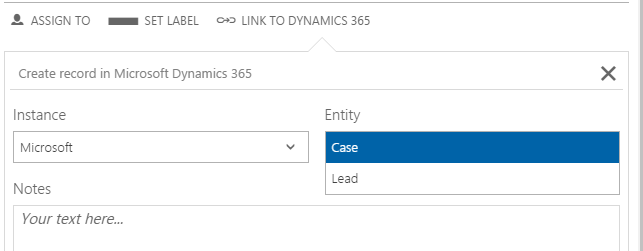
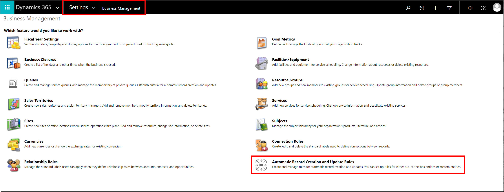
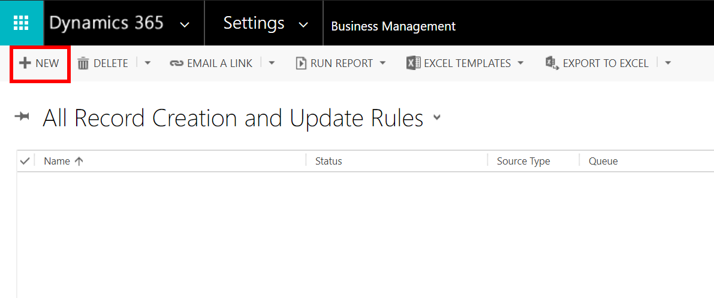
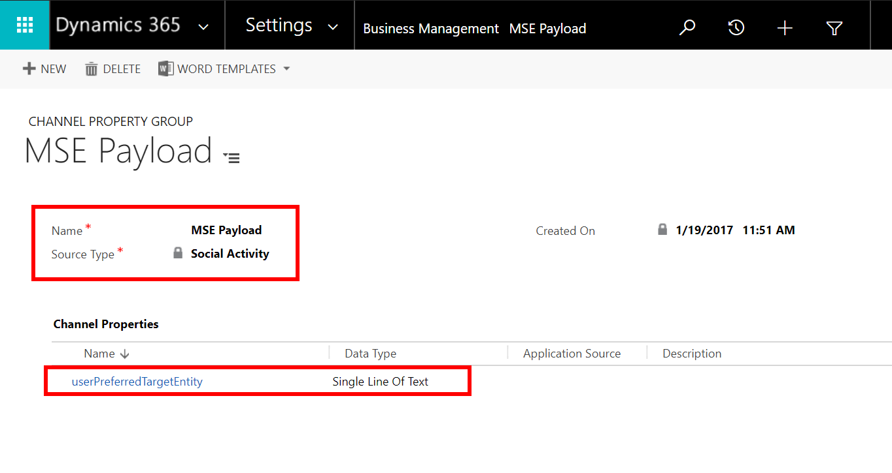
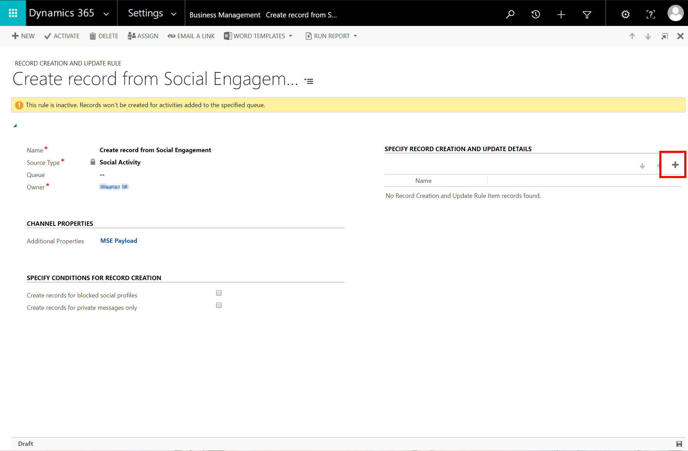
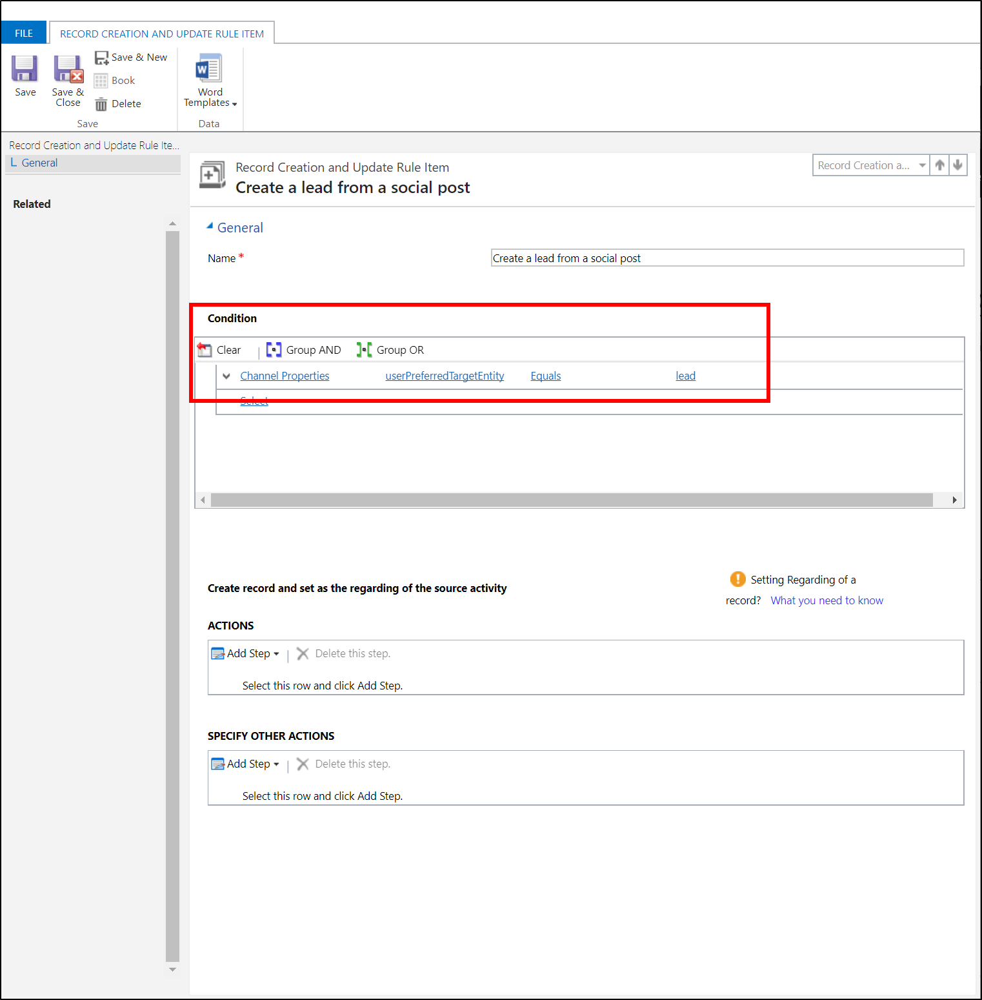
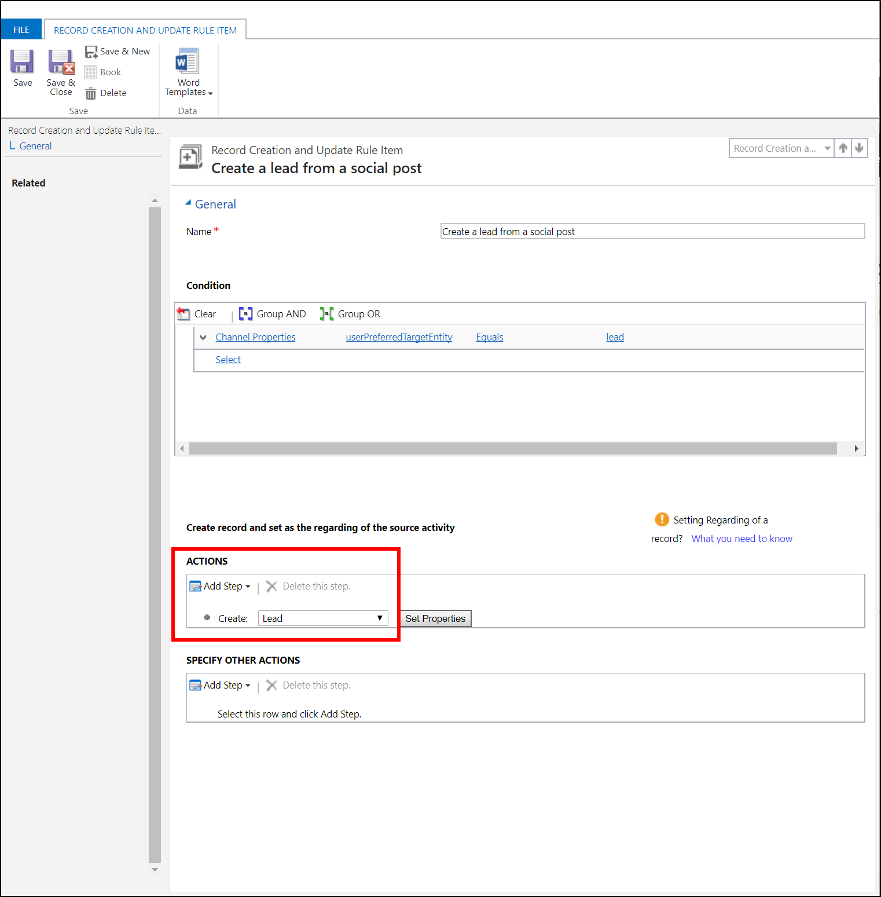
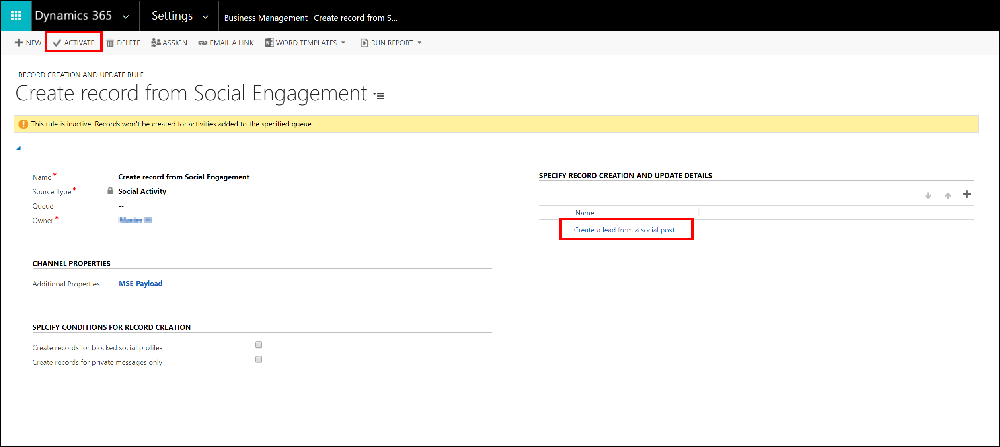

# Configure Automatic Record Creation and Update Rules in Dynamics 365 to process Social Activity entities from Social Engagement

To automatically create an entity record (such as a Case or a Lead) from a Social Activity record in [!include], an administrator or customizer must configure Automatic Record Creation and Update Rules in [!include].

In [!INCLUDE[MSE](../includes/pn-social-engagement-short.md)], when users [link a post to Dynamics 365](link-posts-to-dynamics-365.md), a Social Activity record is created in the connected [!include] instance. The entity type the user creates in [!INCLUDE[MSE](../includes/pn-social-engagement-short.md)] (Case, Lead, and so on) is passed on as part of the [JSON Payload](create-dynamics-365-record-from-social-post.md#understand-the-data-sent-to-dynamics-365-when-you-create-a-social-activity) to the social activity in [!include].

> [!IMPORTANT]
>  Without Automatic Record Creation and Update Rules, the Social Activity record created in [!include] by [!INCLUDE[MSE](../includes/pn-social-engagement-short.md)] does not automatically result in a corresponding [!include] entity record (such as a Case or Lead record).

## Create a rule to automatically turn social activities into Lead or Case records

1. Sign in to [!include] with your system administrator or customizer credentials.

2. Go to **Settings** > **Business Management** > **Automatic Record Creation and Update Rules**.

  

3. Select **New** to create a new rule.

  

4. Provide a **Name** for the rule.

5. Set the **Source Type** to **Social Activity**.

6. Click **Save** to create the record.

  

7. Under **Channel Properties**, select **Additional Properties**.

8. Select the **Search** button, and then select **New**.

9. In the new dialog box, provide a **Name** for the Channel Property Group. For **Source Type**, select **Social Activity**.

10. Select **Save**.

11. Select **Add Channel Property record** in the newly created Channel Property Group. Enter **userPreferredTargetEntity** for the name, and set the **Data Type** to **Single Line of Text**. It's important that you match the name as documented in the [JSON payload](create-dynamics-365-record-from-social-post.md#understand-the-data-sent-to-dynamics-365-when-you-create-a-social-activity). Now that the Channel Property is in place, you create the actual update rules.

12. Select **Save**, and then close the dialog boxes.

  

13. In **Record Creation and Update Rule**, select **Add Record Creation and Update Rule Item record**.

  

14. In the new dialog box that opens, provide a **Name** for the rule and then select **Save** to create the rule.

15. Under **Condition**, choose **Select**, and scroll to the bottom of the drop-down list to find **Channel Properties** under **Local Values**. Then, select **userPreferredTargetEntity** **Equals** **lead**.  
    
    > [!NOTE]
    > The value for userPreferredEntity must exactly match the value in the JSON payload. This value is the [!include] entity type name that can be different from the name in the [!include] user interface. For example, the entity type name for Case is _incident_.

  

16. Under **Action**, select **Add Step**, and then select **Create Record**. Set the value to **Lead**. 

  

17. Click **Save & Close** to finalize the rule.

18. Verify that the rules were created, and then select **Activate** to activate the rule.    
Social Activity entities created from [!INCLUDE[MSE](../includes/pn-social-engagement-short.md)] will now automatically create the configured record type in [!include]. 

  

> [!TIP]
> To create a Case record, repeat the steps above but select **userPreferredTargetEntity** **Equals** **incident**, and under **Action**, set the **Create Record** value to **Case**.

### See also

[Set up the connection to link posts from Social Engagement to Dynamics 365](link-posts-to-dynamics-365.md)    
[Link posts from Social Engagement to Dynamics 365](create-dynamics-365-record-from-social-post.md)    
[Set up rules to automatically create or update records in Dynamics 365](https://technet.microsoft.com/library/mt812474.aspx)
