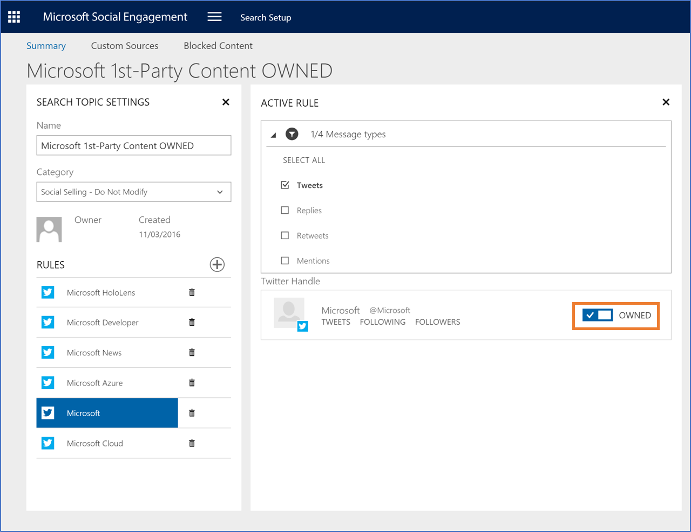
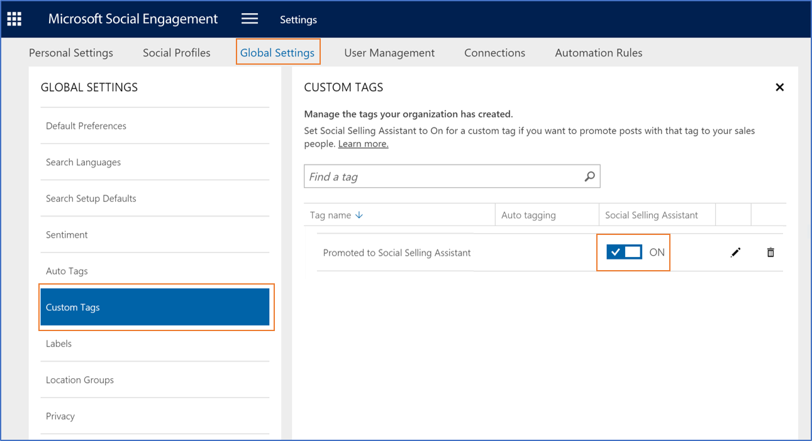

# Configure Social Engagement for the Social Selling Assistant
Before you invite users to work with Social Selling Assistant, we recommend that an administrator configure [!INCLUDE[pn_netbreeze_long](../includes/pn-social-engagement-long.md)], so users get the most out of the recommendation experience.  The personalized content feeds are based on the configuration in the connected [!INCLUDE[pn_netbreeze_long](../includes/pn-social-engagement-long.md)] solution. Users can choose from the available search topics and social profiles to personalize their Social Selling Assistant settings.In the personalization process, users get to choose the search topics to get insights and recommendations for sharing. Also, they can add their own social profiles or view shared profiles for sharing the recommendations.  
  
After a system administrator installs the Social Selling Assistant in [!INCLUDE[pn_ms_dyn_365](../includes/pn-ms-dyn-365.md)], an administrator in [!INCLUDE[pn_netbreeze_short](../includes/pn-social-engagement-short.md)] can optimize its configuration. Start by flagging search topics that gather posts which are owned by your organization or create a special tag to promote certain posts to users in Social Selling Assistant. Finally, you can share social profiles with other users to allow them post on their behalf.  
  
  
## Flag social profiles in search rules as “owned”

If you configured a search rule for posts from social profiles owned by your organization, you can flag them accordingly. This enables the recommendation model to clearly distinguish between content from profiles your organization owns and content owned by others, and process it accordingly.

### Flag owned profiles

1. In Social Engagement, go to **Search Setup**.

2. Select the search topic you want to update.

3. Select the search rule that contains the social profiles or create a new rule.

   

4. In the social profiles list, set **Owned** to **Yes** if your organization owns the profile.

> [!TIP]
> As an ongoing process to ease maintenance, consider setting the **Owned** flag  when new search topics and/or search rules are created in your organization.

## Share social profiles with other users

Users of the Social Selling Assistant can either add their own social profiles or choose from shared profiles to share recommended content. To add a social profile or to share a social profile you own with other users, see [Manage social profiles](manage-social-profiles.md).

## Configure a custom tag to promote posts

Enable your organization to amplify specific messages on social media. Build on the functionality of the Social Selling Assistant by manually promoting such messages to your salespeople by adding a specific tag to a post in [!INCLUDE[pn_netbreeze_short](../includes/pn-social-engagement-short.md)].

### Specify a promotion tag

1. As an  administrator in [!INCLUDE[pn_netbreeze_short](../includes/pn-social-engagement-short.md)], go to **Settings** > **Custom Tags**.

2. Select the tag you want to use to promote posts.

3. Set the **Social Selling Assistant** setting to **On**. [!INCLUDE[proc_more_information](../includes/proc-more-information.md)] [Work with tags](tags.md)

All posts that have the one or more of these tags will be promoted automatically to Social Selling Assistant. To promote a specific post to Social Selling Assistant, apply any of the tags that you marked here to that post. [!INCLUDE[proc_more_information](../includes/proc-more-information.md)] [Promote a post to the Social Selling Assistant](work-with-social-selling-assistant.md#promote-a-post-to-the-social-selling-assistant)

### See Also

[Increase your influence using the Social Selling Assistant](social-selling-assistant-overview.md)   
[Personalize the Social Selling Assistant for individual users](personalize-social-selling-assistant.md)   
[Set up searches to listen to social media conversations](set-up-searches.md)   
[Work with the Social Selling Assistant](work-with-social-selling-assistant.md)   
[TechNet: Extend Dynamics 365 with integration and solutions](https://technet.microsoft.com/library/dn832126.aspx)
