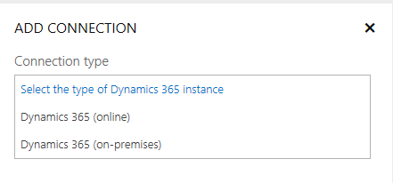
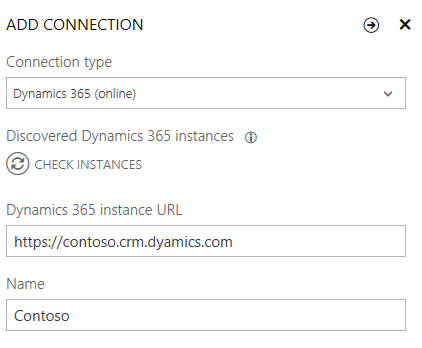

# Connect Dynamics 365 and Social Engagement

Set up the connection between [!INCLUDE[pn_dynamics_crm](../includes/pn-dynamics-crm.md)] and [!INCLUDE[pn_netbreeze_short](../includes/pn-social-engagement-short.md)] so you can link social posts to [!INCLUDE[pn_crm_shortest](../includes/pn-crm-shortest.md)]. Linking posts to [!INCLUDE[pn_crm_shortest](../includes/pn-crm-shortest.md)] lets you create [!INCLUDE[pn_crm_shortest](../includes/pn-crm-shortest.md)] records from social posts that were found in [!INCLUDE[pn_netbreeze_short](../includes/pn-social-engagement-short.md)] by using the **Automatic Record Creation and Update Rules** feature in [!INCLUDE[pn_dynamics_crm](../includes/pn-dynamics-crm.md)].  
  
## Prerequisites to establish a connection with Dynamics 365 

The following prerequisites apply to both [!INCLUDE[pn_dynamics_crm_online](../includes/pn-dynamics-crm-online.md)] and [!INCLUDE[pn_dyn_365_op](../includes/pn-dyn-365-op.md)]. Prerequisites specific to [!INCLUDE[pn_dynamics_crm_online](../includes/pn-dynamics-crm-online.md)] or [!INCLUDE[pn_crm_2016](../includes/pn-crm-2016.md)] are listed later in this topic.  
  
- You have a license assigned for both [!INCLUDE[pn_dynamics_crm](../includes/pn-dynamics-crm.md)] and [!INCLUDE[pn_netbreeze_long](../includes/pn-social-engagement-long.md)].  
  
- You have a System Administrator security role in [!INCLUDE[pn_dynamics_crm](../includes/pn-dynamics-crm.md)]. [Contact your system administrator](http://go.microsoft.com/fwlink/p/?LinkID=513070) if you need an upgrade to your licensed products or an update to your permissions.
  
- You have an Administrator user role in [!INCLUDE[pn_netbreeze_short](../includes/pn-social-engagement-short.md)]. To find out your user role in [!INCLUDE[pn_netbreeze_short](../includes/pn-social-engagement-short.md)], go to **Settings** > **Personal Settings** > **Your Preferences**.
  
- Your browser is likely to block any pop-up windows opened by [!INCLUDE[pn_netbreeze_short](../includes/pn-social-engagement-short.md)] when authenticating to [!INCLUDE[pn_crm_shortest](../includes/pn-crm-shortest.md)], [!INCLUDE[tn_twitter](../includes/tn-twitter.md)], or [!INCLUDE[tn_facebook](../includes/tn-facebook.md)]. [Learn more about the recommended browser settings to manage authentication pop-up windows](system-browser-settings.md).
  
### Additional prerequisites to connect with Dynamics 365 (online)  
  
- Your [!INCLUDE[pn_dynamics_crm_online](../includes/pn-dynamics-crm-online.md)] instance is upgraded to [!INCLUDE[pn_crm_online_2015_update_1](../includes/pn-crm-online-2015-update-1.md)] or a later release.  
  
- Your [!INCLUDE[pn_dynamics_crm](../includes/pn-dynamics-crm.md)] instance is ready to receive social data. [!INCLUDE[proc_more_information](../includes/proc-more-information.md)] [TechNet: Control social data](http://go.microsoft.com/fwlink/p/?LinkId=723352)  
  
### Additional prerequisites to connect with Dynamics 365 (on-premises) (IFD-enabled)
  
- You have upgraded to at least [!INCLUDE[pn_crm_2016](../includes/pn-crm-2016.md)] (on-premises) and the deployment is IFD-enabled.  
  
- Your [!INCLUDE[pn_crm_shortest](../includes/pn-crm-shortest.md)] (on-premises) instance is an [!INCLUDE[pn_Internet_facing_deployment](../includes/pn-internet-facing-deployment.md)] with a public IP address.   
[!INCLUDE[proc_more_information](../includes/proc-more-information.md)] [TechNet: Configure IFD for Microsoft Dynamics CRM](http://go.microsoft.com/fwlink/p/?LinkId=723354)  
  
- Enable OAuth support by following the [post-installation and configuration guidelines for Microsoft Dynamics CRM](http://go.microsoft.com/fwlink/p/?LinkID=723355).  
  
- Register your [!INCLUDE[pn_netbreeze_short](../includes/pn-social-engagement-short.md)] solution so that it can connect to and authenticate with the [!INCLUDE[pn_crm_shortest](../includes/pn-crm-shortest.md)] server, and access the web services. Each solution that you want to connect with [!INCLUDE[pn_crm_shortest](../includes/pn-crm-shortest.md)] (on-premises) (IFD-enabled) should be registered as a RedirectUri. Use the following command to register with the desktop client:  
  
  `Add-AdfsClient -Name MSE -ClientId e8ab36af-d4be-4833-a38b-4d6cf1cfd525 -RedirectUri @("https://listening-prod.dynamics.com/api/connect/version/1.0/solutions/<solution id>/crm/oauthRedirect ", "https://listening-prod.dynamics.com/api/connect/version/1.0/solutions/<solutionid>/crm/oauthRedirect") -Description "OAuth 2.0 client for MSE".`  
  
  [!INCLUDE[proc_more_information](../includes/proc-more-information.md)] [TechNet: Walkthrough: Register a CRM app with Active Directory](http://go.microsoft.com/fwlink/p/?LinkId=723356)  
  
## Establish a connection between Social Engagement and Dynamics 365

To connect [!INCLUDE[pn_dynamics_crm_online](../includes/pn-dynamics-crm-online.md)] and [!INCLUDE[pn_netbreeze_short](../includes/pn-social-engagement-short.md)], both services must be part of the same organization's [!INCLUDE[pn_Office_365](../includes/pn-office-365.md)] subscription. If you have licenses assigned to both [!INCLUDE[pn_crm_online_shortest](../includes/pn-crm-online-shortest.md)] and [!INCLUDE[pn_netbreeze_short](../includes/pn-social-engagement-short.md)], you'll find both products in the [!INCLUDE[pn_Office_365](../includes/pn-office-365.md)] app launcher. [!INCLUDE[proc_more_information](../includes/proc-more-information.md)] [Meet the Office 365 app launcher](http://go.microsoft.com/fwlink/p/?LinkID=401421)  
  
### Connect Social Engagement and Dynamics 365
  
1. In [!INCLUDE[pn_netbreeze_short](../includes/pn-social-engagement-short.md)], go to **Settings** > **Connections** > **Microsoft Dynamics 365**.  
  
2. Click **Add connection** .  
  
3. Select the **Connection type** from the drop-down list.  
  
  
4. Provide the connection information for your [!INCLUDE[pn_crm_online_shortest](../includes/pn-crm-online-shortest.md)] instance.  
  
    - **[!INCLUDE[pn_dynamics_crm_online](../includes/pn-dynamics-crm-online.md)]**
    1. Select **Dynamics 365 (online)** and then click **Check Instances**  to automatically discover all available [!INCLUDE[pn_crm_online_shortest](../includes/pn-crm-online-shortest.md)] instances in your [!INCLUDE[pn_Office_365](../includes/pn-office-365.md)] tenant.  
      
  
    2. Select the [!INCLUDE[pn_crm_online_shortest](../includes/pn-crm-online-shortest.md)] instance you want to connect to from the list of discovered [!INCLUDE[pn_crm_online_shortest](../includes/pn-crm-online-shortest.md)] instances for the selected location. For more information about the discovery process, see [Discover the URL for your organization using the Web API](https://msdn.microsoft.com/library/mt607485.aspx).  
  
    3. Based on the selected [!INCLUDE[pn_crm_online_shortest](../includes/pn-crm-online-shortest.md)] instance, the value in the **Name** field changes. You can update the [!INCLUDE[pn_crm_online_shortest](../includes/pn-crm-online-shortest.md)] name if required.  
    
    - **For [!INCLUDE[pn_dynamics_crm](../includes/pn-dynamics-crm.md)] (on-premises)**
    1. Select **Dynamics 365 (On-Premises)** and add the details of your [!INCLUDE[pn_crm_shortest](../includes/pn-crm-shortest.md)] instance and enter a unique name for the connection.  
    ")  
  
5.  Click **Next** .  
  
6.  If the connection was successful, the **Dynamics 365 Instance** pane opens and shows you the details about the connected instance.  
  
7.  You can set the **Set as default** control to ON to have this instance selected by default when creating new links to [!INCLUDE[pn_crm_shortest](../includes/pn-crm-shortest.md)] records from social posts.  
  
8.  If you changed a value in the **Dynamics 365 Instance** pane, click **Save**  to apply your changes.  
    The connected [!INCLUDE[pn_crm_online_shortest](../includes/pn-crm-online-shortest.md)] instance is now listed in the main pane when you go to **Settings** > **Connections** > **Microsoft Dymanics Dynamics 365**.  
  
## Next steps

Now that you've connected [!INCLUDE[pn_dynamics_crm](../includes/pn-dynamics-crm.md)] and [!INCLUDE[pn_netbreeze_short](../includes/pn-social-engagement-short.md)], you can [define entity details](manage-connection-dynamics-365-social-engagement.md) in [!INCLUDE[pn_netbreeze_short](../includes/pn-social-engagement-short.md)] to specify information for the Social Activity entity that is created when you link a post to [!INCLUDE[pn_crm_shortest](../includes/pn-crm-shortest.md)]. 
  
 When you are satisfied with the configuration of the entities, configure the **Record Creation Rules** in [!INCLUDE[pn_dynamics_crm](../includes/pn-dynamics-crm.md)] to automatically create [!INCLUDE[pn_crm_shortest](../includes/pn-crm-shortest.md)] [records from Social Activity entities](create-dynamics-365-record-from-social-post.md).
   
## Privacy notice

[!INCLUDE[cc_privacy_mse_post_and_automation_rules](../includes/cc-privacy-mse-post-and-automation-rules.md)]  
  
### See also

[Link posts from Social Engagement to Dynamics 365](link-posts-to-dynamics-365.md)   
[Create a Dynamics 365 record from a social post](create-dynamics-365-record-from-social-post.md)   
[Manage the connection between Dynamics 365 and Social Engagement](manage-connection-dynamics-365-social-engagement.md)   
[Administer Microsoft Social Engagement](administer-microsoft-social-engagement.md)
