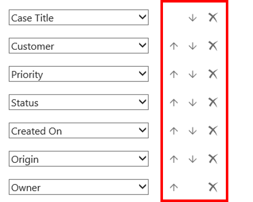
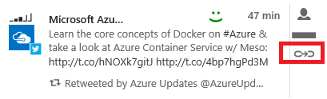
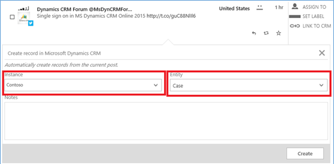
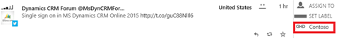
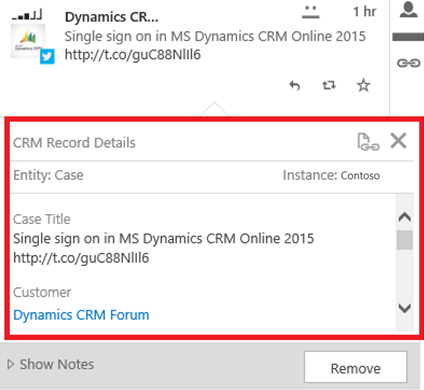
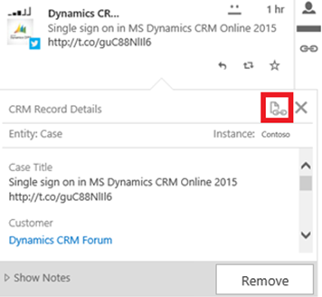
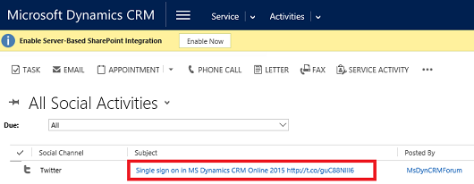
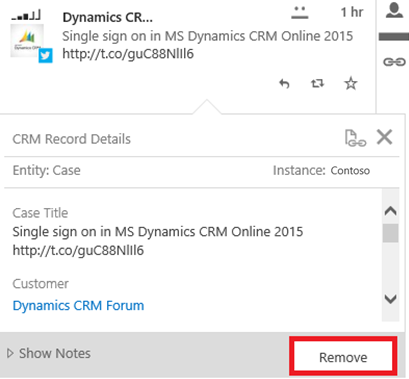

---
title: "Create a Dynamics 365 record from a social post | MicrosoftDocs"
ms.custom: ""
ms.date: "2016-11-18"
ms.reviewer: ""
ms.service: "mse"
ms.suite: ""
ms.tgt_pltfrm: ""
ms.topic: "article"
applies_to: 
  - "Social Engagement"
ms.assetid: fb55dd2f-e81e-4163-9cfd-7e812ebcbe25
caps.latest.revision: 33
author: "m-hartmann"
ms.author: "mhart"
manager: "sakudes"
---
# Create a Dynamics 365 record from a social post
Send a post found with [!INCLUDE[pn_netbreeze_long](../includes/pn-netbreeze-long.md)] to your [!INCLUDE[pn_dynamics_crm_online](../includes/pn-dynamics-crm-online.md)] instance to create a record. For example, you can automatically convert posts to cases for customer service, or to leads for your sales team. When you create a social activity, if the author of the post doesn’t have a social profile in [!INCLUDE[pn_crm_shortest](../includes/pn-crm-shortest.md)], the system creates a social profile and contact record, and then links the social profile with the contact record. When a record is created in [!INCLUDE[pn_crm_shortest](../includes/pn-crm-shortest.md)], you can see the details about this record in [!INCLUDE[pn_netbreeze_short](../includes/pn-netbreeze-short.md)].  
  
## In this topic  
 [Specify record details](#DefineEntityDetails)  
  
 [Convert a social engagement post to a social activity record in Dynamics 365](#ConvertPost)  
  
 [Configure Dynamics 365 to automatically create records from linked posts](#configureCRMrule)  
  
 [Understand the data sent to Dynamics 365 when you create a social activity](#understandDataSent)  
  
 [View record details for a linked post in Social Engagement](#ViewRecordDetails)  
  
 [Open a linked record in Dynamics 365](#viewRecord)  
  
 [Remove a linked Dynamics 365 record from a post](#RemoveLinkToCRM)  
  
<a name="DefineEntityDetails"></a>   
## Specify record details  
 You can define the information to show in [!INCLUDE[pn_crm_shortest](../includes/pn-crm-shortest.md)] record details when a record in [!INCLUDE[pn_crm_shortest](../includes/pn-crm-shortest.md)] is created from a social post. Depending on your selection, [!INCLUDE[pn_crm_shortest](../includes/pn-crm-shortest.md)] fields shows the information about the connected instance and selected entity. To familiarize yourself with the social activity record type or the [!INCLUDE[pn_crm_shortest](../includes/pn-crm-shortest.md)] record creation and update rules feature, see [MSDN: SocialActivity entity messages and methods](https://msdn.microsoft.com/library/dn689062.aspx), [CRM Help & Training: Set up rules to automatically create or update records in CRM](http://go.microsoft.com/fwlink/p/?LinkID=624394).  
  
 Define the fields of a [!INCLUDE[pn_crm_shortest](../includes/pn-crm-shortest.md)] entity that you want to display in **Dynamics 365 Record Details** in [!INCLUDE[pn_netbreeze_short](../includes/pn-netbreeze-short.md)] when a record of the same entity is created from a post. Add the fields you want to see in the **Dynamics 365 Record Details** when you define the entity details in [!INCLUDE[pn_netbreeze_short](../includes/pn-netbreeze-short.md)].  
  
#### Define or edit fields for record details  
  
1.  In [!INCLUDE[pn_netbreeze_short](../includes/pn-netbreeze-short.md)], go to **Settings** > **Connections** > **Microsoft Dynamics 365**.  
  
2.  In the **Microsoft Dynamics 365 Connections** pane, select the [!INCLUDE[pn_crm_shortest](../includes/pn-crm-shortest.md)] instance that you want to define entity details for.  
  
3.  In the **Dynamics 365 Instance** pane, select the record type under **Record details**.  
  
4.  In the **Entity Details** pane, select the [!INCLUDE[pn_crm_shortest](../includes/pn-crm-shortest.md)] fields to show in the **Dynamics 365 Record Details** form for the selected entity. Or click **Add** to add more fields.  
  
5.  Reorder the fields using the up arrow  or down arrow  or remove fields using the **Remove** button .  
  
   
  
    > [!IMPORTANT]
    >  You can't remove an entity if there are active automation rules using that entity. You will first need to deactivate or delete all automation rules using that entity. [!INCLUDE[proc_more_information](../includes/proc-more-information.md)][](../social-engagement/automation-rules.md "Route posts using automation rules")  
  
6.  To apply your changes, in the **Dynamics 365 Instance** pane, click **Save**.  
  
<a name="ConvertPost"></a>   
## Convert a social engagement post to a social activity  
  
1.  In [!INCLUDE[pn_netbreeze_short](../includes/pn-netbreeze-short.md)], click **Posts** on any Analytics page to see the posts list.  
  
     --OR--  
  
     Go to **Microsoft Social Engagement** > **Social Center** to see your streams.  
  
2.  Go to the post you want to convert to a social activity record in [!INCLUDE[pn_dynamics_crm](../includes/pn-dynamics-crm.md)], and then click **Link to Dynamics 365**.  
  
   
  
3.  Select from the available instances, and then select the record type you want to create from the **Entity** drop-down list. The **Entity** drop-down list shows only those entities that are configured in the **Dynamics 365 Instance** panel in the **Dynamics 365 Record Details** section. If a single entity is configured with an instance, it will be selected by default.  
  
   
  
4.  Add any additional information, up to 250 characters, related to the record in **Notes**, and then click **Create**.  
  
     The post now displays a **Linked** button  along with the name of the [!INCLUDE[pn_crm_online_shortest](../includes/pn-crm-online-shortest.md)] instance it is linked to.  
  
   
  
> [!TIP]
>  -   To automatically create records in [!INCLUDE[pn_crm_online_shortest](../includes/pn-crm-online-shortest.md)] from social posts that match a specific data set, you can create automation rules. [!INCLUDE[proc_more_information](../includes/proc-more-information.md)][Route posts using automation rules](../social-engagement/automation-rules.md)  
> -   If the linked [!INCLUDE[pn_crm_online_shortest](../includes/pn-crm-online-shortest.md)] instance has [!INCLUDE[pn_netbreeze_short](../includes/pn-netbreeze-short.md)] system settings set to disabled, the link creation fails and shows this error message: "Dynamics 365 can’t receive social data from [!INCLUDE[pn_netbreeze_short](../includes/pn-netbreeze-short.md)]". Contact your [!INCLUDE[pn_crm_online_shortest](../includes/pn-crm-online-shortest.md)] administrator to review the Disable [!INCLUDE[pn_netbreeze_short](../includes/pn-netbreeze-short.md)] system settings. [!INCLUDE[proc_more_information](../includes/proc-more-information.md)][TechNet: Control social data](http://go.microsoft.com/fwlink/p/?LinkId=723352)  
> -   If [!INCLUDE[pn_crm_online_shortest](../includes/pn-crm-online-shortest.md)] allows incoming social activities, but no rules are defined in [!INCLUDE[pn_netbreeze_short](../includes/pn-netbreeze-short.md)] to build [!INCLUDE[pn_crm_online_shortest](../includes/pn-crm-online-shortest.md)] entities out of them, the linking operation does succeed. However, opening link details in [!INCLUDE[pn_netbreeze_short](../includes/pn-netbreeze-short.md)] will not provide any details. Contact your [!INCLUDE[pn_crm_online_shortest](../includes/pn-crm-online-shortest.md)] administrator if this happens. [!INCLUDE[proc_more_information](../includes/proc-more-information.md)][CRM Help & Training: Set up rules to automatically create or update records in CRM](http://go.microsoft.com/fwlink/p/?LinkID=624394)  
  
<a name="configureCRMrule"></a>   
## Configure Dynamics 365 to automatically create records from linked posts  
 By default, [!INCLUDE[pn_crm_shortest](../includes/pn-crm-shortest.md)] creates a Social Activity entity when a post is linked from Social Engagement. In [!INCLUDE[pn_crm_shortest](../includes/pn-crm-shortest.md)], you can convert this entity to a different record type. To automate the process, you can set up Automatic Record Creation Rules in [!INCLUDE[pn_crm_shortest](../includes/pn-crm-shortest.md)] to automatically create records from incoming social activities.  
  
 To learn more about the social activity record type or the [!INCLUDE[pn_crm_shortest](../includes/pn-crm-shortest.md)] record creation and update rules feature, see [MSDN: SocialActivity entity messages and methods](https://msdn.microsoft.com/library/dn689062.aspx), [CRM Help & Training: Set up rules to automatically create or update records in CRM](http://go.microsoft.com/fwlink/p/?LinkID=624394).  
  
<a name="understandDataSent"></a>   
## Understand the data sent to Dynamics 365 when you create a social activity  
 When you create a social activity, [!INCLUDE[pn_netbreeze_short](../includes/pn-netbreeze-short.md)] sends the social payload as a JSON object to the **Additional Parameters** field of a social activity. The payload can be used as channel properties that define conditions for rules, and for setting properties of the record you're creating or updating. [!INCLUDE[proc_more_information](../includes/proc-more-information.md)][CRM Help & Training: Set up rules to automatically create or update records in CRM](http://go.microsoft.com/fwlink/p/?LinkID=624394) The payload contains the most important fields required by [!INCLUDE[pn_crm_shortest](../includes/pn-crm-shortest.md)] to consume tweets and [!INCLUDE[tn_facebook](../includes/tn-facebook.md)] posts. These fields contain information about the post that was sent: author, content, URI to the original post, URI to the post in [!INCLUDE[pn_netbreeze_short](../includes/pn-netbreeze-short.md)], and some additional post metadata. Based on the post’s source, the content of the payload may change.  
  
 Social Activity in [!INCLUDE[pn_crm_shortest](../includes/pn-crm-shortest.md)] has an **Additional Parameters** field that receives the social payload as JSON from [!INCLUDE[pn_netbreeze_short](../includes/pn-netbreeze-short.md)].  
  
 To learn more about how to set up channel properties in [!INCLUDE[pn_crm_shortest](../includes/pn-crm-shortest.md)] to work with Additional Parameters from [!INCLUDE[pn_netbreeze_short](../includes/pn-netbreeze-short.md)], see [CRM Help & Training: Set up rules to automatically create or update records in CRM](http://go.microsoft.com/fwlink/p/?LinkID=624394).  
  
 The properties used in `ActivityAdditionalParams` are described in the following table.  
  
|Property in `ActivityAdditionalParams`|Value format|Description|Source restrictions|  
|--------------------------------------------|------------------|-----------------|-------------------------|  
|`targetEntityName`|string|Name of the entity that gets created in [!INCLUDE[pn_dynamics_crm](../includes/pn-dynamics-crm.md)].  When linking a post to [!INCLUDE[pn_crm_shortest](../includes/pn-crm-shortest.md)], this is always set to `socialactivity`.|N/A|  
|`userPreferredTargetEntity`|string|Preferred entity as defined by the user in the Entity drop-down list  of a linked post's Record Details in [!INCLUDE[pn_netbreeze_short](../includes/pn-netbreeze-short.md)]. This doesn’t necessarily match the type of record created in [!INCLUDE[pn_crm_shortest](../includes/pn-crm-shortest.md)] due to rules defined in [!INCLUDE[pn_dynamics_crm](../includes/pn-dynamics-crm.md)].|N/A|  
|`socialHandle`|string|Alias or user name of the author on the source.|N/A|  
|`profileName`|string|Alias or user name of the author on the source.|N/A|  
|`profilelink`|string|URL to the author’s profile.|Available for [!INCLUDE[tn_facebook](../includes/tn-facebook.md)] and [!INCLUDE[tn_twitter](../includes/tn-twitter.md)]|  
|`fullName`|string|The author’s name.|N/A|  
|`community`|number|1: [!INCLUDE[tn_facebook](../includes/tn-facebook.md)]<br /><br /> 2: [!INCLUDE[tn_twitter](../includes/tn-twitter.md)]<br /><br /> 0: Other|N/A|  
|`influencescore`|number|Reach score of the author in a range from 0-99.  The higher the number, the more influential the author.|N/A|  
|`retweetedBy_displayName`|string|Name of the author who retweeted the post.|Available only if the post is a retweet|  
|`retweetedBy_externalId`|string|External ID of the author who retweeted the post.|Available only if the post is a retweet|  
|`retweetedBy_screenName`|string|Name of the author who retweeted the post.|Available only if the post is a retweet|  
|`isretweet`|boolean|Determines whether the post is a retweet or not.<br /><br /> true: retweet<br /><br /> false: not a retweet|Available only if the post is a retweet|  
|`MSEbacklinkPost`|string|URI to access the post in [!INCLUDE[pn_netbreeze_short](../includes/pn-netbreeze-short.md)].|N/A|  
|`Notes`|string|Additional information added by the creator of the social activity as free form text in [!INCLUDE[pn_netbreeze_short](../includes/pn-netbreeze-short.md)].|N/A|  
  
### Sample payload  
 A typical `ActivitiyAdditionalParameters`JSON sent to [!INCLUDE[pn_crm_shortest](../includes/pn-crm-shortest.md)] is given here.  
  
```  
{  
  "targetEntityName": "socialactivity",  
  "userPreferredTargetEntity": "incident",  
  "socialHandle": "Contoso",  
  "profileName": "Contoso",  
  "profilelink": "http://www.twitter.com/Contoso",  
  "fullName": "Contoso",  
  "community": 2,  
  "influencescore": 41.0,  
  "notes": "The customer requested a technician to call back as quickly as possible.",  
  "isRetweet": false,  
  "MSEbacklinkPost": "https:// listening-prod.dynamics.com /app/23534544 /#postid=45663"  
}  
```  
  
<a name="ViewRecordDetails"></a>   
## View record details for a linked post in Social Engagement  
 If a post is linked to a social activity in [!INCLUDE[pn_dynamics_crm](../includes/pn-dynamics-crm.md)], you can open its associated record in **Dynamics 365 Record Details**.  
  
#### Open a Dynamics 365 record from within Social Engagement  
  
1.  In [!INCLUDE[pn_netbreeze_short](../includes/pn-netbreeze-short.md)], click **Posts** on the right side of any Analytics page to see the posts list.  
  
     --OR--  
  
     Go to **Microsoft Social Engagement** > **Social Center** to see your streams.  
  
2.  Select the post, and then click **Link to Dynamics 365**. The **Dynamics 365 Record Details** dialog box shows all details for the associated Dynamics 365 record.  
  
   
  
> [!NOTE]
>  If the rule definitions fails and the entity isn't created from the linked social activity, contact your [!INCLUDE[pn_crm_shortest](../includes/pn-crm-shortest.md)] administrator.  
  
<a name="viewRecord"></a>   
## Open a linked record in Dynamics 365  
  
1.  In [!INCLUDE[pn_netbreeze_short](../includes/pn-netbreeze-short.md)], click **Posts** on any Analytics page to see the posts list.  
  
     --OR--  
  
     Go to **Microsoft Social Engagement** > **Social Center** to see your streams.  
  
2.  Select the post you want to open the associated record for, and then click **Link to Dynamics 365**.  
  
3.  In the **Dynamics 365 Record Details**, click **Open Record** to see the record in [!INCLUDE[pn_crm_shortest](../includes/pn-crm-shortest.md)].  
  
 [!INCLUDE[pn_crm_shortest](../includes/pn-crm-shortest.md)] entities that are enabled for interactive experience open in the interactive service hub when you open a record on a social post that is linked to [!INCLUDE[pn_crm_shortest](../includes/pn-crm-shortest.md)]. [!INCLUDE[pn_crm_shortest](../includes/pn-crm-shortest.md)] entities not enabled for interactive experience will continue open in the web client. [!INCLUDE[proc_more_information](../includes/proc-more-information.md)][CRM Help & Training: User's guide for the new interactive service hub](http://go.microsoft.com/fwlink/p/?LinkID=690167)  
  
   
  
> [!NOTE]
>  If there are no rules, or no active rules, or the social activity doesn't meet the defined conditions, no target [!INCLUDE[pn_crm_shortest](../includes/pn-crm-shortest.md)] record is created and the **Open Record** option  opens the social activity in [!INCLUDE[pn_crm_shortest](../includes/pn-crm-shortest.md)]. When the target [!INCLUDE[pn_crm_shortest](../includes/pn-crm-shortest.md)] record is created, the **Open Record** option  opens the target record.  
  
   
  
<a name="RemoveLinkToCRM"></a>   
## Remove a linked Dynamics 365 record from a post  
 You can remove a linked [!INCLUDE[pn_crm_shortest](../includes/pn-crm-shortest.md)] record from a post. Note that removing a linked [!INCLUDE[pn_crm_shortest](../includes/pn-crm-shortest.md)] record from a post also removes any attached notes. Consider removing a linked [!INCLUDE[pn_crm_shortest](../includes/pn-crm-shortest.md)] record from a post when the link is no longer valid, is incorrect, or when you are considering creating a new entity record from the same post.  
  
> [!NOTE]
>  Removing a link does not affect the linked record in [!INCLUDE[pn_crm_shortest](../includes/pn-crm-shortest.md)], but only breaks the link between the [!INCLUDE[pn_netbreeze_short](../includes/pn-netbreeze-short.md)] post and [!INCLUDE[pn_crm_shortest](../includes/pn-crm-shortest.md)] record. Once removed there is no way to re-establish the link between the same [!INCLUDE[pn_netbreeze_short](../includes/pn-netbreeze-short.md)] post and same [!INCLUDE[pn_crm_shortest](../includes/pn-crm-shortest.md)] record.  
  
1.  In [!INCLUDE[pn_netbreeze_short](../includes/pn-netbreeze-short.md)], click **Posts** on the right side of any Analytics page to see the posts list.  
  
     --OR--  
  
     Go to **Microsoft Social Engagement** > **Social Center** to see your streams.  
  
2.  Select the post you want to open the associated record for, and then click **Link to Dynamics 365**.  
  
3.  In the **Dynamics 365 Record Details**, click **Remove**.  
  
   
  
<a name="privacy"></a>   
## Privacy Notice  
 [!INCLUDE[cc_privacy_mse_post_and_automation_rules](../includes/cc-privacy-mse-post-and-automation-rules.md)]  
  
## See Also  
 [Set up the connection between Dynamics 365 and Social Engagement](../social-engagement/connect-dynamics-365-social-engagement.md)   
 [Link posts from Social Engagement to Dynamics 365](../social-engagement/link-posts-to-dynamics-365.md)   
 [Administer Microsoft Social Engagement](../social-engagement/administer-microsoft-social-engagement.md)
[!INCLUDE[cc_copy_year_all_rights_reserved_md](../includes/cc-copy-year-all-rights-reserved.md)]
