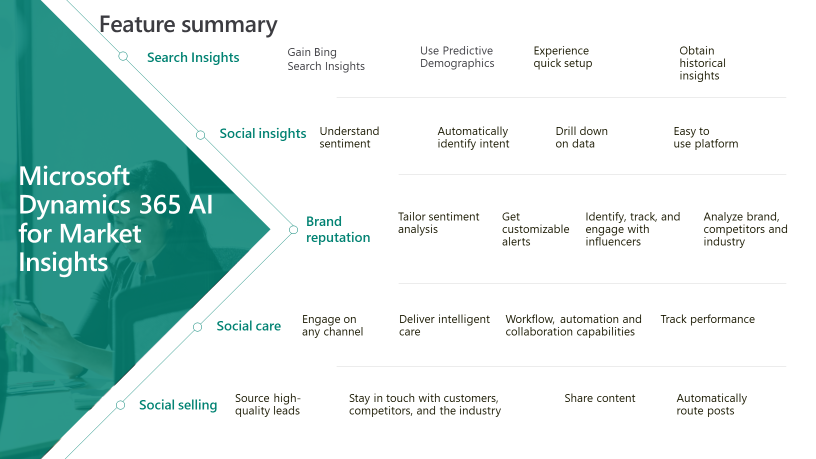

# Changes coming for Microsoft Social Engagement

## Overview

Effective January 16, 2019, Microsoft will no longer offer Microsoft Social Engagement as part of the Dynamics 365 subscription for new customers. Current Dynamics 365 customers are entitled to continue using the Microsoft Social Engagement service for the remainder the contract or until the discontinuation of service on January 16, 2020, whichever is sooner. These changes may require your organization to take advance action prior to the end of your contract, to transition to an alternative solution. 

With the discontinuation of service, we suggest to try [the public preview of Microsoft Dynamics 365 AI for Market Insights](https://dynamics.microsoft.com/ai/market-insights/) to help meet your needs. Dynamics 365 AI for Market Insights is an application that can help users gain insights and win market share by monitoring external information sources, both social media and trending search terms on the web. Unlike other solutions in the market, this easy to use application provides holistic social and web insights, intelligent sentiment and intent analysis features. This helps businesses know their customers, build their brand, and gain competitive advantage.
Transition offer:

Active customers* whose contracts exceed past the discontinuation date of Microsoft Social Engagement, January 16, 2020, will have the option to opt into using the base package of Dynamics 365 AI for Market Insights application for free. The opt in period will begin when AI for Market Insights becomes generally available and allows active customers to use the grandfathering plan until the end of their current contract, or January 16, 2022 whichever is earlier. These active customers must opt in to the grandfather plan before January 16, 2020. 

After the end of their contracts, Dynamics 365 AI for Market Insights will be available for customers to purchase at the future market price.
 
*Active customers are those who in the months of either October, November, or December 2018 met the following criteria: 
- At least 1 Monthly Active User logging in AND
- At least 1 Search Topic configured
OR
- Any customer that has paid for additional quota post add-ons
For questions related to transitioning you can contact [MSEeol@microsoft.com](mailto:MSEeol@microsoft.com).  

## General questions

### Why is Microsoft Social Engagement being discontinued?
    
Dynamics 365 will focus more on enabling businesses with complete AI powered social and web insights rather than just with social listening capabilities. Combined capabilities and insights from Microsoft Social Engagement, Bing Search, IE/Edge browser and Dynamics 365 will be offered through [Dynamics 365 AI for Market Insights](https://dynamics.microsoft.com/ai/market-insights/). The social and web insights can help marketing, social media and product teams know what their customers and competitors say, seek, and feel.

### What is the Microsoft Social Engagement to Dynamics 365 AI for Market Insights transitional experience?

The transition to Dynamics 365 AI for Market Insights will be an easy experience for existing MSE customers. When signing in to AI for Market Insights, all the data and configurations from MSE will be migrated to AI for Market Insights. The user interface for AI for Market Insights is subject to change in the future. There may be some additional configurations required to use the new features that will be available only in AI for Market Insights.

### What are the key capabilities of Dynamics 365 AI for Market Insights?
    
    

The major key features of Dynamics 365 AI for Market Insights fall within five categories:
- **Search Insights**: Know what your customers are saying, seeking and feeling by acquiring audience insights from what customers are doing on Bing search. Get demographic and historical insights to align marketing and product development activities. Turn these insights into actions by developing targeted campaigns. 
- **Social Insights**: Listen to what customers and competitors are saying and track how their sentiment changes over time through automatic sentiment analysis.  Leverage the power of AI to detect intent within social posts and help you identify new leads or respond to service questions.
- **Brand Reputation**: Use machine learning to tweak sentiment detection in a way that’s tailored to your organization. Identify, track, and engage with individual influencers and experts on social so you never miss a post from an influencer. Stay up to date on industry trends with a market news email digest.
- **Social Care**: Give service agents the information they need and automate case routing, so they can spend more time delighting customers.  Detect and create alerts based on sentiment and trends to proactively identify service issues.
- **Social Selling**: Empower your sales people to sell more by leveraging social media. Sales teams can gather intelligence, source new leads, and build credibility.  Source high-quality leads by using social to identify and act on buying signals, then create new leads based on social posts.

### What is the difference in capabilities between MSE and AI for Market Insights?

Dynamics 365 AI for Market Insights will focus more on enabling businesses with complete AI-powered social and web insights and will have combined capabilities and insights from Microsoft Social Engagement, Bing Search, IE/Edge browser and the Dynamics 365 platform. Future releases will include more capabilities to deliver web insights based on Bing search and IE/Edge browse activities. We are also planning to update the UI to optimize it for delivering insights. Please continue to engage with us, get application related updates, and answers through the [AI for Market Insights community site](https://community.dynamics.com/365/aimarketinsights).

 
### What is the international availability of Dynamics 365 AI for Markets?
    
Today, Dynamics 365 AI for Market Insights public preview is available in 8 countries: United States, United Kingdom, Canada, France, Germany, Australia, Italy, and Spain. We expect this application to be generally available in more countries and languages by April 2019. Please refer to the [AI for Market Insights page in the International Availability document](https://aka.ms/dynamics_365_international_availability_deck) for more details on countries and languages supported by this application.    
To access Dynamics 365 AI for Market Insights public preview for the countries listed above, please [visit the Dynamics 365 AI for Market Insights site](https://dynamics.microsoft.com/ai/market-insights/) for your country.

### How can customers access Dynamics 365 AI for Market Insights public preview if they are located outside of the countries listed above?

If a customer is located outside of the listed countries, they can visit the [U.S. Dynamics 365 AI for Market Insights site](https://dynamics.microsoft.com/en-us/ai/market-insights/) to access the app. 

### What functionality will be included in Dynamics 365 AI for Market Insights?

Please refer to the [release notes](https://dynamics.microsoft.com/business-applications/release/) to stay up to date on all the newest features and functionality for Dynamics 365 AI for Market Insights. 

### Will Dynamics 365 AI for Market Insights be available to Government?

Similar to Microsoft Social Engagement, government entities will not be able to use Dynamics 365 AI for Market Insights.

## Subscription and billing questions

### Which subscriptions and licenses are affected by this announcement?
Customers using the Dynamics licenses and their variations listed below, which include Microsoft Social Engagement, will be impacted. 

- **Dynamics 365 Licenses**    
  - Dynamics 365 for Sales Enterprise	
  - Dynamics 365 for Customer Service Enterprise	
  - Dynamics 365 for Field Service 	
  - Dynamics 365 for Project Service Automation	
  - Dynamics 365 for Marketing	
  - Dynamics 365 Customer Engagement Plan	
  - Dynamics 365 Plan	
    
- **Legacy Licenses**
  - Dynamics CRM Online Enterprise 
  - Dynamics CRM Online Professional
  - Microsoft Social Engagement Enterprise
  - Microsoft Social Engagement Professional 

### Will monthly quota add-ons be available for purchase after January 16, 2019? Or will these stop being sold at this point?

Yes, monthly quota add-ons for Microsoft Social Engagement will be available to purchase until the discontinuation of the application on January 16, 2020.

### Will new Dynamics 365 customers be entitled to Dynamics 365 AI for Market Insights?

New Dynamics 365 customers are encouraged to sign up to try the [Dynamics 365 AI for Market Insights](https://dynamics.microsoft.com/ai/market-insights/) public preview. Dynamics 365 AI for Market Insights will not be included as part of the Dynamics 365 plan.

### Who can I contact for billing issues and concerns?

You can review the Dynamics 365 (online) Billing FAQ and locate your billing support number or submit a billing support query. You can also email us at [MSEEol@microsoft.com](mailto:MSEEol@microsoft.com) for any escalations.

### See also

[Business Applications release notes](https://dynamics.microsoft.com/business-applications/release/)    
[Dynamics 365 AI for Market Insights product page](https://dynamics.microsoft.com/ai/market-insights/)    
[Dynamics 365 Ai for Market Insights help center](https://docs.microsoft.com/dynamics365/ai/market-insights)